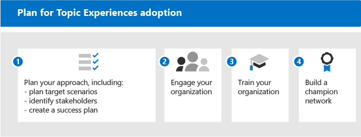

# Aan de slag met het aangaan van de Onderwerps ervaring (preview)Get started driving adoption of Topic Experiences (Preview)

> [!Note]
> De inhoud in dit artikel is bedoeld voor project cortex private preview.The content in this article is for Project Cortex Private Preview. [Meer informatie over Project Cortex](https://aka.ms/projectcortex).[Find out more about Project Cortex](https://aka.ms/projectcortex).

Voordat u aan de slag kunt gaan met de vaststelling, moet u inzicht krijgen in de basisprincipes van kennisbeheer en onderwerps ervaringen.Before you get started with adoption, you need to understand the concepts involved in knowledge management and topic experiences. In het volgende diagram ziet u wat er gebeurt tijdens de detectie en de curator van het onderwerp:The following diagram shows what happens during topic discovery and curation:

- **Detectie**: gebruikers kunnen kennis ontdekken in de apps die ze elke dag gebruiken via de onderwerpen van een onderwerp, en kunnen ook onderwerpen ontdekken in Microsoft Search.**Discovery**: Users can discover knowledge in the apps they use every day through topic cards - they can also discover topics in Microsoft Search.
- Met de onderhevige informatie over experts van onderhevige technici (kmo's) Verfijn de onderwerpen via de onderwerp PAGINA'S en AI van de invoer.**Curation**: Subject matter experts (SMEs) refine topics through topic pages, and AI learns from their input. Het onderwerp bevat topic pagina's die gebruikers kunnen verkennen en kunnen beheren.The Topic center contains topic pages that users can explore and experts can manage.
- **Identificatie**: met Microsoft Graph en de informatie over de kunstmatige informatie (AI) en personen (onderwerpen, vaardigheden, enzovoort) worden geïdentificeerd en automatisch ingedeeld in Verwante onderwerpen.**Identification**: With Microsoft Graph and Artificial Intelligence (AI) knowledge and people (topics, skills, an so on) are identified and automatically organized into related topics. SharePoint-inhoud wordt geïndexeerd met beveiligingsinhoud.SharePoint content is indexed with security content.
- **Uitbreiding**: met inhouds connectors van Microsoft Graph (binnenkort beschikbaar), kunt u op de hoogte zijn van gegevens van externe services en gegevensopslag.**Extension**: With Microsoft Graph content connectors (coming soon), you can ingest knowledge from external services and data repositories.

Voor meer informatie kunt u het [overzicht](topic-experiences-overview.md) van een inleiding bekijken.For more information, you can review the [overview](topic-experiences-overview.md) for an introduction.

Houd er rekening mee dat:Keep in mind that:

- Het detecteren van een onderwerp is verbeterd wanneer er meer inhoud beschikbaar is.Topic discovery is improved when more content is available.
- De beveiliging, privacy en locatie van uw gegevens blijven behouden, ook al worden deze in een nieuwe ervaring gepresenteerd.The security, privacy, and location of your data is preserved even though the information is presented in a new experience.
- Gebruikers hebben een licentie nodig voor het weergeven van onderwerp-ervaringen.Users need a license to view topic experiences.
- Detectie bevindt zich in eerste instantie van de Engelse taal.Discovery is initially on English language content.

Ter voorbereiding kunt u de volgende vragen stellen:To help prepare, think through these questions:

- Welke inhoud moet worden gebruikt voor het detecteren van een onderwerp?What content should be used for topic discovery?
- Wie beheert een onderwerp?Who will manage topics?
- Wie ziet er een onderwerp uit?Who will see topic cards and highlights?
- Welke onderwerpen worden verwacht?Which topics are expected?

Bekijk deze lijst met vereisten voor het optimaal benutten van onderwerps functies:Review this list of prerequisites for getting the most out of topic experiences:

|Product of functieProduct or feature |BeschrijvingDescription |
|:-------|:--------|
|SharePoint Online met moderne SharePoint-pagina'sSharePoint Online with modern SharePoint pages |Onderwerp bevat alleen inhoud op SharePoint-sites, en topic Cards kunnen alleen worden geoppereerd op moderne pagina's.Topic mining only includes content on SharePoint sites, and topic cards can only be surfaced on modern pages.|
|Microsoft GraphMicrosoft Graph |U kunt bepalen of onderwerpen wel of niet worden opgenomen in de zoekfunctie of in Delve met de instellingen van Microsoft Graph.You can control whether topics are included or excluded from Search or Delve with the Microsoft Graph settings. |

## Plannen voor aannemingPlan for adoption

Voor het plannen van de aanneming van onderwerpen moet u het volgende doen:To plan for adoption of Topic Experiences, you need to:

1. Plan uw aanpak en doelscenario's:Plan your approach and target scenarios:
    - Denk na over het definiëren en prioriteren van de [scenario's](#target-scenarios).Think about defining and prioritizing the [scenarios](#target-scenarios).
    - Denk na over de [belanghebbenden](#identify-stakeholders) en de Projectteamleden die u nodig hebt.Think about the [stakeholders](#identify-stakeholders) and project team members you need to have involved.  
    - Bepaal wat de impact van uw bedrijf is en hoe u het [succes gaat waarderen](#create-a-success-plan).Figure out what business impact you want to drive towards and how you're going to [measure success](#create-a-success-plan).

2. Deel uw organisatie:Engage your organization:
    - Identificeer de zakelijke groepen en zakelijke teams die betrokken moeten zijn, en verdeel de planning van de bedrijven en de scenario's die u plant.Identify the business groups and business teams that need to be involved and gain alignment across those and the scenarios that you're planning.
    - Maak een goede manier om te leren hoe u met een goede uitnodigingen aan de slag kunt gaan, zodat u snel aan de slag kunt om de beste oplossing te vinden.Start thinking about how to engage some early adopters to get critical, early feedback so you can iterate to get to the best solution.
    - Bouw de Community samen en denk na over de manier waarop de functies van het onderwerp in uw organisatie kunnen worden gebruikt door deze verschillende groepen.Start building the community and think about how Topic Experiences can be used across your organization by these different groups.

3. Train uw organisatie: de meeste mensen leren het concept van onderwerpen te begrijpen en de manier waarop u relevante informatie vindt, en de waarde begrijpt en zien.Train your organization: Most people will intuitively understand the concept of topics and how topic cards compile relevant information, and understand and see the value. Maar misschien wilt u training maken die is afgestemd op uw eigen cultuur en organisatie, om aan te geven hoe u wilt dat het onderwerp wordt gebruikt in uw organisatie. Enkele trainingsbronnen:But you might want to create training that is tailored to your own culture and organization, to show how you want Topic Experiences to be used in your org. Some training resources:
    - [Project cortex resource centrum](https://aka.ms/projectcortex).[Project Cortex Resource Center](https://aka.ms/projectcortex). Bevat overviews en functie gegevens, opgenomen Video's en presentaties over Office-uren, en informatie over partners en hun aanbiedingen.Includes overviews and feature information, recorded office hour videos and presentations, and information about partners and their offerings.
    - Binnenkort beschikbaar, trainingsvideo's en Help voor eindgebruikers.Coming soon, training videos and help for end users.

4. [Bouw netwerk](#build-a-champion-network):[Build a champion network](#build-a-champion-network):
    - Het kan zijn dat community's al op de eigen plaats staan.You might have communities of practice or champion networks already in place. Dit zijn fantastische manieren om te Socialize en evangelize en om peers te kopen bij elkaar te helpen.These are great ways to socialize and evangelize and get peers involved in helping each other. En kunnen succesverhalen delen die zeer waardevol kunnen zijn.And they can share success stories which can be really valuable. Ze kunnen advies bieden en enthousiast maken.They can offer advice and generate excitement.

### Doelscenario'sTarget scenarios

In dit geval kunt u bepalen welk model u nodig hebt en hoe u uw organisatie kunt structureren op basis van de locatie waar het model wordt toegepast.The why helps determine what model will be needed, and how to structure your org based on where the model will be applied. Hier volgen enkele scenario's waarin kennisbeheer uw organisatie kan helpen:Here are a few scenarios where knowledge management can help your organization:

- Rollen onboarding & training: wat is de terminologie van een nieuwe organisatie, belangrijke projecten en cultuur zijn belangrijke stappen in het onboarding.Role onboarding & training: Understanding a new organization's terminology, key projects, and culture are important steps in onboarding. Met behulp van eenvoudige detectie van onderwerpen kunt u snel aan de slag met nieuwe functies, rollen of projecten.Easy discovery of topics can help new employees get up to speed on new job, roles, or projects quickly.
- Expertise zoeken en gegevens delen: wanneer onderwerpen in uw organisatie worden beheerd en gedeeld, kunnen personen in uw organisaties makkelijker informatie en experts vinden om ze op hun dagelijkse werk te helpen.Expertise finding and information sharing: When topics are managed and shared, people in your organizations can more easily find information and experts to help them in their day to day work.
- Uitgebreide beslissing ter verduidelijking en verbeterde tijd voor de markt: wanneer informatie en experts gemakkelijk te bereiken zijn, kunt u beslissingen eenvoudiger en verrijkings projecten maken.Expanded decision making and improved time to market: When information and experts are easy to reach, you can make decisions more easily and shave time off projects.

Hier ziet u bijvoorbeeld een scenario voor de onboarding van rollen:For example, here's a scenario for role onboarding:

- Een werknemer (Jordanië) maakt een nieuwe rol of heeft nog geen medewerker gemaakt en begint met een rol.An employee (Jordan) is taking on a new role, or has been newly hired and is just starting with a role. Jordanië wil zo snel mogelijk met u meedoen en productief zijn.Jordan wants to get involved and productive as quickly as possible. Maar Jordanië heb ook hulp nodig bij het vinden van een beginpunt.But Jordan also need help finding a starting place.
- Een collega (Kim) die in de rol stond voordat Jordanië pagina's heeft gemaakt waarmee nieuwe medewerkers kunnen worden geholpen en dat iemand anders die informatie zoekt.A colleague (Kim) who was in the role before Jordan created topic pages that can help out new employees and anyone else looking for that information.
- Kim bestond een KMO'S en heeft machtigingen voor het bekijken van niet-bevestigde pagina's.Kim was an SME and had permissions to look at unconfirmed topic pages. Niet-bevestigde onderwerpen vormen geweldig beginpunt voor de detectie en het maken van de AI-pagina's, en Kim kon ze bewerken om resources toe te voegen, definities en vastmaken.Unconfirmed topic pages are great starting points for what the AI has discovered and created, and Kim was able to edit them to add expert resources, definitions, and pin other resources.
- Net als de tekst van een nieuw bericht op SharePoint, ziet u met Jordanië een onderwerp en houdt u de muisknop ingedrukt om snel een definitie van de term te krijgen en contact op te nemen met meer vragen.As Jordan reads through a new post on SharePoint, Jordan sees a topic highlight, and hovers over it to quickly get a definition of the term and who to contact with more questions. Voor deze informatie en contactpersonen kunnen de persoon een verzoek doen om te zien wie er iets moet vragen.Before, Jordan might have had to hunt around for this information and contact colleagues to see who to ask about something.
- Deze informatie kan krachtig zijn omdat deze informatie eerder beschikbaar is, omdat deze informatie mogelijk al voor u beschikbaar is, is er mogelijk een silo gemaakt en moeilijk te vinden.Exposing this information through Topic Experiences can be powerful, because although this information may have been available before, it might have been siloed and hard to find. De toepassingen in de toepassingen te gebruiken die worden gebruikt en de ondersteuning van deze experts kan ook worden vastgesteld voor de afspraak en de community.Bringing it into the applications that Jordan is using and helping Jordan find these experts can also drive a sense of engagement and community. Het kan ook betekenen dat de nieuwe rol met de nieuwe rol is geleerd.It can also help Jordan feel more empowered when dealing with the new role.

Nadat u uw scenario's hebt vastgesteld, kunt u de volgende scenario's van een prioriteit voorzien:After you identify your scenarios, you can prioritize the scenarios:

Een van de manieren om een prioriteit toe te wijzen, is door de scenario's uit te zetten in een raster met gevolgen en de implementatie.One way to prioritize it is to plot your scenarios out in a grid showing impact vs. ease of implementation. Zoek scenario's met een hoge impact en eenvoudig te implementeren.Look for scenarios that have both high impact and are easy to implement. Maak hiervan een hoge prioriteit.Make those your top priority. De de laagste gevolgen voor de implementatie van een scenario zijn zeer zeer zeer hoog.Low impact and hard to implement scenarios are your lowest priority. Als u een snel Win met een hoge impact hebt, kunt u met een simpel scenario een scenario maken waarmee mensen enthousiast kunnen raken en de mogelijkheden van het gebruik van onderwerpen kunnen zien.When you have a quick win with a high impact, easy to implement scenario, it helps people get excited and see the possibilities of using topics.

Kies een aantal belangrijke scenario's om in eerste instantie aan de aandacht te richten, werk met uw eerste Beoordelingen voor wat u wilt doen en voer vervolgens de stappen uit.Pick a couple of key scenarios to focus on initially, work with your early adopters to get some feedback, and then roll out in stages. Op deze manier kunt u snel aan de slag gaan, verbeteringen aanbrengen en feedback krijgen, zodat u de overname in de loop van de tijd kunt verhogen.This way you can iterate, make improvements, and gain feedback so you can grow adoption over time. 

### Belanghebbenden identificerenIdentify stakeholders

Identificeer de belanghebbenden voor uw project.Identify the stakeholders for your project. De belangrijkste rollen zijn de executive sponsor, succes eigenaar en leiders.The key roles are the Executive sponsor, Success owner, and Champions.

|RolRole |VerplichtingenResponsibilities |DepartmentDepartment |
|:-------|:-------|:--------|
| Onderdirecteur (en)Executive sponsor(s)   | De visie en de waarden op hoog niveau met het bedrijf communicerenCommunicate high-level vision and values to the company   |  Uitvoerend leiderschapExecutive leadership   |
| Project potentiële klantenProject lead(s) | Toezicht houden op het hele proces voor het uitvoeren van uitvoering en implementatieOversee the entire launch execution and rollout process | Project ManagementProject management |
| Kennis beheerdersKnowledge administrators| Ervaringen met het onderwerp instellen en configurerenSet up and configure Topic experiences | IT-afdelingIT department |
| Kennis beheerdersKnowledge managers | Onderwerpen beheren en de taxonomie natoezichtManage topics and oversee the taxonomy | AfdelingAny department |
| Taxonomie beheerdersTaxonomy managers | Toezicht houden op de taxonomieOversee the taxonomy | AfdelingAny department |
| Onderhevige experts en medewerkers van een onderwerpSubject-matter experts and topic contributors | Onderwerpen en beschrijvingen maken of bekijkenGenerate or review topics and descriptions | AfdelingAny department |
| LeidersChampions | Ondersteuning voor evangelize en beheren van objectenHelp evangelize and manage objection handling | Afdeling (personeel)Any department (staff) |
| Tenant beheerderTenant administrator | Instellingen op tenantniveau configurerenConfigure tenant-level settings | IT-afdelingIT department |
| Power platform-beheerderPower Platform administrator| Algemene gegevensservice omgeving configurerenConfigure common data services environment | IT-afdelingIT department |
| Zoekbeheerder of managerSearch administrator or manager | Zoekinstellingen configurerenConfigure search settings | IT-afdelingIT department |

In een grotere organisatie kunnen ook meerdere personen in deze rollen bestaan en moet u de coordinatie tussen de personen zelf verduidelijken.In a larger organization, you might also have multiple people in these roles, and you'll need to drive coordination amongst them. In een kleiner bedrijf kunnen een enkele persoon diverse rollen uitvoeren.In a smaller company, a single person might perform several of these roles. Het is mogelijk dat verschillende rollen in de verschillende fasen van het project liggen.Different roles might be more involved in different phases of the project. Sommige mensen zijn bijvoorbeeld meer betrokken bij het instellen van de functies (Tenant beheerders), en anderen komen niet in aanmerking voor de mogelijkheid om te beginnen met het definiëren van onderwerpen erts.For example, some people are more involved in setting up the features (Tenant administrators), while others don't get involved until you start defining topics ore are more involved in sustainment (Subject-matter experts and Champions).
 
Hoewel het u aan deze rollen wordt voldaan, is het raadzaam dat u dit niet nodig hebt om aan de slag te gaan met de geïdentificeerde oplossing.Though we recommend having each of these roles fulfilled throughout your rollout, you may find that you don't require them all to get started with your identified solution.

### Een succes plan makenCreate a success plan

Met deze indicatoren meet u de successen van onderwerp-ervaringen in uw organisatie.Use these indicators to measure the success of Topic Experiences in your organization. Bekijk het volgende:Look at:

1. Gebruiks titels:Topic usage:
      - Onderwerp-hitsTopic impressions
      - Aantal onderwerpen: beide bevestigd en onbevestigd in de lijst met genamene onderwerpen.Quantity of topics – both confirmed and unconfirmed in your curated topic list.
      - Het aantal gepubliceerde topic pagina's.Number of published topic pages.
1. Feedback van de eindgebruikers van onderwerpen kaarten.End user feedback from topic cards.
1. Tevredenheids enquêtes voor werknemers doen.Do employee satisfaction surveys. Onderwerpen dienen de mogelijkheid van werknemers te vergroten om informatie te vinden, zodat ze hun invoer en feedback kunnen verzamelen.Topics should improve employees' ability to find information, so find ways to gather their input and feedback on that.
1. Positieve impact op zoek analyses.Positive impact to search analytics. Aangezien onderwerpen in de zoekervaring worden weergegeven, ziet u over een bepaalde periode geringte tarieven van afgebroken zoekopdrachten, omdat mensen eenvoudiger de onderwerpen in de zoekfunctie kunnen vinden.Because topics appear in the search experience, over time you might see lowered rates of abandoned searches because people are more easily able to find the topics in search. 

### Een netwerk met een netwerk makenBuild a champion network

Maak een netwerk netwerk in uw organisatie.Build a champion network in your organization. Leiders zijn belangrijk, omdat ze het volgende kunnen doen:Champions are important because they can:

- Een cirkel van invloed maken onder hun teamsCreate a circle of influence amongst their teams
- Onderhoudsoverzicht van drive topic Management &Drive topic management & maintenance

U kunt leiders werven bij verschillende rollen: kennis beheerders en technici.You can recruit champions from different roles – Knowledge Managers and subject-matter experts.

Veel netwerken profiteren Yammer als platform.Lots of champion networks leverage Yammer as their platform. In Yammer kunnen mensen vragen plaatsen en antwoorden krijgen, en succesverhalen delen.In Yammer, people can post questions and get answers, and share success stories. Het woord is moeilijk te vinden, zodat u het netwerk van mensen in uw bedrijf kunt vertrouwen, zodat u advies krijgt tegen hun collega's en te laten zien hoe hun team gebruik kan maken van de eigen scenario's.It's hard to get the word out alone, so you can rely on the network of people throughout your company to offer advice to their peers and show how their team is using Topic Experiences so other teams can think about their own scenarios.

In sommige organisaties wordt hackathons (formeel of informele, virtueel of persoon) gebruikt om groepen personen te verzamelen om aan een specifiek project te werken.Some organizations are using hackathons (formal or informal, virtual or in person) to gather groups of people to work on a specific project. U kunt bijvoorbeeld de experts van de materie verzamelen en ze samen samenwerken aan een reeks topic pagina's.For example, you could gather your subject-matter experts and have them work together to curate a set of topic pages.

Denk na over de wijze waarop u uw leiders kunt herkennen.Think about how you can recognize your champions. U kunt hun activiteiten afschrijven, ze een bijdrage geven en een zichtbare community met een gevoel en afspraak maken, zodat ze ze leuk vinden, zodat ze ze ook weer kunnen zien.Reward their activities, give them some recognition, and generate a visible community feeling and engagement so that they feel like they're contributing to something and they're also getting something back from it.

Nu u klaar bent om verder te gaan, moet u er zeker van zijn dat u de voortdurende betrokkenheid stimuleert.Now that you're ready to roll out, you want to make sure that you're encouraging ongoing engagement.

- Active Yammer-groepen voor uw leiders onderhouden.Maintain active Yammer groups for your champions.
- Deel succesverhalen.Share success stories.
- Host periodiek extra afspraken voor het delen van verhalen of het introduceren van nieuwe functies.Periodically host additional engagement events to share stories or introduce new features.
- Uitdagingen voor mensen en de uitvoering van de wedstrijden instellen.Set challenges for people and run competitions.

## Volgende stappenNext steps

Wanneer u klaar bent om de onderwerpen te kunnen invullen, moet u contact met u meedoen.When you're ready to roll out Topic Experiences, you'll need to get people involved.

- Begin met het introduceren van de functieset, zodat u deze kunt gebruiken om te denken aan hun scenario's.Start introducing the feature set and getting them to think about their scenarios.
- Verzamel de belanghebbenden en maak scenario's.Gather the stakeholders and create scenarios.
- Als u de Community aanneemt, moet u nadenken hoe u ze gaat uitoefenen.Drive the community and think about how you're going to engage them.
- Voer vervolgens de voorbereidende stappen uit.Then complete preparation steps. Sommige technische voorbereidingen en een deel van de professionele voorbereiding.Some may be technical readiness, and some business readiness.
- Tenslotte Socialize en promoten.Finally, socialize and promote.
