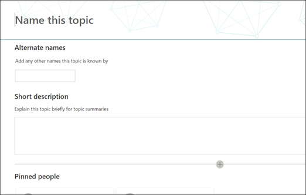

# Werken met onderwerpen in het onderwerp centrum (preview)Work with topics in the topic center (Preview)

> [!Note] 
> De inhoud in dit artikel is bedoeld voor project cortex private preview.The content in this article is for Project Cortex Private Preview. [Lees meer over project cortex](https://aka.ms/projectcortex).[Find out more about Project Cortex](https://aka.ms/projectcortex).

In het onderwerp centrum kan een Knowledge Manager onderwerpen controleren die zijn mined en gedetecteerd in de door u opgegeven SharePoint-bronlocaties, en deze kunnen ofwel bevestigen of weigeren.In the topic center, a knowledge manager can review topics that have been mined and discovered in the SharePoint source locations you specified, and can either confirm or reject them. Een Knowledge Manager kan ook nieuwe topic pagina's maken en publiceren als die niet is gevonden in het detecteren van een onderwerp of bestaande pagina's bewerken als ze moeten worden bijgewerkt.A knowledge manager can also create and publish new topic pages if one was not found in topic discovery, or edit existing ones if they need to be updated.

## VereistenRequirements

Om in het onderwerp te kunnen werken, moet u beschikken over de vereiste machtigingen.In order to work in the topic center, you need to have the required permissions. Uw beheerder kan u tijdens het [instellen van Knowledge Management](set-up-knowledge-network.md)toevoegen of nieuwe gebruikers kunnen [later worden toegevoegd](give-user-permissions-to-the-topic-center.md).Your admin can add you during [knowledge management setup](set-up-knowledge-network.md), or new users can be [added afterwards](give-user-permissions-to-the-topic-center.md).

De gebruikers van het onderwerp centrum kunnen twee groepen machtigingen krijgen:Topic center users can be given two sets of permissions:

- Onderwerpen maken en bewerken: nieuwe onderwerpen maken of inhoud van een onderwerp bijwerken, zoals de beschrijving, documenten en gekoppelde personenCreate and edit topics: Create new topics or update topic content such as the description, documents and associated persons
- Onderwerpen beheren: gebruik het dashboard van het onderwerp-beheer om de onderwerpen binnen de organisatie te reviseren.Manage topics: Use the Topic management dashboard to review topics across the organization. Gebruikers kunnen acties uitvoeren, zoals onderwerpen voor bevestigen en negerenUsers can perform actions such as confirm and reject topics

## Onbevestigde onderwerpen controlerenReview unconfirmed topics

Op de startpagina van het onderwerp Center worden de onderwerpen die zijn gevonden in de opgegeven SharePoint-bronlocaties weergegeven op het tabblad **onbevestigd** . Een gebruiker met machtigingen voor het beheren van onderwerpen kan onbevestigde onderwerpen controleren en ervoor zorgen dat deze worden bevestigd of genegeerd.On the topic center home page, topics that were discovered in your specified SharePoint source locations will be listed in the **Unconfirmed** tab. A user with permissions to manage topics can review unconfirmed topics and choose to confirm or reject them.

Een niet-bevestigd onderwerp bekijken:To review an unconfirmed topic:

1. Selecteer op het tabblad niet- **bevestigd** het onderwerp om de onderwerpenpagina te openen.On the **Unconfirmed** tab, select the topic to open the topic page. 

2. Op de pagina onderwerp controleert u het onderwerp en selecteert u **bewerken** als u wijzigingen wilt aanbrengen aan de pagina.On the topic page, review the topic page, and select **Edit** if you need to make any changes to the page.
3. Op de startpagina van het kennis centrum voor het geselecteerde onderwerp, kunt u het volgende doen:On the Knowledge Center home page, for the selected topic, you can: 
    a.a. Selecteer de controleren om te bevestigen dat u het onderwerp wilt bewaren.Select the check to confirm that you want to keep the topic. 
    b.b. Selecteer de **x** als u het onderwerp wilt negeren.Select the **x** if you want to reject the topic. 

    Bevestigde onderwerpen worden verwijderd uit de niet- **bevestigde** lijst en worden nu weergegeven op het tabblad **bevestigd** .Confirmed topics will be removed from the **Unconfirmed** list and will now display in the **Confirmed** tab. 

    Genegeerde onderwerpen worden verwijderd uit de niet- **bevestigde** lijst en worden nu weergegeven in het tabblad **afgekeurd of uitgesloten** .Rejected topics will be removed from the **Unconfirmed** list and will now display in the **Rejected or Excluded** tab. 
    
   
## Een nieuw onderwerp makenCreate a new topic

Gebruikers met de machtiging onderwerp maken of bewerken kunnen een nieuw onderwerp maken, indien nodig.A user with create or edit topic permissions can create a new topic if needed. U moet dit mogelijk doen als het onderwerp niet is gevonden via Discovery of als de AI-technologie niet voldoende bewijs heeft gevonden om dit als onderwerp te verkrijgen.You might need to do this if the topic was not discovered through discovery or if the AI technology did not find enough evidence to establish it as a topic.

Een nieuw onderwerp maken:To create a new topic:
1. Selecteer op de pagina onderwerp centrum de optie **Nieuw**en selecteer vervolgens **onderwerpenpagina**.On the topic center page, select **New**, then select **Topic Page**. 

      

2. Op de nieuwe pagina voor het onderwerp kunt u de gegevens invullen van de nieuwe sjabloon:On the new topic page, you can fill in the information on the new topic template: 
    a.a. Typ in het gedeelte **naam van dit onderwerp** de naam van het nieuwe onderwerp.In the **Name this topic** section, type the name of the new topic. 
    b.b. Typ in de sectie **alternatieve namen** de namen of acroniemen die ook worden gebruikt om het onderwerp te raadplegen.In the **Alternate names** section, type names or acronyms that are also used to refer to the topic. 
    c.c. Typ in het gedeelte **korte beschrijving** de beschrijving van een of twee zinnen van het onderwerp.In the **Short description** section, type a one or two sentence description of the topic. Deze tekst wordt gebruikt voor het bijbehorende onderwerpvenster.This text will be used for the associated topic card. 
    d.d. Typ in de sectie **personen** de namen van de experts voor het onderwerp.In the **People** section, type the names of subject matter experts for the topic. 
    e.e. Selecteer in de sectie **bestanden en pagina's** de optie **toevoegen** en op de volgende pagina kunt u de bijbehorende OneDrive-bestanden of SharePoint Online-pagina's selecteren.In the **Files and pages** section, select **Add** and then on the next page you can select associated OneDrive files or SharePoint Online pages. 
    f.f. Selecteer in de sectie **sites** de optie **toevoegen**.In the **Sites** section, select **Add**. Selecteer de sites die zijn gekoppeld aan het onderwerp in het deelvenster **sites** dat wordt weergegeven.In the  **Sites** pane that displays, select the sites that are associated to the topic. 

      
3. Als u andere onderdelen aan de pagina wilt toevoegen, zoals tekst, afbeeldingen, webonderdelen, koppelingen, enzovoort, selecteert u het canvas pictogram in het midden van de pagina om deze te zoeken en toe te voegen.If you need to add other components to the page, such as text, images, webparts, links, etc., select the canvas icon in the middle of the page to locate and add them.
       

4. Wanneer u klaar bent, selecteert u **publiceren** om de onderwerpenpagina te publiceren.When you are done, select **Publish** to publish the topic page. Gepubliceerde topic pagina's worden weergegeven op het tabblad **pagina's** .Published topic pages will display in the **Pages** tab.

> [!Note] 
> De nieuwe topic wordt gemaakt van webonderdelen die bekend zijn met het *kennis netwerk*.The new topic page is made up of web parts that are *knowledge network aware*. Dit betekent dat zo veel meer informatie over het onderwerp wordt verzameld, maar de informatie in deze webonderdelen wordt bijgewerkt met suggesties om de pagina nuttiger te maken voor gebruikers.This means that as AI gathers more information on the topic, the information in these web parts will be updated with suggestions to make the page more useful to users.

## Een bestaande onderwerpenpagina bewerkenEdit an existing topic page

Bestaande topic pagina's vindt u op de pagina **pagina's** .Existing topic pages can be found in the **Pages** page. 

1. Selecteer op de pagina onderwerp centrum de optie **pagina's**.On the Topic Center page, select **Pages**. 
2. Op de pagina **pagina's** ziet u een lijst met onderwerpen over pagina's.On the **Pages** page, you will see a list of topic pages. Gebruik het zoekvak om te zoeken naar het onderwerp dat u wilt bijwerken.Use the Search box to find the topic page you want to update. Klik op de naam van het onderwerp dat u wilt bewerken.Click on the name of the topic page that you want to edit. 
3. Selecteer **bewerken**op de pagina onderwerp.On the topic page, select **Edit**.  
4. Breng de gewenste wijzigingen aan in de pagina.Make the changes you need to the page. Dit omvat updates voor de volgende velden:This includes updates to the following fields: 
    a.a. Alternatieve namenAlternate names 
    b.b. BeschrijvingDescription 
    c.c. PersonenPeople 
    d.d. Bestanden en pagina'sFiles and pages 
    e.e. SitesSites 
    f.f. U kunt ook statische items toevoegen aan de pagina, zoals tekst, afbeeldingen of koppeling, door het papier pictogram te selecteren.You can also add static items to the page - such as text, images, or link - by selecting the canvas icon. 

5. Selecteer **opnieuw publiceren** om uw wijzigingen op te slaan.Select **Republish** to save your changes.

## Zie ookSee also

  

