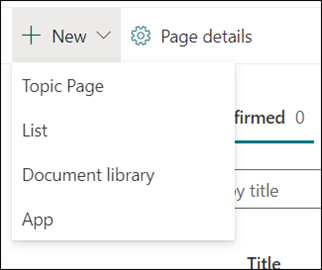

# Werken met onderwerpen in het onderwerp centrum (preview)

> [!Note] 
> De inhoud in dit artikel is bedoeld voor project cortex private preview. [Meer informatie over Project Cortex](https://aka.ms/projectcortex).

In het onderwerp centrum kan een Knowledge Manager onderwerpen controleren die zijn mined en gedetecteerd in de door u opgegeven SharePoint-bronlocaties, en deze kunnen ofwel bevestigen of weigeren. Een Knowledge Manager kan ook nieuwe topic pagina's maken en publiceren als die niet is gevonden in het detecteren van een onderwerp of bestaande pagina's bewerken als ze moeten worden bijgewerkt.

## Vereisten

Om in het onderwerp te kunnen werken, moet u beschikken over de vereiste machtigingen. Uw beheerder kan u tijdens het [instellen van Knowledge Management](set-up-topic-experiences.md)toevoegen of nieuwe gebruikers kunnen [later worden toegevoegd](give-user-permissions-to-the-topic-center.md).

De gebruikers van het onderwerp centrum kunnen twee groepen machtigingen krijgen:

- Onderwerpen maken en bewerken: nieuwe onderwerpen maken of inhoud van een onderwerp bijwerken, zoals de omschrijving, documenten en gekoppelde personen.

- Onderwerpen beheren: gebruik het dashboard van het onderwerp-beheer om de onderwerpen binnen de organisatie te reviseren. Gebruikers kunnen acties uitvoeren, zoals onderwerpen voor bevestigen en negeren.

## Bekijk de voorgestelde onderwerpen

Op de startpagina van het onderwerp Center worden de onderwerpen die zijn gevonden in de opgegeven SharePoint-bronlocaties weergegeven op het tabblad **Aanbevolen** . Een gebruiker met machtigingen voor het beheren van onderwerpen kan onbevestigde onderwerpen controleren en ervoor zorgen dat deze worden bevestigd of genegeerd.

Een voorgesteld onderwerp bekijken:

1. Selecteer op het tabblad **Aanbevolen** het onderwerp om het onderwerp te openen. 

2. Op de pagina onderwerp controleert u het onderwerp en selecteert u **bewerken** als u wijzigingen wilt aanbrengen aan de pagina.

3. Op de startpagina van het kennis centrum voor het geselecteerde onderwerp, kunt u het volgende doen:

    1. Selecteer de controleren om te bevestigen dat u het onderwerp wilt bewaren.
    
    1. Selecteer de **x** als u het onderwerp wilt negeren.

    Bevestigde onderwerpen worden verwijderd uit de niet- **bevestigde** lijst en worden nu weergegeven op het tabblad **bevestigd** .

    Genegeerde onderwerpen worden verwijderd uit de niet- **bevestigde** lijst en worden nu weergegeven in het tabblad **afgekeurd of uitgesloten** .

## Bekijk bevestigde onderwerpen

Op de startpagina van het onderwerp Center-onderwerpen die zijn gevonden in de opgegeven SharePoint-bronlocaties en zijn bevestigd door een Knowledge Manager of iedereen te krijgen, bevestigd door 2 of meer personen via het kaart feedback mechanisme, worden weergegeven op het tabblad **bevestigd** . Een gebruiker met machtigingen voor het beheren van onderwerpen kan bevestigde onderwerpen controleren en ervoor kiezen om deze te weigeren.

Een bevestigd onderwerp bekijken:

1. Selecteer op het tabblad **bevestigd** het onderwerp voor het openen van de onderwerpenpagina. 

2. Op de pagina onderwerp controleert u het onderwerp en selecteert u **bewerken** als u wijzigingen wilt aanbrengen aan de pagina.

3. U kunt het ook afwijzen

## Gepubliceerde onderwerpen bekijken
Gepubliceerde onderwerpen zijn bewerkt, zodat bepaalde informatie altijd wordt weergegeven voor iemand die de pagina tegenkomt. Handmatig gemaakte onderwerpen worden hier weergegeven.

   
## Een nieuw onderwerp maken

Gebruikers met de machtiging onderwerp maken of bewerken kunnen een nieuw onderwerp maken, indien nodig. U moet dit mogelijk doen als het onderwerp niet is gevonden via Discovery of als de AI-technologie niet voldoende bewijs heeft gevonden om dit als onderwerp te verkrijgen.

Een nieuw onderwerp maken:

1. Selecteer op de pagina onderwerp centrum de optie **Nieuw** en selecteer vervolgens **onderwerpenpagina**.

    

2. Op de nieuwe pagina voor het onderwerp kunt u de gegevens invullen van de nieuwe sjabloon:

    1. Typ in het gedeelte **naam van dit onderwerp** de naam van het nieuwe onderwerp.
    
    1. Typ in de sectie **alternatieve namen** de namen of acroniemen die ook worden gebruikt om het onderwerp te raadplegen.
    
    1. Typ in het gedeelte **korte beschrijving** de beschrijving van een of twee zinnen van het onderwerp. Deze tekst wordt gebruikt voor het bijbehorende onderwerpvenster.
    
    1. Typ in de sectie **personen** de namen van de experts voor het onderwerp.
    
    1. Selecteer in de sectie **bestanden en pagina's** de optie **toevoegen** en op de volgende pagina kunt u de bijbehorende OneDrive-bestanden of SharePoint Online-pagina's selecteren.
    
    1. Selecteer in de sectie **sites** de optie **toevoegen**. Selecteer de sites die zijn gekoppeld aan het onderwerp in het deelvenster  **sites** dat wordt weergegeven.

    
    
3. Als u andere onderdelen aan de pagina wilt toevoegen, zoals tekst, afbeeldingen, webonderdelen, koppelingen, enzovoort, selecteert u het canvas pictogram in het midden van de pagina om deze te zoeken en toe te voegen.

    

4. Wanneer u klaar bent, selecteert u **publiceren** om de onderwerpenpagina te publiceren. Gepubliceerde topic pagina's worden weergegeven op het tabblad **pagina's** .

> [!Note] 
> De nieuwe topic wordt gemaakt van webonderdelen die bekend zijn met het *kennis netwerk*. Dit betekent dat zo veel meer informatie over het onderwerp wordt verzameld, maar de informatie in deze webonderdelen wordt bijgewerkt met suggesties om de pagina nuttiger te maken voor gebruikers.

## Een bestaande onderwerpenpagina bewerken

Bestaande topic pagina's vindt u op de pagina **pagina's** . 

1. Selecteer op de pagina onderwerp centrum de optie **pagina's**.

2. Op de pagina **pagina's** ziet u een lijst met onderwerpen over pagina's. Gebruik het zoekvak om te zoeken naar het onderwerp dat u wilt bijwerken. Klik op de naam van het onderwerp dat u wilt bewerken.

3. Selecteer **bewerken** op de pagina onderwerp.

4. Breng de gewenste wijzigingen aan in de pagina. Dit omvat updates voor de volgende velden:

    1. Alternatieve namen
    1. Beschrijving
    1. Personen
    1. Bestanden en pagina's
    1. Sites
    1. U kunt ook statische items toevoegen aan de pagina, zoals tekst, afbeeldingen of koppeling, door het papier pictogram te selecteren.

5. Selecteer **opnieuw publiceren** om uw wijzigingen op te slaan.

<!--## See also-->

