# Binnenkort beschikbaar: SharePoint configureren als een bron van leerinhoud voor Microsoft Viva Learning (preview)Coming soon: Configure SharePoint as a learning content source for Microsoft Viva Learning (Preview)

> [!NOTE]
> De informatie in dit artikel heeft betrekking op een voorbeeldproduct dat aanzienlijk kan worden gewijzigd voordat het commercieel wordt uitgebracht.The information in this article relates to a preview product that may be substantially modified before it's commercially released. 

U kunt SharePoint configureren als een bron voor leerinhoud om de eigen inhoud van uw organisatie beschikbaar te maken in Viva Learning (Preview).You can configure SharePoint as a learning content source to make your organization's own content available in Viva Learning (Preview).

## OverzichtOverview

De kennisbeheerder (of globale beheerder) biedt een site-URL aan waar de Leerservice een lege gecentraliseerde locatie kan maken, de Learning App Content Repository, in de vorm van een gestructureerde SharePoint-lijst.The knowledge admin (or global administrator) provides a site URL to where the Learning Service can create an empty centralized location—the Learning App Content Repository—in the form of a structured SharePoint list. Deze lijst kan door uw organisatie worden gebruikt om koppelingen naar SharePoint-mappen met meerdere bedrijven te huis houden die leerinhoud bevatten.This list can be used by your organization to house links to cross-company SharePoint folders that contain learning content. Beheerders zijn verantwoordelijk voor het verzamelen en cureren van een lijst met URL's voor mappen.Admins are responsible for collecting and curating a list of URLs for folders. Deze mappen mogen alleen inhoud bevatten die beschikbaar kan worden gesteld in Viva Learning (preview).These folders should only include content that can be made available in Viva Learning (Preview).

Viva Learning (Preview) ondersteunt de volgende documenttypen:Viva Learning (Preview) supports the following document types:

- Word, PowerPoint, Excel, PDFWord, PowerPoint, Excel, PDF
- Audio (.m4a)Audio (.m4a)
- Video (.mov, .mp4, .avi)Video (.mov, .mp4, .avi)

Zie [SharePoint-limieten voor meer informatie.](/office365/servicedescriptions/sharepoint-online-service-description/sharepoint-online-limits?redirectSourcePath=%252farticle%252fSharePoint-Online-limits-8f34ff47-b749-408b-abc0-b605e1f6d498)For more information, see [SharePoint limits](/office365/servicedescriptions/sharepoint-online-service-description/sharepoint-online-limits?redirectSourcePath=%252farticle%252fSharePoint-Online-limits-8f34ff47-b749-408b-abc0-b605e1f6d498). 

## MachtigingenPermissions

URL's van documentbibliotheekmappen kunnen worden verzameld vanaf elke SharePoint-site in de organisatie.Document library folder URLs can be collected from any SharePoint site in the organization. Viva Learning (Preview) volgt alle bestaande inhoudsmachtigingen.Viva Learning (Preview) follows all existing content permissions. Daarom is alleen inhoud waarvoor een gebruiker toegang heeft, doorzoekbaar en zichtbaar in Viva Learning (Preview).Therefore, only content for which a user has permission to access is searchable and visible within Viva Learning (Preview). Inhoud in deze mappen kan worden doorzocht, maar alleen inhoud waaraan de afzonderlijke werknemer machtigingen heeft, kan worden gebruikt.Any content within these folders will be searchable, but only content to which the individual employee has permissions can be used.

Het verwijderen van inhoud uit de opslagplaats van uw organisatie wordt momenteel niet ondersteund.Content deletion from your organization’s repository is not currently supported.

Als u onbedoeld opgedoken inhoud wilt verwijderen, gaat u als volgt te werk:To remove unintentionally surfaced content, follow these steps:

1.  Als u de toegang tot de documentbibliotheek wilt beperken, selecteert u de optie Acties **tonen** en selecteert u **Vervolgens Toegang beheren.**To restrict access to the document library, select the **Show actions** option, and then select **Manage access**.
     
     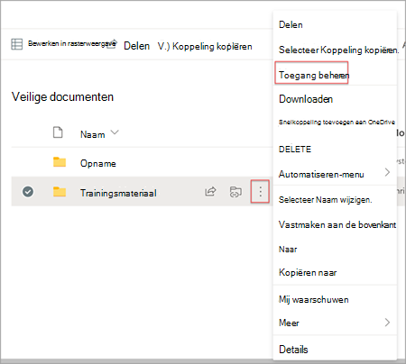

2.  Verwijder het oorspronkelijke document in de documentbibliotheek.Delete the original document within the document library.

Zie Delen en machtigingen in de [moderne SharePoint-ervaring](/sharepoint/modern-experience-sharing-permissions)voor meer informatie.For more information, see [Sharing and permissions in the SharePoint modern experience](/sharepoint/modern-experience-sharing-permissions). 

## LeerserviceLearning Service

De Learning Service gebruikt de meegeleverde map-URL's om metagegevens op te halen uit alle inhoud die in die mappen is opgeslagen.The Learning Service uses the provided folder URLs to get metadata from all content stored in those folders. Binnen 24 uur na het leveren van de MAP-URL in de gecentraliseerde opslagplaats kunnen werknemers de inhoud van uw organisatie zoeken en gebruiken in Viva Learning (Preview).Within 24 hours of supplying the folder URL in the centralized repository, employees can search for and use your organization’s content within Viva Learning (Preview). Alle wijzigingen in inhoud, inclusief bijgewerkte metagegevens en machtigingen, worden ook binnen 24 uur toegepast in de Leerservice.All changes to content, including updated metadata and permissions, will also be applied in the Learning Service within 24 hours.

## SharePoint configureren als bronConfigure SharePoint as a source

U moet een globale beheerder van Microsoft 365, SharePoint-beheerder of kennisbeheerder zijn om deze taken uit te voeren.You must be a Microsoft 365 global administrator, SharePoint administrator, or knowledge admin to perform these tasks.

Als u SharePoint wilt configureren als bronnen voor leerinhoud in voor Viva Learning (Voorbeeld), volgt u de volgende stappen:To configure SharePoint as a learning content sources in for Viva Learning (Preview), follow these steps:

1.  Ga in de linkernavigatie van het Microsoft 365-beheercentrum naar **Instellingen**  >  **organisatie-instellingen.**In the left navigation of the Microsoft 365 admin center, go to **Settings** > **Org settings**.
 
2.  Selecteer op **de pagina Organisatie-instellingen** op het **tabblad Services** de optie Viva **Learning (voorbeeld)**.On the **Org settings** page, on the **Services** tab, select **Viva Learning (Preview)**.

     

3.  In het **deelvenster Viva Learning (Preview)** onder SharePoint wordt de SITE-URL naar de SharePoint-site weergegeven waarin u wilt dat Viva Learning (Preview) een gecentraliseerde opslagplaats maakt.On the **Viva Learning (Preview)** panel, under SharePoint, provides the site URL to the SharePoint site where you want Viva Learning (Preview) to create a centralized repository.

     

4.  Er wordt automatisch een SharePoint-lijst gemaakt op de opgegeven SharePoint-site.A SharePoint list is created automatically within the provided SharePoint site.

     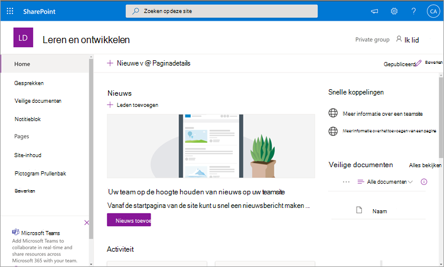

     Selecteer in de linkernavigatie van de SharePoint-site **de optie Site-inhoud**  >  **Learning App Content Repository.**In the left navigation of the SharePoint site, select **Site contents** > **Learning App Content Repository**. 

     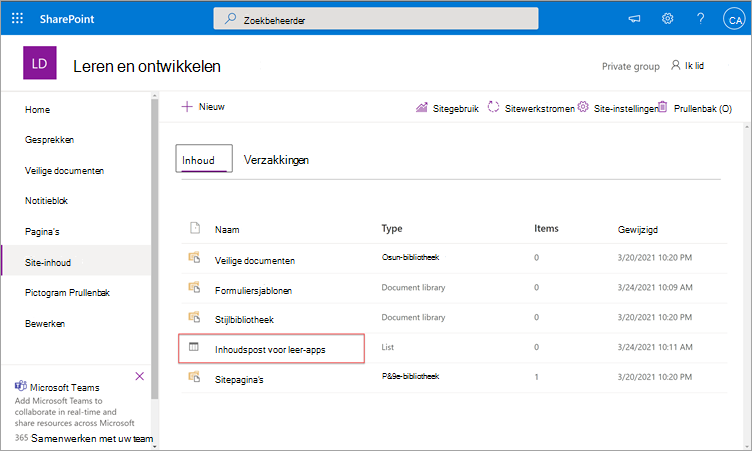 

5. Vul op **de pagina Inhoudsopslag** van leer-apps de SharePoint-lijst met URL's in naar de mappen met leerinhoud.On the **Learning App Content Repository** page, populate the SharePoint list with URLs to the learning content folders.

   1. Selecteer **Nieuw om** het deelvenster Nieuw item **te** bekijken.Select **New** to view the **New item** panel. 

       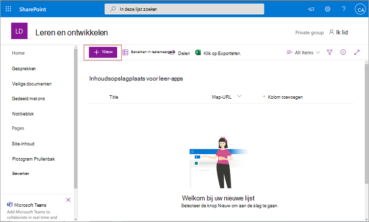
 
   2. Voeg in **het deelvenster** Nieuw item in **het** veld Titel een adreslijstnaam van uw keuze toe.On the **New item** panel, in the **Title** field, add a directory name of your choice. Voeg in **het veld Map-URL** de URL toe aan de map leerinhoud.In the **Folder URL** field, add the URL to the learning content folder. Selecteer **Opslaan**.Select **Save**.

       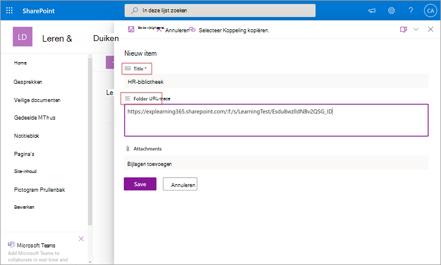

   3. De **pagina Learning App Content Repository** wordt bijgewerkt met de nieuwe leerinhoud.The **Learning App Content Repository** page is updated with the new learning content.

       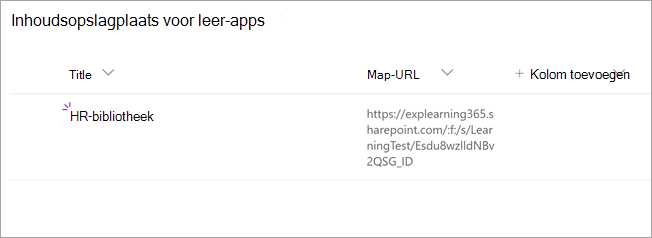

> [!NOTE]
> Als u een bredere toegang tot de Inhoudsopslagplaats voor leer-apps wilt toestaan, is er binnenkort een koppeling naar de lijst beschikbaar in de interface Viva Learning (Preview), waar gebruikers toegang kunnen aanvragen en uiteindelijk kunnen helpen de lijst in te vullen.To allow for broader access to the Learning App Content Repository, a link to the list soon will be available in the Viva Learning (Preview) interface where users can request access and ultimately help populate the list. Site-eigenaren en globale beheerders moeten toegang verlenen tot de lijst.Site owners and global administrators will be required to grant access to the list. Access is alleen specifiek voor de lijst en is niet van toepassing op de site waar de lijst is opgeslagen.Access is specific to the list only and does not apply to the site where the list is stored. Zie De inhoud van [uw](#provide-your-own-organizations-content) eigen organisatie later in dit artikel verstrekken voor meer informatie.For more information, see [Provide your own organization's content](#provide-your-own-organizations-content) later in this article.

### Map URL document library curationFolder URL document library curation

Standaardmetagegevens (zoals gewijzigde datum, gemaakt door, documentnaam, inhoudstype en organisatienaam) worden automatisch in Viva Learning (Preview) getrokken door de Microsoft Graph-API.Default metadata (such as modified date, created by, document name, content type, and organization name) is automatically pulled into Viva Learning (Preview) by the Microsoft Graph API.
 
Als u de algehele detectie en zoekrelevantie van de inhoud wilt verbeteren, raden we u aan een kolom **Beschrijving toe te** voegen.To improve overall discovery and search relevance of the content, we recommend adding a **Description** column.

Als u een kolom **Beschrijving wilt** toevoegen aan de pagina van de documentbibliotheek, gaat u als volgt te werk:To add a **Description** column to the document library page, follow these steps:

1.  Selecteer op **de pagina** Documenten de optie **Kolom toevoegen.**On the **Documents** page, select **Add column**.

2. Selecteer de **optie Acties tonen** en selecteer vervolgens Enkele regel **tekst.**Select the **Show actions** option, and then select **Single line of text**.

     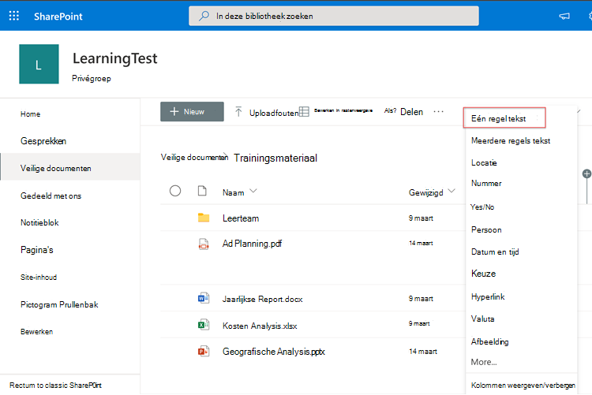

3. Voeg in **het deelvenster** Een kolom maken in het veld **Naam** een beschrijvende naam voor de kolom toe.On the **Create a column** panel, in the **Name** field, add a descriptive name for the column. Selecteer **Opslaan**.Select **Save**.

     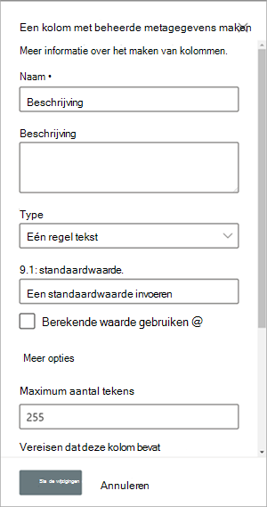
 
4. Voeg op **de** pagina Documenten in **de** kolom Beschrijving aangepaste beschrijvingen toe voor elk item.On the **Documents** page, in the **Description** column, add custom descriptions for each item. Als er geen beschrijving wordt opgegeven, wordt in Viva Learning (Preview) een standaardbericht weergegeven waarin de inhoud wordt benadrukt als afkomstig uit uw eigen SharePoint-bibliotheek.If no description is supplied, Viva Learning (Preview) will provide a default message that highlights the content as being from your own SharePoint library. 

     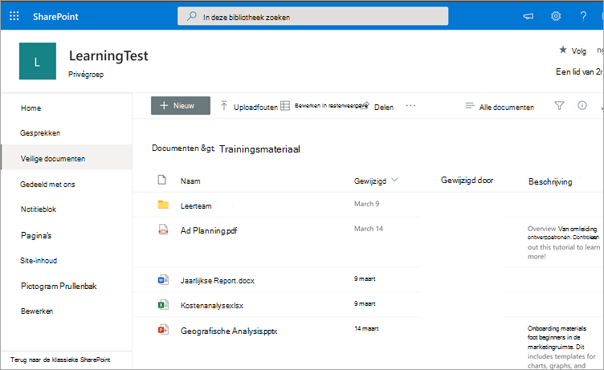
 
### De inhoud van uw eigen organisatie leverenProvide your own organization's content

Kennisbeheerders hebben toegang tot de Learning App Content Repository van hun organisatie in SharePoint, waar ze verwijzingen kunnen geven naar documentbibliotheken binnen verschillende organisaties.Knowledge admins can access their organization’s Learning App Content Repository in SharePoint, where they can provide references to cross-organization document libraries. Inhoud in deze bibliotheken wordt vervolgens weergegeven als leerinhoud in Viva Learning (Preview).Content within these libraries will be then surfaced as learning content in Viva Learning (Preview).

1. Selecteer in Viva Learning (Preview) **Meer opties** **(...)** en selecteer vervolgens **Instellingen.**In Viva Learning (Preview), select **More options** (**...**), and then select **Settings**.

     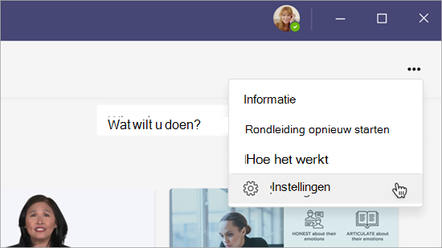
     
2. Selecteer **onder Instellingen** de optie **Machtigingen.**Under **Settings**, select **Permissions**.

     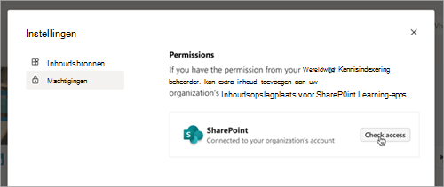

3. Selecteer **Toegang controleren** om verbinding te maken met de gecentraliseerde bibliotheek van uw organisatie.Select **Check access** to connect to your organization’s centralized library.
     
