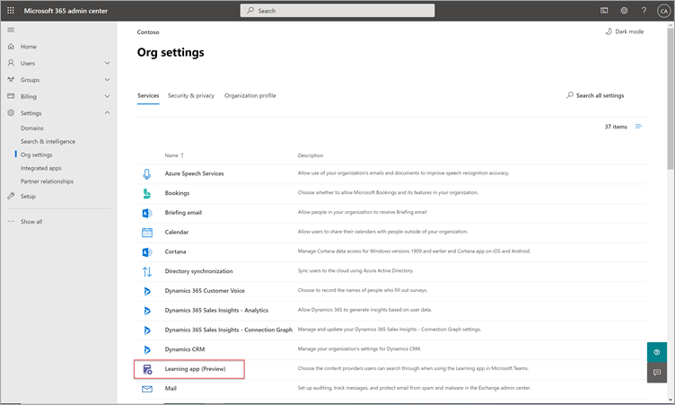

# Leerinhoudsbronnen configureren voor Microsoft Viva Learning (Preview) in het Microsoft 365 beheercentrum

> [!NOTE]
> De informatie in dit artikel heeft betrekking op een voorbeeldproduct dat aanzienlijk kan worden gewijzigd voordat het commercieel wordt uitgebracht. 

De beheerders van het Microsoft 365-beheercentrum kunnen instellingen met betrekking tot Viva Learning (Preview) beheren en de bronnen voor leerinhoud configureren door de rol van kennisbeheerder toe te wijzen aan geselecteerde personen in uw organisatie.

De beheerder selecteert welke andere bronnen van leerinhoud (bijvoorbeeld SharePoint of ondersteunde bronnen van externe inhoudsproviders) beschikbaar zijn voor gebruikers van Viva Learning (Preview). De beheerder configureert deze bronnen om ervoor te zorgen dat de inhoud beschikbaar is voor zoeken en ontdekken en kan worden bekeken door de werknemers die Viva Learning (Preview) gebruiken.

> [!NOTE]
>  Gebruikers melden zich aan bij niet-Microsoft en LinkedIn Learning Pro in een browser of ingesloten viewer. Voor dit geconfigureerde leren gelden de afzonderlijke licentie-, privacy- en servicevoorwaarden tussen uw organisatie en de derde partij, en niet de voorwaarden van Viva Learning (Preview). Voordat u dit type leerproces selecteert, controleert u of er een overeenkomst is gesloten voor uw organisatie en gebruikers.

## De rol van kennisbeheerder toewijzen (optioneel)

U moet een globale Microsoft 365 zijn om deze taken uit te voeren.

> [!TIP]
> De kennisbeheerder moet redelijk technisch zijn en over bestaande SharePoint-beheerdersreferenties, bij voorkeur iemand die goed bekend is met het onderwijs, leren, trainen of werknemerservaring in de organisatie.

### Een kennisbeheerder toevoegen

Als u een kennisbeheerder voor Viva Learning (Preview) wilt toevoegen, volgt u de volgende stappen:

1.  Ga in de linkernavigatie van het Microsoft 365 beheercentrum naar **Rollen.**

2.  Selecteer op **de** pagina Rollen op het **tabblad Azure AD** de optie Knowledge **Administrator.**
 
3.  Selecteer in **het deelvenster Kennisbeheerder** **toegewezen beheerders** en selecteer vervolgens **Toevoegen.**

     

3.  Selecteer in **het deelvenster** Beheerders toevoegen de persoon die u voor de rol kiest en selecteer **vervolgens Toevoegen.**

     

### Een kennisbeheerder verwijderen

Als u een kennisbeheerder voor Viva Learning (Preview) wilt verwijderen, volgt u de volgende stappen:

1.  Ga in de linkernavigatie van het Microsoft 365 beheercentrum naar **Rollen.**

2.  Ga op **de pagina** Rollen naar het tabblad **Azure AD** en selecteer **kennisbeheerder.**
 
3.  Selecteer in **het deelvenster** Kennisbeheerder op **het** tabblad Toegewezen beheerders de optie Verwijderen **en** selecteer vervolgens de persoon die u uit de rol wilt verwijderen. Als u wilt bevestigen, selecteert u **Verwijderen.**

     

## Instellingen configureren voor de leerinhoudsbronnen

U moet een globale Microsoft 365 of kennisbeheerder zijn om deze taken uit te voeren.

Als u instellingen wilt configureren voor leerinhoudsbronnen in Viva Learning, volgt u de volgende stappen:

1.  Ga in de linkernavigatie van het Microsoft 365 beheercentrum **naar Instellingen**  >  **Organisatie-instellingen.**

2.  Selecteer op **de pagina Organisatie-instellingen** op het **tabblad Services** de optie Viva **Learning (voorbeeld)**.

     

3.  Selecteer in **het deelvenster Viva Learning (Preview)** de leerinhoudsbronnen die u wilt configureren voor de organisatie en selecteer vervolgens **Opslaan.**

     

Van alle bestaande leerbronnen zijn sommige standaard ingeschakeld. Deze leerbronnen zijn:

- LinkedIn Learning (gratis inhoud)
- Microsoft Learn
- Microsoft 365 Training

> [!NOTE]
> LinkedIn gratis inhoud wordt verstrekt aan gebruikers onder het LinkedIn-privacybeleid en de gebruikersovereenkomst. LinkedIn ontvangt het IP-adres van de gebruiker, eventuele cookies die eerder door LinkedIn zijn ingesteld, en stelt een nieuwe cookie in om het gebruik van gratis inhoud bij te houden. Gebruikers zijn niet verplicht zich aan te melden met LinkedIn om gratis inhoud te ontvangen.  
Voor LinkedIn premium-inhoud heeft uw organisatie een abonnement nodig voor uw team om toegang te krijgen tot die inhoud. Gebruikers moeten zich aanmelden bij LinkedIn om toegang te krijgen tot dat leerproces, dat wordt verstrekt onder de voorwaarden van de voorwaarden van uw organisatie en de gebruikersvoorwaarden met LinkedIn.   Voor inhoud die niet van Microsoft is (behalve gratis LinkedIn-inhoud), moet uw organisatie een abonnement hebben voor uw gebruikers om toegang te krijgen tot die inhoud met een werkaccount voordat u deze verbinding maakt met Viva Learning (Preview). Persoonlijke abonnementen van gebruikers op niet-Microsoft-leerproviders worden niet geïntegreerd met Viva Learning (Preview). Gebruikers melden zich aan bij niet-Microsoft en LinkedIn Learning Pro in een browser of ingesloten viewer. Als gebruikers naar inhoud gaan waar ze geen organisatieabonnement hebben, zien ze mogelijk een providerpagina waar ze zich kunnen registreren voor een afzonderlijk abonnement. Alle niet-Microsoft-leren wordt verstrekt onder de voorwaarden van de niet-Microsoft-provider en niet als onderdeel van Viva Learning. 

Als u een bron voor leerinhoud wilt in- of uitschakelen, schakelt u het selectievakje naast de bron in. Als een bron is ingeschakeld, wordt een vinkje weergegeven.

## Inhoudsproviders van derden 

De set beschikbare verbonden leerproviders kan op elk moment veranderen. Meer providers zullen deelnemen naarmate het programma groeit. Beschikbare providers kunnen er ook voor kiezen om hun verbinding met Viva Learning (Preview) te stoppen.

### Skillsoft als inhoudsbron  

Voor Viva Learning (Preview) komen gebruikers die Skillsoft hebben ingeschakeld en ervoor kiezen om Skillsoft-inhoud te bekijken, terecht op een Percipio-pagina met de vraag of ze de Percipio-sitenaam van uw organisatie moeten invoeren. Nadat gebruikers de sitenaam van uw organisatie hebben ingevoerd, worden ze doorgestuurd naar de pagina om zich aan te melden bij de Percipio-site van uw organisatie. Gebruikers melden zich aan met hun bestaande referenties en zien de inhoud die ze oorspronkelijk hebben geselecteerd. Gebruikers worden slechts eenmaal gevraagd de naam van de Percipio-site in te geven, totdat hun browsercache is gewist. Als u deze ervaring voor uw gebruikers wilt stroomlijnen, raden we u aan de naam van uw Percipio-site op te geven in interne communicatie die u verzendt over Viva Learning (Preview).

Dit is bedoeld als een tijdelijke ervaring voor preview en we werken samen met Skillsoft om tenantspecifieke integratie in te stellen voor algemene beschikbaarheid, waardoor de stap wordt overgeslagen waarvoor gebruikers de Percipio-sitenaam van uw organisatie moeten verstrekken. 

### Details over Microsoft-substraat  

Voor gegevens die u kopieert naar Viva Learning (Preview) van een niet-Microsoft-service (leerprovider of leerbeheersysteem), kunt u die gegevens niet rechtstreeks in Viva Learning (Preview) extraheren, corrigeren of verwijderen. We vernieuwen de gegevens die u importeert van niet-Microsoft-providers om wijzigingen en verwijderingen in de niet-Microsoft-brongegevens weer te geven.

U moet samenwerken met de leverancier van de niet-Microsoft-service voor het openen, corrigeren, verwijderen of extraheren van gegevens onder de licentie-, service- of privacyvoorwaarden van de niet-Microsoft-service. De wijzigingen die daar zijn aangebracht, worden doorgevoerd in de gegevens die zijn verwerkt voor uw gebruik in Viva Learning (Preview) na voltooiing van de gegevensupdatecyclus van de niet-Microsoft-service en Viva Learning (Preview). Als u de verbinding tussen Viva Learning (Preview) en een niet-Microsoft-service uit schakelen, worden alle gegevens die u eerder uit die service hebt geïmporteerd, verwijderd. 

## Volgende stap

[Een SharePoint als een bron van leerinhoud configureren voor Microsoft Viva Learning (preview)](configure-sharepoint-content-source.md)