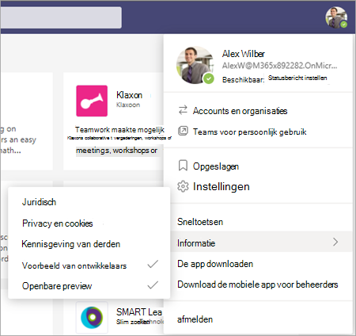

# Microsoft Viva Learning (Preview) instellen in het Teams beheercentrumSet up Microsoft Viva Learning (Preview) in the Teams admin center

> [!NOTE]
> De informatie in dit artikel heeft betrekking op een voorbeeldproduct dat aanzienlijk kan worden gewijzigd voordat het commercieel wordt uitgebracht.The information in this article relates to a preview product that may be substantially modified before it's commercially released. 

De Teams beheerder moet bepaalde stappen uitvoeren om Viva Learning (Preview) in te stellen voor hun gebruikers in de tenant.The Teams administrator needs to perform certain steps to enable Viva Learning (Preview) for their users in the tenant. Deze stappen variëren op basis van de manier waarop de tenant is ingeschakeld: [*Openbare*](set-up-teams-admin-center.md#public-preview-tenants) preview of [ *Private Preview* (of Beta).](set-up-teams-admin-center.md#private-preview-tenants)These steps vary based on how the tenant is enabled:  [*Public Preview*](set-up-teams-admin-center.md#public-preview-tenants) or [*Private Preview* (or Beta)](set-up-teams-admin-center.md#private-preview-tenants).

## Openbare preview-tenantsPublic Preview tenants

### Beheerdersstappen voor openbare preview-tenantsAdministrator steps for Public Preview tenants

Omdat Viva Learning (Preview) nog niet algemeen beschikbaar is, zijn bepaalde stappen vereist om de functies in te stellen en machtigingen in te stellen voor specifieke gebruikers of groepen.Because the Viva Learning (Preview) is not yet generally available, certain steps are required to enable the features and set permissions for specific users or groups. 

1. Openbare preview-functies inschakelen voor Gebruikers van Viva Learning (Preview).Enable Public Preview features for Viva Learning (Preview) users.

    a.a. Wijzig Teams updatebeleid om openbare preview-functies in te stellen.Modify Teams update policy to enable Public Preview features. Zie [Microsoft Teams Openbare preview.](/microsoftteams/public-preview-doc-updates)See [Microsoft Teams Public Preview](/microsoftteams/public-preview-doc-updates).

    b.b. Schakel het updatebeleid in voor gebruikers of groepen die Viva Learning (Preview) testen.Enable the update policy for users or groups who will perform Viva Learning (Preview) testing. Zie [Beleid toewijzen aan gebruikers en groepen.](/microsoftteams/assign-policies-users-and-groups)See [Assign policies to users and groups](/microsoftteams/assign-policies-users-and-groups).

2. Wijzig het app-machtigingsbeleid voor Gebruikers van Viva Learning (Preview).Modify the app permission policy for Viva Learning (Preview) users.

    a.a. Tenzij het momenteel deel uitmaakt van het globale beleid, kunt u alle Microsoft-apps toestaan in het app-machtigingsbeleid.Unless it's currently part of the global policy, allow all Microsoft apps in the app permission policy. Zie [App-machtigingsbeleid beheren in Microsoft Teams.](/microsoftteams/teams-app-permission-policies)See [Manage app permission policies in Microsoft Teams](/microsoftteams/teams-app-permission-policies). 

    b.b. Schakel het app-machtigingsbeleid in voor gebruikers of groepen die Viva Learning (Preview) testen.Enable the app permission policy for users or groups who will perform Viva Learning (Preview) testing. Zie [Beleid toewijzen aan gebruikers en groepen.](/microsoftteams/assign-policies-users-and-groups)See [Assign policies to users and groups](/microsoftteams/assign-policies-users-and-groups).

3.  Informeer gebruikers die Viva Learning (Preview) testen om hun [buildclient](set-up-teams-admin-center.md#user-steps-for-public-preview-tenants)over te schakelen naar Openbare preview voor Teams.Notify users who will test Viva Learning (Preview) to [switch their build client to Public Preview for Teams](set-up-teams-admin-center.md#user-steps-for-public-preview-tenants).

> [!IMPORTANT]
> Voor openbare preview-tenants wordt Viva Learning (Preview) niet weergegeven in beheerde **apps** in het Teams-beheercentrum tot de definitieve productversie.For Public Preview tenants, Viva Learning (Preview) will not be displayed in **Managed apps** in the Teams admin center until final product release. Gebruikers van openbare preview-weergave kunnen echter Viva Learning (Preview) vinden in de Teams app Store en gebruiken, zodra het juiste beleid en de juiste machtigingen zijn ingesteld.However, enabled Public Preview users can find Viva Learning (Preview) in the Teams app store and use it, once the correct policies and permissions have been set up.

### Gebruikersstappen voor openbare preview-tenantsUser steps for Public Preview tenants

Gebruikers die zijn ingeschakeld voor het testen van openbare preview- door het eerder beschreven beleid in te [schakelen,](set-up-teams-admin-center.md#administrator-steps-for-public-preview-tenants) moeten overschakelen naar Openbare preview [in](/microsoftteams/public-preview-doc-updates#enable-public-preview) hun Teams client.Users who have been enabled for Public Preview testing — by enabling the [policies previously described](set-up-teams-admin-center.md#administrator-steps-for-public-preview-tenants) — need to [switch to Public Preview](/microsoftteams/public-preview-doc-updates#enable-public-preview) in their Teams client.

1. Gebruikers moeten hun profielafbeelding selecteren > **Over**  >  **openbare preview.**Users must select their profile image > **About** > **Public Preview**.
   
    
    
2. Gebruikers moeten de algemene voorwaarden voor openbare preview-weergave accepteren.Users must accept the Public Preview terms and conditions.

    
 
3. Gebruikers kunnen Nu Viva Learning (Preview) vinden in de Teams app Store en deze gaan gebruiken.Users can now find Viva Learning (Preview) in the Teams app store and start using it.

## Private Preview-tenantsPrivate Preview tenants

### Beheerdersstappen voor tenants voor privévoorbeelden (of bètaversies)Administrator steps for Private Preview (or Beta) tenants

Voor private preview-tenants zijn er geen aanvullende beleidsregels die moeten worden ingeschakeld.For Private Preview tenants, there are no additional policies that need to be enabled. Viva Learning (Preview) moet echter beschikbaar zijn voor gebruikers in uw organisatie.However, Viva Learning (Preview) must be made available for users in your organization.

1. Ga in de linkernavigatie van het Teams beheercentrum naar Teams **Apps**  >  **beheren.**In the left navigation of the Teams admin center, go to **Teams apps** > **Manage apps**.

   

2. Typ op **de pagina Apps** beheren in het zoekvak Viva *Learning* en selecteer vervolgens Viva **Learning (Preview).**On the **Manage apps** page, in the search box, type *Viva Learning*, and then select **Viva Learning (Preview)**.

   

3. Selecteer op **de pagina Viva Learning (Preview)** onder **Status** de optie Toegestaan **om** Viva Learning (Preview) in te zetten.On the **Viva Learning (Preview)** page, under **Status**, select **Allowed** to turn on Viva Learning (Preview).

   

<!---
The Teams admin installs Viva Learning (Preview) and applies permission policies through the Teams admin center.

1. For Viva Learning (Preview), you must first set the Update policy in Teams. For more information, see [Microsoft Teams Public Preview](/MicrosoftTeams/public-preview-doc-updates).

    1. Sign in to the Teams admin center.

    2. Select **Teams** > **Update policies**.

    3. Select **Add**. 

    4. Name the update policy, add a policy, and turn on **Show preview features**.

2. The admin must notify users of the policy update so that they move their build into the Public Preview for Teams. 

    1. Users must select their profile image > **About** > **Public Preview**.
   
        
    
    2. Users must accept the **Public preview** terms and conditions.

        
 
3. For organizations that have restrictive policies and need to enable Viva Learning (Preview), follow the process in the next section.

## Manage settings for Viva Learning (Preview)

You must be an administrator in the Teams admin center to perform these tasks.

To make Viva Learning (Preview) available for users in your organization, follow these steps:

1. In the left navigation of the Teams admin center, go to **Teams apps** > **Manage apps**.

   

2. On the **Manage apps** page, in the search box, type *Viva learning*, and then select **Viva Learning (Preview)**.

   

3. On the **Viva Learning (Preview)** page:

   1. Under **Status**, select **Allowed** to turn on Viva Learning (Preview).

   2. On the **Settings** tab, under **App settings**, go to the Microsoft 365 admin center to [configure learning content sources](content-sources-365-admin-center.md).

   

4. After **Manage app** settings, go to **Permission policies** and **Setup policies** to grant permission to employees who should have access to Viva Learning (Preview) as part of your organization's participation in the preview.

> [!NOTE]
>  If your organization is in Ring 4.0 as part of Teams TAP100 program, you might need to enable approved users in Ring 3.0 to access Viva Learning (Preview).   As part of the preview, Viva Learning (Preview) is released in Ring 3.0. If your organization is in Ring 4.0, you won’t see Viva Learning (Preview) on the **Manage apps** page. To test the app, you need to create a custom apps permission policy, set it to **Allow all apps**, and assign it to Ring 3.0 approved users.      

--->

## Volgende stapNext step

[Bronnen voor leerinhoud configureren voor Viva Learning (preview) in het Microsoft 365-beheercentrumConfigure learning content sources for Viva Learning (Preview) in the Microsoft 365 admin center](content-sources-365-admin-center.md)
