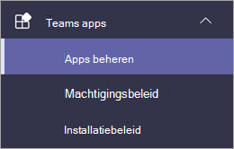
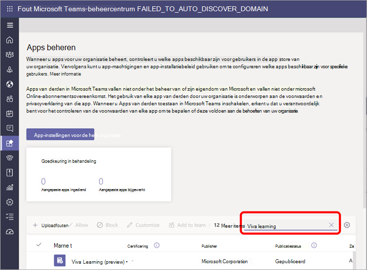
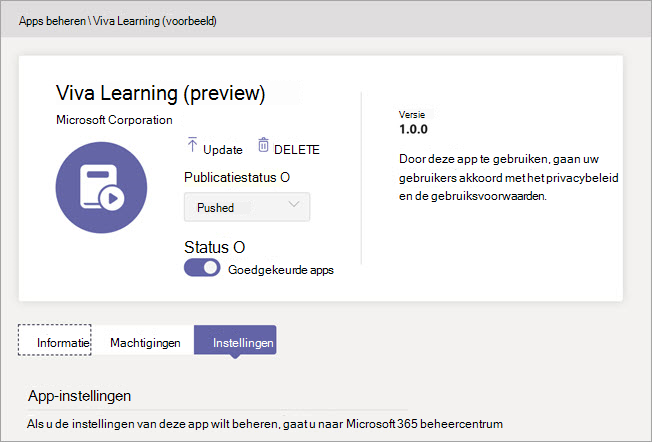
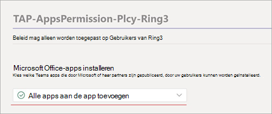

# Microsoft Viva Learning (Preview) instellen in het Teams beheercentrum

> [!NOTE]
> De informatie in dit artikel heeft betrekking op een voorbeeldproduct dat aanzienlijk kan worden gewijzigd voordat het commercieel wordt uitgebracht. 

De Teams beheerder installeert Viva Learning (Preview) en past machtigingsbeleid toe via het Teams beheercentrum.

## Instellingen voor Viva Learning beheren (voorbeeld)

U moet een beheerder zijn in het Teams beheercentrum om deze taken uit te voeren.

Als u Viva Learning (Preview) beschikbaar wilt maken voor gebruikers in uw organisatie, volgt u de volgende stappen:

1. Ga in de linkernavigatie van het Teams beheercentrum naar Teams **Apps**  >  **beheren.**

   

2. Typ op **de pagina Apps** beheren in het zoekvak Viva *learning* en selecteer vervolgens Viva **Learning (Preview).**

   

3. Op de **pagina Viva Learning (Preview)** :

   1. Selecteer **onder Status** de optie **Toegestaan** om Viva Learning (Preview) in te zetten.

   2. Ga op **Instellingen** tabblad Onder **App-instellingen** naar het Microsoft 365 beheercentrum om [leerinhoudsbronnen te configureren.](content-sources-365-admin-center.md)

   

4. Nadat **u app-instellingen** beheren  hebt ingesteld, gaat u naar Machtigingsbeleid en Installatiebeleid om toestemming te verlenen aan werknemers die toegang moeten hebben tot Viva Learning (Preview) als onderdeel van de deelname van uw organisatie aan het voorbeeld. 

> [!NOTE]
>  Als uw organisatie ring 4.0 heeft als onderdeel van Teams TAP100-programma, moet u mogelijk goedgekeurde gebruikers in Ring 3.0 inschakelen voor toegang tot Viva Learning (Preview).   Als onderdeel van het voorbeeld wordt Viva Learning (Preview) uitgebracht in Ring 3.0. Als uw organisatie Ring 4.0 gebruikt, ziet u Viva Learning (Preview) niet op de **pagina Apps beheren.** Als u de app wilt testen, moet u een aangepast machtigingsbeleid voor apps maken, instellen op Alle **apps** toestaan en deze toewijzen aan goedgekeurde gebruikers van Ring 3.0.      

## Volgende stap

[Bronnen voor leerinhoud configureren voor Viva Learning (preview) in het Microsoft 365-beheercentrum](content-sources-365-admin-center.md)