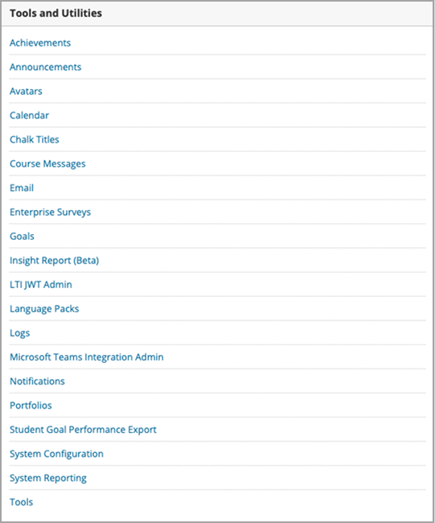

# Gebruik Microsoft Teams lessen met Blackboard

> [!IMPORTANT]
> Sommige informatie is gerelateerd aan voorlopige productversies die mogelijk aanzienlijk gewijzigd worden voordat ze commercieel gepubliceerd worden. Microsoft geeft geen garantie, uitdrukkelijk of impliciet, met betrekking tot de informatie die hier wordt beschreven.

Microsoft Teams lessen is een LTI-app (Learning Tools Interoperability) waarmee docenten en leerlingen eenvoudig kunnen navigeren tussen hun LMS (Learning Management System) en Teams. Gebruikers hebben rechtstreeks vanuit hun LMS toegang tot hun klasteams die aan hun cursus zijn gekoppeld.

## De app goedkeuren in de Microsoft Azure tenant

De volgende taken worden uitgevoerd door de Microsoft Office 365 beheerder en de Blackboard Learn Ultra-beheerder.

Voordat de integratie binnen Blackboard Learn Ultra wordt uitgevoerd, moet de Microsoft Office 365-beheerder de Blackboard **MSFT-Teams** voor De Ultra Azure-app voor de tenant van de instelling Microsoft Azure goedkeuren.

1. Zoek uw Microsoft Tenant-id. Zie [hoe u de tenant kunt vinden.](/azure/active-directory/fundamentals/active-directory-how-to-find-tenant)

2. Omleiden van het Microsoft Identity Platform Admin Consent Endpoint volgens het volgende voorbeeld:

   `https://login.microsoftonline.com/{tenant}/adminconsent?client\_id=2d94989f-457a-47c1-a637-e75acdb11568`

   > [!NOTE]
   > Vervang {tenant} door de Microsoft-tenant-id van uw organisatie.

## De integratie-apps registreren

Als Blackboard Learn Ultra-beheerder moet u 2 LTI 1.3-integratie-apps registreren in uw testomgeving:

- De Blackboard Learn Class-Teams ondersteuning voor de roostersynchronisatie

- De Microsoft Teams LTI-app voor klasteam

1. Noteer de volgende LTI-client-ID's voor beide apps:

    - Blackboard - f1561daa-1b21-4693-ba90-6c55f1a0eb41

    - Microsoft - 027328b7-c2e3-4c9e-aaa1-07802dae6c89

2. Ga naar het beheerderspaneel en zoek onder **Integraties** de LTI-hulpprogrammaproviders.

   

3. Selecteer **LTI1.3/Advantage Tool registreren.**

4. Voer de eerste van de verstrekte client-1D's in (Blackboard of Microsoft) en selecteer **Verzenden.**

   

5. Controleer de vooraf ingevulde instellingen en controleer of de status van het hulpprogramma is gemarkeerd als goedgekeurd.

6. Schuif naar de onderkant en selecteer **Verzenden.**

7. Herhaal de vorige stappen om de tweede LTI-apps in uw omgeving te registreren.

## De REST-toepassing en het delen van cross origin-resources instellen

De Blackboard Learn Ultra-beheerder moet ook de REST-toepassing en de configuratie voor het delen van resources voor cross origin configureren.

Vul het volgende in om de REST-toepassing in te stellen

1. Open de Leerbeheerhulpmiddelen en selecteer **REST API-integraties** in de **sectie Integraties.**

2. Selecteer **Integraties maken** en voer dezelfde toepassings-/client-id in die u hebt ingevoerd voor het LTI-hulpprogramma Teams Blackboard Learn Class.

3. Voer de gebruiker leren in (dit kan uw eigen gebruikersnaam voor leren beheerders zijn) of selecteer **Bladeren om** te zoeken.

4. Selecteer **Ja** voor **Eindgebruikerstoegang.**

5. Selecteer **Ja** voor **Geautoriseerd om als gebruiker op te treden**

6. Selecteer **Verzenden zodra** deze is voltooid.

## Cross-Origin Resource Sharing instellen

1. Toegang tot de Leerbeheerhulpmiddelen en selecteer Delen van resources over **meerdere origins** in **de sectie Integraties.**

2. Selecteer **Configuratie maken.**

3. Voer `https://bb-ms-teams-ultra-ext.api.blackboard.com` de origin in.

4. Voeg het woord **Autorisatie** toe aan **de toegestane kopteksten.**

5. Beschikbaar **instellen** op **Ja**.

6. Selecteer **Verzenden zodra** deze is voltooid.

## Klas-Teams inschakelen in Blackboard Learn

Nadat u de LTI-hulpprogramma's hebt ingeschakeld, is de volgende stap het instellen van de Microsoft Class-Teams van uw eigen Microsoft Office 365 tenant. U kunt dit doen door deze stappen uit te voeren als de Blackboard Learn Ultra-beheerder.

1. Selecteer **in Leer**  >  **beheerhulpmiddelen en -hulpprogramma's** **Microsoft Teams Integratiebeheerder.**

   

2. Schakel het selectievakje in voor **Inschakelen Microsoft Teams.**

3. Voer uw tenant-id in zoals wordt verwezen in de sectie onder Microsoft O365-beheerder

 > [!NOTE]
 > U kunt de instellingen pas opslaan als de app is goedgekeurd door de O365-beheerder. Zie [De app goedkeuren in Microsoft Azure tenant](#approve-the-app-in-the-microsoft-azure-tenant).

4. Wanneer de globale O365-beheerder de blackboard-Teams heeft goedgekeurd in uw Microsoft Tenant, selecteert u **Verzenden.**
