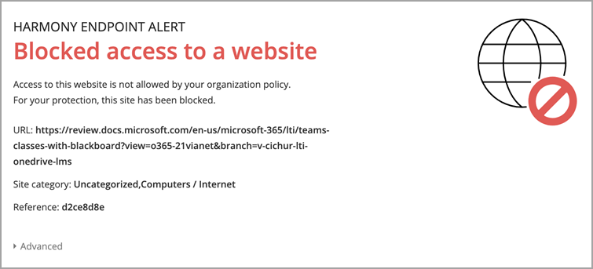

# Gebruik Microsoft Teams met Blackboard Learn Ultra

Teamwerk staat centraal in elke moderne organisatie. Door samenwerking te bevorderen, is het een bepalend kenmerk van elke succesvolle instelling. U kunt alle mogelijkheden en functies van Blackboard Learn Ultra verbeteren door ze te koppelen aan Microsoft Teams klassen.

Uw lessen kunnen realtime gesprekken, videovergaderingen of asynchrone interacties bevatten. U kunt bestanden delen en cocreatie-ervaringen toevoegen voor uw leerlingen/studenten, allemaal op één plek. Microsoft Teams met Learn Ultra de dynamiek van het onderwijs opnieuw definiëren en wat effectief leren betekent.

> [!IMPORTANT]
> Zorg ervoor dat u het veld Instellingse-e-mail hebt ingesteld in uw [SIS (Student Information System)](https://help.blackboard.com/Learn/Administrator/SaaS/Integrations/Student_Information_System/SIS_Planning)
>
>De Microsoft Teams klassenintegratie is afhankelijk van het e-mailveld van de instelling in uw SIS om de juiste Microsoft Azure Active Directory's (AAD) [User Principle Name (UPN) toe te vertrouwen.](/azure/active-directory/hybrid/howto-troubleshoot-upn-changes) Als er geen e-mail van een instelling is ingericht, wordt dit standaard ingesteld op de bestaande e-mail. Het wordt aanbevolen om dit veld in te stellen voor elke gebruiker om ervoor te zorgen dat hun gegevens correct worden gesynchroniseerd en dat er geen conflict is tussen e-mailgegevens tussen AAD en Blackboard Learn Ultra.
>
> Als u dit veld niet op de juiste manier hebt ingesteld in de SIS-toewijzing, blijft de integratie werken, maar worden gebruikers mogelijk niet weergegeven in de Teams-klassen die zijn gemaakt en kunnen er fouten optreden.

## Ondersteuning voor het toewijzen van institutionele gegevens – SIS-veld instellings-e-mail

Als onderdeel van de ontwikkeling met integraties van cloudproviders heeft Blackboard Learn Ultra een nieuw veld Voor e-mail van instellingen gemaakt, zowel in de integratie van studentinformatiesysteemkader als openbare REST-API's, zodat instellingen het proces voor gegevenssynchronisatie effectief kunnen beheren tussen Blackboard Learn Ultra en AAD. 

### Wat betekent de e-mail van de instelling en wat wordt er ondersteund?

In het veld Instellings-e-mail kunnen aangepaste veldtoewijzingen worden gemaakt tussen de extern ondersteunde gegevensbronnen van een client en Blackboard Learn Ultra.  Als gegevensbronnen cloudproviders zijn, zoals Microsoft, is de UPN (User Principle Name) een primaire unieke id voor elke gebruiker die bestaat uit een UPN-voorvoegsel (de accountnaam van de gebruiker) en een UPN-achtervoegsel (een DNS-domeinnaam) die is samengevoegd met een @-symbool. Hiermee wordt een uniek e-mailadres gemaakt voor elke specifieke gebruiker binnen de Microsoft Azure Active Directory.

Om ervoor te zorgen dat gegevens nauwkeurig zijn en registraties of lidmaatschappen tussen Blackboard Learn Ultra en Microsoft Teams-klassen correct worden bereikt, moet het e-mailadres van een gebruiker overeenkomen tussen beide systemen. In Blackboard Learn Ultra kunnen gebruikers hun bestaande e-mailadres wijzigen of overschrijven in de gebruikersinterface, wat kan leiden tot synchronisatiefouten en dat de gebruiker niet correct wordt toegevoegd aan een klasteam. Met **de toewijzing** van het veld Institution Email zorgt u ervoor dat dit beveiligings- en validatiecontroleniveau correct kan worden beheerd, ongeacht of gebruikers hun e-mail hebben gewijzigd in Blackboard Learn Ultra of niet.

 Als er twee e-mailadressen verschillen, is dit het volgende:

- Er moet een beslissing worden genomen over welke bron voorrang heeft en wordt zowel als de e-mails van de persoon als de e-mail van de instelling genomen.
  Of
- Een instelling kan een aangepaste veldtoewijzing instellen in de instellings-e-mail, waarmee een mogelijk conflict kan worden opgelost.

De **toewijzing van** het veld Institution Email is nu beschikbaar voor alle bestaande SIS-integratietypen op Advanced Configuration **Instellingen** Users Learn Object  >  **Type** Field  >  **Mapping**.

> [!NOTE]
> Het is belangrijk om te weten dat instellings-e-mail standaard **is** ingesteld op e-mail van persoon voor alle SIS-indelingen en uniek moet zijn voor elke persoon.  Voor alle bestaande integraties die zijn ingesteld en uitgevoerd, is deze gegevenstoewijzing ingesteld, omdat sis gebruikers niet kan importeren als hun e-mail is gedupliceerd. Als een instelling de mogelijkheid vereist om de instellings-e-mail te wijzigen **in** **aangepast,** moet de instelling dit beheren via de Instellingen geavanceerde configuratie in het SIS.

## Vereisten

De Microsoft Teams klassenintegratie is alleen beschikbaar voor **cursussen voor Ultra Course View.** Uw instelling moet aan deze vereisten voldoen om deze te kunnen gebruiken:

- Laat Blackboard Learn Ultra Learn SaaS met Ultra Base Navigation ingeschakeld

  

- LTI inschakelen voor gebruik in cursussen.

  a. Ga naar de **LTI-hulpprogramma's** van  >  **het beheerderspaneel**  >  **Globale eigenschappen beheren.**

  b. Selecteer **LTI ingeschakeld in cursussen** en selecteer desgewenst Ingeschakeld in **organisaties.**

  c. Selecteer **Verzenden**.

- LTI moet zijn geconfigureerd

- Blackboard Learn Ultra-Teams LTI-integratie toevoegen

- Hulpprogramma Microsoft Teams klassen LTI 1.3 toevoegen

- Het REST API-hulpprogramma en het delen van resources over verschillende origins toevoegen

- Integratie van klassen configureren Microsoft Teams goedkeuren

## Het hulpmiddel Blackboard Learn Ultra Teams Classes LTI 1.3 toevoegen

1. Selecteer in **het beheerderspaneel** de optie **LTI Tool Providers**.

2. Selecteer **register LTI 1.3 Tool**.

3. Typ of **kopieer en** plak deze id in het veld Client-id:

   `f1561daa-1b21-4693-ba90-6c55f1a0eb41`

4. Bekijk alle instellingen die vooraf zijn ingevuld en in **De status** van het hulpprogramma en selecteer **vervolgens Ingeschakeld.**

5. Selecteer **in Instellingsbeleid** de optie **Rol in Cursus, Naam** en **E-mailadres** en selecteer **vervolgens Ja** voor beide.

6. Selecteer **Cijferservicetoegang toestaan en** **Lidmaatschapsservicetoegang toestaan.**

## Het hulpmiddel Microsoft Teams klassen LTI 1.3 toevoegen

1. Selecteer in **het beheerderspaneel** de optie **LTI Tool Providers**.

2. Selecteer **register LTI 1.3 Tool**.

3. Typ of **kopieer en** plak deze id in het veld Client-id:

   `027328b7-c2e3-4c9e-aaa1-07802dae6c89`

4. Controleer alle instellingen die vooraf zijn ingevuld en in *De status van* het hulpprogramma en selecteer *Ingeschakeld.*

5. Selecteer **in Instellingsbeleid** de optie **Rol in cursus, naam** en **e-mailadres.** Selecteer **Ja** voor beide.

6. Selecteer **Cijferservicetoegang toestaan en** **Lidmaatschapsservicetoegang toestaan.**

## Het HULPPROGRAMMA REST-API toevoegen

1. Ga in **het beheerderspaneel** naar **Integraties** en selecteer **Rest API-integraties.**

2. Selecteer **Integratie maken.**

3. Typ of kopieer **en** plak deze id in het veld Toepassing-id:

   `f1561daa-1b21-4693-ba90-6c55f1a0eb41`

4. Typ een gebruiker voor deze integratie.

   Deze gebruiker is degene met api-toegang voor thuisgebruik waaruit de toepassing is gekoppeld.

5. Selecteer **Verzenden**.

## Het delen van resources over verschillende origins toevoegen

1. Ga in **het deelvenster Beheerder** naar **Integraties** en selecteer **Resource delen met meerdere origins.*

2. Selecteer **Configuratie maken.**

3. In het **veld Origin** kopieert en plakt u deze URL:

   `https://bb-ms-teams-ultra-ext.api.blackboard.com`

4. Typ **autorisatie** in het veld Toegestane **kopteksten.**

5. Beschikbaar **instellen** op **Ja**.

6. Selecteer **Verzenden**.

## Integratie van klassen configureren Microsoft Teams goedkeuren

Als u uw Blackboard Learn Ultra-exemplaar wilt integreren met Microsoft Teams klassen, moet u ervoor zorgen dat de Blackboard Learn Ultra-toepassing is goedgekeurd voor toegang binnen uw Microsoft Azure tenant. Dit is een proces dat moet worden voltooid door de globale beheerder van Microsoft 365 instelling.

Dit proces kan worden uitgevoerd vóór of nadat u de LTI-toepassingen in uw Blackboard Learn Ultra Instance hebt geconfigureerd.

### Voordat u de LTI-toepassingen configureert

Als u ervoor kiest om de app Blackboard Learn Ultra Teams Classes Azure goed te keuren voordat u de LTI-integraties configureert, moet u omleiden naar het **Microsoft Identity Platform Admin Consent Endpoint**. De URL wordt weergegeven:

`https://login.microsoftonline.com/{tenant}/adminconsent?client\_id=2d94989f-457a-47c1-a637-e75acdb11568`

> [!NOTE]
> U vervangt **{Tenant} door** uw specifieke Microsoft Azure tenant-id.

U ziet een machtigingenvenster waarin wordt uitgelegd dat u toestemming geeft voor Blackboard Learn Ultra om toegang te krijgen tot Microsoft Teams.

### Na het configureren van de LTI-toepassingen

1. Ga in **het beheerderspaneel** naar **Hulpprogramma's** en selecteer **Microsoft Teams Integratiebeheerder.**

2. Selecteer **Inschakelen Microsoft Teams.**

3. Voeg uw **Microsoft Tenant-id toe** aan het beschikbare tekstveld.

4. Kies een van de volgende opties:

   - Als de app vooraf toestemming heeft gegeven, wordt er een klein vinkje gegeven. Als het vinkje wordt weergegeven, selecteert u **Verzenden.**

   - Als toestemming nog niet is goedgekeurd, volgt u de stappen die worden beschreven om de URL voor toestemming te genereren en deze ter goedkeuring naar de Microsoft 365 globale beheerder te verzenden.

5. Nadat u de goedkeuring hebt bevestigd, **selecteert** u Opnieuw proberen om te bevestigen en selecteert u **Vervolgens Verzenden**.

   