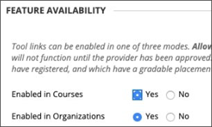

# Gebruik Microsoft Teams met Blackboard Learn UltraUse Microsoft Teams classes with Blackboard Learn Ultra

Teamwerk staat centraal in elke moderne organisatie.Teamwork is at the core of every modern organization. Door samenwerking te bevorderen, is het een bepalend kenmerk van elke succesvolle instelling.By fostering collaboration, it’s a defining characteristic of every successful institution. U kunt alle mogelijkheden en functies van Blackboard Learn Ultra verbeteren door ze te koppelen aan Microsoft Teams klassen.You can enhance all the capabilities and features of Blackboard Learn Ultra by pairing them up with Microsoft Teams classes.

Uw lessen kunnen realtime gesprekken, videovergaderingen of asynchrone interacties bevatten.Your classes might include real-time conversations, video meetings, or asynchronous interactions. U kunt bestanden delen en cocreatie-ervaringen toevoegen voor uw leerlingen/studenten, allemaal op één plek.You can add file sharing and cocreation experiences for your students, all in one place. Microsoft Teams met Learn Ultra de dynamiek van het onderwijs opnieuw definiëren en wat effectief leren betekent.Microsoft Teams classes with Learn Ultra redefine the dynamics of teaching and what effective learning means.

> [!IMPORTANT]
> Zorg ervoor dat u het veld Instellingse-e-mail hebt ingesteld in uw [SIS (Student Information System)](https://help.blackboard.com/Learn/Administrator/SaaS/Integrations/Student_Information_System/SIS_Planning)Ensure that you have successfully set up the Institution Email field in your [Student Information System (SIS)](https://help.blackboard.com/Learn/Administrator/SaaS/Integrations/Student_Information_System/SIS_Planning)
>
>De Microsoft Teams klassenintegratie is afhankelijk van het e-mailveld van de instelling in uw SIS om de juiste Microsoft Azure Active Directory's (AAD) [User Principle Name (UPN) toe te vertrouwen.](/azure/active-directory/hybrid/howto-troubleshoot-upn-changes)The Microsoft Teams classes integration relies on the institution email field in your SIS to map to the correct Microsoft Azure Active Directory’s (AAD) [User Principle Name (UPN)](/azure/active-directory/hybrid/howto-troubleshoot-upn-changes). Als er geen e-mail van een instelling is ingericht, wordt dit standaard ingesteld op de bestaande e-mail.If no institution email has been provisioned, this will default to the existing email. Het wordt aanbevolen om dit veld in te stellen voor elke gebruiker om ervoor te zorgen dat hun gegevens correct worden gesynchroniseerd en dat er geen conflict is tussen e-mailgegevens tussen AAD en Blackboard Learn Ultra.It’s recommended that this field be set for every user to ensure their data is synchronized correctly and that there is no conflict of email data between AAD and Blackboard Learn Ultra.
>
> Als u dit veld niet op de juiste manier hebt ingesteld in de SIS-toewijzing, blijft de integratie werken, maar worden gebruikers mogelijk niet weergegeven in de Teams-klassen die zijn gemaakt en kunnen er fouten optreden.If you haven’t set this field appropriately in your SIS mapping, the integration will continue to work, but users might not appear in the Teams classes created, and errors could occur.

## Ondersteuning voor het toewijzen van institutionele gegevens – SIS-veld instellings-e-mailSupporting Institutional Data Mapping – Institution Email SIS Field

Als onderdeel van de ontwikkeling met integraties van cloudproviders heeft Blackboard Learn Ultra een nieuw veld Voor e-mail van instellingen gemaakt, zowel in de integratie van studentinformatiesysteemkader als openbare REST-API's, zodat instellingen het proces voor gegevenssynchronisatie effectief kunnen beheren tussen Blackboard Learn Ultra en AAD. As part of the evolution with Cloud provider integrations, Blackboard Learn Ultra has created a new **Institution Email** field, in both the Student Information System Framework integration and public REST APIs, allowing institutions to manage the data synchronization process effectively between Blackboard Learn Ultra and AAD.

### Wat betekent de e-mail van de instelling en wat wordt er ondersteund?What does the Institution Email mean and what does it support?

In het veld Instellings-e-mail kunnen aangepaste veldtoewijzingen worden gemaakt tussen de extern ondersteunde gegevensbronnen van een client en Blackboard Learn Ultra. The **Institution Email** field allows customized field mappings between a client’s externally supported data sources and Blackboard Learn Ultra. Als gegevensbronnen cloudproviders zijn, zoals Microsoft, is de UPN (User Principle Name) een primaire unieke id voor elke gebruiker die bestaat uit een UPN-voorvoegsel (de accountnaam van de gebruiker) en een UPN-achtervoegsel (een DNS-domeinnaam) die is samengevoegd met een @-symbool.If data sources are cloud providers, such as Microsoft, the User Principle Name (UPN) is a primary unique identifier for each user consisting of a UPN prefix (the user’s account name) and a UPN suffix (a DNS domain name) joined together with an @ symbol. Hiermee wordt een uniek e-mailadres gemaakt voor elke specifieke gebruiker binnen de Microsoft Azure Active Directory.This creates a unique email address for each specific user within the Microsoft Azure Active Directory.

Om ervoor te zorgen dat gegevens nauwkeurig zijn en registraties of lidmaatschappen tussen Blackboard Learn Ultra en Microsoft Teams-klassen correct worden bereikt, moet het e-mailadres van een gebruiker overeenkomen tussen beide systemen.To ensure data is accurate and enrollments or memberships between Blackboard Learn Ultra and Microsoft Teams classes are correctly achieved, a user’s email address must match between both systems. In Blackboard Learn Ultra kunnen gebruikers hun bestaande e-mailadres wijzigen of overschrijven in de gebruikersinterface, wat kan leiden tot synchronisatiefouten en dat de gebruiker niet correct wordt toegevoegd aan een klasteam.In Blackboard Learn Ultra, users can change or override their existing email address in the user interface, which could result in sync errors occurring and the user not being correctly added to a Class Team. Met **de toewijzing** van het veld Institution Email zorgt u ervoor dat dit beveiligings- en validatiecontroleniveau correct kan worden beheerd, ongeacht of gebruikers hun e-mail hebben gewijzigd in Blackboard Learn Ultra of niet.The **Institution Email** field mapping ensures this level of security and validation checking can be correctly managed, regardless if users have changed their email within Blackboard Learn Ultra or not.

 Als er twee e-mailadressen verschillen, is dit het volgende:When two email addresses are different, either:

- Er moet een beslissing worden genomen over welke bron voorrang heeft en wordt zowel als de e-mails van de persoon als de e-mail van de instelling genomen.A decision must be made as to which source has precedence and will be taken as both the Person and Institution Emails.
  OfOr
- Een instelling kan een aangepaste veldtoewijzing instellen in de instellings-e-mail, waarmee een mogelijk conflict kan worden opgelost.An institution can set a custom field mapping in its Institution Email, which can resolve a potential conflict.

De **toewijzing van** het veld Institution Email is nu beschikbaar voor alle bestaande SIS-integratietypen op Advanced Configuration **Instellingen** Users Learn Object  >  **Type** Field  >  **Mapping**.The **Institution Email** field mapping is now available for all existing SIS integration types at **Advanced Configuration Settings** > **Users Learn Object Type** > **Field Mapping**.

> [!NOTE]
> Het is belangrijk om te weten dat instellings-e-mail standaard **is** ingesteld op e-mail van persoon voor alle SIS-indelingen en uniek moet zijn voor elke persoon. It’s important to note that, by default, the **Institution Email** is set to the **Person Email** for all SIS formats and must be unique for each person. Voor alle bestaande integraties die zijn ingesteld en uitgevoerd, is deze gegevenstoewijzing ingesteld, omdat sis gebruikers niet kan importeren als hun e-mail is gedupliceerd.All existing integrations that are set up and running will have this data mapping in place, as SIS will fail to import users if their email is duplicated. Als een instelling de mogelijkheid vereist om de instellings-e-mail te wijzigen **in** **aangepast,** moet de instelling dit beheren via de Instellingen geavanceerde configuratie in het SIS.If an institution requires the ability to change the Institution Email to **custom**, they'll need to manage this through the **Advanced Configuration Settings** in the SIS.

## VereistenRequirements

De Microsoft Teams klassenintegratie is alleen beschikbaar voor **cursussen voor Ultra Course View.**The Microsoft Teams classes integration is available for **Ultra Course View courses only**. Uw instelling moet aan deze vereisten voldoen om deze te kunnen gebruiken:Your institution needs to complete these requirements to use it:

- Laat Blackboard Learn Ultra Learn SaaS met Ultra Base Navigation ingeschakeldHave Blackboard Learn Ultra Learn SaaS with Ultra Base Navigation enabled

  

- LTI inschakelen voor gebruik in cursussen.Enable LTI for use in courses.

  a.a. Ga naar de **LTI-hulpprogramma's** van  >  **het beheerderspaneel**  >  **Globale eigenschappen beheren.**Go to the **Administrator Panel** > **LTI Tool Providers** > **Manage Global Properties**.

  b.b. Selecteer **LTI ingeschakeld in cursussen** en selecteer desgewenst Ingeschakeld in **organisaties.**Select **LTI Enabled in Courses**, and optionally, select **Enabled in Organizations**.

  c.c. Selecteer **Verzenden**.Select **Submit**.

- LTI moet zijn geconfigureerdMust have LTI configured

- Blackboard Learn Ultra-Teams LTI-integratie toevoegenAdd Blackboard Learn Ultra Teams Classes LTI Integration

- Hulpprogramma Microsoft Teams klassen LTI 1.3 toevoegenAdd Microsoft Teams Classes LTI 1.3 Tool

- Het REST API-hulpprogramma en het delen van resources over verschillende origins toevoegenAdd the REST API Tool and Cross-Origin Resource Sharing

- Integratie van klassen configureren Microsoft Teams goedkeurenConfigure and approve Microsoft Teams classes Integration

## Het hulpmiddel Blackboard Learn Ultra Teams Classes LTI 1.3 toevoegenAdd the Blackboard Learn Ultra Teams Classes LTI 1.3 Tool

1. Selecteer in **het beheerderspaneel** de optie **LTI Tool Providers**.From the **Administrator Panel**, select **LTI Tool Providers**.

2. Selecteer **register LTI 1.3 Tool**.Select **register LTI 1.3 Tool**.

3. Typ of **kopieer en** plak deze id in het veld Client-id:In the **Client ID** field, type or copy and paste this ID:

   `f1561daa-1b21-4693-ba90-6c55f1a0eb41`

4. Bekijk alle instellingen die vooraf zijn ingevuld en in **De status** van het hulpprogramma en selecteer **vervolgens Ingeschakeld.**Review all settings that have been pre-populated and in **Tool Status**, and then select **Enabled**.

5. Selecteer **in Instellingsbeleid** de optie **Rol in Cursus, Naam** en **E-mailadres** en selecteer **vervolgens Ja** voor beide.In **Institution Policies**, select **Role in Course, Name,** and **Email Address**, and then select **Yes** for both.

6. Selecteer **Cijferservicetoegang toestaan en** **Lidmaatschapsservicetoegang toestaan.**Select **Allow grade service access** and **Allow Membership Service Access**.

## Het hulpmiddel Microsoft Teams klassen LTI 1.3 toevoegenAdd the Microsoft Teams Classes LTI 1.3 Tool

1. Selecteer in **het beheerderspaneel** de optie **LTI Tool Providers**.From the **Administrator Panel**, select **LTI Tool Providers**.

2. Selecteer **register LTI 1.3 Tool**.Select **register LTI 1.3 Tool**.

3. Typ of **kopieer en** plak deze id in het veld Client-id:In the **Client ID** field, type or copy and paste this ID:

   `027328b7-c2e3-4c9e-aaa1-07802dae6c89`

4. Controleer alle instellingen die vooraf zijn ingevuld en in *De status van* het hulpprogramma en selecteer *Ingeschakeld.*Review all settings that have been pre-populated and in *Tool Status* and select *Enabled.*

5. Selecteer **in Instellingsbeleid** de optie **Rol in cursus, naam** en **e-mailadres.**In **Institution Policies**, select **Role in Course, Name,** and **Email Address**. Selecteer **Ja** voor beide.Select **Yes** for both.

6. Selecteer **Cijferservicetoegang toestaan en** **Lidmaatschapsservicetoegang toestaan.**Select **Allow grade service access** and **Allow Membership Service Access**.

## Het HULPPROGRAMMA REST-API toevoegenAdd the REST API tool

1. Ga in **het beheerderspaneel** naar **Integraties** en selecteer **Rest API-integraties.**From the **Administrator Panel**, navigate to **Integrations** and select **Rest API Integrations**.

2. Selecteer **Integratie maken.**Select **Create Integration**.

3. Typ of kopieer **en** plak deze id in het veld Toepassing-id:In the **Application ID** field, type or copy and paste this ID:

   `f1561daa-1b21-4693-ba90-6c55f1a0eb41`

4. Typ een gebruiker voor deze integratie.Type a user for this integration.

   Deze gebruiker is degene met api-toegang voor thuisgebruik waaruit de toepassing is gekoppeld.This user will be the one with home API access from which the application is associated.

5. Selecteer **Verzenden**.Select **Submit**.

## Het delen van resources over verschillende origins toevoegenAdd the Cross-Origin Resource Sharing

1. Ga in **het deelvenster Beheerder** naar **Integraties** en selecteer \**Resource delen met meerdere origins.*From the **Administrator panel**, navigate to **Integrations** and select \**Cross-origin Resource Sharing*.

2. Selecteer **Configuratie maken.**Select **Create Configuration**.

3. In het **veld Origin** kopieert en plakt u deze URL:In the **Origin** field, type of copy and paste this URL:

   `https://bb-ms-teams-ultra-ext.api.blackboard.com`

4. Typ **autorisatie** in het veld Toegestane **kopteksten.**In the **Allowed Headers** field, type **Authorization**.

5. Beschikbaar **instellen** op **Ja**.Set **Available** to **Yes**.

6. Selecteer **Verzenden**.Select **Submit**.

## Integratie van klassen configureren Microsoft Teams goedkeurenConfigure and Approve Microsoft Teams classes Integration

Als u uw Blackboard Learn Ultra-exemplaar wilt integreren met Microsoft Teams klassen, moet u ervoor zorgen dat de Blackboard Learn Ultra-toepassing is goedgekeurd voor toegang binnen uw Microsoft Azure tenant.To successfully integrate your Blackboard Learn Ultra instance with Microsoft Teams classes, you'll need to make sure the Blackboard Learn Ultra application is approved for access within your Microsoft Azure tenant. Dit is een proces dat moet worden voltooid door de globale beheerder van Microsoft 365 instelling.This is a process that will need to be completed by your institution’s Microsoft 365 Global Admin.

Dit proces kan worden uitgevoerd vóór of nadat u de LTI-toepassingen in uw Blackboard Learn Ultra Instance hebt geconfigureerd.This process can be done either before or after you have configured the LTI applications in your Blackboard Learn Ultra Instance.

### Voordat u de LTI-toepassingen configureertBefore Configuring the LTI Applications

Als u ervoor kiest om de app Blackboard Learn Ultra Teams Classes Azure goed te keuren voordat u de LTI-integraties configureert, moet u omleiden naar het **Microsoft Identity Platform Admin Consent Endpoint**.If you choose to approve the Blackboard Learn Ultra Teams Classes Azure app before configuring the LTI integrations, you'll need to redirect to the **Microsoft Identity Platform Admin Consent Endpoint**. De URL wordt weergegeven:The URL is shown:

`https://login.microsoftonline.com/{tenant}/adminconsent?client\_id=2d94989f-457a-47c1-a637-e75acdb11568`

> [!NOTE]
> U vervangt **{Tenant} door** uw specifieke Microsoft Azure tenant-id.You’ll replace **{Tenant}** with your specific institutional Microsoft Azure tenant ID.

U ziet een machtigingenvenster waarin wordt uitgelegd dat u toestemming geeft voor Blackboard Learn Ultra om toegang te krijgen tot Microsoft Teams.You'll see a permissions window that explains you're giving permission to Blackboard Learn Ultra to access Microsoft Teams.

### Na het configureren van de LTI-toepassingenAfter Configuring the LTI Applications

1. Ga in **het beheerderspaneel** naar **Hulpprogramma's** en selecteer **Microsoft Teams Integratiebeheerder.**On the **Administrator Panel**, navigate to **Tools and Utilities** and select **Microsoft Teams Integration Admin**.

2. Selecteer **Inschakelen Microsoft Teams.**Select **Enable Microsoft Teams**.

3. Voeg uw **Microsoft Tenant-id toe** aan het beschikbare tekstveld.Add your **Microsoft Tenant ID** into the available text field.

4. Kies een van de volgende opties:Choose one of the following options:

   - Als de app vooraf toestemming heeft gegeven, wordt er een klein vinkje gegeven.If the app has pre-consent, it will show a small checkmark. Als het vinkje wordt weergegeven, selecteert u **Verzenden.**If the checkmark appears, select **Submit**.

   - Als toestemming nog niet is goedgekeurd, volgt u de stappen die worden beschreven om de URL voor toestemming te genereren en deze ter goedkeuring naar de Microsoft 365 globale beheerder te verzenden.If consent hasn’t been approved, follow the steps described to generate the URL for consent and send it to the Microsoft 365 Global Admin for approval.

5. Nadat u de goedkeuring hebt bevestigd, **selecteert** u Opnieuw proberen om te bevestigen en selecteert u **Vervolgens Verzenden**.Once you've confirmation of approval, select **Retry** to confirm, and then select **Submit**.

   