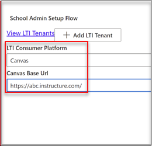

# LTI Microsoft OneDrive canvas gebruikenUse Microsoft OneDrive LTI with Canvas

> [!IMPORTANT]
> Sommige informatie is gerelateerd aan voorlopige productversies die mogelijk aanzienlijk gewijzigd worden voordat ze commercieel gepubliceerd worden.Some information relates to prereleased product which may be substantially modified before it's commercially released. Microsoft geeft geen garantie, uitdrukkelijk of impliciet, met betrekking tot de informatie die hier wordt beschreven.Microsoft makes no warranties, express or implied, with respect to the information provided here.

## Integreren met CanvasIntegrate with Canvas

De persoon die deze integratie uitvoert, moet een beheerder van Canvas zijn en een beheerder van de Microsoft 365 tenant.The person who performs this integration should be an admin of Canvas and an admin of the Microsoft 365 tenant.

1. Meld u aan bij de Microsoft Azure portal met het tenantbeheerderaccount.Sign in to the Microsoft Azure portal with the tenant admin account. De Azure-tenantbeheerder moet ook de rol groepsbeheerder hebben.The Azure tenant administrator should also have the Group administrator role.

    

2. Meld u aan bij de Microsoft [OneDrive LTI-portal](https://odltiappnl.azurewebsites.net/admin).Sign in to the Microsoft [OneDrive LTI portal](https://odltiappnl.azurewebsites.net/admin).

3. Accepteer de machtigingen om de aanmelding te voltooien.Accept the permissions to complete the sign-in.

    

4. Selecteer **LTI-tenant toevoegen.**Select **Add LTI Tenant**.

     

5. Selecteer **LTI Consumer Platform** als **Canvas** in de vervolgkeuzekeuze.Select **LTI Consumer Platform** as **Canvas** from the dropdown.

6. Selecteer **Canvas Base URL** en selecteer vervolgens **Volgende**.Select **Canvas Base URL** and then select **Next**.

    

   In het volgende scherm ziet u velden die vertrouwelijk voor u zijn.The next screen shows fields that are confidential to you.

7. Selecteer **Volgende** van ??Select **Next** from ?? (U bent bijna klaar).page. KUNNEN REVISOREN DE LEGE HIER INVULLEN?CAN REVIEWERS FILL IN THE BLANK HERE?

8. Selecteer **Volgende** in het scherm met informatie die vertrouwelijk voor u is.Select **Next** in the screen that shows information that's confidential to you.

   In het laatste scherm van de Azure-portal ziet u de volgende stappen voor het toevoegen van uw Canvas-exemplaar.The final screen of the Azure portal shows the next steps for adding your Canvas instance.

9. Kopieer de ontwikkelaarssleutels vanuit dit scherm.Copy the Developer Keys from this screen. U wordt gebruikt wanneer u het canvas-exemplaar maakt.You'll use when you create the Canvas instance.

## Het canvas-exemplaar toevoegenAdd the Canvas instance

1. Schakel in het canvas-exemplaar **deselecteer**  >  **beheerdersontwikkelaarssleutels uit.**In your Canvas instance, deselect **Admin** > **Developer Keys**.

2. Kies **LTI-toets** in de vervolgkeuzekeuze op **Ontwikkelaarssleutel.**Choose **LTI Key** in the dropdown on **Developer Key**.

   

3. Plak de ontwikkelaarssleutels hier.Paste the developer keys here.

     

   De sleutel wordt gemaakt in **de UIT-modus**The key gets created in **OFF** mode

   

4. Kopieer de gemarkeerde tekst.Copy the highlighted text.
    Dit fungeert als client-id in Microsoft OneDrive LTI-portal.This serves as Client ID in Microsoft OneDrive LTI portal.

5. Plak de tekst in het **veld Client-id** in Microsoft OneDrive LTI-portal en selecteer **volgende**.Paste the text into the **Client ID** field in Microsoft OneDrive LTI portal, and then select **Next**.

6. Selecteer **Opslaan**.Select **Save**.

7. Bekijk de instellingen door **LTI-tenants weergeven te selecteren.**View the settings by selecting **View LTI Tenants**.
