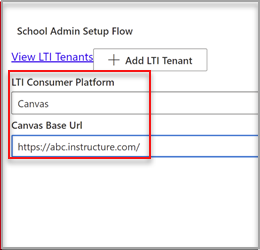

# Microsoft OneDrive gebruiken met uw Learning Management System

> [!IMPORTANT]
> Sommige informatie is gerelateerd aan voorlopige productversies die mogelijk aanzienlijk gewijzigd worden voordat ze commercieel gepubliceerd worden. Microsoft geeft geen garantie, uitdrukkelijk of impliciet, met betrekking tot de informatie die hier wordt beschreven.

Ontdek de voordelen van het gebruik van Microsoft OneDrive met uw Learning Management System (LMS).

**Microsoft Office 365 rechtstreeks in uw werkstromen brengen**

De LTI-app (Microsoft OneDrive Learning Tools Interoperability) is geïntegreerd met uw LMS om Microsoft OneDrive en Microsoft Office 365 rechtstreeks in uw belangrijkste werkstromen te integreren:

- Resources toevoegen en inhoud organiseren.
- Samenwerkingsdocumenten starten.
- Opdrachten maken en sorteren.

**Veilig en volledig compatibel met de nieuwste LTI-standaarden**

De Microsoft OneDrive LTI App is compatibel met LTI 1.3 en LTI Advantage. Dit voordeel zorgt voor een zeer veilige en nauw geïntegreerde gebruikerservaring.

**Moderne en uitgebreide gebruikerservaring**

De Microsoft OneDrive LTI-app brengt het beste van Microsoft direct in uw LMS-ervaring. We verbeteren de bestaande Office 365-integratie in uw LMS door een modernere gebruikerservaring te bieden, compleet met een nieuwe en uitgebreide Microsoft OneDrive-bestands picker en uitgebreidere bewerkingservaringen voor Office-bestanden. Microsoft is vanaf nu ook volledig eigenaar van de Microsoft OneDrive LTI-app, wat betekent dat u automatisch het nieuwste en beste van Microsoft krijgt.

Met de Microsoft OneDrive LTI-app kunt u het volgende doen:

- Voeg Office 365-bestanden bij, waaronder Word-documenten, PowerPoint-presentaties en Excel vanuit de Rich Content Editor.

- Office 365-cloudtoewijzingen distribueren.

- Bekijk en organiseer uw persoonlijke en cursus Microsoft OneDrive-bestanden.

- Maak samenwerkingen waarbij cursusleden in realtime kunnen samenwerken aan gedeelde documenten.

- Toegang tot meerdere Microsoft OneDrive-accounts, waaronder persoonlijke en schoolaccounts.

- Integreer Office 365-bestanden met uw cursusmodules.

- Gebruik uw Microsoft-account voor één aanmelding met uw LMS.

## Integreren met Canvas

De persoon die deze integratie uitvoert, moet een beheerder van Canvas en een beheerder van de Microsoft 365-tenant zijn.

1. Meld u aan bij de Microsoft Azure-portal met het tenantbeheerderaccount. De Azure-tenantbeheerder moet ook de rol groepsbeheerder hebben.

    

2. Meld u aan bij de [LTI-portal van Microsoft OneDrive.](https://odltiappnl.azurewebsites.net/admin)

3. Accepteer de machtigingen om de aanmelding te voltooien.

    

4. Selecteer **LTI-tenant toevoegen.**

     

5. Selecteer **LTI Consumer Platform** als **Canvas** in de vervolgkeuzekeuze.

6. Selecteer **Canvas Base URL** en selecteer vervolgens **Volgende**.

    

   In het volgende scherm ziet u velden die vertrouwelijk voor u zijn.

7. Selecteer **Volgende** van ?? (U bent bijna klaar). KUNNEN REVISOREN DE LEGE HIER INVULLEN?

8. Selecteer **Volgende** in het scherm met informatie die vertrouwelijk voor u is.

   In het laatste scherm van de Azure-portal ziet u de volgende stappen voor het toevoegen van uw Canvas-exemplaar.

9. Kopieer de ontwikkelaarssleutels vanuit dit scherm. U wordt gebruikt wanneer u het canvas-exemplaar maakt.

## Het canvas-exemplaar toevoegen

1. Schakel in het canvas-exemplaar **deselecteer**  >  **beheerdersontwikkelaarssleutels uit.**

2. Kies **LTI-toets** in de vervolgkeuzekeuze op **Ontwikkelaarssleutel.**

   

3. Plak de ontwikkelaarssleutels hier.

     

   De sleutel wordt gemaakt in **de UIT-modus**

   

4. Kopieer de gemarkeerde tekst.
    Dit fungeert als client-id in de LTI-portal van Microsoft OneDrive.

5. Plak de tekst in het **veld Client-id** in de LTI-portal van Microsoft OneDrive en selecteer **volgende**.

6. Selecteer **Opslaan**.

7. Bekijk de instellingen door **LTI-tenants weergeven te selecteren.**
