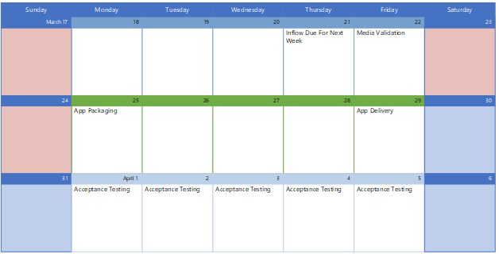

# Werken met Microsoft Consulting Services

U kunt contact houden met Microsoft Consulting Services (MCS) om uw apps te laten verpakken voor gebruik met Microsoft Managed Desktop. Voor meer informatie kunt u contact opnemen met uw accountvertegenwoordiger om contact op te nemen met MCS en het specifieke app-verpakkingsproject te bekijken.

## Rollen en verantwoordelijkheden

Als u wilt werken met mcs-app-verpakking, **moet u de volgende elementen leveren:**

- De broninstallateurbestanden (bijvoorbeeld setup.exe of .msi).
- De installatie-instructies, met informatie over hoe de uiteindelijke installatie eruit moet zien. Moet er bijvoorbeeld een bureaubladsnelkoppeling naar de app zijn? Wat moet de zichtbaarheid van de app zijn? Moet de app verbinding maken met een server en zo ja, welke? Zie de aanvraagsjabloon [voor aanvraag voor toepassingen voor meer informatie.](https://github.com/MicrosoftDocs/microsoft-365-docs/raw/public/microsoft-365/managed-desktop/get-ready/downloads/app-packaging-template.docx)
- U moet uw eigen acceptatietest uitvoeren om te controleren of de app werkt zoals u dat nodig hebt in uw omgeving.

**MCS zorgt voor de volgende acties:**

- Controleren of de app is verboden of beperkt in de Microsoft Managed Desktop omgeving.
- Testen van de installatie, het starten en verwijderen van de app om ervoor te zorgen dat de app compatibel is met Windows 10. Als MCS een compatibiliteitsprobleem detecteert, wordt de app door mcs overgehandigd aan het [App Assure-programma](/fasttrack/products-and-capabilities#app-assure) voor herstel.
- De app inpakken op uw specificatie en vervolgens app-implementatie testen met Microsoft Intune.

## Planning voor app-bezorging

Start het verpakkingsproces door de app-informatie te uploaden naar de Microsoft Managed Desktop portal. Het verpakkingsteam bekijkt elke donderdag nieuwe inzendingen. Na controle en verpakking worden de verpakte apps de volgende vrijdag bezorgd. Er kunnen maximaal vijf apps per week worden verpakt om te starten, maar de service kan worden opgeschaald naar uw behoeften.

U krijgt een melding zodra de app is geleverd. Op dat moment hebt u 21 dagen de tijd om acceptatietests uit te voeren en het werk in de Microsoft Managed Desktop goed te keuren. Als u tijdens uw acceptatietest een probleem met de app ontdekt, weigert u de app in de Microsoft Managed Desktop-portal en wordt u via e-mail verbonden met een MCS-packager om het probleem te begrijpen en op te lossen.

## Accounts en omgeving testen

Het verpakkingsteam kan de migratie naar Microsoft Intune voltooien door bepaalde machtigingen op te geven:

- Toegang tot Microsoft Intune app-implementatiemogelijkheden voor de packager om de app toe te voegen en toe te wijzen
- Testgroepen, gebruikersaccounts en licenties voor de verwerkers om de apps te kunnen testen

MCS gebruikt deze machtigingen om de volgende acties uit te voeren:

- Ervoor zorgen dat de app werkt op een virtuele computer die is geconfigureerd voor Microsoft Managed Desktop
- De app uploaden naar Microsoft Intune voor implementatie naar uw gebruikers

Zonder deze machtigingen kan MCS verder gaan, maar kunnen ze de toepassingen niet uploaden naar uw omgeving.
