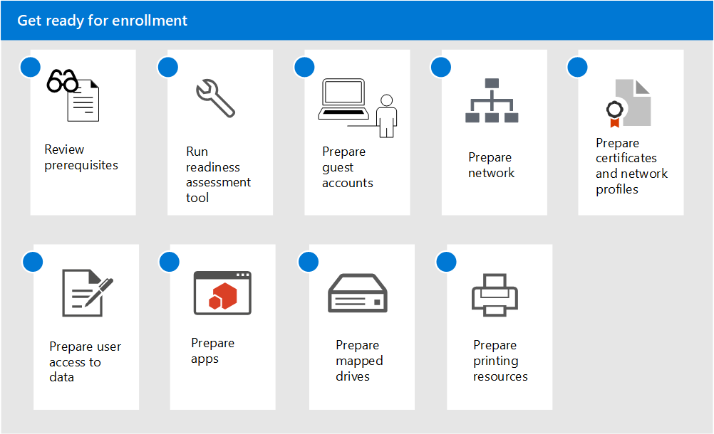

# Voorbereiden op inschrijving in Microsoft Managed DesktopGet ready for enrollment in Microsoft Managed Desktop

Deze onderwerpen beschrijven de stappen die u in uw organisatie moet nemen om u voor te bereiden op inschrijving, inclusief het controleren of uw omgeving aan de belangrijkste vereisten voldoet, netwerken configureren, certificaten instellen en uw apps voorbereiden op de service.These topics describe the steps you'll need to take in your organization to prepare for enrollment, including checking that your environment meets key prerequisites, configuring networks, setting up certificates, and preparing your apps for inclusion in the service. Nadat u de hulpprogramma's voor gereedheidsevaluatie hebt uitgevoerd, kunt u de andere stappen in elke volgorde of parallel uitvoeren.Once you have run the readiness assessment tools, you can complete the other steps in any order or in parallel. Afhankelijk van uw omgeving, zijn sommige stappen mogelijk niet relevant voor u.Depending on your environment, some of the steps might not be relevant to you.

1. Lees [vereisten voor Microsoft Managed Desktop](prerequisites.md).Review [prerequisites for Microsoft Managed Desktop](prerequisites.md).
2. Gebruik [hulpprogramma's voor gereedheidsevaluatie](readiness-assessment-tool.md).Use [readiness assessment tools](readiness-assessment-tool.md).
3. [Vereisten voor gast-accountsPrerequisites for guest accounts](guest-accounts.md)
4. [Netwerkconfiguratie voor Microsoft Managed DesktopNetwork configuration for Microsoft Managed Desktop](network.md)
5. [Certificaten en netwerkprofielen voorbereiden voor Microsoft Managed DesktopPrepare certificates and network profiles for Microsoft Managed Desktop](certs-wifi-lan.md)
6. [Toegang voorbereiden tot on-premises bronnen voor Microsoft Managed DesktopPrepare on-premises resources access for Microsoft Managed Desktop](authentication.md)
7. [Apps in Microsoft Managed DesktopApps in Microsoft Managed Desktop](apps.md)
8. [Toegewezen stations voorbereiden voor Microsoft Managed DesktopPrepare mapped drives for Microsoft Managed Desktop](mapped-drives.md)
9. [Afdrukbronnen voorbereiden voor Microsoft Managed DesktopPrepare printing resources for Microsoft Managed Desktop](printing.md)
