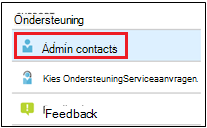
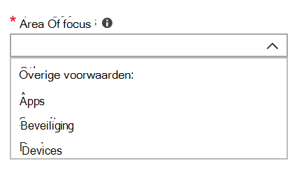

# Contactpersonen voor beheer toevoegen en verifiëren in de beheerportal

Microsoft Managed Desktop-service communiceert op verschillende manieren met klanten. Om de communicatie te stroomlijnen en ervoor te zorgen dat we contact hebben met de juiste personen, moet u een set beheerderscontacten verstrekken. Microsoft Managed Desktop IT Operations neemt contact op met deze personen voor hulp bij het oplossen van problemen met uw tenant.

> [!IMPORTANT]
> Mogelijk hebt u deze contactpersonen al toegevoegd aan de beheerportal. Als dat het geval is, kunt u nu even controleren of de lijst met contactpersonen juist is, omdat Microsoft Managed **Desktop** deze moet kunnen bereiken als er een ernstig incident optreedt.

## Azure Active Directory access for Microsoft Managed Desktop Admin portal

Microsoft Managed Desktop Admin portal vereist dat personen die toegang hebben tot de portal een van deze Azure Active Directory (AD) rollen hebben:
- Globale beheerder
- Intune-servicebeheerder
- Algemene lezer
- Serviceondersteuningsbeheerder

De globale beheerder moet degene zijn die uw organisatie inschrijft voor Microsoft Managed Desktop. Alle vijf rollen hebben dezelfde toegang binnen de beheerportal om taken te starten en weer te geven. Zie Beheerdersrolmachtigingen in Azure Active Directory voor meer informatie over het toewijzen van [deze rollen in Azure](/azure/active-directory/users-groups-roles/directory-assign-admin-roles)AD. 

## Contactgebieden van beheerder met focus

Beheerderscontacten moeten de beste persoon of groep zijn die vragen kan beantwoorden en beslissingen kunnen nemen voor verschillende aandachtsgebieden. **Microsoft Managed Desktop Operations neemt contact op met deze beheerderscontactcontacten voor vragen over ondersteuningsaanvragen die door de klant zijn ingediend.** Deze beheerderscontacten ontvangen meldingen voor ondersteuningsverzoekupdates en nieuwe berichten. Deze gebieden zijn:

Focusgebied | Voor vragen over
--- | ---
App-verpakking | App-verpakking oplossen
Apparaten | Apparaattoestand, probleemoplossing met Microsoft Managed Desktop-apparaten
Beveiliging | Beveiligingsproblemen oplossen met beheerde bureaubladapparaten van Microsoft
IT-helpdesk | in gevallen waarin onze ondersteuningsmedewerkers gebruikerstickets buiten microsoft Managed Desktop-ondersteuningsgebieden overhanden 
Overige | Voor problemen die niet onder andere gebieden vallen

**Wie u ook kiest voor deze contactpersonen, moet de kennis en de bevoegdheid hebben om beslissingen te nemen voor uw Microsoft Managed Desktop-omgeving.** Wanneer u uw Microsoft Managed Desktop-omgeving aan boord neemt, wordt u gevraagd contactpersonen toe te voegen voor uw lokale helpdesk en beveiliging. 

Beheerderscontacten zijn vereist wanneer u [een ondersteuningsaanvraag indient.](../service-description/support.md) U moet een beheerdercontactcontact hebben voor het focusgebied van de ondersteuningsaanvraag. 

**Beheerderscontacten toevoegen**

1.  Meld u aan bij [microsoft Managed Desktop Admin Portal](https://aka.ms/mwaasportal). 

2.  Selecteer **onder Ondersteuning** de optie Contactpersonen **beheren.** 

    

3. Kies **Toevoegen**.

    

4.  Selecteer een **gebied met focus** en voer de gegevens voor de contactpersoon in. 

    

5. Herhaal dit voor elk focusgebied. 

## Stappen om aan de slag te gaan met Microsoft Managed Desktop

1. Beheerderscontacten toevoegen en verifiëren in de beheerportal (dit onderwerp)
2. [Voorwaardelijke toegang aanpassen](conditional-access.md)
3. [Licenties toewijzen](assign-licenses.md)
4. [InTune-bedrijfsportal installeren op apparaten](company-portal.md)
5. [Enterprise State Roaming inschakelen](enterprise-state-roaming.md)
6. [Microsoft Managed Desktop-apparaten instellen](set-up-devices.md)
7. [Uw gebruikers voorbereiden om apparaten te gebruiken](get-started-devices.md)
8. [Apps implementeren op apparaten](deploy-apps.md)