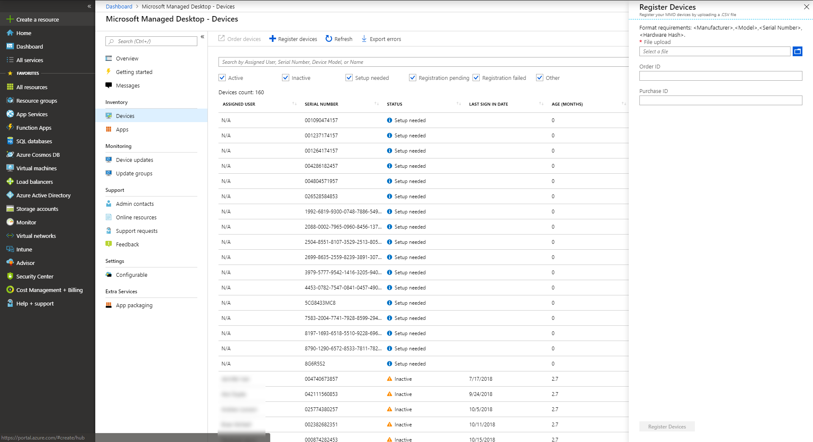

# <a name="register-existing-devices-yourself"></a><span data-ttu-id="3758b-103">Registreer bestaande apparaten zelf</span><span class="sxs-lookup"><span data-stu-id="3758b-103">Register existing devices yourself</span></span>

>[!NOTE]
><span data-ttu-id="3758b-104">In dit onderwerp worden de stappen beschreven die u gebruiken om apparaten die u al hebt opnieuw te gebruiken en deze te registreren in Microsoft Managed Desktop.</span><span class="sxs-lookup"><span data-stu-id="3758b-104">This topic describes the steps for you to re-use devices you already have and register them in Microsoft Managed Desktop.</span></span> <span data-ttu-id="3758b-105">Als u met gloednieuwe apparaten werkt, volgt u in plaats daarvan zelf de stappen in [Nieuwe apparaten registreren in Microsoft Managed Desktop.](register-devices-self.md)</span><span class="sxs-lookup"><span data-stu-id="3758b-105">If you are working with brand-new devices, follow the steps in [Register new devices in Microsoft Managed Desktop yourself](register-devices-self.md) instead.</span></span>

<span data-ttu-id="3758b-106">Het proces voor partners wordt gedocumenteerd in [Stappen voor Partners om apparaten te registreren.](register-devices-partner.md)</span><span class="sxs-lookup"><span data-stu-id="3758b-106">The process for Partners is documented in [Steps for Partners to register devices](register-devices-partner.md).</span></span>

<span data-ttu-id="3758b-107">Microsoft Managed Desktop kan werken met gloednieuwe apparaten of u apparaten die u misschien al hebt opnieuw gebruiken (waarvoor u ze opnieuw moet afbeelding smaken).</span><span class="sxs-lookup"><span data-stu-id="3758b-107">Microsoft Managed Desktop can work with brand-new devices or you can re-use devices you might already have (which will require that you re-image them).</span></span> <span data-ttu-id="3758b-108">U apparaten registreren met Microsoft Managed Desktop op de Azure Portal.</span><span class="sxs-lookup"><span data-stu-id="3758b-108">You can register devices by using Microsoft Managed Desktop on the Azure Portal.</span></span>

## <a name="prepare-to-register-existing-devices"></a><span data-ttu-id="3758b-109">Voorbereiden om bestaande apparaten te registreren</span><span class="sxs-lookup"><span data-stu-id="3758b-109">Prepare to register existing devices</span></span>


<span data-ttu-id="3758b-110">Voer de volgende stappen uit om bestaande apparaten te registreren:</span><span class="sxs-lookup"><span data-stu-id="3758b-110">To register existing devices, follow these steps:</span></span>

1. [<span data-ttu-id="3758b-111">Verkrijg de hardwarehash voor elk apparaat.</span><span class="sxs-lookup"><span data-stu-id="3758b-111">Obtain the hardware hash for each device.</span></span>](#obtain-the-hardware-hash)
2. [<span data-ttu-id="3758b-112">De hashgegevens samenvoegen</span><span class="sxs-lookup"><span data-stu-id="3758b-112">Merge the hash data</span></span>](#merge-hash-data)
3. <span data-ttu-id="3758b-113">[Registreer de apparaten in Microsoft Managed Desktop](#register-devices).</span><span class="sxs-lookup"><span data-stu-id="3758b-113">[Register the devices in Microsoft Managed Desktop](#register-devices).</span></span>
4. [<span data-ttu-id="3758b-114">Controleer nogmaals of de afbeelding correct is.</span><span class="sxs-lookup"><span data-stu-id="3758b-114">Double-check that the image is correct.</span></span>](#check-the-image)
5. [<span data-ttu-id="3758b-115">Het apparaat leveren</span><span class="sxs-lookup"><span data-stu-id="3758b-115">Deliver the device</span></span>](#deliver-the-device)

### <a name="obtain-the-hardware-hash"></a><span data-ttu-id="3758b-116">De hardwarehash verkrijgen</span><span class="sxs-lookup"><span data-stu-id="3758b-116">Obtain the hardware hash</span></span>

<span data-ttu-id="3758b-117">Microsoft Managed Desktop identificeert elk apparaat uniek door te verwijzen naar de hardwarehash.</span><span class="sxs-lookup"><span data-stu-id="3758b-117">Microsoft Managed Desktop identifies each device uniquely by referencing its hardware hash.</span></span> <span data-ttu-id="3758b-118">Je hebt vier opties om deze informatie te verkrijgen van apparaten die je al gebruikt:</span><span class="sxs-lookup"><span data-stu-id="3758b-118">You have four options for getting this information from devices you're already using:</span></span>

- <span data-ttu-id="3758b-119">Vraag uw OEM-leverancier naar het AutoPilot-registratiebestand, dat de hardwarehashes bevat.</span><span class="sxs-lookup"><span data-stu-id="3758b-119">Ask your OEM supplier for the AutoPilot registration file, which will include the hardware hashes.</span></span>
- <span data-ttu-id="3758b-120">Een aangepast rapport maken in [Configuration Manager](#configuration-manager).</span><span class="sxs-lookup"><span data-stu-id="3758b-120">Create a custom report in [Configuration Manager](#configuration-manager).</span></span>
- <span data-ttu-id="3758b-121">Voer een Windows PowerShell-script uit - met [Active Directory](#active-directory-powershell-script-method) of [handmatig](#manual-powershell-script-method) op elk apparaat - en verzamel de resultaten in een bestand.</span><span class="sxs-lookup"><span data-stu-id="3758b-121">Run a Windows PowerShell script--either by using [Active Directory](#active-directory-powershell-script-method) or [manually](#manual-powershell-script-method) on each device--and collect the results in a file.</span></span>
- <span data-ttu-id="3758b-122">Start elk apparaat- maar voltooi de Installatie-ervaring van Windows niet - en [verzamel de hashes op een verwisselbaar flashstation.](#flash-drive-method)</span><span class="sxs-lookup"><span data-stu-id="3758b-122">Start each device--but don't complete the Windows setup experience--and [collect the hashes on a removable flash drive](#flash-drive-method).</span></span>

#### <a name="configuration-manager"></a><span data-ttu-id="3758b-123">Configuration Manager</span><span class="sxs-lookup"><span data-stu-id="3758b-123">Configuration Manager</span></span>

<span data-ttu-id="3758b-124">U Microsoft Endpoint Configuration Manager gebruiken om de hardwarehashes te verzamelen van bestaande apparaten die u wilt registreren bij Microsoft Managed Desktop.</span><span class="sxs-lookup"><span data-stu-id="3758b-124">You can use Microsoft Endpoint Configuration Manager to collect the hardware hashes from existing devices that you want to register with Microsoft Managed Desktop.</span></span>

> [!IMPORTANT]
> <span data-ttu-id="3758b-125">Alle apparaten waarvoor u deze informatie wilt krijgen, moeten Windows 10, versie 1703 of hoger gebruiken.</span><span class="sxs-lookup"><span data-stu-id="3758b-125">Any devices you want to get this information for must be running Windows 10, version 1703 or later.</span></span> <span data-ttu-id="3758b-126">U hebt ook een apparaat nodig dat een configuration manager-client is die is verbonden met de site Configuration Manager (Current Branch).</span><span class="sxs-lookup"><span data-stu-id="3758b-126">You also need a device that is a Configuration Manager client connected to the Configuration Manager (Current Branch) site.</span></span> <span data-ttu-id="3758b-127">U hebt ook de rol van het rapporteringspuntsitesysteem nodig die in uw omgeving is ingesteld met SQL Server Reporting Services ingeschakeld.</span><span class="sxs-lookup"><span data-stu-id="3758b-127">You also need the Reporting Point Site System role set up in your environment with SQL Server Reporting Services enabled.</span></span> 

<span data-ttu-id="3758b-128">Als u aan al deze vereisten hebt voldaan, u de informatie verzamelen door de volgende stappen te volgen:</span><span class="sxs-lookup"><span data-stu-id="3758b-128">If you've met all these prerequisites, you're ready to collect the information by following these steps:</span></span>

1. <span data-ttu-id="3758b-129">Selecteer in de console Configuratiebeheer de optie **Controle**.</span><span class="sxs-lookup"><span data-stu-id="3758b-129">In the Configuration Manager console, select **Monitoring**.</span></span> 
2. <span data-ttu-id="3758b-130">Vouw in de werkruimte Controle **rapporten**uit en selecteer **Rapporten**.</span><span class="sxs-lookup"><span data-stu-id="3758b-130">In the Monitoring workspace, expand **Reporting**, and then select **Reports**.</span></span> 
3. <span data-ttu-id="3758b-131">Selecteer op het tabblad **Start** in de sectie **Maken** de optie **Rapport maken** om de wizard Rapport maken te openen.</span><span class="sxs-lookup"><span data-stu-id="3758b-131">On the **Home** tab, in the **Create** section, select **Create Report** to open the Create Report wizard.</span></span> 
4. <span data-ttu-id="3758b-132">Stel op de pagina **Informatie** de volgende instellingen in:</span><span class="sxs-lookup"><span data-stu-id="3758b-132">On the **Information** page, set these settings:</span></span> 
    - <span data-ttu-id="3758b-133">**Naam:** Geef een naam op voor het rapport.</span><span class="sxs-lookup"><span data-stu-id="3758b-133">**Name:** Specify a name for the report.</span></span> 
    - <span data-ttu-id="3758b-134">**Beschrijving:** Geef een beschrijving voor het rapport op.</span><span class="sxs-lookup"><span data-stu-id="3758b-134">**Description:** Specify a description for the report.</span></span> 
    - <span data-ttu-id="3758b-135">**Server:** Hiermee wordt de naam weergegeven van de rapportserver waarop u dit rapport maakt.</span><span class="sxs-lookup"><span data-stu-id="3758b-135">**Server:** Displays the name of the report server on which you are creating this report.</span></span> 
    - <span data-ttu-id="3758b-136">**Pad:** Selecteer **Bladeren** om een map op te geven waarin u het rapport wilt opslaan.</span><span class="sxs-lookup"><span data-stu-id="3758b-136">**Path:** Select **Browse** to specify a folder in which you want to store the report.</span></span> 
5. <span data-ttu-id="3758b-137">Selecteer **Volgende**.</span><span class="sxs-lookup"><span data-stu-id="3758b-137">Select **Next**.</span></span> 
6. <span data-ttu-id="3758b-138">Controleer op de **pagina Overzicht** de instellingen.</span><span class="sxs-lookup"><span data-stu-id="3758b-138">On the **Summary** page, review the settings.</span></span> <span data-ttu-id="3758b-139">Selecteer **Vorige** om de instellingen te wijzigen of selecteer **Volgende** om het rapport te maken in Configuratiebeheer.</span><span class="sxs-lookup"><span data-stu-id="3758b-139">Select **Previous** to change the settings or select **Next** to create the report in Configuration Manager.</span></span> 
7. <span data-ttu-id="3758b-140">Selecteer **op** de pagina Voltooien de optie **Sluiten** om de wizard af te sluiten en open **Rapportbouwer** om de rapportinstellingen in te voeren.</span><span class="sxs-lookup"><span data-stu-id="3758b-140">On the **Completion** page, select **Close** to exit the wizard and open **Report Builder** to enter the report settings.</span></span> <span data-ttu-id="3758b-141">Voer uw gebruikersaccount en wachtwoord in als u wordt gevraagd en selecteer **OK.**</span><span class="sxs-lookup"><span data-stu-id="3758b-141">Enter your user account and password if you are prompted, and then select **OK.**</span></span> <span data-ttu-id="3758b-142">Als Rapportbouwer niet op het apparaat is geïnstalleerd, wordt u gevraagd het apparaat te installeren.</span><span class="sxs-lookup"><span data-stu-id="3758b-142">If Report Builder is not installed on the device, you are prompted to install it.</span></span> <span data-ttu-id="3758b-143">Selecteer **Uitvoeren om Rapportbouwer te installeren**, wat nodig is om rapporten te wijzigen en te maken.</span><span class="sxs-lookup"><span data-stu-id="3758b-143">Select **Run to install Report Builder**, which is required to modify and create reports.</span></span> 


<span data-ttu-id="3758b-144">**Geef in Microsoft Report Builder**de SQL-instructie voor het rapport op en volg de volgende stappen:</span><span class="sxs-lookup"><span data-stu-id="3758b-144">**In Microsoft Report Builder**, provide the SQL statement for the report and follow these steps:</span></span>

1. <span data-ttu-id="3758b-145">Selecteer in het linkerdeelvenster **Gegevenssets**en klik vervolgens met de rechtermuisknop op **Gegevensset toevoegen**.</span><span class="sxs-lookup"><span data-stu-id="3758b-145">In the left pane, select **Datasets**, and then right-click to **Add Dataset**.</span></span>
2. <span data-ttu-id="3758b-146">Ga naar het tabblad **Query** en voer de naam als *DataSet0*in .</span><span class="sxs-lookup"><span data-stu-id="3758b-146">Go to the **Query** tab, and then enter the name as *DataSet0*.</span></span> 
3. <span data-ttu-id="3758b-147">Selecteer **Een gegevensset gebruiken die is ingesloten in mijn rapport**; Rapportbouwer wordt geopend.</span><span class="sxs-lookup"><span data-stu-id="3758b-147">Select **Use a dataset embedded in my report**; Report Builder opens.</span></span>
4. <span data-ttu-id="3758b-148">Selecteer **gegevensbron**in **Rapportbouwer:**.</span><span class="sxs-lookup"><span data-stu-id="3758b-148">In **Report Builder**, select **Data source:**.</span></span> <span data-ttu-id="3758b-149">Selecteer de standaardgegevensbron, die moet beginnen met "AutoGen".</span><span class="sxs-lookup"><span data-stu-id="3758b-149">Select the default data source, which should start with "AutoGen".</span></span> 
5. <span data-ttu-id="3758b-150">Kies **Querytype als tekst**en voer deze query in:</span><span class="sxs-lookup"><span data-stu-id="3758b-150">Choose **Query type as Text**, and then enter this query:</span></span>


```sql
SELECT comp.manufacturer0      AS Manufacturer,  
       comp.model0             AS Model,  
       bios.serialnumber0      AS Serial_Number,  
       mdm.devicehardwaredata0 AS HardwareHash  
FROM   Fn_rbac_gs_computer_system(@UserSIDs) comp

       INNER JOIN Fn_rbac_gs_pc_bios(@UserSIDs) bios  
               ON comp.resourceid = bios.resourceid  
       INNER JOIN Fn_rbac_gs_mdm_devdetail_ext01(@UserSIDs) mdm  
               ON comp.resourceid = mdm.resourceid
```


5. <span data-ttu-id="3758b-151">Navigeer naar het tabblad **Veld,** wehre-waarden **voor Veldnaam** en **veldbron** moeten al worden ingevuld.</span><span class="sxs-lookup"><span data-stu-id="3758b-151">Navigate to the **Field** tab, wehre values for **Field Name** and **Field Source** should already be populated.</span></span> <span data-ttu-id="3758b-152">Als dit niet het zo is, selecteert u **Toevoegen**en selecteert u **Queryveld**.</span><span class="sxs-lookup"><span data-stu-id="3758b-152">If they aren't, then select **Add**, and then select **Query Field**.</span></span> <span data-ttu-id="3758b-153">Voer de **veldnaam** en **veldbron in**.</span><span class="sxs-lookup"><span data-stu-id="3758b-153">Enter the **Field Name** and **Field Source**.</span></span>
6. <span data-ttu-id="3758b-154">Herhaal dit voor elk van deze waarden:</span><span class="sxs-lookup"><span data-stu-id="3758b-154">Repeat for each of these values:</span></span> 
    - <span data-ttu-id="3758b-155">Fabrikant</span><span class="sxs-lookup"><span data-stu-id="3758b-155">Manufacturer</span></span> 
    - <span data-ttu-id="3758b-156">Model</span><span class="sxs-lookup"><span data-stu-id="3758b-156">Model</span></span> 
    - <span data-ttu-id="3758b-157">Serieel_getal</span><span class="sxs-lookup"><span data-stu-id="3758b-157">Serial_Number</span></span> 
    - <span data-ttu-id="3758b-158">HardwareHash</span><span class="sxs-lookup"><span data-stu-id="3758b-158">HardwareHash</span></span>
7. <span data-ttu-id="3758b-159">Selecteer **OK**.</span><span class="sxs-lookup"><span data-stu-id="3758b-159">Select **OK**.</span></span>

<span data-ttu-id="3758b-160">**Definieer vervolgens de rapportweergave en maak het rapport** door de volgende stappen te volgen:</span><span class="sxs-lookup"><span data-stu-id="3758b-160">**Next, define the report display and create the report** by following these steps:</span></span>

1. <span data-ttu-id="3758b-161">Tabel **of matrix selecteren**; er wordt een nieuwe wizard geopend.</span><span class="sxs-lookup"><span data-stu-id="3758b-161">Select **Table or Matrix**; a new wizard will open.</span></span>
2. <span data-ttu-id="3758b-162">Selecteer **in Een gegevensset kiezen**de optie Een bestaande **gegevensset kiezen in dit rapport of een gedeelde gegevensset**.</span><span class="sxs-lookup"><span data-stu-id="3758b-162">In **Choose a dataset**, select **Choose an existing dataset in this report or a shared dataset**.</span></span>  
3. <span data-ttu-id="3758b-163">Selecteer **DataSet0** (de standaardinstelling) en selecteer **Volgende**.</span><span class="sxs-lookup"><span data-stu-id="3758b-163">Select **DataSet0** (the default), and then select **Next**.</span></span>
4. <span data-ttu-id="3758b-164">**Sleep fabrikant,** **model**en **serienummer naar** het vak **Rijgroepen.**</span><span class="sxs-lookup"><span data-stu-id="3758b-164">Drag **Manufacturer**, **Model**, and **Serial Number** into the **Row Groups** box.</span></span> <span data-ttu-id="3758b-165">Sleep **HardwareHash** naar het vak **Waarden** en selecteer **Volgende**.</span><span class="sxs-lookup"><span data-stu-id="3758b-165">Drag **HardwareHash** into the **Values** box and then select **Next**.</span></span>
5. <span data-ttu-id="3758b-166">Schakel de selectievakjes voor **Subtotalen en eindtotalen weergeven en groepen** **Uitvouwen/samenvouwen uit.**</span><span class="sxs-lookup"><span data-stu-id="3758b-166">Clear the checkboxes for **Show subtotals and grand totals** and **Expand/collapse groups**.</span></span> <span data-ttu-id="3758b-167">Selecteer **Volgende**.</span><span class="sxs-lookup"><span data-stu-id="3758b-167">Select **Next**.</span></span>
6. <span data-ttu-id="3758b-168">Selecteer **Voltooien**.</span><span class="sxs-lookup"><span data-stu-id="3758b-168">Select **Finish**.</span></span>
7. <span data-ttu-id="3758b-169">Selecteer **Uitvoeren** om uw rapport uit te voeren.</span><span class="sxs-lookup"><span data-stu-id="3758b-169">Select **Run** to run your report.</span></span> <span data-ttu-id="3758b-170">Controleer of het rapport de informatie bevat die u verwacht.</span><span class="sxs-lookup"><span data-stu-id="3758b-170">Verify that the report provides the information that you expect.</span></span> <span data-ttu-id="3758b-171">Selecteer indien nodig **Ontwerp** om terug te keren naar de ontwerpweergave om het rapport te wijzigen.</span><span class="sxs-lookup"><span data-stu-id="3758b-171">If necessary, select **Design** to return to the Design view to modify the report.</span></span>
8. <span data-ttu-id="3758b-172">Selecteer **Opslaan** om het rapport op te slaan op de rapportserver.</span><span class="sxs-lookup"><span data-stu-id="3758b-172">Select **Save** to save the report to the report server.</span></span> <span data-ttu-id="3758b-173">U het nieuwe rapport uitvoeren in het knooppunt Rapporten in de werkruimte Controle.</span><span class="sxs-lookup"><span data-stu-id="3758b-173">You can run the new report in the Reports node in the Monitoring workspace.</span></span> 

<span data-ttu-id="3758b-174">**Exporteer ten slotte het rapport en gebruik het om apparaten te registreren** door deze stappen te volgen.</span><span class="sxs-lookup"><span data-stu-id="3758b-174">**Finally, export the report and use it to register devices** by following these steps.</span></span> <span data-ttu-id="3758b-175">(U hoeft alleen de stappen 1 en 2 van deze sectie te volgen als u na de vorige stappen hebt weggenavigeerd.):</span><span class="sxs-lookup"><span data-stu-id="3758b-175">(You should only need to follow Steps 1 and 2 of this section if you have navigated away after the previous steps.):</span></span>

1. <span data-ttu-id="3758b-176">Selecteer in de console Configuratiebeheer de optie **Controle**.</span><span class="sxs-lookup"><span data-stu-id="3758b-176">In the Configuration Manager console, select **Monitoring**.</span></span>
2. <span data-ttu-id="3758b-177">Vouw **in Monitoring** **Rapportage**uit en selecteer vervolgens **Rapporten**.</span><span class="sxs-lookup"><span data-stu-id="3758b-177">In **Monitoring**, expand **Reporting**, and then select **Reports**.</span></span>
3. <span data-ttu-id="3758b-178">Zoek het rapport met de naam die u eerder hebt gemaakt.</span><span class="sxs-lookup"><span data-stu-id="3758b-178">Find the report using the name you created earlier.</span></span>
4. <span data-ttu-id="3758b-179">Klik met de rechtermuisknop op dit rapport en selecteer **Uitvoeren**.</span><span class="sxs-lookup"><span data-stu-id="3758b-179">Right-click this report, and select **Run**.</span></span>
5. <span data-ttu-id="3758b-180">Selecteer **exporteren** en selecteer **Opslaan als CSV**in het dialoogvenster dat wordt geopend.</span><span class="sxs-lookup"><span data-stu-id="3758b-180">In the dialog that opens, select **Export** and then select **Save as CSV**.</span></span>
6. <span data-ttu-id="3758b-181">Deze versie van rapport haalt hashes uit alle Windows 10-apparaten waarmee Configuration Manager communiceert.</span><span class="sxs-lookup"><span data-stu-id="3758b-181">This version of report extracts hashes from all Windows 10 devices that Configuration Manager communicates with.</span></span> <span data-ttu-id="3758b-182">U moet resultaten filteren op alleen die apparaten die u wilt registreren bij Microsoft Managed Desktop.</span><span class="sxs-lookup"><span data-stu-id="3758b-182">You will need to filter results to just those devices you plan to register with Microsoft Managed Desktop.</span></span>


> [!IMPORTANT]
> <span data-ttu-id="3758b-183">De query in Configuratiebeheer staat geen spaties toe in geëxporteerde kolomnamen. daarom heb je in de stappen 'Serial_Number' en 'HardwareHash' ingevoerd.</span><span class="sxs-lookup"><span data-stu-id="3758b-183">The query in Configuration Manager doesn’t allow spaces in exported column names; that's why the steps had you enter "Serial_Number" and "HardwareHash."</span></span> <span data-ttu-id="3758b-184">Nu u het geëxporteerde CSV-bestand hebt, moet u de rapportkoppen bewerken om *serienummer* en *hardwarehash* te lezen, zoals hier wordt weergegeven voordat u verdergaat met apparaatregistratie.</span><span class="sxs-lookup"><span data-stu-id="3758b-184">Now that you have the exported CSV file, you must edit the report headers to read *Serial Number* and *Hardware Hash* as shown here before you proceed with device registration.</span></span>

<span data-ttu-id="3758b-185">Nu u overgaan tot [Apparaten registreren met behulp van de Azure Portal.](#register-devices-by-using-the-azure-portal)</span><span class="sxs-lookup"><span data-stu-id="3758b-185">Now you can proceed to [Register devices by using the Azure Portal](#register-devices-by-using-the-azure-portal).</span></span>


#### <a name="active-directory-powershell-script-method"></a><span data-ttu-id="3758b-186">Active Directory PowerShell-scriptmethode</span><span class="sxs-lookup"><span data-stu-id="3758b-186">Active Directory PowerShell script method</span></span>

<span data-ttu-id="3758b-187">In een Active Directory-omgeving `Get-MMDRegistrationInfo` kunt u de PowerShell-cmdlet gebruiken om de informatie van apparaten in Active Directory-groepen op afstand te verzamelen met Behulp van WinRM.</span><span class="sxs-lookup"><span data-stu-id="3758b-187">In an Active Directory environment, you can use the `Get-MMDRegistrationInfo` PowerShell cmdlet to remotely collect the information from devices in Active Directory Groups by using WinRM.</span></span> <span data-ttu-id="3758b-188">U de `Get-AD Computer` cmdlet ook gebruiken en gefilterde resultaten krijgen voor een specifieke hardwaremodelnamen die in de catalogus zijn opgenomen.</span><span class="sxs-lookup"><span data-stu-id="3758b-188">You can also use the `Get-AD Computer` cmdlet and get filtered results for a specific hardware model names included in the catalog.</span></span> <span data-ttu-id="3758b-189">Bevestig hiervoor eerst deze vereisten en ga vervolgens verder met de stappen:</span><span class="sxs-lookup"><span data-stu-id="3758b-189">To do this, first confirm these prerequisites, and then proceed with the steps:</span></span>

- <span data-ttu-id="3758b-190">WinRM is ingeschakeld.</span><span class="sxs-lookup"><span data-stu-id="3758b-190">WinRM is enabled.</span></span>
- <span data-ttu-id="3758b-191">De apparaten die u wilt registreren, zijn actief op het netwerk (dat wil zeggen dat ze niet zijn losgekoppeld of uitgeschakeld).</span><span class="sxs-lookup"><span data-stu-id="3758b-191">The devices you want to register are active on the network (that is, they are not disconnected or turned off).</span></span>
- <span data-ttu-id="3758b-192">Zorg ervoor dat u een parameter voor domeinreferenties hebt die toestemming heeft om op afstand uit te voeren op de apparaten.</span><span class="sxs-lookup"><span data-stu-id="3758b-192">Make sure you have a domain credential parameter that has permission to execute remotely on the devices.</span></span>
- <span data-ttu-id="3758b-193">Zorg ervoor dat Windows Firewall toegang geeft tot WMI.</span><span class="sxs-lookup"><span data-stu-id="3758b-193">Make sure that Windows Firewall allows access to WMI.</span></span> <span data-ttu-id="3758b-194">Voer hiervoor de volgende stappen uit:</span><span class="sxs-lookup"><span data-stu-id="3758b-194">To do that, follow these steps:</span></span>
    1. <span data-ttu-id="3758b-195">Open het configuratiescherm **van Windows Defender Firewall** en selecteer Een app of functie toestaan via Windows Defender **Firewall**.</span><span class="sxs-lookup"><span data-stu-id="3758b-195">Open the **Windows Defender Firewall** control panel and select **Allow an app or feature through Windows Defender Firewall**.</span></span>
    2. <span data-ttu-id="3758b-196">Zoek **Windows Management Instrumentation (WMI)** in de lijst, schakel in voor zowel Privé als **Openbaar**en selecteer **VERVOLGENS OK**.</span><span class="sxs-lookup"><span data-stu-id="3758b-196">Find **Windows Management Instrumentation (WMI)** in the list, enable for both **Private and Public**, and then select **OK**.</span></span>

1.  <span data-ttu-id="3758b-197">Open een PowerShell-prompt met beheerdersrechten.</span><span class="sxs-lookup"><span data-stu-id="3758b-197">Open a PowerShell prompt with administrative rights.</span></span>
2.  <span data-ttu-id="3758b-198">Voer *een* van deze scripts uit:</span><span class="sxs-lookup"><span data-stu-id="3758b-198">Run *either one* of these scripts:</span></span>
```powershell
Install-script -name Get-MMDRegistrationInfo 
#example one – leverage Get-ADComputer to enumerate devices 
Get-ADComputer -filter * | powershell -ExecutionPolicy Unrestricted Get-MMDRegistrationInfo.ps1 -credential Domainname\<accountname>
```
```powershell 
#example two – target specific devices: 
Set-ExecutionPolicy powershell -ExecutionPolicy Unrestricted Get-MMDRegistrationInfo.ps1 -credential Domainname\<accountname> -Name Machine1,Machine2,Machine3
```
3. <span data-ttu-id="3758b-199">Krijg toegang tot mappen waar er mogelijk vermeldingen voor de apparaten zijn.</span><span class="sxs-lookup"><span data-stu-id="3758b-199">Access any directories where there might be entries for the devices.</span></span> <span data-ttu-id="3758b-200">Verwijder vermeldingen voor elk apparaat uit *alle* mappen, waaronder Windows Server Active Directory Domain Services en Azure Active Directory.</span><span class="sxs-lookup"><span data-stu-id="3758b-200">Remove entries for each device from *all* directories, including Windows Server Active Directory Domain Services and Azure Active Directory.</span></span> <span data-ttu-id="3758b-201">Houd er rekening mee dat deze verwijdering een paar uur kan duren om volledig te verwerken.</span><span class="sxs-lookup"><span data-stu-id="3758b-201">Be aware that this removal could take a few hours to completely process.</span></span>
4. <span data-ttu-id="3758b-202">Toegangsbeheerservices waar mogelijk vermeldingen voor de apparaten zijn.</span><span class="sxs-lookup"><span data-stu-id="3758b-202">Access management services where there might be entries for the devices.</span></span> <span data-ttu-id="3758b-203">Verwijder vermeldingen voor elk apparaat uit *alle* beheerservices, waaronder Microsoft Endpoint Configuration Manager, Microsoft Intune en Windows Autopilot.</span><span class="sxs-lookup"><span data-stu-id="3758b-203">Remove entries for each device from *all* management services, including Microsoft Endpoint Configuration Manager, Microsoft Intune, and Windows Autopilot.</span></span> <span data-ttu-id="3758b-204">Houd er rekening mee dat deze verwijdering een paar uur kan duren om volledig te verwerken.</span><span class="sxs-lookup"><span data-stu-id="3758b-204">Be aware that this removal could take a few hours to completely process.</span></span>

<span data-ttu-id="3758b-205">Nu u overgaan tot [het registreren van apparaten.](#register-devices)</span><span class="sxs-lookup"><span data-stu-id="3758b-205">Now you can proceed to [register devices](#register-devices).</span></span>

#### <a name="manual-powershell-script-method"></a><span data-ttu-id="3758b-206">Handmatige PowerShell-scriptmethode</span><span class="sxs-lookup"><span data-stu-id="3758b-206">Manual PowerShell script method</span></span>

1.  <span data-ttu-id="3758b-207">Open een PowerShell-prompt met beheerdersrechten.</span><span class="sxs-lookup"><span data-stu-id="3758b-207">Open a PowerShell prompt with administrative rights.</span></span>
2.  <span data-ttu-id="3758b-208">Uitvoeren`Install-Script -Name Get-MMDRegistrationInfo`</span><span class="sxs-lookup"><span data-stu-id="3758b-208">Run `Install-Script -Name Get-MMDRegistrationInfo`</span></span>
3.  <span data-ttu-id="3758b-209">Uitvoeren`powershell -ExecutionPolicy Unrestricted Get-MMDRegistrationInfo -OutputFile <path>\hardwarehash.csv`</span><span class="sxs-lookup"><span data-stu-id="3758b-209">Run `powershell -ExecutionPolicy Unrestricted Get-MMDRegistrationInfo -OutputFile <path>\hardwarehash.csv`</span></span>
4. [<span data-ttu-id="3758b-210">Voeg de hashgegevens samen.</span><span class="sxs-lookup"><span data-stu-id="3758b-210">Merge the hash data.</span></span>](#merge-hash-data)

#### <a name="flash-drive-method"></a><span data-ttu-id="3758b-211">Flash-stationmethode</span><span class="sxs-lookup"><span data-stu-id="3758b-211">Flash drive method</span></span>

1. <span data-ttu-id="3758b-212">Plaats een USB-station op een ander apparaat dan het apparaat dat u registreert.</span><span class="sxs-lookup"><span data-stu-id="3758b-212">On a device other than the one you're registering, insert a USB drive.</span></span>
2. <span data-ttu-id="3758b-213">Open een PowerShell-prompt met beheerdersrechten.</span><span class="sxs-lookup"><span data-stu-id="3758b-213">Open a PowerShell prompt with administrative rights.</span></span>
3. <span data-ttu-id="3758b-214">Uitvoeren`Save-Script -Name Get-MMDRegistrationInfo -Path <pathToUsb>`</span><span class="sxs-lookup"><span data-stu-id="3758b-214">Run `Save-Script -Name Get-MMDRegistrationInfo -Path <pathToUsb>`</span></span>
4. <span data-ttu-id="3758b-215">Schakel het apparaat in dat u registreert, maar *start de installatie-ervaring niet.*</span><span class="sxs-lookup"><span data-stu-id="3758b-215">Turn on the device you are registering, but *do not start the setup experience*.</span></span> <span data-ttu-id="3758b-216">Als u per ongeluk de installatie-ervaring start, moet u het apparaat opnieuw instellen of opnieuw inbeelden.</span><span class="sxs-lookup"><span data-stu-id="3758b-216">If you accidentally start the setup experience, you'll have to reset or reimage the device.</span></span>
5. <span data-ttu-id="3758b-217">Plaats het USB-station en druk op Shift + F10.</span><span class="sxs-lookup"><span data-stu-id="3758b-217">Insert the USB drive, and then press SHIFT + F10.</span></span>
6. <span data-ttu-id="3758b-218">Open een PowerShell-prompt met beheerdersrechten en voer vervolgens uit `cd <pathToUsb>`.</span><span class="sxs-lookup"><span data-stu-id="3758b-218">Open a PowerShell prompt with administrative rights, and then run `cd <pathToUsb>`.</span></span>
7. <span data-ttu-id="3758b-219">Uitvoeren`Set-ExecutionPolicy -ExecutionPolicy Unrestricted`</span><span class="sxs-lookup"><span data-stu-id="3758b-219">Run `Set-ExecutionPolicy -ExecutionPolicy Unrestricted`</span></span>
8. <span data-ttu-id="3758b-220">Uitvoeren`.\Get-MMDRegistrationInfo -OutputFile <path>\hardwarehash.csv`</span><span class="sxs-lookup"><span data-stu-id="3758b-220">Run `.\Get-MMDRegistrationInfo -OutputFile <path>\hardwarehash.csv`</span></span>
9. <span data-ttu-id="3758b-221">Verwijder het USB-station en schakel het apparaat vervolgens uit door`shutdown -s -t 0`</span><span class="sxs-lookup"><span data-stu-id="3758b-221">Remove the USB drive, and then shut down the device by running `shutdown -s -t 0`</span></span>
10. [<span data-ttu-id="3758b-222">Voeg de hashgegevens samen.</span><span class="sxs-lookup"><span data-stu-id="3758b-222">Merge the hash data.</span></span>](#merge-hash-data)

>[!IMPORTANT]
><span data-ttu-id="3758b-223">Ga niet meer in op het apparaat dat u registreert totdat u de registratie voor het apparaat hebt voltooid.</span><span class="sxs-lookup"><span data-stu-id="3758b-223">Do not power on the device you are registering again until you've completed registration for it.</span></span> 


### <a name="merge-hash-data"></a><span data-ttu-id="3758b-224">Hashgegevens samenvoegen</span><span class="sxs-lookup"><span data-stu-id="3758b-224">Merge hash data</span></span>

<span data-ttu-id="3758b-225">Als u de hardwarehashgegevens hebt verzameld volgens de handmatige PowerShell- of flashdrive-methoden, moet u nu de gegevens in de CSV-bestanden in één bestand hebben gecombineerd om de registratie te voltooien.</span><span class="sxs-lookup"><span data-stu-id="3758b-225">If you collected the hardware hash data by the manual PowerShell or flash drive methods, you now need to have the data in the CSV files combined into a single file to complete registration.</span></span> <span data-ttu-id="3758b-226">Hier is een voorbeeld PowerShell script om dit eenvoudig te maken:</span><span class="sxs-lookup"><span data-stu-id="3758b-226">Here's a sample PowerShell script to make this easy:</span></span>

`Import-CSV -Path (Get-ChildItem -Filter *.csv) | ConvertTo-Csv -NoTypeInformation | % {$_.Replace('"', '')} | Out-File .\aggregatedDevices.csv`

<span data-ttu-id="3758b-227">Als de hashgegevens zijn samengevoegd tot één CSV-bestand, u nu doorgaan [met het registreren van de apparaten.](#register-devices)</span><span class="sxs-lookup"><span data-stu-id="3758b-227">With the hash data merged into one CSV file, you can now proceed to [register the devices](#register-devices).</span></span>

### <a name="register-devices"></a><span data-ttu-id="3758b-228">Apparaten registreren</span><span class="sxs-lookup"><span data-stu-id="3758b-228">Register devices</span></span>

<span data-ttu-id="3758b-229">Het CSV-bestand moet zich in een bepaalde indeling voor registratie hebben.</span><span class="sxs-lookup"><span data-stu-id="3758b-229">The CSV file must be in a particular format for registration.</span></span> <span data-ttu-id="3758b-230">Als u de gegevens zelf hebt verzameld in de vorige stappen, moet het bestand al in de juiste indeling zijn; als u het bestand van een leverancier verkrijgt, moet u mogelijk de indeling aanpassen.</span><span class="sxs-lookup"><span data-stu-id="3758b-230">If you collected the data yourself in the previous steps, the file should already be in the right format; if you obtain the file from a supplier, you might need to adjust the format.</span></span>

>[!NOTE]
><span data-ttu-id="3758b-231">Voor uw gemak u een [sjabloon](https://github.com/MicrosoftDocs/microsoft-365-docs/raw/public/microsoft-365/managed-desktop/get-started/downloads/device-registration-sample-partner.xlsx) voor dit CSV-bestand downloaden.</span><span class="sxs-lookup"><span data-stu-id="3758b-231">For your convenience, you can download a [template](https://github.com/MicrosoftDocs/microsoft-365-docs/raw/public/microsoft-365/managed-desktop/get-started/downloads/device-registration-sample-partner.xlsx) for this CSV file.</span></span>

<span data-ttu-id="3758b-232">Uw bestand moet **exact dezelfde kolomkoppen** bevatten als de voorbeeldkop (fabrikant, model, enz.), maar uw eigen gegevens voor de andere rijen.</span><span class="sxs-lookup"><span data-stu-id="3758b-232">Your file needs to include the **exact same column headings** as the sample one (Manufacturer, Model, etc.), but your own data for the other rows.</span></span> <span data-ttu-id="3758b-233">Als u de sjabloon gebruikt, opent u deze in een tekstbewerkingstool zoals Kladblok en overweegt u alle gegevens alleen in rij 1 achter te laten en alleen gegevens in rijen 2 en lager in te voeren.</span><span class="sxs-lookup"><span data-stu-id="3758b-233">If you use the template, open it in a text editing tool such as Notepad, and consider leaving all the data in row 1 alone, only entering data in rows 2 and below.</span></span> 
    
  ```
 Manufacturer,Model,Serial Number,Hardware Hash
  SpiralOrbit,ContosoABC,000000000000,dGhpc2RldmljZWlzYW5tbWRkZXZpY2U
  
  
  ```

>[!NOTE]
><span data-ttu-id="3758b-234">Als u vergeet een van de voorbeeldgegevens te wijzigen, mislukt de registratie.</span><span class="sxs-lookup"><span data-stu-id="3758b-234">If you forget to change any of the sample data, registration will fail.</span></span>

#### <a name="register-devices-by-using-the-azure-portal"></a><span data-ttu-id="3758b-235">Apparaten registreren met behulp van de Azure Portal</span><span class="sxs-lookup"><span data-stu-id="3758b-235">Register devices by using the Azure Portal</span></span>

<span data-ttu-id="3758b-236">Selecteer **Apparaten** in het linkernavigatiedeelvenster in de [Azure-portal](https://aka.ms/mmdportal)van Microsoft Managed Desktop.</span><span class="sxs-lookup"><span data-stu-id="3758b-236">From the Microsoft Managed Desktop [Azure Portal](https://aka.ms/mmdportal), select **Devices** in the left navigation pane.</span></span> <span data-ttu-id="3758b-237">Selecteer **+ Apparaten registreren**; de fly-in opent:</span><span class="sxs-lookup"><span data-stu-id="3758b-237">Select **+ Register devices**; the fly-in opens:</span></span>

<span data-ttu-id="3758b-238">[](../../media/register-devices-flyin-sterile.png)</span><span class="sxs-lookup"><span data-stu-id="3758b-238">[](../../media/register-devices-flyin-sterile.png)</span></span>


[//]: # (Helaas is dit niet waar. We kunnen deze notitie verwijderen - maar laten het nu totdat we een kans hebben om erover te praten.)

<!--Registering any existing devices with Managed Desktop will completely re-image them; make sure you've backed up any important data prior to starting the registration process.-->


<span data-ttu-id="3758b-240">Voer de volgende stappen uit:</span><span class="sxs-lookup"><span data-stu-id="3758b-240">Follow these steps:</span></span>

1. <span data-ttu-id="3758b-241">Geef **in Het uploaden van**bestanden een pad naar het CSV-bestand dat u eerder hebt gemaakt.</span><span class="sxs-lookup"><span data-stu-id="3758b-241">In **File upload**, provide a path to the CSV file you created previously.</span></span>
2. <span data-ttu-id="3758b-242">Optioneel u een **bestel-id** of **aankoop-id** toevoegen voor uw eigen trackingdoeleinden.</span><span class="sxs-lookup"><span data-stu-id="3758b-242">Optionally, you can add an **Order ID** or **Purchase ID** for your own tracking purposes.</span></span> <span data-ttu-id="3758b-243">Er zijn geen indelingsvereisten voor deze waarden.</span><span class="sxs-lookup"><span data-stu-id="3758b-243">There are no format requirements for these values.</span></span>
3. <span data-ttu-id="3758b-244">Selecteer **Apparaten registreren**.</span><span class="sxs-lookup"><span data-stu-id="3758b-244">Select **Register devices**.</span></span> <span data-ttu-id="3758b-245">Het systeem voegt de apparaten toe aan uw lijst met apparaten op het **apparaatblad**, gemarkeerd als **Registratie in behandeling**.</span><span class="sxs-lookup"><span data-stu-id="3758b-245">The system will add the devices to your list of devices on the **Devices blade**, marked as **Registration Pending**.</span></span> <span data-ttu-id="3758b-246">Registratie duurt meestal minder dan 10 minuten, en wanneer het apparaat succesvol is, wordt het weergegeven als **Klaar voor de gebruiker,** wat betekent dat het klaar is en wacht tot een eindgebruiker begint te gebruiken.</span><span class="sxs-lookup"><span data-stu-id="3758b-246">Registration typically takes less than 10 minutes, and when successful the device will show as **Ready for user** meaning it's ready and waiting for an end-user to start using.</span></span>


<span data-ttu-id="3758b-247">U de voortgang van de apparaatregistratie controleren op de hoofdpagina **Microsoft Managed Desktop - Devices.**</span><span class="sxs-lookup"><span data-stu-id="3758b-247">You can monitor the progress of device registration on the main **Microsoft Managed Desktop - Devices** page.</span></span> <span data-ttu-id="3758b-248">Mogelijke staten die daar worden gemeld zijn:</span><span class="sxs-lookup"><span data-stu-id="3758b-248">Possible states reported there include:</span></span>

| <span data-ttu-id="3758b-249">Status</span><span class="sxs-lookup"><span data-stu-id="3758b-249">State</span></span> | <span data-ttu-id="3758b-250">Beschrijving</span><span class="sxs-lookup"><span data-stu-id="3758b-250">Description</span></span> |
|---------------|-------------|
| <span data-ttu-id="3758b-251">Registratie in behandeling</span><span class="sxs-lookup"><span data-stu-id="3758b-251">Registration pending</span></span> | <span data-ttu-id="3758b-252">Registratie is nog niet gedaan.</span><span class="sxs-lookup"><span data-stu-id="3758b-252">Registration is not done yet.</span></span> <span data-ttu-id="3758b-253">Kom later terug.</span><span class="sxs-lookup"><span data-stu-id="3758b-253">Check back later.</span></span> |
| <span data-ttu-id="3758b-254">Registratie is mislukt</span><span class="sxs-lookup"><span data-stu-id="3758b-254">Registration failed</span></span> | <span data-ttu-id="3758b-255">De registratie kon niet worden voltooid.</span><span class="sxs-lookup"><span data-stu-id="3758b-255">Registration could not be completed.</span></span> <span data-ttu-id="3758b-256">Raadpleeg [apparaatregistratie probleemoplossing](#troubleshooting-device-registration) voor meer informatie.</span><span class="sxs-lookup"><span data-stu-id="3758b-256">Refer to [Troubleshooting device registration](#troubleshooting-device-registration) for more information.</span></span> |
| <span data-ttu-id="3758b-257">Klaar voor gebruik</span><span class="sxs-lookup"><span data-stu-id="3758b-257">Ready for user</span></span> | <span data-ttu-id="3758b-258">Registratie geslaagd en het apparaat is nu klaar om te worden geleverd aan de eindgebruiker.</span><span class="sxs-lookup"><span data-stu-id="3758b-258">Registration succeeded and the device is now ready to be delivered to the end user.</span></span> <span data-ttu-id="3758b-259">Microsoft Managed Desktop begeleidt hen door de eerste set-up, dus u hoeft zich niet verder te voorbereiden.</span><span class="sxs-lookup"><span data-stu-id="3758b-259">Microsoft Managed Desktop will guide them through first time set-up, so there’s no need for you to do any further preparations.</span></span> |
| <span data-ttu-id="3758b-260">Actief</span><span class="sxs-lookup"><span data-stu-id="3758b-260">Active</span></span> | <span data-ttu-id="3758b-261">Het apparaat is geleverd aan de eindgebruiker en ze hebben zich geregistreerd bij uw tenant.</span><span class="sxs-lookup"><span data-stu-id="3758b-261">The device has been delivered to the end user and they have registered with your tenant.</span></span> <span data-ttu-id="3758b-262">Dit geeft ook aan dat ze regelmatig gebruik maken van het apparaat.</span><span class="sxs-lookup"><span data-stu-id="3758b-262">This also indicates that they are regularly using the device.</span></span> |
| <span data-ttu-id="3758b-263">Inactief</span><span class="sxs-lookup"><span data-stu-id="3758b-263">Inactive</span></span> | <span data-ttu-id="3758b-264">Het apparaat is geleverd aan de eindgebruiker en ze hebben zich geregistreerd bij uw tenant.</span><span class="sxs-lookup"><span data-stu-id="3758b-264">The device has been delivered to the end user and they have registered with your tenant.</span></span> <span data-ttu-id="3758b-265">Ze hebben het apparaat echter niet recent gebruikt (in de afgelopen 7 dagen).</span><span class="sxs-lookup"><span data-stu-id="3758b-265">However, they have not used the device recently (in the last 7 days).</span></span>  | 

#### <a name="troubleshooting-device-registration"></a><span data-ttu-id="3758b-266">Apparaatregistratie oplossen</span><span class="sxs-lookup"><span data-stu-id="3758b-266">Troubleshooting device registration</span></span>

| <span data-ttu-id="3758b-267">Foutbericht</span><span class="sxs-lookup"><span data-stu-id="3758b-267">Error message</span></span> | <span data-ttu-id="3758b-268">Details</span><span class="sxs-lookup"><span data-stu-id="3758b-268">Details</span></span> |
|---------------|-------------|
| <span data-ttu-id="3758b-269">Apparaat niet gevonden</span><span class="sxs-lookup"><span data-stu-id="3758b-269">Device not found</span></span> | <span data-ttu-id="3758b-270">We konden dit apparaat niet registreren omdat we geen overeenkomst konden vinden voor de meegeleverde fabrikant, model of serienummer.</span><span class="sxs-lookup"><span data-stu-id="3758b-270">We couldn’t register this device because we could not find a match for the provided manufacturer, model, or serial number.</span></span> <span data-ttu-id="3758b-271">Bevestig deze waarden met uw apparaatleverancier.</span><span class="sxs-lookup"><span data-stu-id="3758b-271">Confirm these values with your device supplier.</span></span> |
| <span data-ttu-id="3758b-272">Hardwarehash niet geldig</span><span class="sxs-lookup"><span data-stu-id="3758b-272">Hardware hash not valid</span></span> | <span data-ttu-id="3758b-273">De hardwarehash die u voor dit apparaat hebt opgegeven, is niet correct geformatteerd.</span><span class="sxs-lookup"><span data-stu-id="3758b-273">The hardware hash you provided for this device was not formatted correctly.</span></span> <span data-ttu-id="3758b-274">Controleer de hardwarehash en voer deze vervolgens opnieuw in.</span><span class="sxs-lookup"><span data-stu-id="3758b-274">Double-check the hardware hash and then resubmit.</span></span> |
| <span data-ttu-id="3758b-275">Apparaat al geregistreerd</span><span class="sxs-lookup"><span data-stu-id="3758b-275">Device already registered</span></span> | <span data-ttu-id="3758b-276">Dit apparaat is al geregistreerd bij uw organisatie.</span><span class="sxs-lookup"><span data-stu-id="3758b-276">This device is already registered to your organization.</span></span> <span data-ttu-id="3758b-277">Geen verdere actie vereist.</span><span class="sxs-lookup"><span data-stu-id="3758b-277">No further action required.</span></span> |
| <span data-ttu-id="3758b-278">Apparaat dat is geclaimd door een andere organisatie</span><span class="sxs-lookup"><span data-stu-id="3758b-278">Device claimed by another organization</span></span> | <span data-ttu-id="3758b-279">Dit apparaat is al geclaimd door een andere organisatie.</span><span class="sxs-lookup"><span data-stu-id="3758b-279">This device has already been claimed by another organization.</span></span> <span data-ttu-id="3758b-280">Neem contact op met uw apparaatleverancier.</span><span class="sxs-lookup"><span data-stu-id="3758b-280">Check with your device supplier.</span></span> |
| <span data-ttu-id="3758b-281">Onverwachte fout</span><span class="sxs-lookup"><span data-stu-id="3758b-281">Unexpected error</span></span> | <span data-ttu-id="3758b-282">Uw aanvraag kan niet automatisch worden verwerkt.</span><span class="sxs-lookup"><span data-stu-id="3758b-282">Your request could not be automatically processed.</span></span> <span data-ttu-id="3758b-283">Neem contact op met de ondersteuning en geef de aanvraag-id op:<requestId></span><span class="sxs-lookup"><span data-stu-id="3758b-283">Contact Support and provide the Request ID: <requestId></span></span> |

### <a name="check-the-image"></a><span data-ttu-id="3758b-284">De afbeelding controleren</span><span class="sxs-lookup"><span data-stu-id="3758b-284">Check the image</span></span>

<span data-ttu-id="3758b-285">Als uw apparaat afkomstig is van een Microsoft Managed Desktop-partnerleverancier, moet de afbeelding correct zijn.</span><span class="sxs-lookup"><span data-stu-id="3758b-285">If your device has come from a Microsoft Managed Desktop partner supplier, the image should be correct.</span></span>

<span data-ttu-id="3758b-286">U bent ook van harte welkom om de afbeelding alleen toe te passen als u dat liever hebt.</span><span class="sxs-lookup"><span data-stu-id="3758b-286">You’re also welcome to apply the image on your own if you prefer.</span></span> <span data-ttu-id="3758b-287">Neem om aan de slag te gaan contact op met de Microsoft-vertegenwoordiger waarmee u werkt en geeft u de locatie en stappen voor het toepassen van de afbeelding.</span><span class="sxs-lookup"><span data-stu-id="3758b-287">To get started, contact the Microsoft representative you’re working with and they will provide you the location and steps for applying the image.</span></span>

### <a name="deliver-the-device"></a><span data-ttu-id="3758b-288">Het apparaat leveren</span><span class="sxs-lookup"><span data-stu-id="3758b-288">Deliver the device</span></span>

> [!IMPORTANT]
> <span data-ttu-id="3758b-289">Voordat u het apparaat aan uw gebruiker overhandigt, moet u ervoor zorgen dat u de [juiste licenties](../get-ready/prerequisites.md) voor die gebruiker hebt verkregen en toegepast.</span><span class="sxs-lookup"><span data-stu-id="3758b-289">Before you hand off the device to your user, make sure you have obtained and applied the [appropriate licenses](../get-ready/prerequisites.md) for that user.</span></span>

<span data-ttu-id="3758b-290">Als alle licenties worden toegepast, u [uw gebruikers klaar maken om apparaten te gebruiken,](get-started-devices.md)en vervolgens kan uw gebruiker het apparaat opstarten en doorgaan met de Windows-installatie-ervaring.</span><span class="sxs-lookup"><span data-stu-id="3758b-290">If all the licenses are applied, you can [get your users ready to use devices](get-started-devices.md), and then your user can start up the device and proceed through the Windows setup experience.</span></span>


