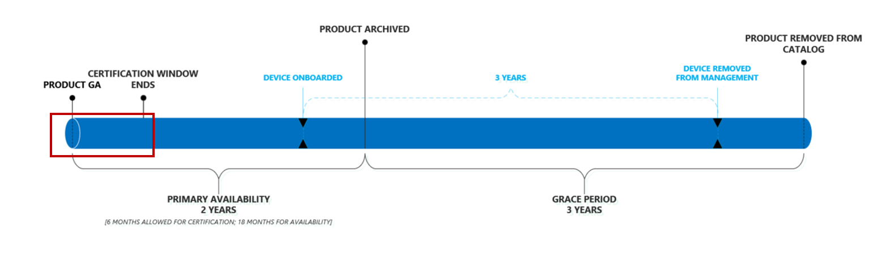

# Microsoft Managed Desktop-productlevenscyclusMicrosoft Managed Desktop product lifecycle

Microsoft Managed Desktop heeft voordelen voor eindgebruikers om ervoor te zorgen dat ze altijd apparaten gebruiken die de beste prestaties, betrouwbaarheid, ontwerp en beveiligingsmogelijkheden bieden (zoals ondersteuning voor functies zoals Windows Hello).Microsoft Managed Desktop benefits end users assuring that they always use devices that offer the best performance, reliability, design, and security capabilities (such as support for features like Windows Hello). Om dit te bereiken, onderhoudt Microsoft Managed Desktop een korte catalogus van continu [bijgewerkte goedgekeurde apparaten.](device-list.md)To accomplish this, Microsoft Managed Desktop maintains a short catalog of continuously updated [approved devices](device-list.md). 
 
In dit onderwerp wordt de levenscyclus van apparaten beschreven wanneer ze worden toegevoegd en verwijderd uit de goedgekeurde catalogus.This topic details the lifecycle of devices as they are added and removed from the approved catalog. 

> [!NOTE]
> In dit onderwerp maken we een onderscheid tussen een "apparaat" en een 'product'.In this topic, we'll make a distinction between a "device" and a "product." Met "apparaat" bedoelen we één individuele, specifieke computer.By "device," we mean one individual, specific computer. Bijvoorbeeld, "Serienummer 1234", "Bill's laptop", "Shared VM XYZ" verwijzen naar specifieke apparaten.For example, "Serial number 1234", "Bill's laptop", "Shared VM XYZ" refer to specific devices. Een "product" verwijst echter naar een verzameling of een familie van apparaten.A "product", however, refers to a collection or family of devices. Bijvoorbeeld "Fabrikam Laptop", "Adatum ZX450 Laptop", enz. Dit is belangrijk omdat producten worden toegevoegd aan onze [goedgekeurde lijst](device-list.md)of catalogus, en apparaten worden ingeschreven bij Microsoft Managed Desktop.For example, "Fabrikam Laptop", "Adatum ZX450 Laptop", etc. This is important because products are added to our [approved list](device-list.md), or catalog, and devices are what get enrolled into Microsoft Managed Desktop.

## ProductlevenscyclusProduct lifecycle

 Over het algemeen doorlopen producten deze levenscyclusfasen:Generally, products move through these lifecycle phases:

- [Productrelease en -evaluatieProduct release and evaluation](#product-release-and-evaluation)
- [Primaire beschikbaarheidsperiode voor productenProduct primary availability period](#product-primary-availability-period)
- [Product respijtperiodeProduct grace period](#product-grace-period)
- [ProductpensioenProduct retirement](#product-retirement)

Deze illustratie toont de gehele volgorde:This illustration shows the entire sequence:

Producten blijven maximaal 24 maanden in de catalogus staan, maar <em>apparaten</em> blijven 3 jaar onder beheer op basis van hun individuele inschrijvingsdatums.Products remain on the catalog for up to 24 months, but <em>devices</em> remain under management for 3 years based on their individual enrollment dates. Effectief, elk product heeft drie belangrijke data, maar elk apparaat heeft slechts een.Effectively, each product has three important dates, but each device has only one. Voor producten worden alle drie deze data berekend op basis van de <em>goedkeuringsdatum,</em>en daarom publiceren we deze data na goedkeuring, zodat u altijd vooruit kijken en de gehele levenscyclus van het product op de juiste manier plannen.For products, all three of these dates are calculated based on the <em>approval date</em>, and therefore we publish these dates upon approval so that you can always look ahead and plan appropriately for the product's entire lifecycle.

In deze tabel worden voorbeelddata voor een theoretisch product weergegeven:This table shows example dates for a theoretical product:

|ProductProduct  |Goedgekeurde datumApproved date  |Einde van de primaire beschikbaarheidEnd of primary availability  |Einde van de subsidiabiliteitEnd of eligibility  |
|---------|---------|---------|---------|
|Fabrikam LaptopFabrikam Laptop    | 1/1/20171/1/2017 | 6/1/20196/1/2019 | 6/1/20226/1/2022 |
|Adatum-laptopAdatum Laptop   | 1/1/20181/1/2018 | 6/1/20206/1/2020 | 6/1/20236/1/2023  |

In deze tabel worden voorbeelddata voor theoretische *apparaten weergegeven:*This table shows example dates for theoretical *devices*:

|Apparaat-idDevice ID  |InschrijvingsdatumEnrollment date  |PensioendatumRetirement date  |
|---------|---------|---------|
|Laptop #123412Laptop #123412     |  2/3/20182/3/2018       |  2/3/20212/3/2021       |
|#321513Desktop #321513     | 6/2/20186/2/2018        |  6/2/20216/2/2021       |

## Productrelease en -evaluatieProduct release and evaluation

De levenscyclus van het product begint wanneer een fabrikant het product openbaar uitbrengt:The product lifecycle starts when a manufacturer publicly releases the product:

Tijdens deze fase doet het Microsoft Managed Desktop engineering team hun evaluatie en certificering van een product.During this stage, the Microsoft Managed Desktop engineering team does their evaluation and certification of a product. Het team evalueert onder andere zaken als betrouwbaarheid en prestaties met Windows, naleving van een hardwarebasislijn, marktsentiment en voorraad- en kanaalbereidheid.The team evaluates things like reliability and performance with Windows, compliance with a hardware baseline, market sentiment, and inventory and channel readiness, among other things. Dit proces duurt meestal ongeveer 6 weken.This process typically takes approximately 6 weeks.
  
Microsoft Managed Desktop evalueert apparaten alleen voor certificering binnen de eerste zes maanden van beschikbaarheid.Microsoft Managed Desktop will only evaluate devices for certification within their first 6 months of availability. Dit zorgt ervoor dat we onze inspanningen altijd richten op de nieuwste generatie hardware.This ensures that we're always focusing our efforts on the latest generation of hardware.
 
Aan het einde van deze fase voegt Microsoft Managed Desktop het product toe aan de [goedgekeurde lijst,](device-list.md)waardoor het product effectief wordt vrijgegeven voor klantinschrijvingen.At the end of this phase, Microsoft Managed Desktop adds the product to the [approved list](device-list.md), effectively releasing the product for customer enrollments. Ongeacht de datum waarop een apparaat is gecertificeerd, is de **goedgekeurde datum** gedateerd op de algemene beschikbaarheidsdatum van het product.Regardless of the date when a device is certified, its **approved date** is back-dated to the product's own general availability date. 

## Primaire beschikbaarheidsperiode voor productenProduct primary availability period

Deze periode is de kern van de beschikbaarheid van producten:This period is the core of product availability:

Elk apparaat dat tijdens deze periode is ingeschreven, ontvangt de volledige drie jaar ondersteuning van Microsoft Managed Desktop (zoals blijkt uit de blauwe tijdlijn).Any device enrolled during this period receives the full three years of support from Microsoft Managed Desktop (as shown by the blue timeline). Deze periode duurt tot een einddatum die is vastgesteld op 24 maanden vanaf de algemene beschikbaarheidsdatum.This period lasts until an end date set to 24 months from the general availability date.

U deze periode zien als effectief open inschrijving, dus om de waarde van Microsoft Managed Desktop te maximaliseren, moet u zich richten op uw inkoopmodellen en geselecteerde producten die binnen deze periode vallen.You can think of this period as effectively "open enrollment", so to maximize the value of Microsoft Managed Desktop, you should target your procurement models and selected products to fall within this period. Als klein voorbeeld moet een klant voorkomen dat een klant zich vestigt op een roll-outperiode van twee jaar met behulp van een product dat zich in de laatste maand van de primaire beschikbaarheid bevindt - de meeste van deze apparaten ontvangen niet de volledige drie jaar Microsoft Managed Desktop-beheer (zie [respijtperiode](#product-grace-period) voor meer informatie).As a small example, a customer should avoid settling on a two-year roll-out period using a product that is in its final month of primary availability – most of those devices will not receive the full three years of Microsoft Managed Desktop management (see [grace period](#product-grace-period) for more information).  

## Product respijtperiodeProduct grace period

De productspijtperiode is een periode van drie jaar na de primaire beschikbaarheid.The product grace period is a three-year period following primary availability. In deze fase u apparaten inschrijven die afkomstig zijn uit een ondersteunde productfamilie, maar nog steeds vasthouden aan de beloften van Microsoft Managed Desktop met betrekking tot moderne hardware- en apparaatprestaties.This phase allows you to enroll devices that are from a supported product family, but still hold firm to the promises of Microsoft Managed Desktop regarding modern hardware and device performance. Deze fase is ideaal voor klanten die inkoopbeslissingen hebben genomen voordat ze weten van Microsoft Managed Desktop.This phase is ideal for customers who have made procurement decisions before knowing about Microsoft Managed Desktop. 

Als u onlangs een aantal goedgekeurde apparaten hebt gekocht voordat u zich inschreef bij Microsoft Managed Desktop, u deze nog steeds inschrijven, maar u ontvangt geen volledige drie jaar beheer.If you've recently bought a number of approved devices prior to enrolling with Microsoft Managed Desktop, you can still enroll them, but you won't receive a full three years of management. In plaats daarvan zullen ze op de pensioendatum niet aan de eisen voldoen, ongeacht wanneer ze zijn ingeschreven.Instead, they'll fall out of compliance on the retirement date, regardless of when they were enrolled. Achter de schermen behandelt Microsoft Managed Desktop deze apparaten alsof ze zijn ingeschreven op de laatste dag van de primaire beschikbaarheid.Behind the scenes, Microsoft Managed Desktop will treat these devices as if they were enrolled on the last day of primary availability. In deze illustratie u dit scenario zien door op te merken dat zowel het blauwe als het groene apparaat op dezelfde dag eindigen, ondanks hun verschil van één jaar in inschrijving:In this illustration, you can see this scenario by noting that both the blue and green device end on the same day, despite their one-year difference in enrollment:

Het Fabrikam Laptop voorbeeld van de vorige tabel illustreert deze situatie:The Fabrikam Laptop example from the previous table illustrates this situation: 

|ProductProduct  |Goedgekeurde datumApproved date  |Einde van de primaire beschikbaarheidEnd of primary availability  |Einde van de subsidiabiliteitEnd of eligibility  |
|---------|---------|---------|---------|
|Fabrikam LaptopFabrikam Laptop    | 6/1/20176/1/2017 | 6/1/20196/1/2019 | 6/1/20226/1/2022 |

Als klant kun je Fabrikam Laptops helemaal inschrijven tot 6/1/2022 - maar ze worden allemaal behandeld alsof je ze hebt ingeschreven op 6/1/2019.As a customer, you can enroll Fabrikam Laptops all the way until 6/1/2022 – however they will all be treated as though you enrolled them on 6/1/2019. Als je op 6/1/2021 een Fabrikam Laptop inschrijft, krijg je maar één jaar management.If you enroll a Fabrikam Laptop on 6/1/2021 you'll only get one year of management. Met dit beleid u gedeeltelijke levenscyclusen extraheren uit producten die eerder werden ondersteund, in plaats van nieuwe apparaten voortijdig aan te schaffen.This policy allows you to extract partial lifecycles from products that were previously supported, rather than having to procure new devices prematurely. 

Ten slotte wordt het apparaat tijdens deze fase uit de [apparaatlijst](device-list.md) verwijderd en naar de [lijst met gearchiveerde apparaten](archived-device-list.md)verplaatst.Finally, during this phase the device is removed from the [device list](device-list.md) and moved to the [archived device list](archived-device-list.md).

## ProductpensioenProduct retirement

Productpensioen is de laatste fase van de levenscyclus.Product retirement is the final phase of the lifecycle. In deze fase kunnen geen nieuwe apparaten van dat producttype worden ingeschreven in Microsoft Managed Desktop en per definitie zijn alle bestaande apparaten nu buiten de toegestane termijn van drie jaar.In this phase, no new devices of that product type can be enrolled in Microsoft Managed Desktop and, by definition, all existing devices are now outside their allowed three-year term. Gedurende deze periode verwijdert Microsoft Managed Desktop het apparaat volledig uit de openbare lijst.During this time, Microsoft Managed Desktop will remove the device from the public list entirely. Het is ook tijdens deze fase waarin, als u nog geen vervangingen hebt aangeschaft, u verminderde services begint te zien terwijl Microsoft Managed Desktop begint te worden opgekort op de apparaten die niet aan de regels voldoen.It's also during this phase where, if you haven't already procured replacements, you'll start to see diminished services as Microsoft Managed Desktop starts to ramp down on the devices which are out of compliance. 

## Apparaten die niet aan de regels voldoenDevices that are out of compliance

Een apparaat is niet in overeenstemming wanneer het toegestane venster voor Microsoft Managed Desktop-beheer is verstreken.A device is out of compliance when its allowed window for Microsoft Managed Desktop management has elapsed. Dit gebeurt wanneer het apparaat drie jaar beheer heeft bereikt of wanneer dat producttype uit de apparaatcatalogus wordt verwijderd, ongeacht wat het eerst gebeurt.This occurs when the device has reached three years of management or when that product type is removed from the device catalog, whichever occurs first. U moet uw inkoopcycli altijd zodanig targeten dat nieuwe apparaten worden geïmplementeerd voordat de huidige apparaten niet meer voldoen.You should always target your procurement cycles such that new devices are deployed prior to current devices going out of compliance.

Het Microsoft Managed Desktop-team weet dat inkoopcycli lang zijn en gepland rond langlopende budgetten.The Microsoft Managed Desktop team knows that procurement cycles are long and planned around long-running budgets. Om ervoor te zorgen dat u altijd op de hoogte bent van de status van uw apparaatpopulatie, bieden we een [website](https://aka.ms/mmdportal) die elk apparaat onder beheer, de leeftijd en een status vermeldt die de naleving ervan aangeeft.To ensure that you're always aware of the state of your device population, we provide a [website](https://aka.ms/mmdportal) that lists every device under management, its age, and a status indicating its compliance. Dit betekent dat u altijd over de meest recente informatie beschikt over de leeftijd van het apparaat en het rapport gebruiken in elke inkoopplanningscyclus.This means you always have the latest information regarding device age and can use the report in any procurement planning cycle. 

