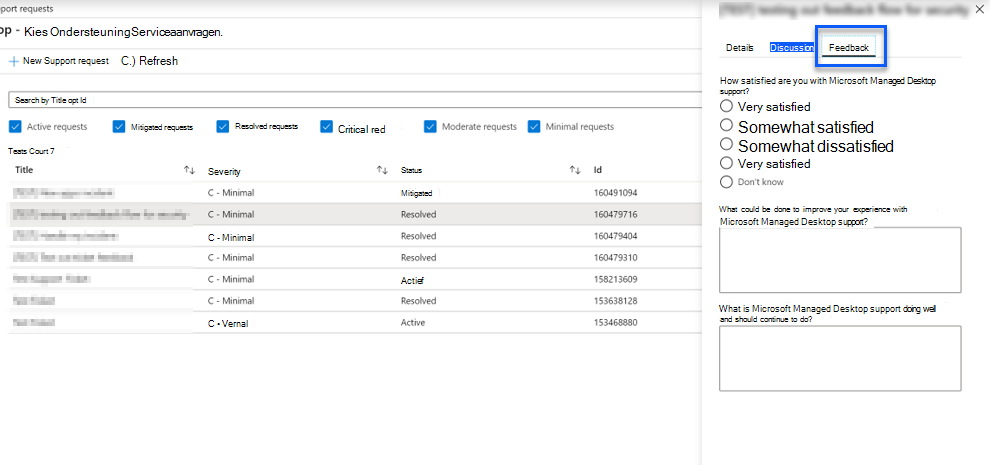

# Ondersteuning voor beheerders voor Microsoft Managed DesktopAdmin support for Microsoft Managed Desktop

U kunt ondersteunings tickets of feedback aanvragen indienen bij Microsoft via de beheer portal van Microsoft beheerde Pc's.You can submit support tickets or feedback requests to Microsoft using the Microsoft Managed Desktop Administrative Portal. Ondersteuningsverzoeken worden altijd met een prioriteit gewijzigd.Support requests are always prioritized over feedback submissions. Ondersteuningsaanvragen worden triaged en beheerd op basis van de ernst van de naam, zoals beschreven in de tabel met de [Ernst definitie](#sev).Support requests are triaged and managed according to severity as outlined in the [severity definition table](#sev). U ontvangt een beoordeling van de feedback, indien aangevraagd.Feedback is reviewed, and a response provided where requested. 

>[!IMPORTANT]
>Zorg ervoor dat u [een beheerders contact instelt](../get-started/add-admin-contacts.md) voor app-verpakking, apparaten, beveiliging en andere.Make sure that you [set up an Admin contact](../get-started/add-admin-contacts.md) for app packaging, devices, security, and other. U kunt geen Ondersteuningsverzoek indienen op een van deze gebieden als een beheerder contactpersoon niet is geconfigureerd.You are unable to submit a support request in any of these areas if an admin contact is not configured.

**Een ondersteuningsverzoek indienen****To submit a support request**
1. Meld u aan bij de [Portal van Microsoft beheerde bureaubladbeheer](https://aka.ms/mwaasportal).Sign in to [Microsoft Managed Desktop Admin portal](https://aka.ms/mwaasportal). 
2. Selecteer **+ nieuwe ondersteuningsticket**bij **ondersteuningsverzoeken**.On **Support requests**, select **+ New Support ticket**.
3. Selecteer het **type ondersteuningsaanvraag** dat overeenkomt met de Help die u nodig hebt.Select the **Support request type** that matches the help you need. De volgende tabel bevat een overzicht van de opties.The table below outlines the options. 
4. Selecteer het **niveau**van de ernst.Select the **Severity level**. Zie voor meer informatie de [definities van de ondersteuningsaanvragen](#sev).For more information, see [Support request severity definitions](#sev). 

Type ondersteuningsverzoekSupport request type | Wanneer gebruikenWhen to use
--- | ---
VoorvalIncident | U hebt het Microsoft beheerde bureaublad Operations-team nodig voor onderzoek, zoals een verbreide impact van een wijziging of beveiligingsincident.You require the Microsoft Managed Desktop Operations Team to investigate, like widespread impact of a change or security incident.
Aanvragen voor informatieRequest for information | U plant een wijziging voor netwerken, proxyconfiguraties, VPN-systemen, het verlopen van certificaten of slechts enkele informatie over de service.You are planning a change for networking, proxy configuration, VPN systems, certificate expiration, or just need some information about the service. Een antwoord van het Microsoft beheerde bureaublad operationeel team wordt ten zeerste aangeraden bij het communiceren van een wijziging binnen uw organisatie.A response from the Microsoft Managed Desktop Operations Team is strongly advised when communicating a change within your organization.
WijzigingsaanvraagChange request | U hebt het Microsoft beheerde bureaublad activiteiten team nodig om een wijziging aan te brengen, zoals het verplaatsen van apparaten tussen updategroepen.You require the Microsoft Managed Desktop Operations Team to make a change, such as moving devices between update groups.

## Ernst definities voor ondersteuning aanvragenSupport request severity definitions

De eerste antwoordtijd is de periode van wanneer u uw ondersteuningsaanvraag indient bij een Microsoft-beheerde bureaublad beheerder contactpersonen en begint te werken op uw ondersteuningsaanvraag.Initial response time is the period from when you submit your support request to when a Microsoft Managed Desktop engineer contacts you and starts working on your support request. Het eerste antwoord tijdstip verschilt per de bedrijfsimpact van de aanvraag, op basis van de ernst van de aanvraag.The initial response time varies with the business impact of the request, based on the severity of the request.

UrgentieniveauSeverity level  | Klant situatieCustomer situation |  Tijdstip van eerste antwoordInitial response time   | Verwachte klant antwoordExpected customer response
--- | --- | --- | ---
**Ernst A – belangrijke impact****Severity A – Critical Impact** |  **Belangrijke bedrijfsimpact****Critical business impact**  Het bedrijf van de klant heeft een aanzienlijk verlies of vermindering van de services en vereist onmiddellijk aandacht.Customer’s business has significant loss or degradation of services and requires immediate attention.  **Belangrijkste gevolgen voor de compatibiliteit van toepassingen****Major application compatibility impact**  Het hele bedrijf van de klant heeft financieel gevolgen vanwege vastlopen of verlies van kritieke functionaliteit.The customer’s entire business is experiencing financial impact due to crashing or loss of critical functionality | Aanvankelijk: < 1 uurInitial: < 1 hour Update: 60 minutenUpdate: 60 minutes 24x7 beschikbaar24x7 available | Wanneer u ernst A selecteert, controleert u of het probleem essentieel is voor bedrijfsimpact, met ernstig verlies en vermindering van de services.When you select Severity A, you confirm that the issue has critical business impact, with severe loss and degradation of services.   De uitgave vraagt een onmiddellijk antwoord en u legt voor voortdurende 24 uur elke dag samen met het Microsoft-team tot oplossing, anders kan Microsoft de ernst op niveau B verlagen.The issue demands an immediate response, and you commit to continuous 24x7 operation every day with the Microsoft team until resolution, otherwise, Microsoft may at its discretion decrease the Severity to level B.   U dient er ook voor te zorgen dat Microsoft uw accurate contactgegevens heeft.You also ensure that Microsoft has your accurate contact information. 
**Ernst B – gemiddelde impact****Severity B – Moderate Impact** |  **Impact van het bedrijf****Moderate business impact**  Het bedrijf van de klant heeft een slecht verlies of vermindering van de services, maar het is mogelijk dat het werk redelijkerwijs verder gaat.Customer’s business has moderate loss or degradation of services, but work can reasonably continue in an impaired manner.  **Nadelige gevolgen voor compatibiliteit van toepassingen****Moderate application compatibility impact**  Een specifieke bedrijfsgroep is niet langer productief, vanwege vastlopen van gedrag of verlies van kritieke functionaliteit.A specific business group is no longer productive, due to crashing behavior or loss of critical functionality. |  Aanvankelijk: < 4 uurInitial: < 4 hours Update: 12 uurUpdate: 12 hours Kantooruren (24x7 beschikbaar)Business hours (24x7 available) | Wanneer u severe Select selecteert, bevestigt u dat het probleem gevolgen heeft voor uw bedrijf met verlies en vermindering van de services, maar tijdelijke oplossingen bieden een redelijke, alsof tijdelijke, bedrijfscontinuïteit.When you select Severity B, you confirm that the issue has moderate impact to your business with loss and degradation of services, but workarounds enable reasonable, albeit temporary, business continuity.   Het probleem vraagt een urgent antwoord.The issue demands an urgent response. Als u bij het aangaan van de ondersteuningsaanvraag bij het indienen van het ondersteuningsverzoek bij een aanvraag een aanvraag voor ondersteuning hebt ingediend, moet u de ernst van Microsoft wellicht op de gewenste manier verkleinen tot niveau C. Als u de ondersteuning voor business-hours hebt gekozen bij het indienen van een foutmelding, wordt u in Microsoft alleen tijdens kantooruren contact met u opgenomen.If you chose 24x7 when you submit the support request, you commit to a continuous 24x7 operation every day with the Microsoft team until resolution, otherwise, Microsoft might at its discretion decrease the severity to level C. If you chose business-hours support when you submit a Severity B incident, Microsoft will contact you during business hours only.  U dient er ook voor te zorgen dat Microsoft uw accurate contactgegevens heeft.You also ensure that Microsoft has your accurate contact information.
**Ernst C – minimale impact****Severity C – Minimal Impact** |   **Minimale zakelijke impact****Minimum business impact**   Het bedrijf van de klant werkt met kleine belemmeringen van services.Customer’s business is functioning with minor impediments of services.  **Secundaire gevolgen voor compatibiliteit van toepassingen****Minor application compatibility impact**  Potentiële niet-gerelateerde gebruikers bieden beperkte compatibiliteitsproblemen die geen productiviteit kunnen voorkomenPotentially unrelated users experience minor compatibility issues that do not prevent productivity |    Aanvankelijk: < acht uurInitial: < 8 hours Update: 24 uurUpdate: 24 hours KantoorurenBusiness hours  | Wanneer u severe C selecteert, controleert u of het probleem minstens gevolgen heeft voor uw bedrijf met een kleine beletsel van de service.When you select Severity C, you confirm that the issue has minimum impact to your business with minor impediment of service.  Voor een severe C-incident zal Microsoft alleen tijdens kantooruren contact met u opnemen.For a Severity C incident, Microsoft will contact you during business hours only.  U dient er ook voor te zorgen dat Microsoft uw accurate contactgegevens heeftYou also ensure that Microsoft has your accurate contact information

Aanvullende informatie:Additional details:
- **Ondersteunings talen** – alle ondersteuning wordt in het Engels geboden.**Support languages** - All support is provided in English.
- **Wijzigingen van Ernstniveau** -Microsoft kan het niveau van de ernst verlagen als de klant geen voldoende bronnen of antwoorden kan bieden om Microsoft te laten doorgaan met het oplossen van problemen.**Severity level changes** - Microsoft may downgrade the severity level if the customer is not able to provide adequate resources or responses to enable Microsoft to continue with problem resolution efforts. 
- **Kantooruren** : voor de meeste landen zijn kantooruren van 9:00 5:00 tot uur, Pacific Standard Time.**Business hours** - For most countries, business hours are from 9:00 AM to 5:00 PM, Pacific Standard Time.
- **Compatibiliteit van toepassingen** : voor een compatibiliteitsprobleem met toepassingen die moet worden overwogen, moet er een reproductieve fout bestaan, van dezelfde versie van de toepassing, tussen de eerdere en huidige versie van Windows of Office.**Application compatibility** - For an application compatibility issue to be considered, there must be a reproduceable error, of the same version of the application, between the previous and current version of Windows or Office. Voor het oplossen van problemen met de compatibiliteit van toepassingen is voor Microsoft een klant contactpunt vereist.To resolve application compatibility issues, Microsoft requires a customer point of contact to work with. De persoon moet rechtstreeks samenwerken met het team van Fast track om dit probleem te onderzoeken en op te lossen.The individual must work directly with our Fast Track team to investigate and resolve the issue.
- **Antwoordtijd klant** Als een klant niet aan de verwachte antwoord vereisten voldoet, vervaagt Microsoft de aanvraag op basis van één niveau naar het laagste niveau C. Als een klant niet reageert op aanvragen voor een actie, wordt door Microsoft het ondersteuningsverzoek binnen 48 uur na de laatste aanvraag beperkt en gesloten.**Customer response time** If a customer is unable to meet the expected response requirements, Microsoft will downgrade the request by one severity level, to a minimum of Severity C. If a customer is unresponsive to requests for action, Microsoft will mitigate and close the support request within 48 hours of the last request.

## Feedback gevenProvide feedback

We stellen uw feedback op prijs en gebruiken om de ondersteuningservaring van beheerders te verbeteren.We appreciate your feedback and use it to improve the admin support experience.

Wanneer een ticket in de **Beperkde** of **opgeloste** status heeft, kunt u uw feedback over uw ervaringen delen met dat bepaalde probleem.Once a ticket is in the **Mitigated** or **Resolved** state, you can share your feedback on your experience with that particular issue. Ga hiervoor naar de pagina **ondersteuningsaanvragen** in de beheerportal.To do this, go to the **Support requests** page in the Admin portal. Selecteer het specifiek ticket.Select the specific ticket. Selecteer het tabblad **feedback** in de vlucht aan dat aan de rechterkant wordt weergegeven en geef de gevraagde informatie op.In the fly-in that appears on the right side, select the **Feedback** tab, and provide the requested information. Wees voorzichtig met het toevoegen van persoonlijke informatie in het feedbackformulier.Be careful not to include any personal information in the feedback form. Zie voor meer informatie over privacy de privacyverklaring van [Microsoft](https://privacy.microsoft.com/privacystatement).For more information about privacy, see the [Microsoft Privacy Statement](https://privacy.microsoft.com/privacystatement).

## Overige informatiebronnenAdditional resources
- [Gebruikers ondersteuning voor Microsoft Managed Desktop](end-user-support.md).[User support for Microsoft Managed Desktop](end-user-support.md). 
- [Ondersteuning voor Microsoft Managed Desktop](../service-description/support.md).[Support for Microsoft Managed Desktop](../service-description/support.md). 
- Als u al een abonnement hebt op Microsoft Managed Desktop, vindt u in de sectie **online bronnen** van de Microsoft-beheer [Portal beheerde](https://aka.ms/mwaasportal)bureaublad beheerder gedetailleerde procedures, proces stromen, werkinstructies en veelgestelde vragen.If you already subscribe to Microsoft Managed Desktop, you can find detailed procedures, process flows, work instructions, and FAQs in the Microsoft Managed Desktop Admin Guide in the **Online resources** section of the [Microsoft Managed Desktop Admin Portal](https://aka.ms/mwaasportal).
