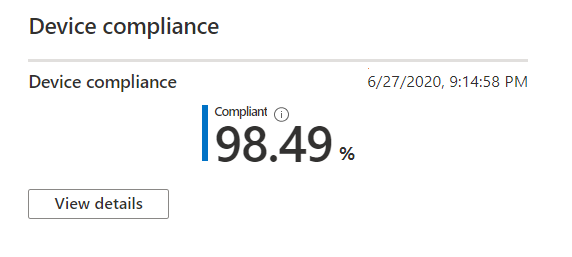

# Rapport over apparaatcompatibiliteitDevice compliance report

In deze weergave ziet u het percentage van uw door Microsoft beheerde bureaublad apparaten dat voldoet aan nalevings beleidsregels die zijn ingesteld in Microsoft intune.This view shows the percentage of your Microsoft Managed Desktop devices that conform to compliance policies set in Microsoft Intune.

Selecteer **Details weergeven** om specifieke informatie weer te geven voor alle door Microsoft beheerde bureaublad apparaten of alleen apparaten die niet voldoen aan nalevingsbeleid.Select **View details** to view specific information for either all of your Microsoft Managed Desktop devices or only devices that do not conform to compliance policies. Gebruik de vervolgkeuzelijst om te schakelen tussen deze weergaven.Use the pulldown menu to switch between these views. Als u in deze weergave wilt weergeven, moet een apparaat een fysieke computer zijn en met intune in de afgelopen 30 dagen zijn gesynchroniseerd.To appear in this view, a device must be a physical machine and have synced with Intune in the last 30 days.

Selecteer in deze weergave de optie **volledige gegevens downloaden** als u een bestand met door komma's gescheiden waarden wilt exporteren met dezelfde informatie.From this view, select **Download full data** to export a comma-delimited file with the same information. In het exportbestand worden de gebieden weergegeven als **schema** weergegeven als kolommen.In the export file, the areas displayed as **Schema** appear as columns.