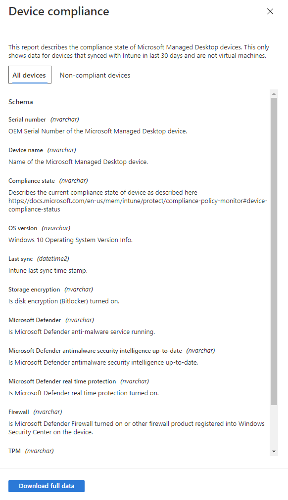

# Rapport over apparaatcompatibiliteit

In deze weergave ziet u het percentage van uw door Microsoft beheerde bureaublad apparaten dat voldoet aan nalevings beleidsregels die zijn ingesteld in Microsoft intune.

Selecteer **Details weergeven** om specifieke informatie weer te geven voor alle door Microsoft beheerde bureaublad apparaten of alleen apparaten die niet voldoen aan nalevingsbeleid. Gebruik de vervolgkeuzelijst om te schakelen tussen deze weergaven. Als u in deze weergave wilt weergeven, moet een apparaat een fysieke computer zijn en met intune in de afgelopen 30 dagen zijn gesynchroniseerd.

Selecteer in deze weergave de optie **volledige gegevens downloaden** als u een bestand met door komma's gescheiden waarden wilt exporteren met dezelfde informatie. In het exportbestand worden de gebieden weergegeven als **schema** weergegeven als kolommen.