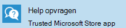

# Hulp aanvragen voor gebruikersGetting help for users

Er zijn twee manieren waarop gebruikers in uw organisatie hulp kunnen krijgen bij hun Microsoft-beheerde bureaublad apparaten: Help-app of telefoon ondersteuning **vragen** .There are two ways that users in your organization can get help with their Microsoft Managed Desktop devices: **Get Help** app, or phone support. Beide ondersteuningsopties zijn beschikbaar voor gebruikers 24 uur per dag, 7 dagen per week.Both of these support options are available to users 24 hours a day, 7 days a week.
 
>[!NOTE]
>Deze ondersteuningsopties zijn niet beschikbaar voor apparaten in de groep testen.These support options are not available for devices in the Test group.

## Help-appGet Help app

De voorkeursmethode voor het bieden van ondersteuning voor uw gebruikers is **hulp**, een gebruiksvriendelijke interface die in het gebruikersapparaat is ingebouwd.The preferred method for providing support to your users is **Get Help**, an easy-to-use interface built into the user device.  

U kunt Help opvragen: een toepassing die op alle door Microsoft beheerde bureaublad apparaten is geïnstalleerd en is vastgemaakt aan de taakbalk.Get Help is an application that’s installed on all Microsoft Managed Desktop devices and is pinned to the task bar. 

- Gebruikers kunnen een terugbeloproep aanvragen op een meegeleverd telefoonnummer of online chatten met een service rep.Users can request a callback to a provided phone number, or chat online with a service rep.
- Aanvragen die buiten het Microsoft beheerde bureaublad ondersteunings bereik vallen, worden doorgestuurd naar de plaatselijke IT-helpdesk via een telefoongesprek.Requests that fall outside of Microsoft Managed Desktop support scope are redirected to the local IT helpdesk via phone call.

> [!NOTE]
> De weergavetaal voor de app Help opvragen is alleen beschikbaar in het Engels, zelfs als een gebruiker een andere taal heeft geselecteerd bij het instellen van hun apparaat of in de apparaatinstellingen.The display language for the Get Help app is English only, even if a user has selected a different language when setting up their device or in device settings. 

### VereistenPrerequisites
Als u wilt dat gebruikers hulp kunnen krijgen via de app, controleert u of aan de volgende vereisten wordt voldaan:For your users to be able to get help through the app, make sure these prerequisites are met:

- U moet het apparaat registreren bij Microsoft Managed Desktop met behulp van een van de methoden in [Microsoft beheerde bureaublad apparaten instellen](../get-started/set-up-devices.md), zoals [nieuwe apparaten zelf registreren](../get-started/register-devices-self.md).The device must be registered with Microsoft Managed Desktop using one of the methods in [Set up Microsoft Managed Desktop devices](../get-started/set-up-devices.md), such as [Register new devices yourself](../get-started/register-devices-self.md).
- De weergavetaal voor het apparaat moet worden ingesteld op een van de volgende landinstellingen: en-US en-nl, en-au, en-NZ, en-ca.The display language for the device must be set to any of these English-language locales: en-us, en-gb, en-au, en-nz, or en-ca.
- De Help-app voor vragen moet up-to-date zijn.The Get Help app should be up to date. Om de status ervan te bevestigen, controleert u of er updates zijn voor apps in de Microsoft Store.To confirm its status, check for app updates in the Microsoft Store.
- Bepaalde [eindpunten](../get-ready/network.md#endpoints-allowed-that-are-necessary-for-microsoft-managed-desktop) moeten toegankelijk zijn op het apparaat.Certain [endpoints](../get-ready/network.md#endpoints-allowed-that-are-necessary-for-microsoft-managed-desktop) must be accessible from the device.

> [!NOTE]
> Het kan een uur duren voordat een apparaat is geïmplementeerd in de volledige functie van de app voor het opvragen van de Help.The Get Help app can take up to one hour after a device is deployed to fully function.

Als u deze vereisten hebt gecontroleerd en de app voor het opvragen van hulp niet werkt, moet u als IT-beheerder een [ondersteuningsverzoek](admin-support.md)indienen.If you've checked these prerequisites and the Get Help app still isn't working, you as an IT admin should file a [support request](admin-support.md).

## Telefonische ondersteuningPhone support

Gebruikers met beheerde bureaublad apparaten van Microsoft hebben ook toegang tot gratis telefoonnummers waarop ze kunnen bellen.Users with Microsoft Managed Desktop devices also have access to toll-free phone numbers they can call. De nummers zijn bedoeld om te worden gebruikt wanneer u hulp nodig hebt.The numbers are meant to be used when Get Help isn’t available. Bijvoorbeeld: als ze zich niet kunnen aanmelden bij het apparaat of het apparaat is verbroken.For example, if they can’t sign in to the device, or the device is broken. Dit zijn de telefoonnummers voor telefonische ondersteuning:Here are the phone numbers for phone support:

- Verenigde Staten: + 1 855 425 0216United States: +1 855 425 0216
- Canada (met uitzondering van Quebec): + 1 855 425 0216Canada (excluding Quebec): +1 855 425 0216
- Verenigd Koninkrijk: + 44 800 026 0698United Kingdom: +44 800 026 0698
- België: + 32 800 58533Belgium: +32 800 58533
- Luxemburg: + 352 800 40119Luxembourg: +352 800 40119
- Australië: + 61 180 037 0619Australia: +61 180 037 0619
- Nieuw-Zeeland: + 64 988 44380New Zealand: +64 988 44380
- Zweden: + 46 20 120 3554Sweden: +46 20 120 3554
- Noorwegen: + 47 800 62584Norway: +47 800 62584
- IJsland: + 354 800 9006Iceland: +354 800 9006
- Ierland: + 353 1 800 832272Ireland: +353 1 800 832272
- Denemarken: + 45 80 40 04 01Denmark: +45 80 40 04 01
- Finland: + 358 800 525088Finland: +358 800 525088

>[!NOTE]
>U moet uw e-mailadres voor uw organisatie bij de hand hebben wanneer u belt om uw identiteit te verifiëren.You'll need to have your organizational email address ready when you call to verify your identity. 

## Meer informatieMore resources
- [Beheerders ondersteuning voor Microsoft Managed Desktop](admin-support.md).[Admin support for Microsoft Managed Desktop](admin-support.md). 
- [Ondersteuning voor Microsoft Managed Desktop](../service-description/support.md).[Support for Microsoft Managed Desktop](../service-description/support.md).
- Als u al een abonnement hebt op Microsoft Managed Desktop, vindt u in de Microsoft Managed Desktop-beheerdershandleiding in de **online bronnen** onder de sectie Microsoft Managed Desktop van het menu **Tenant** beheer in [Microsoft Endpoint Manager](https://endpoint.microsoft.com/).If you already subscribe to Microsoft Managed Desktop, you can find detailed procedures, process flows, work instructions, and FAQs in the Microsoft Managed Desktop Admin Guide in the **Online resources** under the Microsoft Managed Desktop section of the **Tenant administration** menu in [Microsoft Endpoint Manager](https://endpoint.microsoft.com/).
