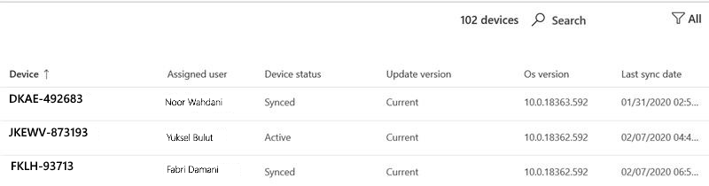

# Inzichten in Windows-beveiligingsupdatesWindows security update insights
Deze weergave bevat een overzicht van de status van beveiligingsupdates voor uw Microsoft Managed Desktop apparaten.This view provides an overview of the status of security updates for your Microsoft Managed Desktop devices. 

Als u gebruiksgegevens wilt weergeven, selecteert <strong>u Windows tabblad Beveiligingsupdates.</strong>To view usage data, select the <strong>Windows security updates</strong> tab.

## ApparaatstatusDevice status

Als apparaten worden bijgewerkt door Windows Update, moeten ze zijn verbonden met internet en niet gedurende minimaal zes uur in de slaapstand blijven staan, waarvan er twee doorlopend moeten zijn.For devices to be updated by Windows Update, they must be connected to the Internet and not hibernating for a minimum of six hours, two of which must be continuous. Hoewel het mogelijk is dat een apparaat dat niet aan deze vereisten voldoet, wordt bijgewerkt, hebben apparaten die aan deze apparaten voldoen de grootste kans dat ze worden bijgewerkt.Although it's possible that a device that doesn't meet these requirements will be updated, devices that meet them have the highest likelihood of being updated. 

We categoriseren apparaatactiviteit in de context van Windows Bijwerken met de volgende voorwaarden:We categorize device activity in the context of Windows Update with these terms:

- <strong>Actief:</strong> Apparaten die voldoen aan de minimumactiviteitscriteria (zes uur, twee doorlopend) voor de meest recente release van beveiligingsupdates en die zich ten minste om de vijf dagen met Microsoft Intune hebben ingecheckt<strong>Active:</strong> Devices that have met the minimum activity criteria (six hours, two continuous) for the most recent security update release and have checked in with Microsoft Intune at least every five days
- <strong>Gesynchroniseerd:</strong> Apparaten die in de afgelopen 28 dagen met Intune zijn ingecheckt<strong>Synced:</strong> Devices that have checked in with Intune within the last 28 days
- <strong>Niet gesynchroniseerd:</strong> Apparaten die de <i>afgelopen</i> 28 dagen niet zijn ingecheckt met Intune<strong>Out of sync:</strong> Devices that have <i>not</i> checked in with Intune in the last 28 days

## Versiestatus bijwerkenUpdate version status

Microsoft brengt elke tweede dinsdag van de maand beveiligingsupdates uit.Microsoft releases security updates every second Tuesday of the month. Elke release voegt belangrijke updates toe voor bekende beveiligingsproblemen.Each release adds important updates for known security vulnerabilities. Microsoft Managed Desktop zorgt ervoor dat 95% van de beheerde apparaten elke maand wordt bijgewerkt met de meest recente beveiligingsupdate.Microsoft Managed Desktop ensures that 95% of its managed devices are updated with the latest available security update every month. Beveiligingsupdates worden soms op andere momenten uitgebracht om nieuwe bedreigingen dringend aan te pakken.Security updates are sometimes released at other times to urgently address new threats. Microsoft Managed Desktop worden deze updates op een vergelijkbare manier geïmplementeerd.Microsoft Managed Desktop deploys these updates in a similar fashion.

We categoriseren de status van beveiligingsupdateversies met de volgende voorwaarden:We categorize the status of security update versions with these terms:

- <strong>Huidige:</strong> Apparaten met de update die in de huidige maand is uitgebracht<strong>Current:</strong> Devices that are running the update released in the current month
- <strong>Vorige:</strong> Apparaten met de update die in de vorige maand is uitgebracht<strong>Previous:</strong> Devices running the update that was released in the previous month
- <strong>Ouder:</strong> Apparaten met een beveiligingsupdate die vóór de vorige maand is uitgebracht<strong>Older:</strong> Devices running any security update released prior to the previous month

U ziet weinig apparaten <strong></strong> in de categorie Ouder. Een grote of groeiende populatie geeft waarschijnlijk een systeemprobleem aan dat u moet rapporteren aan Microsoft Managed Desktop zodat we dit kunnen onderzoeken.You should see few devices in the <strong>Older</strong> category--a large or growing population probably indicates a systemic problem that you should report to Microsoft Managed Desktop so we can investigate.

## Implementatie-voortgangDeployment progress

Aan het begin van elke releasecyclus voor beveiligingsupdates maakt Microsoft Managed Desktop momentopname van de apparaatpopulatie en stelt u het implementatiedoel in op 95% van die populatie.At the beginning of each security update release cycle, Microsoft Managed Desktop takes a snapshot of the device population and sets its deployment target at 95% of that population. Het <strong>gebied Implementatie-voortgang</strong> toont een historische trend die dagelijks wordt bijgewerkt en die bij houdt hoe nauw de update-implementatie aan dit doel voor elke release voldoet.The <strong>Deployment progress</strong> area shows a historical trend, updated daily, tracking how closely the update deployment meets this target for each release. In deze grafiek ziet u alleen apparaten met de actieve status.This graph only shows devices with Active status.

U kunt deze gegevens voor eerdere updatecyclussen bekijken met behulp van de vervolgkeuzelijst in de rechterbovenhoek.You can view this data for previous update cycles by using the dropdown menu in the upper right. De periode die u in dit menu selecteert, is van toepassing op alle informatie op de hele pagina.The period you select in this menu applies to all of the information on the whole page.

Het <strong>gebied Bijgewerkte actieve apparaten per</strong> implementatiegroep biedt een andere weergave door de voortgang van de update-installatie weer te geven voor elk van de Microsoft Managed Desktop implementatiegroepen.The <strong>Updated active devices by deployment group</strong> area offers a different view by showing the progress of the update installation for each of the Microsoft Managed Desktop deployment groups.

In <strong>het doelgebied</strong> Dagen wordt weergegeven hoe lang het duurde voordat 95% van het totale aantal apparaten werd bijgewerkt met de huidige beveiligingsupdate.The <strong>Days to reach target</strong> area displays how long it took for 95% of the total number of devices to be updated with the current security update. Terwijl de implementatie aan de gang is, wordt in dit gebied <strong>Nog steeds</strong> bijgewerkt weergegeven totdat het doel van 95% is bereikt voor de geselecteerde update.While deployment is underway, this area displays <strong>Still updating</strong> until the 95% target is reached for the selected update.

## Gebied met apparaatdetailsDevice details area

De onderkant van het dashboard is een tabel met gedetailleerde informatie voor uw apparaten, waaronder de [apparaatstatus](#device-status) en de [versiestatus Bijwerken.](#update-version-status)The bottom of the dashboard is a table showing detailed information for your devices, including the [Device status](#device-status) and the [Update version status](#update-version-status). U kunt in deze lijst zoeken of filteren op elke weergegeven waarde.You can search this list or filter it by any listed value.

