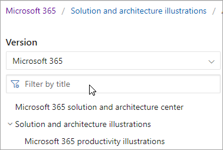
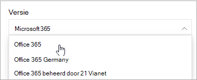
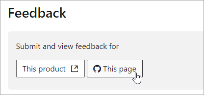

# Navigatiehandleiding voor Microsoft 365-documenten

Dit onderwerp bevat enkele tips en trucs voor het navigeren door de technische documentatieruimte van Microsoft 365.  

## Hubpagina

De microsoft 365-hubpagina vindt u op en is het toegangspunt voor het vinden van [https://aka.ms/microsoft365docs](./index.yml) relevante Microsoft 365-inhoud.

U kunt altijd teruggaan naar deze pagina door **Microsoft 365** te selecteren in de koptekst boven aan elke pagina in de technische documentatieset van Microsoft 365:

## Offlinedocumentatie

Als u de Microsoft 365-documentatie op een offlinesysteem wilt bekijken, kunt u een PDF-bestand maken waar u zich ook in de technische documentatie van Microsoft 365 kunt vinden.

Als u een PDF-bestand wilt maken, selecteert u de koppeling **PDF downloaden** onder aan elke inhoudsopgave.

## TOC-zoekopdracht 
Op docs.microsoft.com kunt u de inhoud in de inhoudsopgave doorzoeken met behulp van het zoekvak filter bovenaan:

## Versiefilter
De technische documentatie van Microsoft 365 bevat inhoud voor aanvullende producten, waaronder Office 365 Germany en Office 365 beheerd door 21 Vianet (China). Functies kunnen variëren tussen deze versies, en als zodanig kan de inhoud zelf soms variëren.

U kunt het versiefilter gebruiken om ervoor te zorgen dat u inhoud ziet voor de juiste versie van Microsoft 365:

## Breadcrumbs

Breadcrumbs vindt u onder de koptekst en boven de inhoudsopgave en geeft aan waar het huidige artikel zich in de inhoudsopgave bevindt.  Hiermee kunt u niet alleen de context instellen op het type inhoud dat u leest, maar kunt u ook een back-up maken van de inhoudsopgavestructuur:

## Artikelsectienavigatie

In het rechternavigatiedeelvenster kunt u snel naar secties in een artikel navigeren en uw locatie in het artikel identificeren.  

## Feedback over documenten verzenden

Als er iets mis is in een artikel, kunt u feedback sturen naar het SQL Content-team voor dat artikel door omlaag te schuiven naar de onderkant van de pagina en Feedback over inhoud **te selecteren.**

## Bijdragen aan Microsoft 365-documentatie

Wist u dat u de inhoud op uw docs.microsoft.com bewerken? Als u dit doet, wordt onze documentatie niet alleen verbeterd, maar wordt u ook gecrediteerd als bijdrager aan de pagina. Zie het volgende om aan de slag te gaan:

- [Inzenderhandleiding voor Microsoft Docs](/contribute/)

## Volgende stappen

- Aan de slag met de [technische documentatie van Microsoft 365.](index.yml)