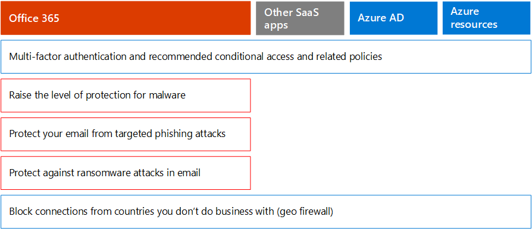

# Microsoft 365 Besluitvormers voor beveiliging voor bedrijven (BDM's)

In dit artikel worden enkele van de meest voorkomende bedreigings- en aanvalsscenario's beschreven die organisaties momenteel voor hun Microsoft 365-omgevingen hebben, en worden aanbevolen acties om deze risico's te beperken. Hoewel Microsoft 365 wordt geleverd met een breed scala aan vooraf geconfigureerde beveiligingsfuncties, moet u als klant ook de verantwoordelijkheid nemen om uw eigen identiteiten, gegevens en apparaten te beveiligen die worden gebruikt voor toegang tot cloudservices. Deze richtlijnen zijn ontwikkeld door Kozeta Beam (Microsoft Cloud Security Architect) en Thiagaraj Sundararajan (Microsoft Senior Consultant).

Dit artikel wordt georganiseerd op basis van de prioriteit van het werk, te beginnen met het beveiligen van de accounts die worden gebruikt voor het beheren van de meest kritieke services en activa, zoals uw tenant, e-mail en SharePoint. Het biedt een methodische manier om de beveiliging te benaderen en werkt samen met de volgende spreadsheet, zodat u uw voortgang kunt bijhouden met belanghebbenden en teams in uw organisatie: Microsoft 365 beveiliging voor [BDMs-spreadsheet.](https://github.com/MicrosoftDocs/microsoft-365-docs/raw/public/microsoft-365/downloads/Microsoft-365-BDM-security-recommendations-spreadsheet.xlsx) 

Microsoft biedt u het hulpprogramma Secure Score binnen uw tenant om uw beveiligingsbeleid automatisch te analyseren op basis van uw normale activiteiten, een score toe te wijzen en aanbevelingen voor beveiligingsverbetering te geven. Voordat u de acties ondernomen die in dit artikel worden aanbevolen, noteert u uw huidige score en aanbevelingen. De acties die in dit artikel worden aanbevolen, verhogen de score. Het doel is niet om de maximale score te behalen, maar om rekening te houden met de mogelijkheden om uw omgeving te beschermen op een manier die de productiviteit van uw gebruikers niet negatief beïnvloedt. Zie [Microsoft Secure Score](defender/microsoft-secure-score.md).

Nog één ding voordat we beginnen. . . zorg ervoor dat [u het auditlogboek in moet zetten.](../compliance/search-the-audit-log-in-security-and-compliance.md) U hebt deze gegevens later nodig, voor het geval u een incident of een inbreuk moet onderzoeken. 

## Bevoorrechte accounts beveiligen

Als eerste stap wordt u aangeraden ervoor te zorgen dat kritieke accounts in de omgeving een extra beveiligingslaag krijgen, omdat deze accounts toegang hebben en machtigingen hebben voor het beheren en wijzigen van kritieke services en resources, wat een negatieve invloed kan hebben op de hele organisatie, als deze in gevaar komen. Het beveiligen van geprivilegieerde accounts is een van de meest effectieve manieren om te beschermen tegen een aanvaller die de machtigingen van een gecompromitteerde account wil verheffen tot een beheeraccount. 

|Aanbeveling  |E3 |E5  |
|---------|---------|---------|
|Meervoudige verificatie (MFA) afdwingen voor alle beheeraccounts.||| 
|Implementeer Azure Active Directory (Azure AD) Privileged Identity Management (PIM) om just-in-time bevoorrechte toegang toe te passen op Azure AD- en Azure-resources. U kunt ook ontdekken wie toegang heeft en geprivilegieerde toegang controleren.|         | |
|Bevoorrecht toegangsbeheer implementeren voor het beheren van gedetailleerde toegangsbeheer over bevoorrechte beheertaken in Office 365. |         | |
|Configureer en gebruik Privileged Access Workstations (PAW) om services te beheren. Gebruik niet dezelfde werkstations voor surfen op internet en het controleren van e-mail die niet gerelateerd is aan uw beheeraccount.|  | | 

Het volgende diagram illustreert deze mogelijkheden.

Aanvullende aanbevelingen:
- Zorg ervoor dat accounts die worden gesynchroniseerd vanuit on-premises, geen beheerdersrollen voor cloudservices zijn toegewezen. Dit helpt voorkomen dat een aanvaller on-premises accounts kan toepassen om beheerderstoegang tot cloudservices te krijgen. 
- Zorg ervoor dat serviceaccounts geen beheerdersrollen zijn toegewezen. Deze accounts worden vaak niet gecontroleerd en ingesteld met wachtwoorden die niet verlopen. Zorg er eerst voor dat de AADConnect- en ADFS-servicesaccounts standaard geen globale beheerders zijn.
- Licenties verwijderen uit beheerdersaccounts. Tenzij er een specifieke use case is voor het toewijzen van licenties aan specifieke beheerdersaccounts, verwijdert u licenties van deze accounts. 

## Het oppervlak van de aanval verkleinen

Het volgende focusgebied is het verkleinen van het oppervlak van de aanval. Dit kan worden bereikt met minimale inspanning en invloed op uw gebruikers en services. Door het oppervlak van de aanval te verkleinen, hebben aanvallers minder manieren om een aanval op uw organisatie te starten.

Dit zijn enkele voorbeelden:
- Schakel POP3-, IMAP- en SMTP-protocollen uit. De meeste moderne organisaties gebruiken deze oudere protocollen niet meer. U kunt deze veilig uitschakelen en alleen uitzonderingen toestaan als dat nodig is. 
- Het aantal globale beheerders in de tenant beperken en tot het absolute minimum beperken. Hierdoor wordt het oppervlak van de aanval voor alle Cloud-toepassingen direct verkleind. 
- Schakel servers en toepassingen uit die niet meer worden gebruikt in uw omgeving. 
- Implementeert een proces voor het uitschakelen en verwijderen van accounts die niet meer worden gebruikt. 

## Beschermen tegen bekende bedreigingen

Bekende bedreigingen zijn malware, gekromde accounts en phishing. Sommige beveiligingen tegen deze bedreigingen kunnen snel worden geïmplementeerd zonder directe gevolgen voor uw gebruikers, terwijl anderen meer planning en training van gebruikers vereisen. 

|Aanbeveling  |E3  |E5  |
|---------|---------|---------|
|**Stel meervoudige verificatie in en gebruik aanbevolen beleid voor voorwaardelijke toegang, inclusief beleid voor aanmeldingsrisico's.** Microsoft adviseert en heeft een reeks beleidsregels getest die samenwerken om alle cloud-apps te beveiligen, Office 365 en Microsoft 365 services. Zie [Configuraties voor identiteits- en apparaattoegang.](./office-365-security/microsoft-365-policies-configurations.md) | ||
|**Meervoudige verificatie vereisen voor alle gebruikers.** Als u niet de vereiste licenties hebt om het aanbevolen beleid voor voorwaardelijke toegang te implementeren, moet u ten minste meervoudige verificatie voor alle gebruikers vereisen.|||
|**Verhhing het beschermingsniveau tegen malware in e-mail.** Uw Office 365 of Microsoft 365 bevat bescherming tegen malware, maar u kunt deze beveiliging vergroten door bijlagen te blokkeren met bestandstypen die vaak voor malware worden gebruikt.|||
|**Bescherm uw e-mail tegen gerichte phishingaanvallen.** Als u een of meer aangepaste domeinen hebt geconfigureerd voor uw Office 365 of Microsoft 365 omgeving, kunt u gerichte bescherming tegen phishing configureren. Anti-phishingbeveiliging, onderdeel van Defender voor Office 365, kan uw organisatie helpen beschermen tegen kwaadaardige phishingaanvallen op basis van imitaties en andere phishingaanvallen. Als u een aangepast domein niet hebt geconfigureerd, hoeft u dit niet te doen.| ||
|**Bescherm u tegen ransomware-aanvallen in e-mail.** Ransomware neemt de toegang tot uw gegevens weg door bestanden te versleutelen of computerschermen te vergrendelen. Vervolgens wordt geprobeerd geld af te persen van de slachtoffers door om 'los geld' te vragen, meestal in de vorm van cryptovaluta zoals Bitcoin, in ruil voor het retourneren van toegang tot uw gegevens. U kunt ransomware helpen beschermen door een of meer regels voor e-mailstroom te maken om bestandsextensies te blokkeren die vaak voor ransomware worden gebruikt, of om gebruikers te waarschuwen die deze bijlagen per e-mail ontvangen.|||
|**Blokkeer verbindingen uit landen waar u geen zaken mee doet.** Maak een Beleid voor voorwaardelijke toegang van Azure AD om verbindingen uit deze landen te blokkeren, waardoor er effectief een geofirewall rond uw tenant wordt gemaakt.| ||

Het volgende diagram illustreert deze mogelijkheden.

## Beschermen tegen onbekende bedreigingen

Nadat u extra beveiligingen hebt toegevoegd aan uw bevoorrechte accounts en u hebt beschermd tegen bekende aanvallen, verplaatst u uw aandacht naar beveiliging tegen onbekende bedreigingen. De meer bepaalde en geavanceerdere tegenstanders gebruiken innovatieve en nieuwe, onbekende methoden om organisaties aan te vallen. Met de uitgebreide telemetrie van Microsoft met gegevens die meer dan een miljard apparaten, toepassingen en services zijn verzameld, kunnen we Defender voor Office 365 uitvoeren op Windows, Office 365 en Azure om te voorkomen dat Zero-Day-aanvallen worden uitgevoerd, gebruik te maken van zandbakomgevingen en validiteit te controleren voordat u toegang tot uw inhoud toestaat. 

|Aanbeveling  |E3  |E5  |
|---------|---------|---------|
|**Microsoft Defender configureren voor Office 365:** * Safe bijlagen * Safe koppelingen * Microsoft Defender voor Eindpunt voor SharePoint, OneDrive en Microsoft Teams * Anti-phishing in Defender voor Office 365 beveiliging|         | |
|**Microsoft Defender configureren voor endpoint-mogelijkheden:** * Windows Defender Antivirus  * Bescherming tegen misbruik   * Surface Reduction attack   * Isolatie op basis van hardware  * Gecontroleerde maptoegang     |         | |
|**Gebruik Microsoft Cloud App Security** om SaaS-apps te ontdekken en gebruik te maken van gedragsanalyse en afwijkingsdetectie. |         | |

Het volgende diagram illustreert deze mogelijkheden.

Aanvullende aanbevelingen:
- Communicatie via partnerkanaal beveiligen, zoals E-mailberichten met TLS.
- Open Teams Federatie alleen voor Partners met wie u communiceert.
- Voeg geen afzenderdomeinen, afzonderlijke afzenders of bron-IP's toe aan uw allowlist, omdat hierdoor spam- en malwarecontroles kunnen worden overgeslagen. Een veelgebruikte gewoonte bij klanten is het toevoegen van hun eigen geaccepteerde domeinen of een aantal andere domeinen waarbij e-mailstroomproblemen mogelijk zijn gerapporteerd aan de allowlist. Voeg geen domeinen toe aan de lijst Spam- en Verbindingsfilters, omdat hierdoor mogelijk alle spamcontroles worden overgeslagen. 
- Uitgaande spammeldingen inschakelen: schakel uitgaande spammeldingen intern in voor een distributielijst bij de Helpdesk of it-beheerder om te rapporteren of een van de interne gebruikers spamberichten extern verstuurt. Dit kan een indicator zijn dat het account is gecompromitteerd.
- Externe PowerShell uitschakelen voor alle gebruikers: Externe PowerShell wordt voornamelijk gebruikt door beheerders voor toegang tot services voor beheerdoeleinden of programmatische API-toegang. We raden u aan deze optie uit te uitschakelen voor niet-beheerders om verkenning te voorkomen, tenzij ze een zakelijke vereiste hebben om toegang te krijgen tot deze optie. 
- Toegang tot de Microsoft Azure managementportal blokkeren voor alle niet-beheerders. U kunt dit doen door een regel voor voorwaardelijke toegang te maken om alle gebruikers te blokkeren, behalve voor beheerders. 

## Ga ervan uit dat inbreuk wordt aangenomen

Hoewel Microsoft alle mogelijke maatregelen neemt om bedreigingen en aanvallen te voorkomen, raden we u aan om altijd te werken onder de 'Assume Breach'-denkrichting. Zelfs als een aanvaller in de omgeving is binnengedringen, moeten we ervoor zorgen dat hij of zij geen gegevens of identiteitsgegevens uit de omgeving kan exfiltreren. Daarom wordt u aangeraden bescherming in te stellen tegen gevoelige gegevenslekken, zoals socialezekerheidsnummers, creditcardnummers, aanvullende persoonlijke gegevens en andere vertrouwelijke informatie op organisatieniveau. 

De 'Assume Breach'-denkrichting vereist de implementatie van een zero trust-netwerkstrategie, wat betekent dat gebruikers niet volledig vertrouwd zijn, alleen omdat ze intern in het netwerk zijn. In plaats daarvan worden, als onderdeel van de autorisatie van wat gebruikers kunnen doen, sets met voorwaarden opgegeven en wanneer aan dergelijke voorwaarden wordt voldaan, worden bepaalde besturingselementen afgedwongen. Voorwaarden kunnen de status van apparaatstatus, toegang tot toepassingen, uitgevoerde bewerkingen en gebruikersrisico's zijn. Een actie voor het registreren van apparaten moet bijvoorbeeld altijd MFA-verificatie activeren om ervoor te zorgen dat er geen apparaten worden toegevoegd aan uw omgeving. 

Voor een zero trust-netwerkstrategie moet u ook weten waar uw gegevens worden opgeslagen en moet u de juiste besturingselementen toepassen voor classificatie, beveiliging en bewaring. Als u uw meest kritieke en gevoelige activa effectief wilt beschermen, moet u eerst vaststellen waar deze zich bevinden en inventaris maken, wat lastig kan zijn. Werk vervolgens samen met uw organisatie om een beheerstrategie te definiëren. Het definiëren van een classificatieschema voor een organisatie en het configureren van beleid, etiketten en voorwaarden vereisen een zorgvuldige planning en voorbereiding. Het is belangrijk om te beseffen dat dit geen IT-gestuurd proces is. Zorg ervoor dat u samen met uw juridische en complianceteam een passend classificatie- en labelschema voor de gegevens van uw organisatie ontwikkelt.

Microsoft 365 informatiebeveiligingsmogelijkheden kunnen u helpen ontdekken welke gegevens u hebt, waar deze worden opgeslagen en welke informatie aanvullende beveiliging vereist. Informatiebeveiliging is een doorlopend proces en Microsoft 365 biedt u inzicht in de manier waarop gebruikers gevoelige informatie gebruiken en distribueren, waar uw gegevens momenteel worden opgeslagen en waar deze stromen. U kunt ook zien hoe gebruikers omgaan met informatie die is geregeld om er zeker van te zijn dat de juiste etiketten en beveiligingen worden toegepast.

|Aanbeveling |E3|E5 |
|---------|---------|---------|
|**Controleer en optimaliseer uw voorwaardelijke toegang en gerelateerde beleidsregels** om af te stemmen op uw doelstellingen voor een zero trust-netwerk. Bescherming tegen bekende bedreigingen omvat het implementeren van een reeks [aanbevolen beleidsregels.](./office-365-security/microsoft-365-policies-configurations.md) Controleer de implementatie van dit beleid om ervoor te zorgen dat u uw apps en gegevens beschermt tegen hackers die toegang hebben gekregen tot uw netwerk. Het aanbevolen Intune-appbeveiligingsbeleid voor Windows 10 maakt Windows Wi-Windows (WIP) mogelijk. WIP beschermt tegen onbedoelde lekken van uw organisatiegegevens via apps en services, zoals e-mail, sociale media en de openbare cloud. |         ||
|**Externe e-mail doorsturen uitschakelen.** Hackers die toegang krijgen tot het postvak van een gebruiker, kunnen uw e-mail stelen door het postvak in te stellen om e-mail automatisch door te sturen. Dit kan zelfs gebeuren zonder dat de gebruiker dit weet. U kunt dit voorkomen door een e-mailstroomregel te configureren.| ||
|**Anonieme delen van externe agenda's uitschakelen.** Het delen van externe anonieme agenda's is standaard toegestaan. [Het delen van agenda's](/exchange/sharing/sharing-policies/modify-a-sharing-policy) uitschakelen om mogelijke lekken van gevoelige informatie te beperken.| ||
|**Beleid voor preventie van gegevensverlies configureren voor gevoelige gegevens.** Maak een preventiebeleid voor gegevensverlies in het Beveiligings compliancecentrum om gevoelige gegevens te ontdekken en te &amp; beveiligen, zoals creditcardnummers, socialezekerheidsnummers en bankrekeningnummers. Microsoft 365 bevat veel vooraf gedefinieerde gevoelige informatietypen die u kunt gebruiken in beleid voor preventie van gegevensverlies. U kunt ook uw eigen typen gevoelige informatie maken voor gevoelige gegevens die zijn aangepast aan uw omgeving. |||
|**Beleid voor gegevensclassificatie en informatiebeveiliging implementeren.** Implementeer gevoeligheidslabels en gebruik deze om gevoelige gegevens te classificeren en te beschermen. U kunt deze labels ook gebruiken in beleid voor preventie van gegevensverlies. Als u Azure Information Protection-labels gebruikt, raden we u aan geen nieuwe labels te maken in andere beheercentra.|         ||
|Bescherm gegevens in apps en services van **derden met behulp van Cloud App Security.** Configureer Cloud App Security beleid voor het beveiligen van gevoelige informatie in cloud-apps van derden, zoals Salesforce, Box of Dropbox. U kunt gevoelige informatietypen en de gevoeligheidslabels gebruiken die u hebt gemaakt in Cloud App Security beleid en deze toepassen in uw SaaS-apps.   Microsoft Cloud App Security kunt u een groot aantal geautomatiseerde processen afdwingen. Beleidsregels kunnen worden ingesteld voor continue nalevingsscans, juridische eDiscovery-taken, DLP voor gevoelige inhoud die openbaar wordt gedeeld en meer. Cloud App Security kunt elk bestandstype controleren op basis van meer dan 20 metagegevensfilters (bijvoorbeeld toegangsniveau, bestandstype). |         ||
|**Gebruik [Microsoft Defender voor Eindpunt om te](/windows/security/threat-protection/microsoft-defender-atp/information-protection-in-windows-overview) bepalen of gebruikers gevoelige informatie** op hun Windows opslaan. |         ||
|**Gebruik [AIP Scanner om](/azure/information-protection/deploy-aip-scanner) informatie op servers en bestandsaandelen te identificeren en te classificeren.** Gebruik het hulpprogramma voor AIP-rapportage om de resultaten te bekijken en de juiste acties uit te voeren.|         ||

Het volgende diagram illustreert deze mogelijkheden.

## Doorlopend controleren en controleren

Ten laatste, maar niet in de laatste plaats continue controle en controle van de Microsoft 365-omgeving, samen met de Windows en apparaten, is essentieel om ervoor te zorgen dat u eventuele inbraken snel kunt detecteren en corrigeren. Hulpprogramma's zoals Secure Score, Beveiligingscentrum en geavanceerde analyse van Microsoft Intelligent Graph bieden waardevolle informatie in uw tenant en koppelen enorme hoeveelheden bedreigingsinformatie en beveiligingsgegevens om u ongeëvenaarde bedreigingsbeveiliging en -detectie te bieden.

|Aanbeveling |E3 |E5 |
|---------|---------|---------|
|Controleer of **het auditlogboek** is ingeschakeld.|||
|**Wekelijks secure score controleren:** secure score is een centrale locatie om toegang te krijgen tot de beveiligingsstatus van uw bedrijf en acties uit te voeren op basis van aanbevelingen voor veilige score. Het is raadzaam om deze controle wekelijks uit te voeren.|||
|Microsoft **Defender gebruiken voor Office 365** hulpprogramma's: * Mogelijkheden voor het onderzoeken en reageren van bedreigingen  * Geautomatiseerd onderzoek en antwoord |         ||
|Microsoft **Defender voor eindpunt gebruiken:**  *    [Eindpuntdetectie en -antwoord](/windows/security/threat-protection/microsoft-defender-atp/overview-endpoint-detection-response)   * Geautomatiseerde onderzoeks- en herstelscore Secure  *    [Geavanceerde jacht](/windows/security/threat-protection/microsoft-defender-atp/advanced-hunting-overview)  |         ||
|Gebruik **Microsoft Cloud App Security** om ongebruikelijk gedrag in cloud-apps te detecteren om ransomware, gecompromitteerde gebruikers of malafide toepassingen te identificeren, gebruik met een hoog risico te analyseren en automatisch te corrigeren om het risico voor uw organisatie te beperken.|         ||
|Gebruik **Microsoft Azure Schildwacht of** uw huidige SIEM-hulpprogramma om te controleren op bedreigingen in uw omgeving. |         ||
|**Implementeer [Microsoft Defender voor identiteit om](/azure-advanced-threat-protection/what-is-atp)** te controleren en te beschermen tegen bedreigingen die zijn gericht op uw on-premises Active Directory-omgeving.   |         | |
|Gebruik Azure **Defender** _ om te controleren op bedreigingen in hybride en cloudbelastingen. Azure Defender_ bevat een gratis laag met mogelijkheden en een standaardlaag met mogelijkheden die worden betaald op basis van resourceuren of transacties.|         |         |

Het volgende diagram illustreert deze mogelijkheden.

Aanbevolen monitoringacties:
- **Microsoft Secure Score wekelijks controleren:** secure score is een centrale locatie om toegang te krijgen tot de beveiligingsstatus van uw tenant en om acties uit te voeren op basis van de belangrijkste aanbevelingen. Het is raadzaam om deze controle wekelijks uit te voeren. Secure Score bevat aanbevelingen van azure AD, Intune, Cloud App Security en Microsoft Defender voor eindpunt, evenals Office 365. 
- **Wekelijks risicovolle aanmeldingen controleren:** gebruik het Azure AD-beheercentrum om risicovolle aanmeldingen wekelijks te bekijken. De aanbevolen regelset voor identiteits- en apparaattoegang bevat een beleid voor het afdwingen van wachtwoordwijziging bij risicovolle aanmeldingen.  
- **Bekijk wekelijks de** belangrijkste malware- en phished-gebruikers: Gebruik Microsoft Defender voor Office 365 Threat Explorer om topgebruikers te controleren die zijn gericht op malware en phish en om erachter te komen wat de hoofdoorzaak is van de gevolgen voor deze gebruikers.