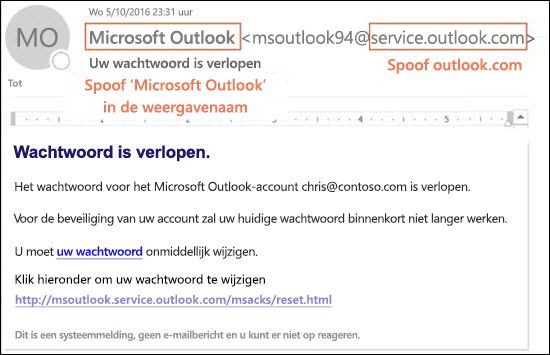

# Beveiliging tegen adresvervalsing in EOP

[!INCLUDE [Microsoft 365 Defender rebranding](../includes/microsoft-defender-for-office.md)]

**Van toepassing op**
- [Exchange Online Protection](exchange-online-protection-overview.md)
- [Abonnement 1 en abonnement 2 voor Microsoft Defender voor Office 365](defender-for-office-365.md)
- [Microsoft 365 Defender](../defender/microsoft-365-defender.md)

In Microsoft 365-bedrijven met postvakken in Exchange Online of EOP-bedrijven (standalone Exchange Online Protection) zonder Exchange Online-postvakken bevat EOP functies om uw organisatie te beschermen tegen gespoofte (vervalste) afzenders.

Wanneer het gaat om het beschermen van haar gebruikers, neemt Microsoft de dreiging van phishing zeer serieus. Spoofing is een gangbare techniek die door hackers wordt gebruikt. **Vervalste berichten lijken afkomstig te zijn van iemand of ergens anders dan de daadwerkelijke bron.** Deze techniek wordt vaak gebruikt in phishing-campagnes die zijn ontworpen om gebruikersgegevens te verkrijgen. De anti-spoofing-technologie in EOP onderzoekt specifiek vervalsing van de Van-header in de berichttekst (gebruikt om de afzender van het bericht weer te geven in e-mailclients). Wanneer EOP een hoge mate van vertrouwen heeft dat de Van-header is vervalst, wordt het bericht geïdentificeerd als vervalst.

De volgende anti-spoofing-technologieën zijn beschikbaar in EOP:

- **Spoof-intelligentie**: bekijk vervalste berichten van afzenders in interne en externe domeinen en sta die afzenders toe of blokkeer ze. Zie [spoof-intelligentie configureren in Microsoft 365](learn-about-spoof-intelligence.md) voor meer informatie.

- **Antiphishing-beleid**: in EOP kunt u met het antiphishing-beleid spoof-intelligentie in- of uitschakelen, niet-geverifieerde afzenderidentificatie in Outlook in- of uitschakelen en de actie specificeren voor geblokkeerde vervalste afzenders (ga naar de map ongewenste e-mail of quarantaine). Het geavanceerd antiphishing-beleid dat beschikbaar is in Microsoft Defender voor Office 365, bevat ook anti-imitatie-instellingen (beveiligde afzenders en domeinen), mailbox intelligence-instellingen en aanpasbare geavanceerde phishing-drempels. Zie [Antiphishing-beleid configureren in Microsoft 365](set-up-anti-phishing-policies.md) voor meer informatie.

- **E-mailverificatie**: een integraal onderdeel van elke poging tot spoofing is het gebruik van e-mailverificatie (ook bekend als e-mailvalidatie) door SPF-, DKIM- en DMARC-records in DNS. U kunt deze records configureren voor uw domeinen, zodat doel-e-mailsystemen de geldigheid kunnen controleren van berichten die beweren afkomstig te zijn van afzenders in uw domeinen. Voor inkomende berichten vereist Microsoft 365 e-mailverificatie voor de domeinen van de afzender. Zie [E-mailverificatie in Microsoft 365](email-validation-and-authentication.md) voor meer informatie.

Vanaf oktober 2018 is bescherming tegen adresvervalsing beschikbaar in EOP.

EOP analyseert en blokkeert berichten die niet kunnen worden geverifieerd door de combinatie van standaardmethoden voor e-mailverificatie en reputatietechnieken van de afzender.

## Hoe spoofing wordt gebruikt in phishing-aanvallen

Spoofberichten hebben de volgende negatieve gevolgen voor gebruikers:

- **Vervalste berichten misleiden gebruikers**: een vervalst bericht kan de ontvanger misleiden tot het klikken op een link en het opgeven van hun inloggegevens, het downloaden van malware of het beantwoorden van een bericht met gevoelige inhoud (bekend als een zakelijk e-mail compromis of BEC).

  In het volgende voorbeeld ziet u een phishingbericht met een vervalste afzender msoutlook94@service.outlook.com:

  

  Dit bericht is niet afkomstig van service.outlook.com, maar de aanvaller heeft het **Van**-veld in de header vervalst om het er zo uit te laten zien. Dit was een poging om de ontvanger te misleiden om op de link voor het **wijzigen van uw wachtwoord** te klikken en hun inloggegevens op te geven.

  Hieronder ziet u een voorbeeld van BEC waarin het vervalste e-mail domein contoso.com wordt gebruikt:

  

  Het bericht ziet er legitiem uit, maar de afzender is vervalst.

- **Gebruikers verwarren echte berichten met nepberichten**: zelfs gebruikers die op de hoogte zijn van phishing kunnen moeite hebben om de verschillen tussen echte berichten en vervalste berichten te zien.

  Het volgende bericht is een voorbeeld van een echt wachtwoordherstelbericht van het Microsoft Beveiliging-account:

  

  Het bericht kwam echt van Microsoft, maar gebruikers zijn geconditioneerd om op te passen. Omdat het moeilijk is om het verschil te zien tussen een echt wachtwoordherstelbericht en een nepbericht, kunnen gebruikers het bericht negeren, als spam rapporteren of het bericht onnodig aan Microsoft als phishing melden.

## Verschillende typen spoofing

Microsoft maakt onderscheid tussen twee verschillende typen adresvervalsingberichten:

- **Intra-org-spoofing**: ook bekend als _Self-to-self_-spoofing. Bijvoorbeeld:

  - De afzender en ontvanger bevinden zich in hetzelfde domein:
    > Van: chris@contoso.com   Aan: michelle@contoso.com

  - De afzender en de ontvanger bevinden zich in de subdomeinen van hetzelfde domein:
    > Van: laura@marketing.fabrikam.com   Aan: julia@engineering.fabrikam.com

  - De afzender en de ontvanger bevinden zich in verschillende domeinen van dezelfde organisatie (dat wil zeggen: beide domeinen zijn geconfigureerd als [geaccepteerde domeinen](/exchange/mail-flow-best-practices/manage-accepted-domains/manage-accepted-domains) in dezelfde organisatie):
    > Van: sender @ microsoft.com   Aan: geadresseerde @ bing.com

    In de e-mailadressen worden spaties gebruikt om kopiëren door spambots te voorkomen.

  Berichten waarvoor [samengestelde authenticatie](email-validation-and-authentication.md#composite-authentication) is mislukt vanwege adresvervalsing tussen domeinen bevatten de volgende waarden in de koppen:

  `Authentication-Results: ... compauth=fail reason=6xx`

  `X-Forefront-Antispam-Report: ...CAT:SPOOF;...SFTY:9.11`

  - `reason=6xx` geeft adresvervalsing binnen de organisatie aan.

  - SFTY geeft het beveiligingsniveau van het bericht. 9 geeft phishing aan, .11 geeft aan dat er sprake is van intra-org-spoofing.

- **spoofing tussen domeinen**: de afzender- en ontvangerdomeinen zijn verschillend en hebben geen relatie met elkaar (ook wel externe domeinen genoemd). Bijvoorbeeld:
    > Van: chris@contoso.com   Aan: michelle@tailspintoys.com

  Berichten waarvoor de [samengestelde verificatie](email-validation-and-authentication.md#composite-authentication) is mislukt vanwege adresvervalsing tussen domeinen bevatten de volgende waarden in de koppen:

  `Authentication-Results: ... compauth=fail reason=000/001`

  `X-Forefront-Antispam-Report: ...CAT:SPOOF;...SFTY:9.22`

  - `reason=000` betekent dat het bericht niet is geslaagd voor expliciete e-mailverificatie. `reason=001` betekent dat het bericht niet is geslaagd voor impliciete e-mailverificatie.

  - SFTY geeft het beveiligingsniveau van het bericht. 9 geeft phishing aan, .22 geeft aan dat er sprake is van spoofing tussen domeinen.

Zie [Antispam-berichtkoppen in Microsoft 365](anti-spam-message-headers.md) voor meer informatie over de categorie- en samengestelde verificatie(compauth)-waarden die verband houden met spoofing.

Zie voor informatie over DMARC [DMARC gebruiken om e-mail in Microsoft 365 te valideren](use-dmarc-to-validate-email.md).

## Rapporten bekijken over hoeveel berichten zijn gemarkeerd als vervalst

EOP-organisaties kunnen het rapport **over het opsporen van spoofing** gebruiken in het rapportendashboard in het Beveiligings- en Compliancecentrum. Zie [rapport over het opsporen van spoofing](view-email-security-reports.md#spoof-detections-report)voor meer informatie.

Microsoft Defender voor Office 365-organisatie kan Threat Explorer gebruiken in het beveiligings- en compliancecentrum om informatie over phishing-pogingen te bekijken. Zie voor meer informatie [Dreigingsonderzoek en -antwoord in Microsoft 365](office-365-ti.md).

## Problemen met bescherming tegen spoofing

Mailinglijsten (ook wel discussielijsten genoemd) staan erom bekend dat ze problemen ondervinden met antispoofing vanwege de manier waarop ze berichten doorsturen en wijzigen.

Stel dat Gabriela Laureano (glaureano@contoso.com) geïnteresseerd is in vogels spotten en lid wordt van de mailinglijst vogelspotters@fabrikam.com. Ze stuurt het volgende bericht naar de lijst:

> **Van:** 'Gabriela Laureano' \<glaureano@contoso.com\>   **Aan:** Vogelaars discussielijst \<birdwatchers@fabrikam.com\>   **Betreft:** Geweldig treffen van blauwe gaaien op de top van de Wageningse Berg deze week 
 Wil iedereen de bezichtiging zien deze week vanaf de Wageningse Berg?

De mailinglijstserver ontvangt het bericht, wijzigt de inhoud ervan en speelt het opnieuw af voor de leden van de lijst. Het opnieuw afgespeelde bericht heeft hetzelfde Van-adres (glaureano@contoso.com), maar er wordt een label aan de onderwerpregel toegevoegd en er wordt een voettekst onder aan het bericht toegevoegd. Dit type wijziging komt veel voor in mailinglijsten en kan leiden tot fout-positieven voor spoofing.

> **Van:** 'Gabriela Laureano' \<glaureano@contoso.com\>   **Aan:** Vogelaars discussielijst \<birdwatchers@fabrikam.com\>   **Betreft:** [VOGELSPOTTERS] Geweldig treffen van blauwe gaaien op de top van de Wageningse Berg deze week 
 Wil iedereen de bezichtiging zien deze week vanaf de Wageningse Berg? 
 Dit bericht is verzonden naar de Vogelspotters-discussielijst. U kunt zich op elk moment weer afmelden.

Voer de volgende stappen uit, afhankelijk van of u de mailinglijst beheert, om ervoor te zorgen dat mailinglijstberichten anti-spoofingcontroles doorstaan:

- Uw organisatie is eigenaar van de mailinglijst:

  - Bekijk de veelgestelde vragen op DMARC.org: [Ik heb een adressenlijst en ik wil samenwerken met DMARC, wat moet ik doen?](https://dmarc.org/wiki/FAQ#I_operate_a_mailing_list_and_I_want_to_interoperate_with_DMARC.2C_what_should_I_do.3F)

  - Lees de instructies in dit blogbericht: [Een tip voor adressenlijstbeheerders om samen te werken met DMARC om fouten te voorkomen](/archive/blogs/tzink/a-tip-for-mailing-list-operators-to-interoperate-with-dmarc-to-avoid-failures).

  - Als u updates op de adressenlijstserver wilt installeren om ARC te ondersteunen, raadpleegt u <http://arc-spec.org>.

- Uw organisatie is niet de eigenaar van de mailinglijst:

  - Vraag de beheerder van de mailinglijst om e-mailverificatie te configureren voor het domein waar vandaan de mailinglijst doorstuurt.

    Wanneer voldoende afzenders aan domeineigenaren antwoorden dat ze e-mailverificatierecords moeten instellen, zet dit hen aan tot actie. Hoewel Microsoft ook met domeineigenaren samenwerkt om de vereiste records te publiceren, is het nog beter wanneer afzonderlijke gebruikers erom vragen.

  - Maak regels voor postvak IN in uw e-mailclient om berichten te verplaatsen naar het postvak IN. U kunt uw beheerders ook vragen om overrides te configureren, zoals besproken in [Spoof-intelligence gebruiken om toegestane afzenders van niet-geverifieerde e-mail te configureren](email-validation-and-authentication.md#use-spoof-intelligence-to-configure-permitted-senders-of-unauthenticated-email).

  - U kunt met Microsoft 365 een ondersteuningsticket maken om een override voor de adressenlijst te maken om deze als legitiem te beschouwen. Raadpleeg voor meer informatie [Contact opnemen met ondersteuning voor zakelijke producten - Hulp voor beheerders](../../admin/contact-support-for-business-products.md).

Als al het andere niet lukt, kunt u het bericht als fout-positief melden aan Microsoft. Zie voor meer informatie [berichten en bestanden rapporteren aan Microsoft](report-junk-email-messages-to-microsoft.md).

U kunt ook contact opnemen met uw beheerder die een ondersteuningsticket kan genereren bij Microsoft. Het technische team van Microsoft zal onderzoeken waarom het bericht als spoof is gemarkeerd.

## Overwegingen bij de bescherming tegen spoofing

Als u een beheerder bent die momenteel berichten naar Microsoft 365 stuurt, moet u ervoor zorgen dat uw e-mail correct is geverifieerd. Anders kan het als spam of phishing worden gemarkeerd. Zie voor meer informatie [oplossingen voor legitieme afzenders die niet-geverifieerde e-mail verzenden](email-validation-and-authentication.md#solutions-for-legitimate-senders-who-are-sending-unauthenticated-email).

Afzenders in de lijst met veilige afzenders van een afzonderlijke gebruiker (of beheerder) slaan onderdelen van de filterstack over, met inbegrip van de beveiliging van spoofberichten. Zie [Outlook-lijsten met veilige afzenders](create-safe-sender-lists-in-office-365.md#use-outlook-safe-senders) voor meer informatie.

Beheerders moeten (indien mogelijk) voorkomen dat toegestane afzenders of toegestane domeinlijsten gebruikt worden. Met deze afzenders worden alle spam, spoofing en phishing-bescherming en de verificatie van de afzender (SPF, DKIM, DMARC) overgeslagen. Zie [lijst met toegestane afzenders of toegestane domein lijsten gebruiken](create-safe-sender-lists-in-office-365.md#use-allowed-sender-lists-or-allowed-domain-lists)voor meer informatie.