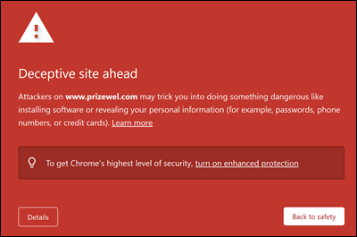

# Aanvalssimulatie traningimplementatieoverwegingen en veelgestelde vragenAttack simulation training deployment considerations and FAQ

Training voor aanvalssimulatie is [nu algemeen beschikbaar.](https://techcommunity.microsoft.com/t5/microsoft-security-and/attack-simulation-training-in-microsoft-defender-for-office-365/ba-p/2037291)Attack simulation training is now [generally available](https://techcommunity.microsoft.com/t5/microsoft-security-and/attack-simulation-training-in-microsoft-defender-for-office-365/ba-p/2037291). Met trainingstrainingen voor aanvalssimulaties kunnen organisaties van Microsoft 365 E5 of Microsoft Defender voor Office 365 Plan 2 sociaal-technische risico's meten en beheren door het maken en beheren van phishingsimulaties toe te staan die worden aangedreven door real-world, ontwapende phishing-payloads.Attack simulation training enables Microsoft 365 E5 or Microsoft Defender for Office 365 Plan 2 organizations to measure and manage social engineering risk by allowing the creation and management of phishing simulations that are powered by real-world, de-weaponized phishing payloads. Hypergerichte training, geleverd in samenwerking met De beveiliging van Terranova, helpt de kennis te verbeteren en het gedrag van werknemers te wijzigen.Hyper-targeted training, delivered in partnership with Terranova security, helps improve knowledge and change employee behavior.

Zie Aan de slag met de trainingstraining Aanvalssimulatie voor meer informatie over aan de slag gaan met de trainingstraining [aanvalssimulatie.](attack-simulation-training-get-started.md)For more information about getting started with Attack simulation training, see [Get started using Attack simulation training](attack-simulation-training-get-started.md).

Hoewel de hele ervaring voor het maken en plannen van simulaties is ontworpen om vrij stromend en frictieloos te zijn, vereist het uitvoeren van simulaties op ondernemingsschaal vaak planning.While the whole simulation creation and scheduling experience has been designed to be free-flowing and frictionless, running simulations at an enterprise scale often requires planning. Dit artikel helpt specifieke uitdagingen aan te pakken die we zien wanneer onze klanten simulaties uitvoeren in hun eigen omgeving.This article helps address specific challenges that we see as our customers run simulations in their own environments.

## Problemen met eindgebruikerservaringenIssues with end user experiences

### URL's voor phishingsimulatie die zijn geblokkeerd door Google Safe BrowsingPhishing simulation URLs blocked by Google Safe Browsing

Een URL-reputatieservice kan een of meer URL's identificeren die door de training voor de aanvalssimulatie worden gebruikt als onveilig.A URL reputation service might identify one or more of the URLs that are used by Attack simulation training as unsafe. Google Safe Browsing in Google Chrome blokkeert enkele gesimuleerde phishing-URL's met een bericht van **de misleidende site.**Google Safe Browsing in Google Chrome blocks some of the simulated phishing URLs with a **Deceptive site ahead** message. Hoewel we met veel URL-reputatieleveranciers werken om altijd onze url's voor simulatie toe te staan, hebben we niet altijd volledige dekking.While we work with many URL reputation vendors to always allow our simulation URLs, we don't always have full coverage.

Houd er rekening mee dat dit probleem niet van invloed is op Microsoft Edge.Note that this issue does not affect Microsoft Edge.

Als onderdeel van de planningsfase moet u de beschikbaarheid van de URL in uw ondersteunde webbrowsers controleren voordat u de URL gebruikt in een phishingcampagne.As part of the planning phase, be sure to check the availability of the URL in your supported web browsers before you use the URL in a phishing campaign. Als de URL's worden geblokkeerd door Google Safe [Browsing,](https://support.google.com/chrome/a/answer/7532419) volgt u deze richtlijnen van Google om toegang tot de URL's toe te staan.If the URLs are blocked by Google Safe Browsing, [follow this guidance](https://support.google.com/chrome/a/answer/7532419) from Google to allow access to the URLs.

Raadpleeg [Aan de slag met training voor aanvalssimulatie](attack-simulation-training-get-started.md) voor de lijst met URL's die momenteel worden gebruikt door de training voor de aanvalssimulatie.Refer to [Get started using Attack simulation training](attack-simulation-training-get-started.md) for the list of URLs that are currently used by Attack simulation training.

### Phishingsimulatie- en beheerders-URL's die zijn geblokkeerd door netwerkproxyoplossingen en filtert stuurprogramma'sPhishing simulation and admin URLs blocked by network proxy solutions and filter drivers

Zowel phishingsimulatie-URL's als beheerders-URL's kunnen worden geblokkeerd of gedropt door uw tussenliggende beveiligingsapparaten of filters.Both phishing simulation URLs and admin URLs might be blocked or dropped by your intermediate security devices or filters. Bijvoorbeeld:For example:

- FirewallsFirewalls
- WAF-oplossingen (Web Application Firewall)Web Application Firewall (WAF) solutions
- Filtert stuurprogramma's van derden (bijvoorbeeld filters in de kernelmodus)Third-party filter drivers (for example, kernel mode filters)

Hoewel er weinig klanten zijn geblokkeerd op deze laag, gebeurt dit wel.While we have seen few customers being blocked at this layer, it does happen. Als u problemen ondervindt, kunt u de volgende URL's configureren om het scannen door uw beveiligingsapparaten of filters te omzeilen:If you encounter problems, consider configuring the following URLs to bypass scanning by your security devices or filters as required:

- De gesimuleerde phishing-URL's zoals beschreven in [Aan de slag met de trainingstraining Aanvalssimulatie](attack-simulation-training-get-started.md).The simulated phishing URLs as described in [Get started using Attack simulation training](attack-simulation-training-get-started.md).
- <https://security.microsoft.com/attacksimulator>
- <https://security.microsoft.com/attacksimulationreport>
- <https://security.microsoft.com/trainingassignments>

### Simulatieberichten die niet aan alle doelgebruikers worden bezorgdSimulation messages not delivered to all targeted users

Het is mogelijk dat het aantal gebruikers dat de e-mailberichten voor de simulatie daadwerkelijk ontvangt, kleiner is dan het aantal gebruikers dat het doel van de simulatie heeft.It's possible that the number of users who actually receive the simulation email messages is less than the number of users who were targeted by the simulation. De volgende typen gebruikers worden uitgesloten als onderdeel van doelvalidatie:The following types of users will be excluded as part of target validation:

- Ongeldige e-mailadressen van geadresseerden.Invalid recipient email addresses.
- Gastgebruikers.Guest users.
- Gebruikers die niet meer actief zijn in Azure Active Directory (Azure AD).Users that are no longer active in Azure Active Directory (Azure AD).

Alleen geldige, niet-gastgebruikers met een geldig postvak worden opgenomen in de simulaties.Only valid, non-guest users with a valid mailbox will be included in simulations. Als u distributiegroepen of beveiligingsgroepen met e-mail gebruikt om gebruikers te targeten, kunt u de [cmdlet Get-DistributionGroupMember](/powershell/module/exchange/get-distributiongroupmember) in [Exchange Online PowerShell](/powershell/exchange/connect-to-exchange-online-powershell) gebruiken om leden van distributiegroepen te bekijken en te valideren.If you use distribution groups or mail-enabled security groups to target users, you can use the [Get-DistributionGroupMember](/powershell/module/exchange/get-distributiongroupmember) cmdlet in [Exchange Online PowerShell](/powershell/exchange/connect-to-exchange-online-powershell) to view and validate distribution group members.

## Problemen met de rapportage van training voor de aanvalssimulatieIssues with Attack simulation training reporting

### Trainingsrapporten voor aanvalssimulaties bevatten geen activiteitendetailsAttack simulation training reports do not contain any activity details

Aanvalssimulatietraining wordt geleverd met uitgebreide, actievolle inzichten die u op de hoogte houden van de voortgang van de bedreigingsbereidheid van uw werknemers.Attack simulation training comes with rich, actionable insights that keep you informed of the threat readiness progress of your employees. Als trainingsrapporten voor aanvalssimulaties niet worden gevuld met gegevens, controleert u of de zoekopdracht in het auditlogboek is ingeschakeld in uw organisatie (deze is standaard ingeschakeld).If Attack simulation training reports are not populated with data, verify that audit log search is turned on in your organization (it's on by default).

Auditlogboek zoeken is vereist door training voor de aanvalssimulatie, zodat gebeurtenissen kunnen worden vastgelegd, opgenomen en teruggelezen.Audit log search is required by Attack simulation training so events can be captured, recorded, and read back. Het uitschakelen van het zoeken naar auditlogboek heeft de volgende gevolgen voor de training voor de aanvalssimulatie:Turning off audit log search has the following consequences for Attack simulation training:

- Rapportagegegevens zijn niet beschikbaar in alle rapporten.Reporting data is not available across all reports. De rapporten worden leeg weergegeven.The reports will appear empty.
- Trainingstoewijzingen worden geblokkeerd, omdat er geen gegevens beschikbaar zijn.Training assignments are blocked, because data is not available.

Zie Zoeken in auditlogboek in- of uitschakelen als u de zoekfunctie voor auditlogboek [wilt in- of uitschakelen.](../../compliance/turn-audit-log-search-on-or-off.md)To turn on audit log search, see [Turn audit log search on or off](../../compliance/turn-audit-log-search-on-or-off.md).

> [!NOTE]
> Lege activiteitsgegevens kunnen ook worden veroorzaakt doordat er geen E5-licenties aan gebruikers worden toegewezen.Empty activity details can also be caused by no E5 licenses being assigned to users. Controleer of ten minste één E5-licentie is toegewezen aan een actieve gebruiker om ervoor te zorgen dat rapportagegebeurtenissen worden vastgelegd en vastgelegd.Verify at least one E5 license is assigned to an active user to ensure that reporting events are captured and recorded.

### Simulatierapporten worden niet onmiddellijk bijgewerktSimulation reports are not updated immediately

Gedetailleerde simulatierapporten worden niet direct bijgewerkt nadat u een campagne hebt gestart.Detailed simulation reports are not updated immediately after you launch a campaign. Maakt u zich geen zorgen; dit gedrag wordt verwacht.Don't worry; this behavior is expected.

Elke simulatiecampagne heeft een levenscyclus.Every simulation campaign has a lifecycle. Wanneer de simulatie voor het eerst wordt gemaakt, is de status **Gepland.**When first created, the simulation is in the **Scheduled** state. Wanneer de simulatie wordt gestart, wordt de voortgangstoestand **uitgevoerd.**When the simulation starts, it transitions to the **In progress** state. Wanneer de simulatie is voltooid, wordt de status **Voltooid** uitgevoerd.When completed, the simulation transitions to the **Completed** state.

Terwijl een simulatie de status **Gepland** heeft, zijn de simulatierapporten meestal leeg.While a simulation is in the **Scheduled** state, the simulation reports will be mostly empty. In deze fase wordt met de simulatie-engine het e-mailadres van de doelgebruiker opgelost, distributiegroepen uitgebreid, gastgebruikers uit de lijst verwijderd, enzovoort:During this stage, the simulation engine is resolving the target user email addresses, expanding distribution groups, removing guest users from the list, etc.:

Wanneer de simulatie het stadium **In voortgang** binnenkomt, ziet u dat de informatie in de rapportage begint te druppelen:Once the simulation enters the **In progress** stage, you will notice information starting to trickle into the reporting:

Het kan tot 30 minuten duren voordat de afzonderlijke simulatierapporten zijn bijgewerkt na de overgang naar **de status In voortgang.**It can take up to 30 minutes for the individual simulation reports to update after the transition to the **In progress** state. De rapportgegevens blijven worden opgebouwd totdat de simulatie de status **Voltooid** heeft bereikt.The report data continues to build until the simulation reaches the **Completed** state. Rapportage-updates vinden plaats met de volgende intervallen:Reporting updates occur at the following intervals:

- Elke 10 minuten voor de eerste 60 minuten.Every 10 minutes for the first 60 minutes.
- Elke 15 minuten na 60 minuten tot 2 dagen.Every 15 minutes after 60 minutes until 2 days.
- Elke 30 minuten na 2 dagen tot 7 dagen.Every 30 minutes after 2 days until 7 days.
- Elke 60 minuten na 7 dagen.Every 60 minutes after 7 days.

Widgets op de **pagina Overzicht** bieden een snelle momentopname van de beveiligingshouding van uw organisatie op basis van een simulatie in de tijd.Widgets on the **Overview** page provide a quick snapshot of your organization's simulation-based security posture over time. Omdat deze widgets uw algehele beveiligingshouding en reis in de tijd weerspiegelen, worden deze bijgewerkt nadat elke simulatiecampagne is voltooid.Because these widgets reflect your overall security posture and journey over time, they're updated after each simulation campaign is completed.

> [!NOTE]
> U kunt de optie **Exporteren** op de verschillende rapportagepagina's gebruiken om gegevens op te halen.You can use the **Export** option on the various reporting pages to extract data.

### Berichten die zijn gerapporteerd als phishing door gebruikers worden niet weergegeven in simulatierapportenMessages reported as phishing by users aren't appearing in simulation reports

Simulatierapporten in de training Aanvalssimulator geven informatie over gebruikersactiviteit.Simulation reports in Attack simulator training provide details on user activity. Bijvoorbeeld:For example:

- Gebruikers die op de koppeling in het bericht hebben geklikt.Users who clicked on the link in the message.
- Gebruikers die hun referenties hebben opgeslagen.Users who gave up their credentials.
- Gebruikers die het bericht als phishing hebben gerapporteerd.Users who reported the message as phishing.

Als berichten die gebruikers als phishing hebben gerapporteerd, niet worden vastgelegd in trainingssimulatierapporten voor aanvallen, is er mogelijk een Exchange-e-mailstroomregel (ook wel een transportregel genoemd) die de bezorging van de gerapporteerde berichten aan Microsoft blokkeert.If messages that users reported as phishing aren't captured in Attack simulation training simulation reports, there might be an Exchange mail flow rule (also known as a transport rule) that's blocking the delivery of the reported messages to Microsoft. Controleer of e-mailstroomregels de bezorging van de volgende e-mailadressen niet blokkeren:Verify that any mail flow rules aren't blocking delivery to the following email addresses:

- junk@office365.microsoft.comjunk@office365.microsoft.com
- abuse@messaging.microsoft.comabuse@messaging.microsoft.com
- phish@office365.microsoft.comphish@office365.microsoft.com
- niet \_ junk@office365.microsoft.comnot\_junk@office365.microsoft.com

## Andere veelgestelde vragenOther frequently asked questions

### V: Wat is de aanbevolen methode om gebruikers te targeten voor simulatiecampagnes?Q: What is the recommended method to target users for simulation campaigns?

A: Er zijn verschillende opties beschikbaar voor doelgebruikers:A: Several options are available to target users:

- Alle gebruikers opnemen (momenteel beschikbaar voor organisaties met minder dan 40.000 gebruikers).Include all users (currently available to organizations with less than 40,000 users).
- Kies specifieke gebruikers.Choose specific users.
- Selecteer gebruikers in een CSV-bestand.Select users from a CSV file.
- Targeting op basis van Azure AD-groep.Azure AD group-based targeting.

We hebben vastgesteld dat campagnes waarbij de beoogde gebruikers worden geïdentificeerd door Azure AD-groepen, over het algemeen gemakkelijker te beheren zijn.We've found that campaigns where the targeted users are identified by Azure AD groups are generally easier to manage.

### V: Zijn er limieten voor het targeten van gebruikers tijdens het importeren van een CSV of het toevoegen van gebruikers?Q: Are there any limits in targeting users while importing from a CSV or adding users?

A: De limiet voor het importeren van geadresseerden uit een CSV-bestand of het toevoegen van afzonderlijke geadresseerden aan een simulatie is 40.000.A: The limit for importing recipients from a CSV file or adding individual recipients to a simulation is 40,000.

Een geadresseerde kan een individuele gebruiker of een groep zijn.A recipient can be an individual user or a group. Een groep kan honderden of duizenden geadresseerden bevatten, zodat er geen werkelijke limiet wordt geplaatst voor het aantal afzonderlijke gebruikers.A group might contain hundreds or thousands of recipients, so an actual limit isn't placed on the number of individual users.

Het beheren van een groot CSV-bestand of het toevoegen van veel afzonderlijke geadresseerden kan lastig zijn.Managing a large CSV file or adding many individual recipients can be cumbersome. Als u Azure AD-groepen gebruikt, wordt het algehele beheer van de simulatie vereenvoudigd.Using Azure AD groups will simplify the overall management of the simulation.

### V: Levert Microsoft payloads in andere talen?Q: Does Microsoft provide payloads in other languages?

A: Er zijn momenteel 5 gelokaliseerde payloads beschikbaar.A: Currently, there are 5 localized payloads available. We hebben gemerkt dat directe of automatische vertalingen van bestaande payloads naar andere talen leiden tot onnauwkeurigheden en verminderde relevantie.We've noticed than any direct or machine translations of existing payloads to other languages will lead to inaccuracies and decreased relevance.

Dat gezegd hebbende, kunt u uw eigen payload maken in de taal van uw keuze met behulp van de aangepaste ervaring voor het maken van laadvermogen.That being said, you can create your own payload in the language of your choice using the custom payload authoring experience. We raden u ook ten zeerste aan om bestaande payloads te gebruiken die zijn gebruikt om gebruikers in een bepaalde geografie te targeten.We also strongly recommend that you harvest existing payloads that were used to target users in a specific geography. Met andere woorden: laat de aanvallers de inhoud voor u localiseren.In other words, let the attackers localize the content for you.

### V: Hoe kan ik overschakelen naar andere talen voor mijn beheerportal en trainingservaring?Q: How can I switch to other languages for my admin portal and training experience?

A: In Microsoft 365 of Office 365 is taalconfiguratie specifiek en gecentraliseerd voor elk gebruikersaccount.A: In Microsoft 365 or Office 365, language configuration is specific and centralized for each user account. Zie Uw weergavetaal en tijdzone [wijzigen in Microsoft 365 voor Bedrijven](https://support.microsoft.com/office/6f238bff-5252-441e-b32b-655d5d85d15b)voor instructies over het wijzigen van de taalinstelling.For instructions on how to change your language setting, see [Change your display language and time zone in Microsoft 365 for Business](https://support.microsoft.com/office/6f238bff-5252-441e-b32b-655d5d85d15b).

Houd er rekening mee dat het 30 minuten kan duren voordat de configuratiewijziging voor alle services wordt gesynchroniseerd.Note that the configuration change might take up to 30 minutes to synchronize across all services.

### V: Kan ik een testsimulatie activeren om te begrijpen hoe deze eruitziet voordat ik een volledige campagne start?Q: Can I trigger a test simulation to understand what it looks like prior to launching a full-fledged campaign?

A: Ja dat kan!A: Yes you can! Op de laatste pagina **Controlesimulatie** in de wizard om een nieuwe simulatie te maken, is er een optie om **een test te verzenden.**On the very last **Review Simulation** page in the wizard to create a new simulation, there's an option to **Send a test**. Met deze optie wordt een voorbeeld van een phishingsimulatiebericht naar de momenteel aangemelde gebruiker gestuurd.This option will send a sample phishing simulation message to the currently logged in user. Nadat u het phishingbericht in uw Postvak IN hebt gevalideerd, kunt u de simulatie indienen.After you validate the phishing message in your Inbox, you can submit the simulation.

### V: Kan ik gebruikers targeten die deel uitmaken van een andere tenant als onderdeel van dezelfde simulatiecampagne?Q: Can I target users that belong to a different tenant as part of the same simulation campaign?

A: Nee.A: No. Op dit moment worden cross-tenantsimulaties niet ondersteund.Currently, cross-tenant simulations are not supported. Controleer of al uw beoogde gebruikers zich in dezelfde tenant hebben.Verify that all of your targeted users are in the same tenant. Alle gebruikers van verschillende tenants of gastgebruikers worden uitgesloten van de simulatiecampagne.Any cross-tenant users or guest users will be excluded from the simulation campaign.

### V: Hoe werkt bezorging op regio-bewust?Q: How does region aware delivery work?

A: Regiobewuste bezorging gebruikt het kenmerk TimeZone van het postvak van de beoogde gebruiker en 'not before' logica om te bepalen wanneer het bericht moet worden bezorgd.A: Region aware delivery uses the TimeZone attribute of the targeted user's mailbox and 'not before' logic to determine when to deliver the message. Houd bijvoorbeeld rekening met het volgende scenario:For example, consider the following scenario:

- Om 7:00 uur in de pacific time zone (UTC-8) maakt en plant een beheerder een campagne om op dezelfde dag om 9:00 uur te beginnen.At 7:00 AM in the Pacific time zone (UTC-8), an admin creates and schedules a campaign to start at 9:00 AM on the same day.
- UserA bevindt zich in de oostelijke tijdzone (UTC-5).UserA is in the Eastern time zone (UTC-5).
- UserB bevindt zich ook in de pacific time zone.UserB is also in the Pacific time zone.

Om 9:00 uur op dezelfde dag wordt het simulatiebericht verzonden naar UserB.At 9:00 AM on the same day, the simulation message is sent to UserB. Met regiobewuste bezorging wordt het bericht niet op dezelfde dag naar UserA verzonden, omdat 9:00 am Pacific time 12:00 uur 12:00 uur Oostelijke tijd is.With region-aware delivery, the message is not sent to UserA on the same day, because 9:00 AM Pacific time is 12:00 PM Eastern time. In plaats daarvan wordt het bericht verzonden naar UserA om 9:00 am Eastern time op de volgende dag.Instead, the message is sent to UserA at 9:00 AM Eastern time on the following day.

Dus tijdens de eerste run van een campagne met regiobewuste bezorging ingeschakeld, lijkt het erop dat het simulatiebericht alleen is verzonden naar gebruikers in een bepaalde tijdzone.So, on the initial run of a campaign with region aware delivery enabled, it might appear that the simulation message was sent only to users in a specific time zone. Maar naarmate de tijd verstrijkt en er meer gebruikers in het bereik komen, worden de beoogde gebruikers groter.But, as time passes and more users come into scope, the targeted users will increase.