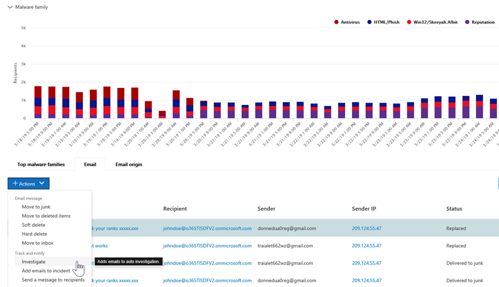
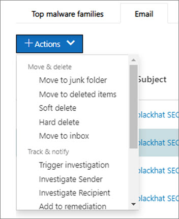

# Hoe geautomatiseerd onderzoek en antwoord werken in Microsoft Defender voor Office 365

[!INCLUDE [Microsoft 365 Defender rebranding](../includes/microsoft-defender-for-office.md)]

**Van toepassing op**
- [Abonnement 2 voor Microsoft Defender voor Office 365](defender-for-office-365.md)
- [Microsoft 365 Defender](../defender/microsoft-365-defender.md)

Wanneer beveiligingswaarschuwingen worden geactiveerd, is het aan uw beveiligingsteam om deze waarschuwingen te bekijken en stappen te ondernemen om uw organisatie te beschermen. Soms kunnen beveiligingsbewerkingsteams worden overstelpt door het aantal waarschuwingen dat wordt geactiveerd. Geautomatiseerde onderzoeks- en antwoordmogelijkheden (AIR) in Microsoft Defender voor Office 365 kunnen u helpen.

Met AIR kan uw beveiligingsteam efficiënter en effectiever werken. Air-mogelijkheden omvatten geautomatiseerde onderzoeksprocessen in reactie op bekende bedreigingen die vandaag de dag bestaan. De juiste herstelacties wachten op goedkeuring, zodat uw beveiligingsteam kan reageren op gedetecteerde bedreigingen.

In dit artikel wordt beschreven hoe AIR werkt aan de hand van verschillende voorbeelden. Zie Automatisch onderzoeken en reageren op [bedreigingen](office-365-air.md)wanneer u klaar bent om aan de slag te gaan met AIR.

- [Voorbeeld 1: Een door de gebruiker gerapporteerd phish-bericht start een onderzoekss playbook](#example-a-user-reported-phish-message-launches-an-investigation-playbook)
- [Voorbeeld 2: Een beveiligingsbeheerder activeert een onderzoek vanuit Threat Explorer](#example-a-security-administrator-triggers-an-investigation-from-threat-explorer)
- [Voorbeeld 3: Een beveiligingsteam integreert AIR met de SIEM met behulp van de Office 365 Management Activity API](#example-a-security-operations-team-integrates-air-with-their-siem-using-the-office-365-management-activity-api)

## Voorbeeld: met een door de gebruiker gerapporteerd phish-bericht wordt een onderzoekss playbook gestart

Stel dat een gebruiker in uw organisatie een e-mailbericht ontvangt dat volgens hen een phishingpoging is. De gebruiker, die is opgeleid om dergelijke berichten te rapporteren, gebruikt de [invoeging](enable-the-report-message-add-in.md) Rapportbericht of de invoeging [Phishing](enable-the-report-phish-add-in.md) melden om deze naar Microsoft te verzenden voor analyse. De inzending wordt ook naar uw systeem verzonden en is zichtbaar in Explorer in **de** weergave Inzendingen (voorheen de door de gebruiker **gerapporteerde** weergave genoemd). Bovendien activeert het door de gebruiker gerapporteerde bericht nu een informatiemelding op basis van het systeem, waarmee automatisch de onderzoeks playbook wordt gestart.

Tijdens de hoofdonderzoeksfase worden verschillende aspecten van de e-mail geëvalueerd. Deze aspecten zijn:

- Een bepaling over welk type bedreiging het kan zijn;
- Wie heeft het verzonden;
- Waar de e-mail is verzonden van (verzendende infrastructuur);
- Of andere exemplaren van de e-mail zijn bezorgd of geblokkeerd;
- Een beoordeling van onze analisten;
- Of het e-mailbericht is gekoppeld aan bekende campagnes;
- en meer.

Nadat het hoofdonderzoek is voltooid, bevat de playbook een lijst met aanbevolen acties die moeten worden ondernomen voor de oorspronkelijke e-mail en entiteiten die daaraan zijn gekoppeld.

Vervolgens worden verschillende bedreigingsonderzoeks- en zoekstappen uitgevoerd:

- Vergelijkbare e-mailberichten worden geïdentificeerd via zoekopdrachten in e-mailcluster.
- Het signaal wordt gedeeld met andere platforms, zoals [Microsoft Defender voor Eindpunt.](/windows/security/threat-protection/microsoft-defender-atp/microsoft-defender-advanced-threat-protection)
- Er wordt bepaald of gebruikers hebben geklikt via schadelijke koppelingen in verdachte e-mailberichten.
- Er wordt een controle uitgevoerd in Exchange Online Protection[(EOP)](exchange-online-protection-overview.md)en (Microsoft Defender voor[Office 365)](defender-for-office-365.md)om te zien of er andere soortgelijke berichten zijn gerapporteerd door gebruikers.
- Er wordt een controle uitgevoerd om te zien of een gebruiker is gecompromitteerd. Deze controle maakt gebruik van signalen in Office 365, [Microsoft Cloud App Security](/cloud-app-security)en Azure Active [Directory,](/azure/active-directory)die verband houden met eventuele afwijkingen in de gebruikersactiviteit.

Tijdens de jachtfase worden risico's en bedreigingen toegewezen aan verschillende stappen voor de jacht.

Herstel is de laatste fase van de playbook. Tijdens deze fase worden herstelstappen ondernomen op basis van de onderzoeks- en jagenfasen.

## Voorbeeld: Een beveiligingsbeheerder activeert een onderzoek vanuit Threat Explorer

Naast geautomatiseerde onderzoeken die worden geactiveerd door een waarschuwing, kan het beveiligingsteam van uw organisatie een geautomatiseerd onderzoek starten vanuit een weergave in [Threat Explorer.](threat-explorer.md)  Met dit onderzoek wordt ook een waarschuwing gemaakt, zodat Microsoft Defender-incidenten en externe SIEM-hulpprogramma's kunnen zien dat dit onderzoek is gestart.

Stel dat u de weergave **Malware** gebruikt in Verkenner. Met behulp van de tabbladen onder de grafiek selecteert u het **tabblad E-mail.** Als u een of meer items in de lijst selecteert, wordt **de knop + Acties** geactiveerd.

Met het **menu** Acties kunt u Onderzoek **activeren selecteren.**

Net als bij playbooks die worden geactiveerd door een waarschuwing, omvatten automatische onderzoeken die worden gestart vanuit een weergave in Explorer een hoofdonderzoek, stappen om bedreigingen te identificeren en te correleren, en aanbevolen acties om deze bedreigingen te beperken.

## Voorbeeld: Een beveiligingsteam integreert AIR met de SIEM met de Office 365 Management Activity API

AIR-mogelijkheden in Microsoft Defender voor Office 365 bevatten rapporten [& details](air-view-investigation-results.md) die beveiligingsbewerkingsteams kunnen gebruiken om bedreigingen te bewaken en aan te pakken. Maar u kunt air-mogelijkheden ook integreren met andere oplossingen. Voorbeelden hiervan zijn een SIEM-systeem (Security Information and Event Management), een case management system of een aangepaste rapportageoplossing. Dit soort integraties kan worden uitgevoerd met behulp van de [Office 365 Management Activity API](/office/office-365-management-api/office-365-management-activity-api-reference).

Onlangs heeft een organisatie bijvoorbeeld een manier ingesteld voor het beveiligingsteam om door de gebruiker gerapporteerde phish-waarschuwingen weer te geven die al door AIR zijn verwerkt. De oplossing integreert relevante waarschuwingen met de SIEM-server van de organisatie en het case-managementsysteem van de organisatie. Met de oplossing wordt het aantal onwaar-positieven aanzienlijk beperkt, zodat het team voor beveiligingsbewerkingen zich kan richten op echte bedreigingen. Zie tech communityblog: De effectiviteit van uw soc verbeteren met Microsoft Defender voor Office 365 en de [O365 Management API](https://techcommunity.microsoft.com/t5/microsoft-security-and/improve-the-effectiveness-of-your-soc-with-office-365-atp-and/ba-p/1525185)voor meer informatie over deze aangepaste oplossing.

## Volgende stappen

- [Aan de slag met AIR](office-365-air.md)
- [Lopende of voltooide herstelacties weergeven](air-review-approve-pending-completed-actions.md)