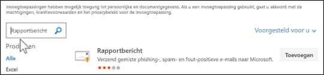

# De invoegtoepassing Bericht rapporteren inschakelenEnable the Report Message add-in

[!INCLUDE [Microsoft 365 Defender rebranding](../includes/microsoft-defender-for-office.md)]

**Van toepassing op****Applies to**
- [Exchange Online ProtectionExchange Online Protection](exchange-online-protection-overview.md)
- [Abonnement 1 en abonnement 2 voor Microsoft Defender voor Office 365Microsoft Defender for Office 365 plan 1 and plan 2](defender-for-office-365.md)
- [Microsoft 365 DefenderMicrosoft 365 Defender](../defender/microsoft-365-defender.md)

> [!NOTE]
> Als u een beheerder bent in een Microsoft 365-organisatie met Exchange Online-postvakken, raden we u aan de portal Inzendingen te gebruiken in het Beveiligings- & Compliancecentrum.If you're an admin in a Microsoft 365 organization with Exchange Online mailboxes, we recommend that you use the Submissions portal in the Security & Compliance Center. Zie Beheerdersinzending gebruiken om [verdachte spam, phish, URL's en](admin-submission.md)bestanden in te dienen bij Microsoft voor meer informatie.For more information, see [Use Admin Submission to submit suspected spam, phish, URLs, and files to Microsoft](admin-submission.md).

Met de invoegvoegingen Rapportbericht en Rapport phishing voor de webversie van Outlook en Outlook (voorheen Bekend als Outlook Web App) kunnen personen eenvoudig onwaar-positieven (goede e-mail die als slecht is gemarkeerd) of onwaar negatieven (slechte e-mail toegestaan) rapporteren aan Microsoft en haar gelieerde bedrijven voor analyse.The Report Message and Report Phishing add-ins for Outlook and Outlook on the web (formerly known as Outlook Web App) enables people to easily report false positives (good email marked as bad) or false negatives (bad email allowed) to Microsoft and its affiliates for analysis.

Microsoft gebruikt deze inzendingen om de effectiviteit van e-mailbeveiligingstechnologieën te verbeteren.Microsoft uses these submissions to improve the effectiveness of email protection technologies. Als mensen bijvoorbeeld een groot aantal berichten rapporteren die als ongewenste e-mail zijn gemarkeerd als Geen ongewenste [e-mail](configure-your-spam-filter-policies.md)met behulp van de invoegmap Rapportbericht, moet het beveiligingsteam van uw organisatie mogelijk antispambeleid aanpassen.For example, if people are reporting a lot of messages that were flagged as junk mail as Not Junk by using the Report Message add-in, your organization's security team might need to adjust [anti-spam policies](configure-your-spam-filter-policies.md).

U kunt de invoeging Rapportbericht of Phishing melden installeren.You can install either the Report Message or Report Phishing add-in. Als u wilt dat uw gebruikers alleen phishingberichten rapporteren, implementeert u de invoeging Phishing melden in uw organisatie.If you want your users to report only phishing messages, deploy the Report Phishing add-in in your organization. Zie De [invoeging Phishing melden inschakelen voor meer informatie.](enable-the-report-phish-add-in.md)For more information, see [Enable the Report Phishing add-in](enable-the-report-phish-add-in.md).

De invoegoptie Rapportbericht biedt de optie om zowel spam- als phishingberichten te rapporteren.The Report Message add-in provides the option to report both spam and phishing messages. Beheerders kunnen de invoeging Rapportbericht voor de organisatie inschakelen en afzonderlijke gebruikers kunnen het zelf installeren.Admins can enable the Report Message add-in for the organization, and individual users can install it for themselves.

Als u een individuele gebruiker bent, kunt u de invoeging [Rapportbericht voor uzelf inschakelen.](#get-the-report-message-add-in-for-yourself)If you're an individual user, you can [enable the Report Message add-in for yourself](#get-the-report-message-add-in-for-yourself).

Als u een globale beheerder of een Exchange Online-beheerder bent en Exchange is geconfigureerd voor het gebruik van OAuth-verificatie, kunt u de invoegvoeging [Rapportbericht inschakelen voor uw organisatie.](#get-and-enable-the-report-message-add-in-for-your-organization)If you're a global administrator or an Exchange Online administrator, and Exchange is configured to use OAuth authentication, you can [enable the Report Message add-in for your organization](#get-and-enable-the-report-message-add-in-for-your-organization). Het rapportbericht Add-In is nu beschikbaar via [Gecentraliseerde implementatie.](../../admin/manage/centralized-deployment-of-add-ins.md)The Report Message Add-In is now available through [Centralized Deployment](../../admin/manage/centralized-deployment-of-add-ins.md).

## Wat moet u weten voordat u begint?What do you need to know before you begin?

- De invoegvoegapp Rapportbericht werkt met de meeste Microsoft 365-abonnementen en de volgende producten:The Report Message add-in works with most Microsoft 365 subscriptions and the following products:

  - De webversie van OutlookOutlook on the web
  - Outlook 2013 SP1 of hogerOutlook 2013 SP1 or later
  - Outlook 2016 voor MacOutlook 2016 for Mac
  - Outlook inbegrepen bij Microsoft 365-apps voor EnterpriseOutlook included with Microsoft 365 apps for Enterprise
  - Outlook-app voor iOS en AndroidOutlook app for iOS and Android

- De invoeging Rapportbericht is niet beschikbaar voor gedeelde postvakken of postvakken in on-premises Exchange-organisaties.The Report Message add-in is not available for shared mailboxes or mailboxes in on-premises Exchange organizations.

- U kunt gerapporteerde berichten zo configureren dat ze worden gekopieerd of omgeleid naar een postvak dat u opgeeft.You can configure reported messages to be copied or redirected to a mailbox that you specify. Zie Beleidsregels voor [gebruikersinzendingen voor meer informatie.](user-submission.md)For more information, see [User submissions policies](user-submission.md).

- Uw bestaande webbrowser moet werken met de invoeging Rapportbericht.Your existing web browser should work with the Report Message add-in. Maar als u merkt dat de invoegvoeging niet beschikbaar is of niet werkt zoals verwacht, probeert u een andere browser.But, if you notice the add-in is not available or not working as expected, try a different browser.

- Voor organisatie-installaties moet de organisatie zijn geconfigureerd voor het gebruik van OAuth-verificatie.For organizational installs, the organization needs to be configured to use OAuth authentication. Zie Bepalen of gecentraliseerde implementatie van invoegvoegingen werkt [voor uw organisatie voor meer informatie.](../../admin/manage/centralized-deployment-of-add-ins.md)For more information, see [Determine if Centralized Deployment of add-ins works for your organization](../../admin/manage/centralized-deployment-of-add-ins.md).

- Beheerders moeten lid zijn van de rollengroep Globale beheerders.Admins need to be a member of the Global admins role group. Zie [Machtigingen in het Beveiligings- & compliancecentrum](permissions-in-the-security-and-compliance-center.md) voor meer informatie.For more information, see [Permissions in the Security & Compliance Center](permissions-in-the-security-and-compliance-center.md).

## De invoeging Rapportbericht voor uzelf krijgenGet the Report Message add-in for yourself

1. Ga naar de Microsoft AppSource bij <https://appsource.microsoft.com/marketplace/apps> en zoek naar de invoeging Rapportbericht.Go to the Microsoft AppSource at <https://appsource.microsoft.com/marketplace/apps> and search for the Report Message add-in. Als u rechtstreeks naar de invoeging Rapportbericht wilt gaan, gaat u naar <https://appsource.microsoft.com/product/office/wa104381180> .To go directly to the Report Message add-in, go to <https://appsource.microsoft.com/product/office/wa104381180>.

2. Klik **op NU krijgen.**Click **GET IT NOW**.

   

3. Bekijk in het dialoogvenster dat wordt weergegeven de gebruiksvoorwaarden en het privacybeleid en klik vervolgens op **Doorgaan.**In the dialog that appears, review the terms of use and privacy policy, and then click **Continue**.

4. Meld u aan met uw werk- of schoolaccount (voor zakelijk gebruik) of uw Microsoft-account (voor persoonlijk gebruik).Sign in using your work or school account (for business use) or your Microsoft account (for personal use).

Nadat de invoegvoegvoeging is geïnstalleerd en ingeschakeld, ziet u de volgende pictogrammen:After the add-in is installed and enabled, you'll see the following icons:

- In Outlook ziet het pictogram er als volgende uit:In Outlook, the icon looks like this:

  

- In de webversie van Outlook ziet het pictogram er als volgende uit:In Outlook on the web, the icon looks like this:

  

Zie De invoeging Rapportbericht gebruiken voor meer informatie over het gebruik van [de invoeging.](https://support.microsoft.com/office/b5caa9f1-cdf3-4443-af8c-ff724ea719d2)To learn how to use the add-in, see [Use the Report Message add-in](https://support.microsoft.com/office/b5caa9f1-cdf3-4443-af8c-ff724ea719d2).

## De invoeging Rapportbericht voor uw organisatie ontvangen en inschakelenGet and enable the Report Message add-in for your organization

> [!NOTE]
> Het kan tot 12 uur duren voordat de invoegvoeging wordt weergegeven in uw organisatie.It could take up to 12 hours for the add-in to appear in your organization.

1. Ga in het Microsoft 365-beheercentrum  naar de pagina Instellingen invoegvoegingen op , Als u de invoegpagina niet ziet, gaat u naar de koppeling Geïntegreerde \>  <https://admin.microsoft.com/AdminPortal/Home#/Settings/AddIns>   \>  \> **apps-invoeginstellingen**  boven aan de pagina Geïntegreerde apps.In the Microsoft 365 admin center, go to the go to the **Settings** \> **Add-ins** page at <https://admin.microsoft.com/AdminPortal/Home#/Settings/AddIns>, If you don't see the **Add-in** Page, go to the **Settings** \> **Integrated apps** \> **Add-ins** link on the top of the **Integrated apps** page.

2. Selecteer **Invoegvoegvoeging implementeren** boven aan de pagina en selecteer vervolgens **Volgende.**Select **Deploy Add-in** at the top of the page, and then select **Next**.

   

3. Controleer de informatie in het **fly-out Nieuwe invoegsel** implementeren dat wordt weergegeven en klik vervolgens op **Volgende.**In the **Deploy a new add-in** flyout that appears, review the information, and then click **Next**.

4. Klik op de volgende pagina op **Kiezen uit de Store.**On the next page, click **Choose from the Store**.

   

5. Klik in het vak Zoeken op de  pagina Selecteer **invoegbericht** dat wordt weergegeven, voer **Rapportbericht** in en klik vervolgens op **zoekpictogram**  .In the **Select add-in** page that appears, click in the **Search** box, enter **Report Message**, and then click **Search** . Zoek rapportbericht in de lijst met **resultaten** en klik vervolgens op **Toevoegen.**In the list of results, find **Report Message** and then click **Add**.

   

6. Controleer in het dialoogvenster dat wordt weergegeven de licentie- en privacygegevens en klik vervolgens op **Doorgaan.**In the dialog that appears, review the licensing and privacy information, and then click **Continue**.

7. Configureer de volgende instellingen op de **pagina Invoeging** configureren die wordt weergegeven:In the **Configure add-in** page that appears, configure the following settings:

   - **Toegewezen gebruikers:** Selecteer een van de volgende waarden:**Assigned users**: Select one of the following values:

     - **Iedereen** (standaard)**Everyone** (default)
     - **Specifieke gebruikers/groepen****Specific users / groups**
     - **Alleen ik****Just me**

   - **Implementatiemethode:** Selecteer een van de volgende waarden:**Deployment method**: Select one of the following values:

     - **Opgelost (standaard)**: De invoeging wordt automatisch geïmplementeerd voor de opgegeven gebruikers en kan niet worden verwijderd.**Fixed (Default)**: The add-in is automatically deployed to the specified users and they can't remove it.
     - **Beschikbaar:** Gebruikers kunnen de invoegvoeging installeren bij **Home** \> **Get-invoegvoegingen** beheerd door \> **beheerder.****Available**: Users can install the add-in at **Home** \> **Get add-ins** \> **Admin-managed**.
     - **Optioneel:** De invoeging wordt automatisch geïmplementeerd voor de opgegeven gebruikers, maar ze kunnen ervoor kiezen deze te verwijderen.**Optional**: The add-in is automatically deployed to the specified users, but they can choose to remove it.

   

   Wanneer u klaar bent, klikt u op **Implementeren.**When you're finished, click **Deploy**.

8. Op de **pagina Rapportbericht** implementeren dat wordt weergegeven, ziet u een voortgangsrapport, gevolgd door een bevestiging dat de invoegvoeging is geïmplementeerd.In the **Deploy Report Message** page that appears, you'll see a progress report followed by a confirmation that the add-in was deployed. Nadat u de informatie hebt gelezen, klikt u op **Volgende**.After you read the information, click **Next**.

   

9. Controleer de gegevens op de **pagina Invoeging** aankondigen die wordt weergegeven en klik op **Sluiten.**On the **Announce add-in** page that appears, review the information, and then click **Close**.

   

## Meer informatie over het gebruik van de invoeging RapportberichtLearn how to use the Report Message add-in

Personen aan wie de invoegvoeging is toegewezen, zien de volgende pictogrammen:People who have the add-in assigned to them will see the following icons:

- In Outlook ziet het pictogram er als volgende uit:In Outlook, the icon looks like this:

  

- In de webversie van Outlook ziet het pictogram er als volgende uit:In Outlook on the web, the icon looks like this:

  

Wanneer u gebruikers op de hoogte stelt van de invoegvoegapp Rapportbericht, voegt u een koppeling toe aan De invoeging [Rapportbericht gebruiken.](https://support.microsoft.com/office/b5caa9f1-cdf3-4443-af8c-ff724ea719d2)When you notify users about the Report Message add-in, include a link to [Use the Report Message add-in](https://support.microsoft.com/office/b5caa9f1-cdf3-4443-af8c-ff724ea719d2).

## Instellingen controleren of bewerken voor de invoegvoegbewerking RapportberichtReview or edit settings for the Report Message add-in

1. Ga in het Microsoft 365-beheercentrum  naar de pagina Instellingen invoegvoegingen op , Als u de invoegpagina niet ziet, gaat u naar de koppeling Geïntegreerde \>  <https://admin.microsoft.com/AdminPortal/Home#/Settings/AddIns>   \>  \> **apps-invoeginstellingen**  boven aan de pagina Geïntegreerde apps.In the Microsoft 365 admin center, go to the go to the **Settings** \> **Add-ins** page at <https://admin.microsoft.com/AdminPortal/Home#/Settings/AddIns>, If you don't see the **Add-in** Page, go to the **Settings** \> **Integrated apps** \> **Add-ins** link on the top of the **Integrated apps** page.

   

2. Zoek en selecteer de **invoeging Rapportbericht.**Find and select the **Report Message** add-in.

3. In het **flyout Rapportbericht bewerken** dat wordt weergegeven, controleert en bewerkt u de instellingen die geschikt zijn voor uw organisatie.In the **Edit Report Message** flyout that appears, review and edit settings as appropriate for your organization. Klik op **Opslaan** wanneer u gereed bent.When you're finished, click **Save**.

   

## Gerapporteerde berichten weergeven en controlerenView and review reported messages

Als u berichten wilt bekijken die gebruikers rapporteren aan Microsoft, hebt u de volgende opties:To review messages that users report to Microsoft, you have these options:

- Gebruik de portal Beheerdersinzendingen.Use the Admin Submissions portal. Zie Gebruikersinzendingen [weergeven bij Microsoft voor meer informatie.](admin-submission.md#view-user-submissions-to-microsoft)For more information, see [View user submissions to Microsoft](admin-submission.md#view-user-submissions-to-microsoft).

- Maak een regel voor de e-mailstroom (ook wel transportregel genoemd) om kopieën van gerapporteerde berichten te verzenden.Create a mail flow rule (also known as a transport rule) to send copies of reported messages. Zie Regels voor [e-mailstroom gebruiken voor](use-mail-flow-rules-to-see-what-your-users-are-reporting-to-microsoft.md)instructies om te zien wat uw gebruikers rapporteren aan Microsoft.For instructions, see [Use mail flow rules to see what your users are reporting to Microsoft](use-mail-flow-rules-to-see-what-your-users-are-reporting-to-microsoft.md).
