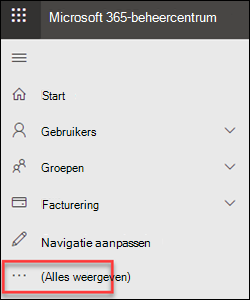
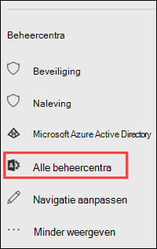

# Exchange-beheercentrum in standalone EOPExchange admin center in standalone EOP

[!INCLUDE [Microsoft 365 Defender rebranding](../includes/microsoft-defender-for-office.md)]

**Van toepassing op****Applies to**
-  [Zelfstandige Exchange Online ProtectionExchange Online Protection standalone](exchange-online-protection-overview.md)

Het Exchange-beheercentrum (EAC) is een webbeheerconsole voor zelfstandige Exchange Online Protection (EOP).The Exchange admin center (EAC) is a web-based management console for standalone Exchange Online Protection (EOP).

Zoekt u de Exchange Online-versie van dit onderwerp?Looking for the Exchange Online version of this topic? Zie [Exchange-beheercentrum in Exchange Online.](/exchange/exchange-admin-center)See [Exchange admin center in Exchange Online](/exchange/exchange-admin-center).

## Het EAC openen in EOPOpen the EAC in EOP

Zelfstandige EOP-klanten hebben toegang tot het EAC op basis van de volgende methoden:Standalone EOP customers can access the EAC by using the following methods:

- **Vanuit het Microsoft 365-beheercentrum:****From the Microsoft 365 admin center**:

  1. Ga naar <https://admin.microsoft.com> en klik op Alles **tonen.**Go to <https://admin.microsoft.com> and click **Show all**.

     

  2. Klik in **de sectie Beheercentra** die wordt weergegeven op **Alle beheercentra.**In the **Admin centers** section that appears, click **All admin centers**.

     

  3. Klik op **de pagina Alle beheercentra** die wordt weergegeven op **Exchange Online Protection.**On the **All admin centers** page that appears, click **Exchange Online Protection**.

- Ga rechtstreeks naar `https://admin.protection.outlook.com/ecp/` .Go directly to `https://admin.protection.outlook.com/ecp/`.

## Algemene elementen van de gebruikersinterface in het EAC in EOPCommon user interface elements in the EAC in EOP

In deze sectie worden de elementen van de gebruikersinterface beschreven die in het EAC worden gevonden.This section describes the user interface elements that are found in the EAC.

### FunctiedeelvensterFeature Pane

Dit is het eerste navigatieniveau voor de meeste taken die u in het EAC uitvoert.This is the first level of navigation for most of the tasks you'll perform in the EAC. Het functievenster is ingedeeld op functiegebieden.The feature pane is organized by feature areas.

- **Geadresseerden:** hier worden groepen en externe contactpersonen bekeken.**Recipients**: This is where you'll view groups and external contacts.

- **Machtigingen:** dit is de plek waar u beheerdersrollen beheert.**Permissions**: This where you'll manage admin roles.

- **Compliancebeheer:** hier vindt u het rapport van de beheerdersrolgroep en het auditlogboekrapport van de beheerder.**Compliance Management**: This is where you'll find the administrator role group report and the admin audit log report.

- **Beveiliging:** hier kunt u anti-malwarebeleid, het standaardbeleid voor verbindingsfilters en DKIM beheren.**Protection**: This is where you can manage anti-malware policies, the default connection filter policy, and DKIM.

  > [!NOTE]
  > U moet anti-malwarebeleid en het standaardbeleid voor verbindingsfilters beheren in & compliancecentrum.You should manage anti-malware policies and the default connection filter policy in the Security & Compliance Center. Zie [Anti-malwarebeleid](configure-anti-malware-policies.md) configureren in EOP en [Verbindingsfilters configureren in EOP](configure-the-connection-filter-policy.md)voor meer informatie.For more information, see [Configure anti-malware policies in EOP](configure-anti-malware-policies.md) and [Configure connection filtering in EOP](configure-the-connection-filter-policy.md).

- **E-mailstroom:** hier beheert u regels voor de e-mailstroom (ook wel transportregels genoemd), geaccepteerde domeinen en verbindingslijnen, en kunt u berichten traceren.**Mail Flow**: This is where you'll manage mail flow rules (also known as transport rules), accepted domains, and connectors, as well as where you can go to run message trace.

- **Hybride:** Hier kunt u de wizard Hybride configuratie uitvoeren [en](/Exchange/hybrid-configuration-wizard)de Exchange [Online PowerShell-module installeren.](/powershell/exchange/mfa-connect-to-exchange-online-powershell)**Hybrid**: This is where you can run the [Hybrid Configuration Wizard](/Exchange/hybrid-configuration-wizard), and where you can install the [Exchange Online PowerShell module](/powershell/exchange/mfa-connect-to-exchange-online-powershell).

### TabbladenTabs

De tabbladen zijn uw tweede navigatieniveau.The tabs are your second level of navigation. Elk van de functiegebieden bevat verschillende tabbladen, die elk een functie vertegenwoordigen.Each of the feature areas contains various tabs, each representing a feature.

### WerkbalkToolbar

Wanneer u op de meeste tabbladen klikt, ziet u een werkbalk.When you click most tabs, you'll see a toolbar. De werkbalk heeft pictogrammen die een specifieke actie uitvoeren.The toolbar has icons that perform a specific action. In de volgende tabel worden de pictogrammen en hun acties beschreven.The following table describes the icons and their actions.

****

|PictogramIcon|NaamName|ActieAction|
|---|---|---|
||Toevoegen, NieuwAdd, New|Gebruik dit pictogram om een nieuw object te maken.Use this icon to create a new object. Sommige van deze pictogrammen hebben een bijbehorende pijl-omlaag waar u op kunt klikken om extra objecten weer te geven die u kunt maken.Some of these icons have an associated down arrow you can click to show additional objects you can create.|
||BewerkenEdit|Gebruik dit pictogram om een object te bewerken.Use this icon to edit an object.|
||VerwijderenDelete|Gebruik dit pictogram om een object te verwijderen.Use this icon to delete an object. Sommige verwijderpictogrammen hebben een pijl-omlaag waar u op kunt klikken om extra opties weer te geven.Some delete icons have a down arrow you can click to show additional options.|
||ZoekenSearch|Gebruik dit pictogram om een zoekvak te openen waarin u de zoekzin kunt typen voor een object dat u wilt zoeken.Use this icon to open a search box in which you can type the search phrase for an object you want to find.|
||VernieuwenRefresh|Gebruik dit pictogram om de lijstweergave te vernieuwen.Use this icon to refresh the list view.|
||Meer optiesMore options|Gebruik dit pictogram om meer acties weer te geven die u kunt uitvoeren voor de objecten van dat tabblad.Use this icon to view more actions you can perform for that tab's objects. In Geadresseerden **worden bijvoorbeeld gebruikers weergegeven \> die** op dit pictogram klikken, de optie om een geavanceerd zoeken **uit te voeren.**For example, in **Recipients \> Users** clicking this icon shows the option to perform an **Advanced Search**.|
||Pijl-omhoog en pijl-omlaagUp arrow and down arrow|Gebruik deze pictogrammen om de prioriteit van een object omhoog of omlaag te verplaatsen.Use these icons to move an object's priority up or down.|
||VerwijderenRemove|Gebruik dit pictogram om objecten uit een lijst te verwijderen.Use this icon to remove objects from a list.|
|

### LijstweergaveList View

Wanneer u een tabblad selecteert, ziet u in de meeste gevallen een lijstweergave.When you select a tab, in most cases you'll see a list view. De weergavelimiet met de EAC-lijstweergave is ongeveer 10.000 objecten.The viewable limit with the EAC list view is approximately 10,000 objects. Daarnaast is paging opgenomen, zodat u naar resultaten kunt pagina's.In addition, paging is included so that you can page to results.

### DetailvensterDetails Pane

Wanneer u een object selecteert in de lijstweergave, wordt informatie over dat object weergegeven in het detailvenster.When you select an object from the list view, information about that object is displayed in the details pane. In sommige gevallen bevat het detailvenster beheertaken.In some cases the details pane includes management tasks.

### Mij-tegel en HelpMe tile and Help

Met **de tegel** Ik kunt u het EAC afmelden en u aanmelden als een andere gebruiker.The **Me** tile allows you to sign out the EAC and sign in as a different user. In de **vervolgkeuzelijst**  Help-pictogram help kunt u de volgende acties uitvoeren:From the **Help** drop-down menu, you can do the following actions:

- **Help:** Klik op  Help-pictogram om de online Help-inhoud weer te geven.**Help**: Click  to view the online help content.
- **Feedback:** Feedback geven.**Feedback**: Leave feedback.
- **Community:** Plaats een vraag voor het vinden van antwoorden in de communityforums.**Community**: Post a question for find answers in the community forums.
- **Help-bellen uitschakelen:** in de Help-bel worden contextuele help-informatie weergegeven voor velden wanneer u een object maakt of bewerkt.**Disable Help bubble**: The Help bubble displays contextual help for fields when you create or edit an object. U kunt de Help-bel uitschakelen of in- of uitschakelen als deze is uitgeschakeld.You can turn off the Help bubble or turn it on if it has been disabled.
- **Opdrachtregistratie weergeven:** er wordt een nieuw venster geopend waarin de equivalente PowerShell-opdrachten worden weergegeven op basis van wat u hebt geconfigureerd in EAC.**Show Command Logging**: A new window opens that shows the equivalent PowerShell commands based on what you configured in EAC.

## Ondersteunde browsersSupported Browsers

Voor de beste ervaring met het EAC raden we u aan altijd de nieuwste browsers, Office-clients en apps te gebruiken.For the best experience using the EAC, we recommend that you always use the latest browsers, Office clients, and apps. We raden u ook aan software-updates te installeren wanneer deze beschikbaar komen.We also recommend that you install software updates when they become available. Zie Systeemvereisten voor Office voor meer informatie over de ondersteunde browsers en systeemvereisten [voor de service.](https://products.office.com/office-system-requirements)For more information about the supported browsers and system requirements for the service, see [System requirements for Office](https://products.office.com/office-system-requirements).

## Ondersteunde talenSupported languages

De volgende talen worden ondersteund en beschikbaar voor het EAC in zelfstandige EOP.The following languages are supported and available for the EAC in standalone EOP.

- AmharicAmharic
- ArabischArabic
- Baskisch (Baskisch)Basque (Basque)
- Bengali (India)Bengali (India)
- BulgarianBulgarian
- CatalanCatalan
- Chinees (vereenvoudigd)Chinese (Simplified)
- Chinees (traditioneel)Chinese (Traditional)
- CroatianCroatian
- CzechCzech
- DanishDanish
- DutchDutch
- EngelsEnglish
- EstonianEstonian
- Filipijns (Filipijnen)Filipino (Philippines)
- FinnishFinnish
- FrenchFrench
- GalicianGalician
- GermanGerman
- GreekGreek
- GujaratiGujarati
- HebrewHebrew
- HindiHindi
- HungarianHungarian
- IJslandsIcelandic
- IndonesianIndonesian
- ItalianItalian
- JapaneseJapanese
- KannadaKannada
- KazakhKazakh
- KiswahiliKiswahili
- KoreanKorean
- LatvianLatvian
- LithuanianLithuanian
- Maleis (Brunei Darussalam)Malay (Brunei Darussalam)
- Maleis (Maleisië)Malay (Malaysia)
- MalajalamMalayalam
- MarathiMarathi
- Noors (Bokmål)Norwegian (Bokmål)
- Noors (Nynorsk)Norwegian (Nynorsk)
- OriyaOriya
- PerzischPersian
- PolishPolish
- Portugees (Brazilië)Portuguese (Brazil)
- Portugees (Portugal)Portuguese (Portugal)
- RomanianRomanian
- RussianRussian
- Servisch (Cyrillisch, Servië)Serbian (Cyrillic, Serbia)
- Servisch (Latijns)Serbian (Latin)
- SlovakSlovak
- SlovenianSlovenian
- SpanishSpanish
- SwedishSwedish
- TamilTamil
- TeluguTelugu
- ThaiThai
- TurkishTurkish
- UkrainianUkrainian
- UrduUrdu
- VietnameseVietnamese
- WelshWelsh