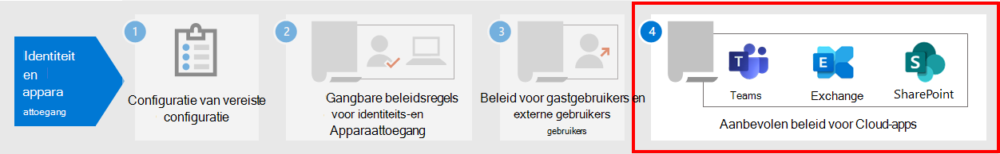

# Beleid voor het toestaan van gasttoegang en B2B-externe gebruikerstoegangPolicies for allowing guest access and B2B external user access

In dit artikel wordt beschreven hoe u het aanbevolen beleid voor apparaat- en identiteitstoegang aanpast om toegang te verlenen aan gasten en externe gebruikers die een Azure Active Directory-account (Azure AD) Business-to-Business (B2B) hebben.This article discusses adjusting the recommended device and identity access policies to allow access for guests and external users that have an Azure Active Directory (Azure AD) Business-to-Business (B2B) account. Deze richtlijnen zijn gebaseerd op [het algemene beleid voor identiteits- en apparaattoegang.](identity-access-policies.md)This guidance builds on the [common identity and device access policies](identity-access-policies.md).

Deze aanbevelingen zijn bedoeld om  van toepassing te zijn op de basislijnbeveiligingslaag.These recommendations are designed to apply to the **baseline** tier of protection. Maar u kunt de aanbevelingen ook aanpassen op basis van uw specifieke behoeften voor **gevoelige** en sterk **gereguleerde** beveiliging.But you can also adjust the recommendations based on your specific needs for **sensitive** and **highly regulated** protection.

Als u een pad biedt voor B2B-accounts om te verifiëren met uw Azure AD-tenant, hebben deze accounts geen toegang tot uw hele omgeving.Providing a path for B2B accounts to authenticate with your Azure AD tenant doesn't give these accounts access to your entire environment. B2B-gebruikers en hun accounts hebben toegang tot services en resources, zoals bestanden, die met hen worden gedeeld via beleid voor voorwaardelijke toegang.B2B users and their accounts have access to services and resources, like files, shared with them by Conditional Access policy.

## Het algemene beleid bijwerken om gasten en externe gebruikerstoegang toe te staan en te beveiligenUpdating the common policies to allow and protect guests and external user access

In dit diagram ziet u welk beleid moet worden toegevoegd of bijgewerkt tussen het algemene beleid voor identiteits- en apparaattoegang, voor B2B-gast- en externe gebruikerstoegang.This diagram shows which policies to add or update among the common identity and device access policies, for B2B guest and external user access.

In de volgende tabel ziet u de beleidsregels die u moet maken en bijwerken.The following table lists the policies you either need to create and update. De algemene beleidsregels koppelen aan de bijbehorende configuratie-instructies in het artikel Algemene [identiteits-](identity-access-policies.md) en apparaattoegangsbeleid.The common policies link to the associated configuration instructions in the [Common identity and device access policies](identity-access-policies.md) article.

|BeveiligingsniveauProtection level|BeleidPolicies|Meer informatieMore information|
|---|---|---|
|**Basislijn****Baseline**|[MFA altijd vereisen voor gasten en externe gebruikersRequire MFA always for guests and external users](identity-access-policies.md#require-mfa-based-on-sign-in-risk)|Maak dit nieuwe beleid en configureer:Create this new policy and configure: <ul><li>Voor **Opdrachten > Gebruikers en groepen > Opnemen,** kiest u Gebruikers en groepen selecteren **en** selecteert u vervolgens **Alle gast- en externe gebruikers.**For **Assignments > Users and groups > Include**, choose **Select users and groups**, and then select **All guest and external users**.</li><li>Voor **Toewijzingen > voorwaarden > Aanmelden**, laat u alle opties uitgeschakeld om altijd meervoudige verificatie (MFA) af te dwingen.For **Assignments > Conditions > Sign-in**, leave all options unchecked to always enforce multi-factor authentication (MFA).</li></ul>|
||[MFA vereisen wanneer het aanmeldingsrisico gemiddeld *of* *hoog* isRequire MFA when sign-in risk is *medium* or *high*](identity-access-policies.md#require-mfa-based-on-sign-in-risk)|Wijzig dit beleid om gasten en externe gebruikers uit te sluiten.Modify this policy to exclude guests and external users.|
||[Eis conforme pc’sRequire compliant PCs](identity-access-policies.md#require-compliant-pcs-but-not-compliant-phones-and-tablets)|Wijzig dit beleid om gasten en externe gebruikers uit te sluiten.Modify this policy to exclude guests and external users.|

Als u gasten en externe gebruikers wilt opnemen of uitsluiten in beleidsregels voor voorwaardelijke toegang, controleert u alle gast- en externe gebruikers voor Opdrachten > Gebruikers en groepen **> Opnemen of** **Uitsluiten.**To include or exclude guests and external users in Conditional Access policies, for **Assignments > Users and groups > Include** or **Exclude**, check **All guest and external users**.

## Meer informatieMore information

### Gasten en externe gebruikerstoegang met Microsoft TeamsGuests and external user access with Microsoft Teams

Microsoft Teams definieert de volgende gebruikers:Microsoft Teams defines the following users:

- **Gasttoegang** maakt gebruik van een Azure AD B2B-account dat kan worden toegevoegd als lid van een team en toegang heeft tot de communicatie en bronnen van het team.**Guest access** uses an Azure AD B2B account that can be added as a member of a team and have access to the communications and resources of the team.

- **Externe toegang** is voor een externe gebruiker die geen B2B-account heeft.**External access** is for an external user that doesn't have a B2B account. Externe gebruikerstoegang omvat uitnodigingen, oproepen, chats en vergaderingen, maar omvat geen teamlidmaatschap en toegang tot de resources van het team.External user access includes invitations, calls, chats, and meetings, but doesn't include team membership and access to the resources of the team.

Zie de vergelijking tussen gasten en externe gebruikerstoegang voor [teams voor meer informatie.](/microsoftteams/communicate-with-users-from-other-organizations#compare-external-and-guest-access)For more information, see the [comparison between guests and external user access for teams](/microsoftteams/communicate-with-users-from-other-organizations#compare-external-and-guest-access).

Zie Beleidsaanbevelingen voor het beveiligen van [Teams-chats, groepen en bestanden](teams-access-policies.md)voor meer informatie over het beveiligen van identiteits- en apparaattoegangsbeleid voor Teams.For more information on securing identity and device access policies for Teams, see [Policy recommendations for securing Teams chats, groups, and files](teams-access-policies.md).

### MFA altijd vereisen voor gast- en externe gebruikersRequire MFA always for guest and external users

Dit beleid vraagt gasten zich te registreren voor MFA in uw tenant, ongeacht of ze zijn geregistreerd voor MFA in hun huisten tenant.This policy prompts guests to register for MFA in your tenant, regardless of whether they're registered for MFA in their home tenant. Wanneer u toegang hebt tot resources in uw tenant, moeten gasten en externe gebruikers MFA voor elke aanvraag gebruiken.When accessing resources in your tenant, guests and external users are required to use MFA for every request.

### Gasten en externe gebruikers uitsluiten van risicogebaseerde MFAExcluding guests and external users from risk-based MFA

Hoewel organisaties op risico's gebaseerde beleidsregels kunnen afdwingen voor B2B-gebruikers die Azure AD Identity Protection gebruiken, gelden er beperkingen voor de implementatie van Azure AD Identity Protection voor B2B-samenwerkingsgebruikers in een resourcemap vanwege hun identiteit die in de thuismap staat.While organizations can enforce risk-based policies for B2B users using Azure AD Identity Protection, there are limitations in the implementation of Azure AD Identity Protection for B2B collaboration users in a resource directory due to their identity existing in their home directory. Vanwege deze beperkingen raadt Microsoft u aan gasten uit te sluiten van MFA-beleid op basis van risico's en deze gebruikers altijd MFA te laten gebruiken.Due to these limitations, Microsoft recommends you exclude guests from risk-based MFA policies and require these users to always use MFA.

Zie Beperkingen van identiteitsbeveiliging [voor B2B-samenwerkingsgebruikers](/azure/active-directory/identity-protection/concept-identity-protection-b2b#limitations-of-identity-protection-for-b2b-collaboration-users)voor meer informatie.For more information, see [Limitations of Identity Protection for B2B collaboration users](/azure/active-directory/identity-protection/concept-identity-protection-b2b#limitations-of-identity-protection-for-b2b-collaboration-users).

### Gasten en externe gebruikers uitsluiten van apparaatbeheerExcluding guests and external users from device management

Slechts één organisatie kan een apparaat beheren.Only one organization can manage a device. Als u gasten en externe gebruikers niet uitsluit van beleidsregels waarvoor apparaat compliance vereist is, worden deze gebruikers geblokkeerd door dit beleid.If you don't exclude guests and external users from policies that require device compliance, these policies will block these users.

## Volgende stapNext step

Beleid voor voorwaardelijke toegang configureren voor:Configure Conditional Access policies for:

- [Microsoft TeamsMicrosoft Teams](teams-access-policies.md)
- [Exchange OnlineExchange Online](secure-email-recommended-policies.md)
- [SharePointSharePoint](sharepoint-file-access-policies.md)