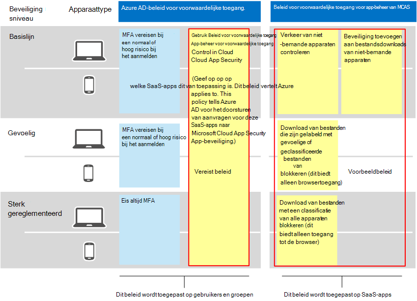
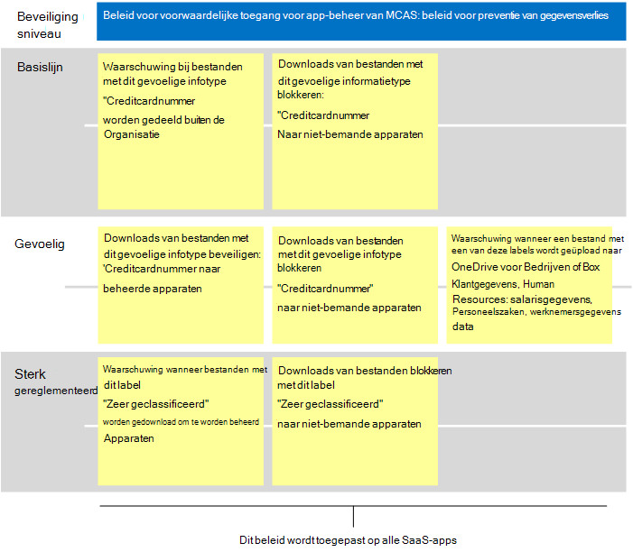

# Aanbevolen Microsoft Cloud App-beveiligingsbeleid voor SaaS-appsRecommended Microsoft Cloud App Security policies for SaaS apps
Microsoft Cloud App Security is gebaseerd op beleid voor voorwaardelijke toegang van Azure AD om het in realtime controleren en beheren van gedetailleerde acties met SaaS-apps mogelijk te maken, zoals het blokkeren van downloads, uploaden, kopiëren en plakken en afdrukken.Microsoft Cloud App Security builds on Azure AD conditional access policies to enable real-time monitoring and control of granular actions with SaaS apps, such as blocking downloads, uploads, copy and paste, and printing. Met deze functie wordt beveiliging toegevoegd aan sessies die inherent risico's met zich brengen, zoals wanneer bedrijfsresources worden gebruikt vanaf niet-bemande apparaten of door gastgebruikers.This feature adds security to sessions that carry inherent risk, such as when corporate resources are accessed from unmanaged devices or by guest users. 

Microsoft Cloud App Security integreert ook inheems met Microsoft Information Protection, waarmee in realtime inhoud wordt gecontroleerd om gevoelige gegevens te vinden op basis van gevoelige informatietypen en gevoeligheidslabels en om passende actie te ondernemen.Microsoft Cloud App Security also integrates natively with Microsoft Information Protection, providing real-time content inspection to find sensitive data based on sensitive information types and sensitivity labels and to take appropriate action. 

Deze richtlijnen omvatten aanbevelingen voor deze scenario's:This guidance includes recommendations for these scenarios:
- SaaS-apps in IT-beheer brengenBring SaaS apps into IT management
- Beveiliging voor specifieke SaaS-apps afstemmenTune protection for specific SaaS apps
- Preventie van gegevensverlies (DLP) configureren om te voldoen aan gegevensbeschermingsvoorschriftenConfigure data loss prevention (DLP) to help comply with data protection regulations

## SaaS-apps in IT-beheer brengenBring SaaS apps into IT management

De eerste stap in het gebruik van Microsoft Cloud App Security voor het beheren van SaaS-apps is om deze te ontdekken en vervolgens toe te voegen aan uw Azure AD-tenant.The first step in using Microsoft Cloud App Security to manage SaaS apps is to discover these and then add them to your Azure AD tenant. Zie [SaaS-apps](https://docs.microsoft.com/cloud-app-security/tutorial-shadow-it)in uw netwerk ontdekken en beheren als u hulp nodig hebt bij detectie.If you need help with discovery, see [Discover and manage SaaS apps in your network](https://docs.microsoft.com/cloud-app-security/tutorial-shadow-it). Nadat u apps hebt gevonden, voegt [u deze toe aan uw Azure AD-tenant.](https://docs.microsoft.com/azure/active-directory/manage-apps/add-application-portal)After you've discovered apps, [add these to your Azure AD tenant](https://docs.microsoft.com/azure/active-directory/manage-apps/add-application-portal).  

U kunt beginnen deze te beheren door het volgende te doen:You can begin to manage these by doing the following:
1. Maak eerst in Azure AD een nieuw beleid voor voorwaardelijke toegang en configureer dit in 'Voorwaardelijke toegang app-beheer gebruiken'.First, in Azure AD, create a new conditional access policy and configure it to "Use Conditional Access App Control." Hiermee wordt de aanvraag omgeleid naar Cloud App Security.This redirects the request to Cloud App Security. U kunt één beleid maken en alle SaaS-apps aan dit beleid toevoegen.You can create one policy and add all SaaS apps to this policy.
1. Maak vervolgens in Cloud App Security sessiebeleid.Next, in Cloud App Security, create session policies. Maak één beleid voor elk besturingselement dat u wilt toepassen.Create one policy for each control you want to apply. 

Machtigingen voor SaaS-apps zijn meestal gebaseerd op zakelijke behoefte aan toegang tot de app.Permissions to SaaS apps are typically based on business need for access to the app. Deze machtigingen kunnen zeer dynamisch zijn.These permissions can be highly dynamic. Het gebruik van cloud-appbeveiligingsbeleid zorgt voor beveiliging van app-gegevens, ongeacht of gebruikers zijn toegewezen aan een Azure AD-groep die is gekoppeld aan basislijnbeveiliging, gevoelige of sterk gereguleerde beveiliging.Using Cloud App Security policies ensures protection to app data, regardless of whether users are assigned to an Azure AD group associated with baseline, sensitive, or highly regulated protection.

Als u gegevens in uw verzameling SaaS-apps wilt beveiligen, wordt in het volgende diagram het benodigde beleid voor voorwaardelijke toegang van Azure AD en voorgestelde beleidsregels weergegeven die u kunt maken in Cloud App-beveiliging.To protect data across your collection of SaaS apps, the following diagram illustrates the necessary Azure AD conditional access policy plus suggested policies you can create in Cloud App Security. In dit voorbeeld zijn de beleidsregels die zijn gemaakt in Cloud App Security van toepassing op alle SaaS-apps die u beheert.In this example, the policies created in Cloud App Security apply to all SaaS apps you are managing. Deze zijn ontworpen om de juiste besturingselementen toe te passen op basis van de vraag of apparaten worden beheerd en gevoeligheidslabels die al op bestanden zijn toegepast.These are designed to apply appropriate controls based on whether devices are managed as well as sensitivity labels that are already applied to files. 

 

In de volgende tabel ziet u het nieuwe beleid voor voorwaardelijke toegang dat u moet maken in Azure AD.The following table lists the new conditional access policy you must create in Azure AD.

|BeveiligingsniveauProtection level|BeleidPolicy|Meer informatieMore information|
|---|---|---|
|Alle beveiligingsniveausAll protection levels | [Voorwaardelijke toegang app-beheer gebruiken in cloud-app-beveiligingUse Conditional Access App Control in Cloud App Security](https://docs.microsoft.com/cloud-app-security/proxy-deployment-aad#configure-integration-with-azure-ad) |Hiermee configureert u uw IdP (Azure AD) om te werken met Cloud App Security.This configures your IdP (Azure AD) to work with Cloud App Security. |

In deze volgende tabel ziet u het bovenstaande voorbeeldbeleid dat u kunt maken om alle SaaS-apps te beveiligen.This next table lists the example policies illustrated above that you can create to protect all SaaS apps. Zorg ervoor dat u uw eigen bedrijfs-, beveiligings- en compliancedoelstellingen evalueert en vervolgens beleid maakt dat de meest geschikte bescherming biedt voor uw omgeving.Be sure to evaluate your own business, security, and compliance objectives and then create policies that provide the most appropriate protection for your environment. 

|BeveiligingsniveauProtection level|BeleidPolicy|
|---|---|
|BasislijnBaseline | Verkeer van niet-bemande apparaten controlerenMonitor traffic from unmanaged devices  Beveiliging toevoegen aan bestandsdownloads van niet-bemande apparatenAdd protection to file downloads from unmanaged devices | 
|GevoeligSensitive  | Download van bestanden die zijn gelabeld met gevoelige of geclassificeerde bestanden van niet-bemande apparaten blokkeren (dit biedt alleen browsertoegang)Block download of files labeled with sensitive or classified from unmanaged devices (this provides browser only access)  | 
| Sterk gereglementeerdHighly regulated | Download van bestanden met een classificatie van alle apparaten blokkeren (dit biedt alleen toegang tot de browser)Block download of files labeled with classified from all devices (this provides browser only access)  |   
|  |   |  

Zie Appbesturingselement voor voorwaardelijke toegang implementeren voor aanbevolen apps voor end-to-endinstructies voor het instellen van Voorwaardelijke toegangsbeheer voor [apps.](https://docs.microsoft.com/cloud-app-security/proxy-deployment-aad)For end-to-end instructions for setting up Conditional Access App Control, see [Deploy Conditional Access App Control for featured apps](https://docs.microsoft.com/cloud-app-security/proxy-deployment-aad). In dit artikel wordt u beschreven hoe u het vereiste beleid voor voorwaardelijke toegang in Azure AD maakt en uw SaaS-apps test.This article walks you through the process of creating the necessary conditional access policy in Azure AD and testing your SaaS apps.

Zie Apps beveiligen met Microsoft Cloud App Security Conditional Access App Control voor meer [informatie.](https://docs.microsoft.com/cloud-app-security/proxy-intro-aad)For more information, see [Protect apps with Microsoft Cloud App Security Conditional Access App Control](https://docs.microsoft.com/cloud-app-security/proxy-intro-aad). 

## Beveiliging voor specifieke SaaS-apps afstemmenTune protection for specific SaaS apps
Mogelijk wilt u extra monitoring en besturingselementen toepassen op specifieke SaaS-apps in uw omgeving.You might want to apply additional monitoring and controls to specific SaaS apps in your environment. Cloud App Security stelt u in staat om dit te doen.Cloud App Security allows you to accomplish this. Als een app zoals Box bijvoorbeeld veel wordt gebruikt in uw omgeving, is het zinvol om extra besturingselementen toe te passen.For example, if an app like Box is used heavily in your environment, it makes sense to apply additional controls. Of als uw juridische of financiële afdeling een specifieke SaaS-app gebruikt voor gevoelige zakelijke gegevens, kunt u zich richten op extra beveiliging voor deze apps.Or, if your legal or finance department is using a specific SaaS app for sensitive business data, you can target extra protection to these apps. 

U kunt uw Box-omgeving bijvoorbeeld beveiligen met deze typen ingebouwde beleidssjablonen voor het opsporen van anomaly's:For example, you can protect your Box environment with these types of built-in anomaly detection policy templates:
- Activiteit van anonieme IP-adressenActivity from anonymous IP addresses
- Activiteit uit een niet-vaak landActivity from infrequent country
- Activiteit van verdachte IP-adressenActivity from suspicious IP addresses
- Onmogelijk reizenImpossible travel
- Activiteit uitgevoerd door beëindigde gebruiker (vereist AAD als IdP)Activity performed by terminated user (requires AAD as IdP)
- MalwaredetectieMalware detection
- Meerdere mislukte aanmeldingspogingenMultiple failed login attempts
- Ransomware-activiteitRansomware activity
- Riskante Oauth-appRisky Oauth App
- Ongebruikelijke activiteit voor het delen van bestandenUnusual file share activity

Dit zijn voorbeelden.These are examples. Er worden regelmatig aanvullende beleidssjablonen toegevoegd.Additional policy templates are added on a regular basis. Zie Verbonden [apps beveiligen](https://docs.microsoft.com/cloud-app-security/protect-connected-apps)voor voorbeelden van het toepassen van extra beveiliging op specifieke apps.For examples of how to apply additional protection to specific apps, see [Protecting connected apps](https://docs.microsoft.com/cloud-app-security/protect-connected-apps). 

[Hoe Cloud App Security uw Box-omgeving](https://docs.microsoft.com/cloud-app-security/protect-box) helpt beveiligen, toont de typen besturingselementen waarmee u uw zakelijke gegevens kunt beveiligen in Box en andere apps met gevoelige gegevens.[How Cloud App Security helps protect your Box environment](https://docs.microsoft.com/cloud-app-security/protect-box) demonstrates the types of controls that can help you protect your business data in Box and other apps with sensitive data.

## Preventie van gegevensverlies (DLP) configureren om te voldoen aan gegevensbeschermingsvoorschriftenConfigure data loss prevention (DLP) to help comply with data protection regulations

Cloud App Security kan een waardevol hulpmiddel zijn voor het configureren van beveiliging voor nalevingsregels.Cloud App Security can be a valuable tool for configuring protection for compliance regulations. In dit geval maakt u specifieke beleidsregels om te zoeken naar specifieke gegevens die door een verordening worden toegepast en om elk beleid zo te configureren dat de juiste actie wordt ondernomen.In this case, you create specific policies to look for specific data that a regulation applies to and configure each policy to take appropriate action. 

In de volgende afbeelding en tabel vindt u verschillende voorbeelden van beleidsregels die kunnen worden geconfigureerd om te voldoen aan de Algemene verordening gegevensbescherming (AVG).The following illustration and table provide several examples of policies that can be configured to help comply with  the General Data Protection Regulation (GDPR). In deze voorbeelden wordt in beleid naar specifieke gegevens op zoek.In these examples, policies look for specific data. Op basis van de gevoeligheid van de gegevens is elk beleid zo geconfigureerd dat de juiste actie wordt ondernomen.Based on the sensitivity of the data, each policy is configured to take appropriate action. 

|BeveiligingsniveauProtection level|VoorbeeldbeleidExample policies|
|:---------------|:-------|
| BasislijnBaseline |Waarschuwing wanneer bestanden met dit gevoelige informatietype ('Creditcardnummer') buiten de organisatie worden gedeeldAlert when files containing this sensitive information type ("Credit Card Number") are shared outside the organization   Downloads van bestanden met dit gevoelige informatietype ('Creditcardnummer') blokkeren op niet-bemande apparatenBlock downloads of files containing this sensitive information type (”Credit card number") to unmanaged devices|
| GevoeligSensitive  | Downloads van bestanden met dit gevoelige informatietype ('Creditcardnummer') beveiligen op beheerde apparatenProtect downloads of files containing this sensitive information type ("Credit card number") to managed devices   Downloads van bestanden met dit gevoelige informatietype ('Creditcardnummer') blokkeren op niet-bemande apparatenBlock downloads of files containing this sensitive information type ("Credit card number") to unmanaged devices   Waarschuwing wanneer een bestand met een van deze labels wordt geüpload naar OneDrive voor Bedrijven of Box (Klantgegevens, Personeelszaken: Salarisgegevens,Personeelszaken, Werknemersgegevens)Alert when a file with on of these labels is uploaded to OneDrive for Business or Box (Customer data, Human Resources: Salary Data,Human Resources, Employee data)|
| Sterk gereglementeerdHighly regulated |Waarschuwing wanneer bestanden met dit label ('Hoog geclassificeerd') worden gedownload naar beheerde apparatenAlert when files with this label ("Highly classified") are downloaded to managed devices 
Downloads van bestanden met dit label ('Hoog geclassificeerd') blokkeren op niet-bemande apparatenBlock downloads of files with this label ("Highly classified") to unmanaged devices |
| | |

## Volgende stappenNext steps

Zie Microsoft [Cloud App Security-documentatie](https://docs.microsoft.com//cloud-app-security/)voor meer informatie over het gebruik van cloud-appbeveiliging.For more information about using Cloud App Security, see [Microsoft Cloud App Security documentation](https://docs.microsoft.com//cloud-app-security/). 