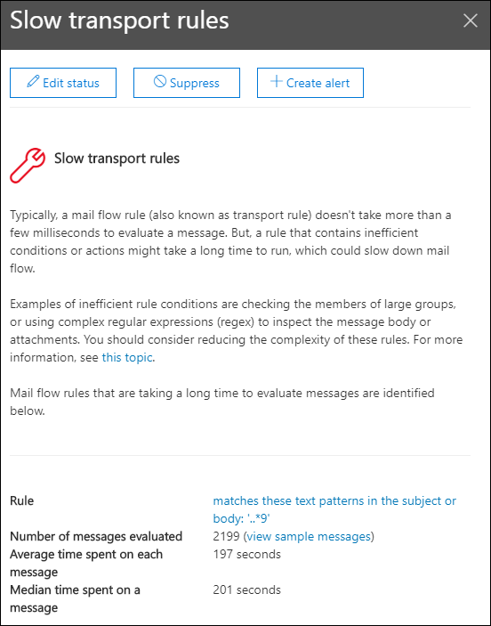

# Inzicht in regels voor trage e-mailstroom oplossen in het beveiligings- & compliancecentrum

[!INCLUDE [Microsoft 365 Defender rebranding](../includes/microsoft-defender-for-office.md)]

**Van toepassing op**
- [Exchange Online Protection](exchange-online-protection-overview.md)
- [Abonnement 1 en abonnement 2 voor Microsoft Defender voor Office 365](defender-for-office-365.md)
- [Microsoft 365 Defender](../defender/microsoft-365-defender.md)

Inefficiënte regels voor e-mailstroom (ook wel transportregels genoemd) kunnen leiden tot vertragingen in de e-mailstroom voor uw organisatie. In dit inzicht worden regels voor e-mailstroomrapporten berapportage die van invloed zijn op de e-mailstroom van uw organisatie. Voorbeelden van deze typen regels zijn:

- Voorwaarden die gebruik maken **van Is lid van** voor grote groepen.
- Voorwaarden die gebruikmaken van complexe regulier expressiepatroon (regex).
- Voorwaarden voor het inchecken van bijlagen met inhoud.

Het **inzicht** in regels voor  trage e-mailstroom oplossen in het gebied Aanbevolen voor u van het e-mailstroomdashboard [in](mail-flow-insights-v2.md) het Compliancecentrum voor beveiliging [&](https://protection.office.com) meldt u wanneer het te lang duurt voordat een regel voor een e-mailstroom wordt voltooid.

Dit inzicht wordt alleen weergegeven nadat de voorwaarde is gedetecteerd (als u geen e-mailluss hebt, ziet u het inzicht niet).

U kunt deze melding gebruiken om e-mailstroomregels te identificeren en aan te passen om vertragingen in de e-mailstroom te verminderen.

Wanneer u op **Details weergeven** op de widget klikt, wordt er een flyout weergegeven met meer informatie:

- **Regel:** U kunt de muisaanwijzer boven de samenvatting houden om alle voorwaarden, uitzonderingen en acties van de regel weer te geven. U kunt op de samenvatting klikken om de regel te bewerken in het Exchange-beheercentrum (EAC).
- **Aantal geëvalueerde berichten:** U kunt op  **Voorbeeldberichten** weergeven klikken om de resultaten van bericht trace te bekijken voor een voorbeeld van de berichten die door de regel zijn beïnvloed.
- **Gemiddelde tijd besteed aan elk bericht**
- **Mediaan tijd besteed aan een bericht:** de middelste waarde die de bovenste helft scheidt van de onderste helft van de tijdsgegevens.

Zie Voorwaarden en uitzonderingen voor e-mailstroomregelen (predicaten) in Exchange Online voor meer informatie over voorwaarden en [uitzonderingen in regels voor e-mailstroom.](/Exchange/security-and-compliance/mail-flow-rules/conditions-and-exceptions)

## Zie ook

Zie E-mailstroominzichten in het Beveiligings- & compliancecentrum voor meer informatie over andere inzichten [in het e-mailstroomdashboard.](mail-flow-insights-v2.md)