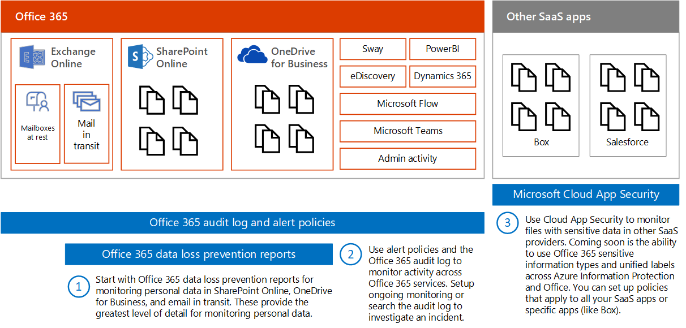
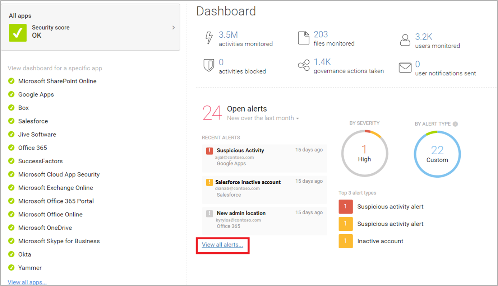

# Controleer op lekken van persoonlijke gegevens

[!INCLUDE [Microsoft 365 Defender rebranding](../includes/microsoft-defender-for-office.md)]

Er zijn veel hulpmiddelen die kunnen worden gebruikt om het gebruik en het transport van persoonlijke gegevens te bewaken. Dit onderwerp beschrijft drie hulpmiddelen die goed werken.

In de afbeelding:

- Begin met Microsoft 365-rapporten voor preventie van gegevensverlies voor het bewaken van persoonlijke gegevens in SharePoint Online, OneDrive voor Bedrijven en e-mail in transit. Deze rapporten geven het grootste detailniveau voor het bewaken van persoonlijke gegevens. Deze rapporten bevatten echter niet alle services in Office 365.

- Gebruik vervolgens waarschuwingsbeleid en het controlelogboek om de activiteit in alle services te controleren. Stel doorlopende bewaking in of doorzoek het auditlogboek om een incident te onderzoeken. Het auditlogboek werkt in alle services - Sway, Power BI, eDiscovery, Dynamics 365, Microsoft Flow, Microsoft Teams, Beheerdersactiviteit, OneDrive voor Bedrijven, SharePoint Online, mail in transit en postvakken in rust. Skype-gesprekken worden in de mailboxen in rust opgenomen.

- Ten slotte kunt u Microsoft Cloud App Security gebruiken om bestanden met gevoelige gegevens in andere SaaS-providers te bewaken. Binnenkort is het mogelijk om gevoelige informatietypen en geïntegreerde labels te gebruiken voor Azure Information Protection en Office met Cloud app Security. U kunt beleid instellen dat van toepassing is op al uw SaaS-apps of specifieke apps (zoals Box). Cloud App Security vindt geen bestanden in Exchange Online, inclusief bestanden die zijn bijgevoegd bij e-mail.

## Rapporten voor preventie van gegevensverlies

Nadat u uw DLP-beleid (Data Loss Prevention) heeft gemaakt, moet u controleren of het werkt zoals u het bedoeld heeft en of het u helpt om aan de regels te blijven voldoen. Met de DLP-rapporten in Office 365 kunt u snel het aantal DLP-beleidsovereenkomsten, onderdrukkingen of foutieve positieven bekijken. Zie of ze in de loop van de tijd omhoog of omlaag gaan, filter het rapport op verschillende manieren en bekijk meer details door een punt op een lijn in de grafiek te selecteren.

Met de DLP-rapporten kunt u het volgende doen:

- Focus op specifieke tijdsperiodes en begrijp de redenen voor pieken en trends.

- Ontdek bedrijfsprocessen die strijdig zijn met het DLP-beleid van uw organisatie.

- Begrijp de zakelijke impact van het DLP-beleid.

- Bekijk de redenen die door gebruikers zijn ingediend bij het oplossen van een beleidstip door het beleid te negeren of een fout-positief te melden.

- Controleer de naleving van een specifiek DLP-beleid door alle overeenkomsten voor dat beleid weer te geven.

- Bekijk een lijst met bestanden met gevoelige gegevens die overeenkomen met uw DLP-beleid in het detailvenster.

Daarnaast kunt u met de DLP-rapporten uw DLP-beleid nauwkeurig afstemmen terwijl u ze in de testmodus uitvoert.

DLP-rapporten zijn te vinden in het beveiligingscentrum en het compliancecentrum. Navigeer naar rapporten \> Rapporten weergeven. Ga onder preventie van gegevensverlies (DLP) naar DLP-beleid en regelovereenkomsten of DLP foute positieven en overschrijvingen.

Zie [de rapporten weergeven voor preventie van gegevensverlies](../../compliance/view-the-dlp-reports.md)voor meer informatie.

## controlelogboek en waarschuwingsbeleid

Het auditlogboek bevat gebeurtenissen van Exchange Online, SharePoint Online, OneDrive voor Bedrijven, Azure Active Directory, Microsoft Teams, Power BI, Sway en andere services.

Het beveiligingscentrum en het compliancecentrum bieden twee manieren om het auditlogboek te controleren en erover te rapporteren:

- Waarschuwingsbeleid instellen, waarschuwingen bekijken en trends volgen - Gebruik het waarschuwingsbeleid en de dashboardinstrumenten in het beveiligingscentrum of het compliancecentrum.

- Direct in het auditlogboek zoeken: Zoek naar alle gebeurtenissen in een gespecificeerd datumbereik. U kunt de resultaten ook filteren op basis van specifieke criteria, zoals de gebruiker die de actie heeft uitgevoerd, de actie of het doelobject.

Teams voor informatiebeveiliging en compliance kunnen deze hulpmiddelen gebruiken om proactief activiteiten te bekijken die worden uitgevoerd door zowel eindgebruikers als beheerders in services. Automatische waarschuwingen kunnen worden geconfigureerd om e-mailmeldingen te verzenden wanneer bepaalde activiteiten plaatsvinden op specifieke siteverzamelingen. Bijvoorbeeld wanneer inhoud wordt gedeeld van sites waarvan bekend is dat ze AVG-gerelateerde informatie bevatten. Hierdoor kunnen deze teams gebruikers opvolgen om ervoor te zorgen dat het beveiligingsbeleid van het bedrijf wordt gevolgd of om aanvullende training te geven.

Informatiebeveiligingsteams kunnen ook in het auditlogboek zoeken om vermoedelijke datalekken te onderzoeken en zowel de oorzaak als de omvang van de inbreuk te bepalen. Deze ingebouwde mogelijkheid vergemakkelijkt de naleving van artikel 33 en 34 van de AVG, die vereisen dat binnen een bepaalde periode meldingen worden gedaan aan de toezichthoudende autoriteit en aan de betrokkenen zelf van een datalek. Vermeldingen in het auditlogboek worden binnen de service slechts 90 dagen bewaard. Het wordt vaak aanbevolen en veel organisaties vereisen dat deze logboeken voor langere tijd worden bewaard.

Er zijn oplossingen beschikbaar die zich via de Microsoft Management Activity API abonneren op de Unified Audit Logs en die zowel logboekvermeldingen kunnen opslaan als geavanceerde dashboards en waarschuwingen kunnen bieden. Een voorbeeld is [Microsoft Operations Management Suite (OMS)](/azure/operations-management-suite/oms-solution-office-365).

Meer informatie over het waarschuwingsbeleid en het doorzoeken van het auditlogboek:

- [Waarschuwingsbeleid in de beveiligings- en compliancecentra van Microsoft 365](../../compliance/alert-policies.md)

- [Zoeken in het auditlogboek naar gebruikers- en beheerdersactiviteit in Office 365](../../compliance/search-the-audit-log-in-security-and-compliance.md) (Inleiding)

- [Auditlogboeken zoeken in- of uitschakelen](../../compliance/turn-audit-log-search-on-or-off.md).

- [Zoeken in het auditlogboek](../../compliance/search-the-audit-log-in-security-and-compliance.md)

- [Search-UnifiedAuditLog](/powershell/module/exchange/search-unifiedauditlog) (cmdlet)

- [Gedetailleerde eigenschappen in het auditlogboek](../../compliance/detailed-properties-in-the-office-365-audit-log.md)

## Microsoft Cloud App Security

Met Microsoft Cloud App Security kunt u andere SaaS-apps ontdekken die worden gebruikt in uw netwerken en gevoelige gegevens die van en naar deze apps zijn verzonden.

Microsoft Cloud App Security is een uitgebreide service die uitgebreide zichtbaarheid, gedetailleerde controle en verbeterde bescherming tegen bedreigingen biedt voor uw cloud-apps. Het identificeert meer dan 15.000 cloudtoepassingen in uw netwerk, vanaf alle apparaten, en biedt risicoanalyse en doorlopende risicobeoordeling en-analyse. Geen agents vereist: informatie verzameld uit uw firewalls en proxy's geeft u volledige zichtbaarheid en context voor het cloudgebruik en schaduw-IT.

Om uw cloudomgeving beter te begrijpen, biedt de Cloud App Security-onderzoeksfunctie uitgebreid inzicht in alle activiteiten, bestanden en accounts voor goedgekeurde en beheerde apps. U kunt gedetailleerde informatie op bestandsniveau verkrijgen en ontdekken waar gegevens naartoe gaan in de cloud-apps.

De volgende illustratie toont bijvoorbeeld twee Cloud App Security-beleidsregels die kunnen helpen bij AVG.

Het eerste beleid waarschuwt wanneer bestanden met een vooraf gedefinieerd PII-kenmerk of aangepaste expressie die u kiest, buiten de organisatie worden gedeeld vanuit de SaaS-apps die u kiest.

Het tweede beleid blokkeert het downloaden van bestanden naar een onbeheerd apparaat. U kiest de kenmerken in de bestanden waarnaar u wilt zoeken en de SaaS-apps waarop u het beleid wilt toepassen.

Deze kenmerktypen komen binnenkort beschikbaar in Cloud App Security:

- Gevoelige informatietypen
- Geïntegreerde labels in Microsoft 365 en Azure Information Protection

### Cloud App Security-dashboard

Als u de Cloud App Security nog niet gebruikt, begint u met het starten van de app. Voor toegang tot Cloud App Security: <https://portal.cloudappsecurity.com>.

Opmerking: zorg ervoor dat u 'Bestanden automatisch scannen naar classificatielabels van Azure Information Protection' (in Algemene instellingen) inschakelt wanneer u aan de slag gaat met Cloud App Security of voordat u labels toewijst. Na de installatie worden bestaande bestanden niet opnieuw gescand door Cloud App Security totdat ze worden gewijzigd.

Meer informatie:

- [Cloud App Security implementeren](/cloud-app-security/getting-started-with-cloud-app-security)

- [Meer informatie over Microsoft Cloud App Security](https://www.microsoft.com/cloud-platform/cloud-app-security)

- [Blokkeer downloads van gevoelige informatie met behulp van de Microsoft Cloud App Security-proxy](/cloud-app-security/use-case-proxy-block-session-aad)

## Voorbeeld van bestands- en activiteitenbeleid om het delen van persoonlijke gegevens te detecteren

### Het delen van bestanden met PII opsporen: creditcardnummer

Waarschuwen wanneer een bestand met een creditcardnummer wordt gedeeld vanuit een goedgekeurde cloud-app.

****

|Besturingselement|Instellingen|
|---|---|
|Beleidstype|Bestandsbeleid|
|Beleidssjabloon|Geen sjabloon|
|Ernst van beleid|Hoog|
|Categorie|DLP|
|Filterinstellingen|Toegangsniveau = openbaar (internet), openbaar, extern 
 App = \<select apps\> (gebruik deze instelling als je de bewaking wilt beperken tot specifieke SaaS-apps)|
|Toepassen op|Alle bestanden, alle eigenaren|
|Inhoudsinspectie|Bevat bestanden die voldoen aan een huidige expressie: alle landen: financiën: creditcardnummer 
 Vereis geen relevante context: niet aangevinkt (deze instelling komt zowel overeen met trefwoorden als met regex) 
 Bevat bestanden met ten minste 1 overeenkomst 
 De laatste vier tekens van de fout opsporen: ingeschakeld|
|Waarschuwingen|Een waarschuwing maken voor elk overeenkomend bestand: ingeschakeld 
 Dagelijkse waarschuwingslimiet: 1000 
 Een waarschuwing als e-mail selecteren: ingeschakeld 
 Aan: infosec@contoso.com|
|Beheermodel|Microsoft OneDrive voor Bedrijven 
 Privé maken: vink Externe gebruikers verwijderen aan. 
 Alle andere instellingen: uitgeschakeld 
 Microsoft SharePoint Online 
 Privé maken: vink Externe gebruikers verwijderen aan. 
 Alle andere instellingen: uitgeschakeld|
|

Vergelijkbare beleidsregels:

- Het delen van bestanden met PII-e-mailadres opsporen
- Het delen van bestanden met PII-paspoortnummer opsporen

### Detecteer klant- of HR-gegevens in Box of OneDrive voor Bedrijven

Waarschuwen wanneer een bestand met het label Klantgegevens of HR-gegevens wordt geüpload naar OneDrive voor Bedrijven of Box.

Opmerkingen:

- Voor het bewaken van Box moet een connector worden geconfigureerd met de API-connector SDK.
- Dit beleid vereist functies die momenteel in de preview-versie privé zijn.

****

|Besturingselement|Instellingen|
|---|---|
|Beleidstype|Activiteitenbeleid|
|Beleidssjabloon|Geen sjabloon|
|Ernst van beleid|Hoog|
|Categorie|Besturingselement delen|
|Reageren op|Afzonderlijke activiteit|
|Filterinstellingen|Activiteitstype = bestand uploaden 
 App = Microsoft OneDrive voor Bedrijven en Box 
 Classificatielabel (momenteel in privépreview): Azure Information Protection = klantgegevens, personeelszaken (salarisgegevens, personeelszaken), werknemersgegevens|
|Waarschuwingen|Een waarschuwing maken: ingeschakeld 
 Dagelijkse waarschuwingslimiet: 1000 
 Een waarschuwing als e-mail selecteren: ingeschakeld 
 Aan: infosec@contoso.com|
|Beheermodel|Alle apps 
 Gebruiker in quarantaine plaatsen: ingeschakeld 
 Alle andere instellingen: uitgeschakeld 
 Office 365 
 Gebruiker in quarantaine plaatsen: ingeschakeld 
 Alle andere instellingen: uitgeschakeld|
|

Vergelijkbare beleidsregels:

- Detecteer grote downloads van klantgegevens of HR-gegevens - Waarschuw wanneer een groot aantal bestanden met klantgegevens of HR-gegevens in een korte periode wordt gedownload door een enkele gebruiker.
- Detecteer het delen van klant- en HR-gegevens - Waarschuw wanneer bestanden met klant- of HR-gegevens worden gedeeld.