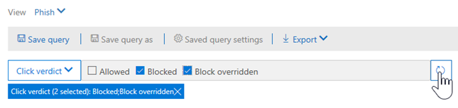

# Weergaven in Threat Explorer en realtime detectiesViews in Threat Explorer and real-time detections

[!INCLUDE [Microsoft 365 Defender rebranding](../includes/microsoft-defender-for-office.md)]

**Van toepassing op****Applies to**
- [Abonnement 1 en abonnement 2 voor Microsoft Defender voor Office 365Microsoft Defender for Office 365 plan 1 and plan 2](defender-for-office-365.md)
- [Microsoft 365 DefenderMicrosoft 365 Defender](../defender/microsoft-365-defender.md)

[Threat Explorer](threat-explorer.md) (en het realtimedetectierapport) is een krachtig, bijna realtime hulpprogramma waarmee beveiligingsteams bedreigingen kunnen onderzoeken en beantwoorden in het Beveiligings- & Compliancecentrum.[Threat Explorer](threat-explorer.md) (and the real-time detections report) is a powerful, near real-time tool to help Security Operations teams investigate and respond to threats in the Security & Compliance Center. Explorer (en het realtimedetectierapport) geeft informatie weer over verdachte malware en phish in e-mail en bestanden in Office 365, evenals andere beveiligingsrisico's en risico's voor uw organisatie.Explorer (and the real-time detections report) displays information about suspected malware and phish in email and files in Office 365, as well as other security threats and risks to your organization.

- Als u [Microsoft Defender voor Office 365](defender-for-office-365.md) Abonnement 2 hebt, hebt u Explorer.If you have [Microsoft Defender for Office 365](defender-for-office-365.md) Plan 2, then you have Explorer.
- Als u Microsoft Defender voor Office 365 Abonnement 1 hebt, hebt u realtime detecties.If you have Microsoft Defender for Office 365 Plan 1, then you have real-time detections.

Wanneer u Explorer (of het realtimedetectierapport) voor het eerst opent, worden in de standaardweergave detecties van e-mail malware voor de afgelopen 7 dagen weergegeven.When you first open Explorer (or the real-time detections report), the default view shows email malware detections for the past 7 days. Dit rapport kan ook Microsoft Defender voor Office 365-detecties tonen, zoals schadelijke URL's die zijn gedetecteerd door veilige koppelingen [en](safe-links.md)schadelijke bestanden die zijn gedetecteerd door [veilige bijlagen.](safe-attachments.md)This report can also show Microsoft Defender for Office 365 detections, such as malicious URLs detected by [Safe Links](safe-links.md), and malicious files detected by [Safe Attachments](safe-attachments.md). Dit rapport kan worden gewijzigd om gegevens van de afgelopen 30 dagen weer te geven (met een betaald Abonnement op Microsoft Defender voor Office 365 P2).This report can be modified to show data for the past 30 days (with a Microsoft Defender for Office 365 P2 paid subscription). Proefabonnementen bevatten alleen gegevens over de afgelopen zeven dagen.Trial subscriptions will include data for the past seven days only.

****

|AbonnementSubscription|HulpprogrammaUtility|Dagen van gegevensDays of Data|
|---|---|---|
|Proefversie van Microsoft Defender voor Office 365 P1Microsoft Defender for Office 365 P1 trial|Detecties in realtimeReal-time detections|77|
|Microsoft Defender voor Office 365 P1 betaaldMicrosoft Defender for Office 365 P1 paid|Detecties in realtimeReal-time detections|3030|
|Microsoft Defender voor Office 365 P1 betaalde proefversie van Defender voor Office 365 P2Microsoft Defender for Office 365 P1 paid testing Defender for Office 365 P2 trial|BedreigingsverkennerThreat Explorer|77|
|Proefversie van Microsoft Defender voor Office 365 P2Microsoft Defender for Office 365 P2 trial|BedreigingsverkennerThreat Explorer|77|
|Microsoft Defender voor Office 365 P2 betaaldMicrosoft Defender for Office 365 P2 paid|BedreigingsverkennerThreat Explorer|3030|
|

> [!NOTE]
> Binnenkort wordt de bewaar- en zoeklimiet voor proeften tenants uitgebreid van 7 naar 30 dagen voor het bewaren en zoeken van gegevens in Explorer (en realtimedetecties).We will soon be extending the Explorer (and Real-time detections) data retention and search limit for trial tenants from 7 to 30 days. Deze wijziging wordt bijgehouden als onderdeel van routekaartitem 70544 en is momenteel in een uitrolfase.This change is being tracked as part of roadmap item no. 70544, and is currently in a roll-out phase.

Gebruik **het** menu Beeld om te wijzigen welke gegevens worden weergegeven.Use the **View** menu to change what information is displayed. Met knopinfo kunt u bepalen welke weergave u wilt gebruiken.Tooltips help you determine which view to use.

Nadat u een weergave hebt geselecteerd, kunt u filters toepassen en query's instellen om verdere analyse uit te voeren.Once you have selected a view, you can apply filters and set up queries to conduct further analysis. In de volgende secties ziet u een kort overzicht van de verschillende weergaven die beschikbaar zijn in Explorer (of realtime detecties).The following sections provide a brief overview of the various views available in Explorer (or real-time detections).

## E-mail > MalwareEmail > Malware

Als u dit rapport wilt bekijken, kiest u in Explorer (of realtime detecties) **de optie E-mail malware** \>  \> **weergeven.**To view this report, in Explorer (or real-time detections), choose **View** \> **Email** \> **Malware**. In deze weergave ziet u informatie over e-mailberichten die zijn geïdentificeerd als malware.This view shows information about email messages that were identified as containing malware.

Klik **op Afzender** om uw lijst met weergaveopties te openen.Click **Sender** to open your list of viewing options. Gebruik deze lijst om gegevens weer te geven op afzender, geadresseerden, afzenderdomein, onderwerp, detectietechnologie, beveiligingsstatus en meer.Use this list to view data by sender, recipients, sender domain, subject, detection technology, protection status, and more.

Als u bijvoorbeeld wilt zien welke acties zijn ondernomen voor gedetecteerde e-mailberichten, kiest u **Beveiligingsstatus** in de lijst.For example, to see what actions were taken on detected email messages, choose **Protection status** in the list. Selecteer een optie en klik vervolgens op de knop Vernieuwen om dat filter toe te passen op uw rapport.Select an option, and then click the Refresh button to apply that filter to your report.

Bekijk onder de grafiek meer informatie over specifieke berichten.Below the chart, view more details about specific messages. Wanneer u een item in de lijst selecteert, wordt er een fly-outvenster geopend, waar u meer informatie kunt vinden over het item dat u hebt geselecteerd.When you select an item in the list, a fly-out pane opens, where you can learn more about the item you selected.

## E-mail > PhishEmail > Phish

Als u dit rapport wilt bekijken, kiest u in Explorer (of realtime detecties) **de** optie \> **E-mail** \> **phish weergeven.**To view this report, in Explorer (or real-time detections), choose **View** \> **Email** \> **Phish**. In deze weergave ziet u e-mailberichten die zijn geïdentificeerd als phishingpogingen.This view shows email messages identified as phishing attempts.

Klik **op Afzender** om uw lijst met weergaveopties te openen.Click **Sender** to open your list of viewing options. Gebruik deze lijst om gegevens te bekijken op afzender, geadresseerden, afzenderdomein, AFZENDER-IP, URL-domein, klik op vonnis en meer.Use this list to view data by sender, recipients, sender domain, sender IP, URL domain, click verdict, and more.

Als u bijvoorbeeld wilt zien welke acties zijn ondernomen wanneer personen op URL's klikten die zijn geïdentificeerd als phishingpogingen, kiest u Op vonnis **klikken** in de lijst, selecteert u een of meer opties en klikt u vervolgens op de knop Vernieuwen.For example, to see what actions were taken when people clicked on URLs that were identified as phishing attempts, choose **Click verdict** in the list, select one or more options, and then click the Refresh button.

Bekijk onder de grafiek meer informatie over specifieke berichten, URL-klikken, URL's en e-mail origin.Below the chart, view more details about specific messages, URL clicks, URLs, and email origin.

Wanneer u een item in de lijst selecteert, zoals een URL die is gedetecteerd, wordt een uitvliegend deelvenster geopend, waar u meer informatie kunt vinden over het item dat u hebt geselecteerd.When you select an item in the list, such as a URL that was detected, a fly-out pane opens, where you can learn more about the item you selected.

## E-> InzendingenEmail > Submissions

Als u dit rapport wilt bekijken, kiest u in Explorer (of realtime detecties) **de** optie \>  \> **E-mailverzending weergeven.**To view this report, in Explorer (or real-time detections), choose **View** \> **Email** \> **Submissions**. In deze weergave ziet u e-mail die gebruikers hebben gerapporteerd als ongewenste e-mail, geen ongewenste e-mail of phishing-e-mail.This view shows email that users have reported as junk, not junk, or phishing email.

Klik **op Afzender** om uw lijst met weergaveopties te openen.Click **Sender** to open your list of viewing options. Gebruik deze lijst om gegevens weer te geven op afzender, geadresseerden, rapporttype (de gebruiker heeft vastgesteld dat de e-mail ongewenste e-mail was, geen ongewenste e-mail of phish) en meer.Use this list to view information by sender, recipients, report type (the user's determination that the email was junk, not junk, or phish), and more.

Als u bijvoorbeeld informatie wilt weergeven over e-mailberichten die zijn gerapporteerd als phishingpogingen, klikt u op **Afzenderrapporttype,** selecteert u Phish en klikt u \> vervolgens op de knop Vernieuwen. For example, to view information about email messages that were reported as phishing attempts, click **Sender** \> **Report type**, select **Phish**, and then click the Refresh button.

Bekijk onder de grafiek meer informatie over specifieke e-mailberichten, zoals onderwerpregel, HET IP-adres van de afzender, de gebruiker die het bericht heeft gerapporteerd als ongewenste e-mail, geen ongewenste e-mail of phish, en meer.Below the chart, view more details about specific email messages, such as subject line, the sender's IP address, the user that reported the message as junk, not junk, or phish, and more.

Selecteer een item in de lijst om extra details weer te geven.Select an item in the list to view additional details.

## E-> Alle e-mailEmail > All email

Als u dit rapport wilt bekijken, kiest u in Verkenner **De optie** \> **E-mail** \> **weergeven alle e-mail.**To view this report, in Explorer, choose **View** \> **Email** \> **All mail**. In deze weergaven ziet u een overzicht van e-mailactiviteit, inclusief e-mail die als schadelijk is geïdentificeerd vanwege phishing of malware, evenals alle niet-schadelijke e-mail (normale e-mail, spam en bulkmail).This views shows an all-up view of email activity, including email identified as malicious due to phishing or malware, as well all non-malicious mail (normal email, spam, and bulk mail).

> [!NOTE]
> Als u een foutmelding krijgt met te veel gegevens om weer te **geven,** voegt u een filter toe en beperkt u zo nodig het datumbereik dat u bekijkt.If you get an error that reads **Too much data to display**, add a filter and, if necessary, narrow the date range you're viewing.

Als u een filter wilt toepassen, kiest u **Afzender,** selecteert u een item in de lijst en klikt u vervolgens op de knop Vernieuwen.To apply a filter, choose **Sender**, select an item in the list, and then click the Refresh button. In ons voorbeeld hebben we **detectietechnologie gebruikt** als filter (er zijn verschillende opties beschikbaar).In our example, we used **Detection technology** as a filter (there are several options available). Gegevens weergeven per afzender, het domein van de afzender, geadresseerden, onderwerp, bijlagebestandsnaam, malwarefamilie, beveiligingsstatus (acties die zijn ondernomen door uw beveiligingsfuncties en beleidsregels voor bedreigingen in Office 365), detectietechnologie (hoe de malware is gedetecteerd) en meer.View information by sender, sender's domain, recipients, subject, attachment filename, malware family, protection status (actions taken by your threat protection features and policies in Office 365), detection technology (how the malware was detected), and more.

Bekijk onder de grafiek meer informatie over specifieke e-mailberichten, zoals onderwerpregel, geadresseerde, afzender, status, en dergelijke.Below the chart, view more details about specific email messages, such as subject line, recipient, sender, status, and so on.

## Inhoud > MalwareContent > Malware

Als u dit rapport wilt bekijken, kiest u in Explorer (of realtime detecties) de optie  \> **Inhoudsmalware** \> **weergeven.**To view this report, in Explorer (or real-time detections), choose **View** \> **Content** \> **Malware**. In deze weergave ziet u bestanden die zijn geïdentificeerd als schadelijk door Microsoft Defender voor [Office 365 in SharePoint Online, OneDrive voor](mdo-for-spo-odb-and-teams.md)Bedrijven en Microsoft Teams.This view shows files that were identified as malicious by [Microsoft Defender for Office 365 in SharePoint Online, OneDrive for Business, and Microsoft Teams](mdo-for-spo-odb-and-teams.md).

Informatie weergeven via malwarefamilie, detectietechnologie (hoe de malware is gedetecteerd) en werkbelasting (OneDrive, SharePoint of Teams).View information by malware family, detection technology (how the malware was detected), and workload (OneDrive, SharePoint, or Teams).

Bekijk onder de grafiek meer informatie over specifieke bestanden, zoals bestandsnaam van bijlagen, werkbelasting, bestandsgrootte, wie het bestand het laatst heeft gewijzigd en meer.Below the chart, view more details about specific files, such as attachment filename, workload, file size, who last modified the file, and more.

## Klik-en-filtermogelijkhedenClick-to-filter capabilities

Met Explorer (en realtimedetecties) kunt u met één klik een filter toepassen.With Explorer (and real-time detections), you can apply a filter in a click. Klik op een item in de legenda en dat item wordt een filter voor het rapport.Click an item in the legend, and that item becomes a filter for the report. Stel dat we kijken naar de weergave Malware in Explorer:For example, suppose we are looking at the Malware view in Explorer:

Als u in **deze grafiek op ATP-detonatie** klikt, ziet u de volgende weergave:Clicking **ATP Detonation** in this chart results in a view like this:

In deze weergave bekijken we nu gegevens voor bestanden die zijn tot leven gebracht door [veilige bijlagen.](safe-attachments.md)In this view, we are now looking at data for files that were detonated by [Safe Attachments](safe-attachments.md). Onder de grafiek ziet u details over specifieke e-mailberichten met bijlagen die zijn gedetecteerd door veilige bijlagen.Below the chart, we can see details about specific email messages that had attachments that were detected by Safe Attachments.

Als u een of meer items selecteert, wordt het **menu** Acties geactiveerd, waarin verschillende opties worden weergegeven waaruit u kunt kiezen voor het geselecteerde item(en).Selecting one or more items activates the **Actions** menu, which offers several choices from which to choose for the selected item(s).

De mogelijkheid om in een klik te filteren en naar specifieke details te navigeren, kan u veel tijd besparen bij het onderzoeken van bedreigingen.The ability to filter in a click and navigate to specific details can save you a lot of time in investigating threats.

## Query's en filtersQueries and filters

Explorer (evenals het realtimedetectierapport) beschikt over verschillende krachtige filters en query's waarmee u kunt inzoomen op details, zoals de meest gerichte gebruikers, de beste malwarefamilies, detectietechnologie en meer.Explorer (as well as the real-time detections report) has several powerful filters and querying capabilities that enable you to drill into details, such as top targeted users, top malware families, detection technology and more. Elk type rapport biedt verschillende manieren om gegevens weer te geven en te verkennen.Each kind of report offers a variety of ways to view and explore data.

> [!IMPORTANT]
> Gebruik geen jokertekens, zoals een sterretje of een vraagteken, in de querybalk voor Explorer (of realtime detecties).Do not use wildcard characters, such as an asterisk or a question mark, in the query bar for Explorer (or real-time detections). Wanneer u in het veld **Onderwerp** zoekt naar e-mailberichten, worden in Verkenner (of realtimedetecties) gedeeltelijke overeenkomsten en resultaten weergegeven die lijken op een jokertekenzoekactie.When you search on the **Subject field** for email messages, Explorer (or real-time detections) will perform partial matching and yield results similar to a wildcard search.
