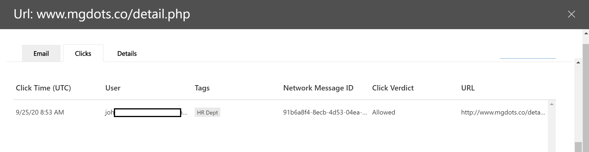
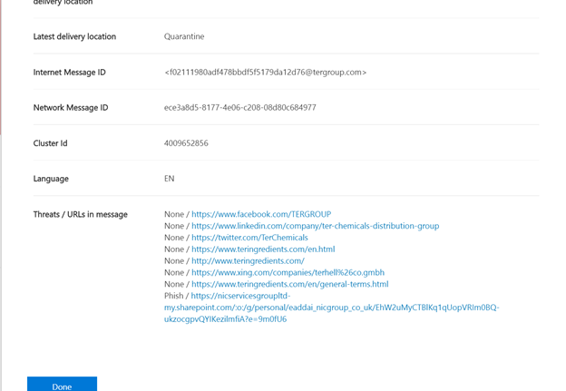
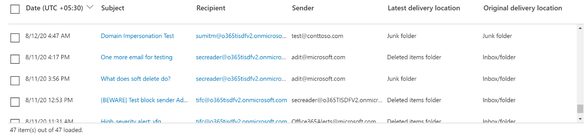
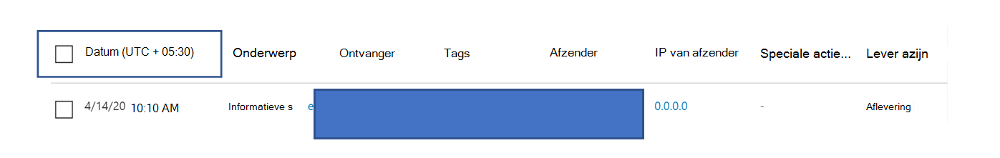
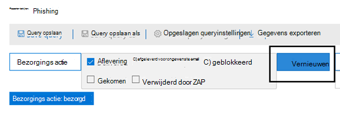

# Bedreigingsverkenner en realtimedetecties

**Van toepassing op**
- [Abonnement 1 en abonnement 2 voor Microsoft Defender voor Office 365](defender-for-office-365.md)
- [Microsoft 365 Defender](../defender/microsoft-365-defender.md)

Als uw organisatie Microsoft Defender voor [Office 365](defender-for-office-365.md)heeft en u beschikt over de benodigde machtigingen, beschikt u over **Explorer-** of **Realtimedetecties** (voorheen *Realtime-rapporten-* zie wat er nieuw is !). Ga in het & Compliancecentrum naar **Bedreigingsbeheer** en kies **explorer** _of_ **realtime detecties.**

|Met Microsoft Defender voor Office 365 Plan 2 ziet u:|Met Microsoft Defender voor Office 365 Plan 1 ziet u:|
|---|---|
|||
|

Explorer- of realtimedetecties helpen uw beveiligingsteam om bedreigingen efficiënt te onderzoeken en te beantwoorden. Het rapport lijkt op de volgende afbeelding:

Met dit rapport kunt u het volgende doen:

- [Malware zien die is gedetecteerd door beveiligingsfuncties van Microsoft 365](#see-malware-detected-in-email-by-technology)
- [Phishing-URL weergeven en op vonnisgegevens klikken](#view-phishing-url-and-click-verdict-data)
- [Een geautomatiseerd onderzoek- en antwoordproces starten vanuit een weergave in Explorer](#start-automated-investigation-and-response) (alleen Defender voor Office 365-abonnement 2)
- [Schadelijke e-mail onderzoeken en meer](#more-ways-to-use-explorer-and-real-time-detections)

## Verbeteringen in threat hunting experience

### Introductie van waarschuwings-id voor MDO-waarschuwingen in Explorer/Realtimedetecties (preview)
Als u vandaag van een waarschuwing naar Threat Explorer navigeert, wordt er een gefilterde weergave geopend in de Verkenner, met de weergave gefilterd op waarschuwingsbeleids-id (beleids-id is een unieke id voor een waarschuwingsbeleid).
We maken deze integratie relevanter door de waarschuwings-id (zie een voorbeeld van waarschuwings-id hieronder) in Threat Explorer en real-time detecties te introduceren, zodat u berichten ziet die relevant zijn voor de specifieke waarschuwing, evenals een aantal e-mailberichten. U kunt ook zien of een bericht deel uitmaakte van een waarschuwing en van dat bericht naar de specifieke waarschuwing navigeren.  

Waarschuwings-id is beschikbaar in de URL wanneer u een afzonderlijke waarschuwing bekijkt. een voorbeeld `https://protection.office.com/viewalerts?id=372c9b5b-a6c3-5847-fa00-08d8abb04ef1`

> [!div class="mx-imgBorder"]
> 

> [!div class="mx-imgBorder"]
> 

 
### De bewaar- en zoeklimiet voor proeften tenants verlengen van 7 naar 30 dagen (Preview) voor het bewaren en zoeken van gegevens in Explorer (en realtimedetecties)  
Als onderdeel van deze wijziging kunt u e-mailgegevens zoeken en filteren over 30 dagen (een toename ten opzichte van de vorige 7 dagen) in Threat Explorer/Real-time detecties voor zowel Defender voor Office P1- als P2-proeften tenants. Dit heeft geen invloed op productieten tenants voor zowel P1- als P2/E5-klanten, die al de mogelijkheden voor het bewaren en zoeken van 30 dagen hebben. 

### Bijgewerkte limieten voor het exporteren van records voor Threat Explorer (Preview) 
Als onderdeel van deze update wordt het aantal rijen voor e-mailrecords dat kan worden geëxporteerd vanuit Threat Explorer verhoogd van 9990 naar 200.000 records. De reeks kolommen die momenteel kan worden geëxporteerd, blijft hetzelfde, maar het aantal rijen wordt groter dan de huidige limiet.

### Tags in Threat Explorer

> [!NOTE]
> De functie gebruikerslabels is beschikbaar in *Preview,* is niet voor iedereen beschikbaar en kan worden gewijzigd. Raadpleeg de routekaart voor Microsoft 365 voor meer informatie over de releaseplanning.

Gebruikerslabels identificeren specifieke groepen gebruikers in Microsoft Defender voor Office 365. Zie Gebruikerslabels voor meer informatie over tags, waaronder licenties en [configuratie.](user-tags.md)

In Threat Explorer ziet u informatie over gebruikerslabels in de volgende ervaringen.

#### E-mailrasterweergave

De **kolom** Tags in het e-mailraster bevat alle tags die zijn toegepast op de postvakken van de afzender of geadresseerde. Systeemlabels zoals prioriteitsaccounts worden standaard eerst weergegeven.

> [!div class="mx-imgBorder"]
> 

#### Filteren

U kunt tags gebruiken als filter. Jaag alleen op prioriteitsaccounts of specifieke scenario's voor gebruikerslabels. U kunt ook resultaten met bepaalde tags uitsluiten. Combineer deze functionaliteit met andere filters om het onderzoeksbereik te beperken.

> [!div class="mx-imgBorder"]
> 

#### Flyout voor e-maildetails
Als u de afzonderlijke tags voor afzender en geadresseerde wilt weergeven, selecteert u het onderwerp om de flyout berichtdetails te openen. Op het **tabblad** Overzicht worden de afzender- en geadresseerdelabels afzonderlijk weergegeven, als ze aanwezig zijn voor een e-mail.
De informatie over afzonderlijke tags voor afzender en geadresseerde strekt zich ook uit tot geëxporteerde CSV-gegevens, waar u deze details in twee afzonderlijke kolommen kunt zien.

> [!div class="mx-imgBorder"]
> 

Informatie over tags wordt ook weergegeven in de flyout klikken op URL's. Als u de weergave wilt bekijken, gaat u naar de weergave Phish of Alle e-mail en gaat u naar het tabblad **URL's** **of URL-klikken.** Selecteer een individuele URL-flyout om meer informatie te bekijken over klikken voor die URL, inclusief tags die aan die klik zijn gekoppeld.

### Bijgewerkte tijdlijnweergave

> [!div class="mx-imgBorder"]
> 

## Verbeteringen in de bedreigingsjachtervaring (binnenkort)

### Bijgewerkte bedreigingsgegevens voor e-mailberichten

We hebben ons gericht op verbeteringen van platform- en gegevenskwaliteit om de nauwkeurigheid en consistentie van gegevens voor e-mailrecords te vergroten. Verbeteringen zijn onder andere het samenvoegen van gegevens vóór de bezorging en de postbezorging, zoals acties die op een e-mail als onderdeel van het ZAP-proces worden uitgevoerd, in één record. Aanvullende details, zoals spamuitspraak, bedreigingen op entiteitsniveau (bijvoorbeeld welke URL schadelijk was) en de meest recente bezorgingslocaties worden ook opgenomen.

Na deze updates ziet u één item voor elk bericht, ongeacht de verschillende gebeurtenissen na de bezorging die van invloed zijn op het bericht. Acties kunnen ZAP, handmatige herstelacties (wat beheerdersactie betekent), dynamische bezorging, en meer, omvatten.

U ziet niet alleen malware- en phishingrisico's, maar ook de spam-uitspraak die is gekoppeld aan een e-mail. Bekijk in het e-mailbericht alle bedreigingen die aan de e-mail zijn gekoppeld, samen met de bijbehorende detectietechnologieën. Een e-mailbericht kan nul, één of meerdere bedreigingen hebben. U ziet de huidige bedreigingen in de **sectie Details** van de e-mail flyout. Voor meerdere bedreigingen (zoals malware  en phishing) wordt in het veld Detectietechnologie de detectie van bedreigingen in kaart gebracht. Dit is de detectietechnologie waarmee de bedreiging is geïdentificeerd.

De set detectietechnologieën bevat nu nieuwe detectiemethoden en spamdetectietechnologieën. U kunt dezelfde set detectietechnologieën gebruiken om de resultaten te filteren in de verschillende e-mailweergaven (Malware, Phish, Alle e-mail).

> [!NOTE]
> Vonnisanalyse is mogelijk niet per se gekoppeld aan entiteiten. Een e-mailbericht kan bijvoorbeeld worden geclassificeerd als phish of spam, maar er zijn geen URL's met een phish-/spam-uitspraak. Dit komt omdat de filters ook inhoud en andere details voor een e-mailbericht evalueren voordat u een vonnis toewijst.

#### Bedreigingen in URL's

U kunt nu de specifieke bedreiging voor een  URL zien op het tabblad Details van de e-mail flyout. De bedreiging kan *malware,* *phish,* *spam* of *geen malware zijn*.)

> [!div class="mx-imgBorder"]
> 

### Bijgewerkte tijdlijnweergave (binnenkort)

> [!div class="mx-imgBorder"]
> 

In de tijdlijnweergave worden alle bezorgings- en postbezorgingsgebeurtenissen aangegeven. Het bevat informatie over de bedreiging die op dat moment is geïdentificeerd voor een subset van deze gebeurtenissen. De tijdlijnweergave bevat ook informatie over eventuele aanvullende acties die worden ondernomen (zoals ZAP of handmatige herstel), samen met het resultaat van die actie. Informatie over de tijdlijnweergave bevat:

- **Bron:** Bron van de gebeurtenis. Dit kan beheerder/systeem/gebruiker zijn.
- **Gebeurtenis:** Bevat gebeurtenissen op het hoogste niveau, zoals oorspronkelijke bezorging, handmatige herstel, ZAP, inzendingen en dynamische bezorging.
- **Actie:** De specifieke actie die is ondernomen als onderdeel van ZAP- of beheeractie (bijvoorbeeld soft delete).
- **Bedreigingen:** Bestrijkt de bedreigingen (malware, phish, spam) die op dat moment zijn geïdentificeerd.
- **Resultaat/details:** Meer informatie over het resultaat van de actie, zoals of deze is uitgevoerd als onderdeel van zap/beheeractie.

### Oorspronkelijke en meest recente bezorgingslocatie

Momenteel komen we de bezorgingslocatie boven in het e-mailraster en de e-mail flyout. Het **veld Bezorgingslocatie** krijgt de naam **_Oorspronkelijke bezorgingslocatie_*_. En we introduceren een ander veld, _*_Meest recente bezorgingslocatie_**.

**De oorspronkelijke bezorgingslocatie** geeft meer informatie over waar een e-mailbericht in eerste instantie is bezorgd. **De meest recente** bezorgingslocatie geeft aan waar een e-mailbericht is geland na systeemacties zoals *ZAP* of beheeracties, zoals *Verplaatsen naar verwijderde items.* De meest recente bezorgingslocatie is bedoeld om beheerders de laatst bekende locatie van het bericht na de bezorging of eventuele systeem-/beheeracties te vertellen. De e-mail bevat geen acties van eindgebruikers. Als een gebruiker bijvoorbeeld een bericht heeft verwijderd of het bericht naar archief/pst heeft verplaatst, wordt de locatie van het bericht 'bezorging' niet bijgewerkt. Maar als een systeemactie de locatie heeft bijgewerkt (bijvoorbeeld ZAP waardoor een e-mailbericht naar quarantaine wordt **verplaatst),** wordt de locatie van de meest recente bezorging als 'quarantaine' gebruikt.

> [!div class="mx-imgBorder"]
> 

> [!NOTE]
> Er zijn een paar gevallen waarin **bezorgingslocatie** en **bezorgingsactie** als 'onbekend' kunnen worden genoemd:
>
> - Mogelijk ziet  u bezorgingslocatie  als 'bezorgd' en bezorgingslocatie als 'onbekend' als het bericht is bezorgd, maar met een regel Postvak IN is het bericht verplaatst naar een standaardmap (zoals Concept of Archief) in plaats van naar de map Postvak IN of Ongewenste e-mail.
>
> - **De meest recente** bezorgingslocatie kan onbekend zijn als een beheerder/systeemactie (zoals ZAP) is geprobeerd, maar het bericht is niet gevonden. Meestal vindt de actie plaats nadat de gebruiker het bericht heeft verplaatst of verwijderd. Controleer in dergelijke gevallen de kolom **Resultaat/details** in de tijdlijnweergave. Zoek naar de instructie 'Bericht verplaatst of verwijderd door de gebruiker'.

> [!div class="mx-imgBorder"]
> 

### Aanvullende acties

*Na de* bezorging van het e-mailbericht zijn aanvullende acties toegepast. Ze kunnen *ZAP,* *handmatige* herstel (actie van een beheerder zoals soft *delete),* dynamische bezorging en opwerking *bevatten* (voor een e-mail die met terugwerkende kracht als goed is gedetecteerd).

> [!NOTE]
> - Als onderdeel van de wijzigingen die in behandeling zijn, gaat de waarde 'Verwijderd door ZAP' die momenteel in het filter Bezorgingsactie wordt opgedoken, weg. U hebt een manier om alle e-mail te zoeken met de ZAP-poging via **Aanvullende acties.**
>
> - Er komen nieuwe velden en waarden voor **detectietechnologieën** en **Aanvullende acties** (met name voor ZAP-scenario's). U moet uw bestaande opgeslagen query's en bijgeslagen query's evalueren om ervoor te zorgen dat ze met de nieuwe waarden werken.

> [!div class="mx-imgBorder"]

> 

### Systeem overschrijven

*Met systeemonderschrijven* kunt u uitzonderingen maken op de gewenste bezorgingslocatie van een bericht. U overschrijven de bezorgingslocatie die door het systeem wordt geleverd, op basis van de bedreigingen en andere detecties die zijn geïdentificeerd door de filtertack. Systeem overschrijven kan worden ingesteld via tenant- of gebruikersbeleid om het bericht te verzenden zoals wordt voorgesteld door het beleid. Bij overschrijven kunnen onbedoelde bezorging van schadelijke berichten worden vastgesteld vanwege hiaten in configuraties, zoals een te breed beleid voor veilige afzenders dat door een gebruiker is ingesteld. Deze overschrijven waarden kunnen de volgende zijn:

- Toegestaan door gebruikersbeleid: een gebruiker maakt beleid op postvakniveau om domeinen of afzenders toe te laten.
- Geblokkeerd door gebruikersbeleid: een gebruiker maakt beleid op het e-mailvakniveau om domeinen of afzenders te blokkeren.
- Toegestaan door organisatiebeleid: de beveiligingsteams van de organisatie stellen beleidsregels of Exchange-regels voor e-mailstroom (ook wel transportregels genoemd) in om afzenders en domeinen toe te staan voor gebruikers in hun organisatie. Dit kan voor een set gebruikers of de hele organisatie zijn.
- Geblokkeerd door organisatiebeleid: de beveiligingsteams van de organisatie stellen beleidsregels of e-mailstroomregels in om afzenders, domeinen, berichttalen of bron-IPs te blokkeren voor gebruikers in hun organisatie. Dit kan worden toegepast op een set gebruikers of de hele organisatie.
- Bestandsextensie geblokkeerd door organisatiebeleid: Het beveiligingsteam van een organisatie blokkeert een bestandsnaamextensie via de anti-malwarebeleidsinstellingen. Deze waarden worden nu weergegeven in e-maildetails om te helpen bij onderzoeken. Secops-teams kunnen ook de functie voor uitgebreide filtering gebruiken om te filteren op geblokkeerde bestandsextensies.

> [!div class="mx-imgBorder"]
> 

### Verbeteringen voor de URL- en klikervaring

De verbeteringen zijn onder andere:

- De volledig geklikte URL (inclusief queryparameters die  deel uitmaken van de URL) in de sectie Klikken van de URL-flyout. Momenteel worden het URL-domein en het pad weergegeven op de titelbalk. We breiden deze informatie uit om de volledige URL weer te geven.

- Fixes across URL filters (*URL* versus *URL domain* versus URL domain and path ): The updates *affect* searching for messages that contain a URL/click verdict. We hebben ondersteuning ingeschakeld voor protocol-agnostische zoekopdrachten, zodat u kunt zoeken naar een URL zonder gebruik te maken `http` van . Standaard wordt de URL naar http gezoekt, tenzij er expliciet een andere waarde is opgegeven. Bijvoorbeeld:

   -  Zoek met en zonder het `http://` voorvoegsel in de **velden URL,** **URL-domein** en **URL-domein en pad.** De zoekopdrachten moeten dezelfde resultaten geven.

   -  Zoek naar het `https://` voorvoegsel in **URL.** Wanneer er geen waarde is opgegeven, wordt het `http://` voorvoegsel aangenomen.

   - `/`wordt genegeerd aan het begin en einde van het URL-pad, **URL-domein,** **URL-domein en padvelden.**  `/` aan het einde van het **URL-veld** wordt genegeerd.

### Phish-betrouwbaarheidsniveau

Phish betrouwbaarheidsniveau helpt bij het bepalen van de mate van vertrouwen waarmee een e-mailbericht is gecategoriseerd als 'phish'. De twee mogelijke waarden zijn *Hoog* en *Normaal.* In de beginfase is dit filter alleen beschikbaar in de Phish-weergave van Threat Explorer.

### ZAP URL-signaal

Het ZAP URL-signaal wordt meestal gebruikt voor ZAP Phish-waarschuwingsscenario's waarbij een e-mailbericht is geïdentificeerd als Phish en na de bezorging is verwijderd. Met dit signaal wordt de waarschuwing verbonden met de bijbehorende resultaten in Explorer. Het is een van de IOC's voor de waarschuwing.

Om het zoekproces te verbeteren, hebben we Threat Explorer en Realtime detecties bijgewerkt om de jachtervaring consistenter te maken. De wijzigingen worden hier beschreven:

- [Tijdzoneverbeteringen](#timezone-improvements)
- [Bijwerken in het vernieuwingsproces](#update-in-the-refresh-process)
- [Grafiek inzoomen om toe te voegen aan filters](#chart-drilldown-to-add-to-filters)
- [In productgegevensupdates](#in-product-information-updates)

### Filteren op gebruikerslabels

U kunt nu sorteren en filteren op systeem- of aangepaste gebruikerslabels om snel het bereik van bedreigingen te begrijpen. Zie Gebruikerslabels voor [meer informatie.](user-tags.md)

> [!IMPORTANT]
> Filteren en sorteren op gebruikerslabels is momenteel in een openbaar voorbeeld. Deze functionaliteit kan aanzienlijk worden gewijzigd voordat deze commercieel wordt uitgebracht. Microsoft biedt geen garanties, uitdrukkelijk of impliciet, met betrekking tot de informatie die erover wordt verstrekt.

### Tijdzoneverbeteringen

U ziet de tijdzone voor de e-mailrecords in de Portal en voor geëxporteerde gegevens. Deze is zichtbaar in verschillende ervaringen zoals e-mailraster, flyout Details, E-mailtijdlijn en soortgelijke e-mailberichten, zodat de tijdzone voor de resultatenset duidelijk is.

> [!div class="mx-imgBorder"]
> 

### Bijwerken in het vernieuwingsproces

Sommige gebruikers hebben opmerkingen gemaakt over verwarring met automatische vernieuwing (bijvoorbeeld zodra u de datum wijzigt, wordt de pagina vernieuwd) en handmatig vernieuwen (voor andere filters). Op dezelfde manier leidt het verwijderen van filters tot automatisch vernieuwen. Het wijzigen van filters tijdens het wijzigen van de query kan inconsistente zoekervaringen veroorzaken. Om deze problemen op te lossen, gaan we over naar een mechanisme voor handmatig filteren.

Vanuit ervaringsstandpunt kan de gebruiker het verschillende filterbereik toepassen en verwijderen (uit de filterset en -datum) en de knop Vernieuwen selecteren om de resultaten te filteren nadat ze de query hebben gedefinieerd. De knop Vernieuwen wordt nu ook benadrukt op het scherm. We hebben ook de bijbehorende tooltips en documentatie in het product bijgewerkt.

> [!div class="mx-imgBorder"]
> 

### Grafiek inzoomen om toe te voegen aan filters

U kunt nu legendawaarden grafieken toevoegen als filters. Selecteer de **knop** Vernieuwen om de resultaten te filteren.

> [!div class="mx-imgBorder"]
> 

### Updates voor in-productgegevens

Extra details zijn nu beschikbaar in het product, zoals het totale aantal zoekresultaten in het raster (zie hieronder). We hebben labels, foutberichten en knopinfo verbeterd voor meer informatie over de filters, de zoekervaring en de resultatenset.

> [!div class="mx-imgBorder"]
> 

## Uitgebreide mogelijkheden in Threat Explorer

### Best getargete gebruikers

Vandaag wordt de lijst met de meest gerichte gebruikers weergegeven in de malwareweergave voor e-mailberichten in de **sectie Top Malware Families.** We breiden deze weergave ook uit in de weergaven Phish en Alle e-mail. U kunt de vijf meest gerichte gebruikers zien, samen met het aantal pogingen voor elke gebruiker voor de bijbehorende weergave. In de Phish-weergave ziet u bijvoorbeeld het aantal Phish-pogingen.

U kunt de lijst met doelgebruikers exporteren, tot een limiet van 3.000, samen met het aantal pogingen voor offlineanalyse voor elke e-mailweergave. Als u het aantal pogingen selecteert (bijvoorbeeld 13 pogingen in de onderstaande afbeelding), wordt een gefilterde weergave geopend in Threat Explorer, zodat u meer informatie over e-mailberichten en bedreigingen voor die gebruiker kunt zien.

> [!div class="mx-imgBorder"]
> 

### Exchange-transportregels

Als onderdeel van gegevensverrijking kunt u alle verschillende Exchange-transportregels (ETR) zien die zijn toegepast op een bericht. Deze informatie is beschikbaar in de weergave E-mailraster. Als u deze wilt weergeven, **selecteert u Kolomopties** in het raster en voegt **u exchange-transportregel toe** vanuit de kolomopties. Deze is ook zichtbaar op de flyout **Details** in de e-mail.

U kunt zowel de GUID als de naam zien van de transportregels die op het bericht zijn toegepast. U kunt de berichten zoeken met de naam van de transportregel. Dit is een zoekopdracht 'Bevat', wat betekent dat u ook gedeeltelijke zoekopdrachten kunt doen.

#### Belangrijke opmerking:

De beschikbaarheid van ETR-zoekopdrachten en -namen is afhankelijk van de specifieke rol die aan u is toegewezen. U moet een van de volgende rollen/machtigingen hebben om de ETR-namen en zoekopdrachten weer te geven. Als u geen van deze rollen aan u hebt toegewezen, kunt u de namen van de transportregels niet zien of berichten zoeken met ETR-namen. U kunt echter wel het ETR-label en de GUID-informatie zien in de e-mailgegevens. Andere ervaringen met het weergeven van records in e-mailrasters, e-mail flyouts, Filters en Export worden niet beïnvloed.

- ALLEEN EXO - Preventie van gegevensverlies: alles
- ALLEEN EXO - O365SupportViewConfig: Alles
- Microsoft Azure Active Directory of EXO - Beveiligingsbeheerder: alles
- AAD of EXO - Beveiligingslezer: Alles
- ALLEEN EXO - Transportregels: Alles
- ALLEEN EXO - View-Only Configuratie: Alles

In het e-mailraster, de flyout Details en de geëxporteerde CSV worden de ETR's weergegeven met een Naam/GUID zoals hieronder wordt weergegeven.

> [!div class="mx-imgBorder"]
> 

### Binnenkomende verbindingslijnen

Connectors zijn een verzameling instructies die aanpassen hoe uw e-mail van en naar uw Microsoft 365- of Office 365-organisatie loopt. Hiermee kunt u beveiligingsbeperkingen of besturingselementen toepassen. In Threat Explorer kunt u nu de verbindingslijnen weergeven die zijn gerelateerd aan een e-mail en e-mailberichten zoeken met behulp van connectornamen.

Het zoeken naar verbindingslijnen is 'bevat' in de natuur, wat betekent dat gedeeltelijke trefwoordzoektermen ook moeten werken. In de hoofdrasterweergave, de flyout Details en de geëxporteerde CSV worden de verbindingslijnen weergegeven in de indeling Naam/GUID, zoals hier wordt weergegeven:

> [!div class="mx-imgBorder"]
> 

## Nieuwe functies in Threat Explorer en realtime detecties

- [Phishing-e-mailberichten weergeven die zijn verzonden naar gebruikers en domeinen die zijn nagebootsd](#view-phishing-emails-sent-to-impersonated-users-and-domains)
-  [Voorbeeld van e-mailkoptekst bekijken en e-mailtekst downloaden](#preview-email-header-and-download-email-body)
- [E-mailtijdlijn](#email-timeline)
- [URL exporteren klik op gegevens](#export-url-click-data)

### Phishing-e-mailberichten weergeven die zijn verzonden naar gebruikers en domeinen die zijn nagebootsd

Als u phishingpogingen wilt identificeren tegen gebruikers en domeinen die zich voordoen als gebruikers, moet u worden toegevoegd aan de lijst *met gebruikers die u wilt beveiligen.* Voor domeinen moeten beheerders Organisatiedomeinen inschakelen *of* een domeinnaam toevoegen *aan domeinen om ze te beveiligen.* De domeinen die u wilt beveiligen, vindt u op de *pagina Anti-Phishingbeleid* in de *sectie Imitatie.*

Als u phish-berichten wilt bekijken en wilt zoeken naar nagebootsde gebruikers of domeinen, gebruikt u de weergave [E-mail > Phish](threat-explorer-views.md) van Explorer.

In dit voorbeeld wordt Threat Explorer gebruikt.

1. Kies in [& Beveiligingscentrum](https://protection.office.com) https://protection.office.com) (kies Bedreigingsbeheer > Explorer (of Realtime detecties).

2. Kies in het menu Beeld de optie E-mail > Phish.

   Hier kunt u een **nagebootsd domein of** **een imiteerde gebruiker kiezen.**

3. **Selecteer** **Imitatiedomein en** typ vervolgens een beveiligd domein in het tekstvak.

   Zoek bijvoorbeeld naar beveiligde domeinnamen zoals *contoso,* *contoso.com* of *contoso.com.au.*

4. Selecteer het onderwerp van een bericht onder het tabblad E-mail > tabblad Details om aanvullende imitatiegegevens te zien, zoals Imiteerde domein/gedetecteerde locatie.

5. **OF** Selecteer **Imiteerde gebruiker** en typ het e-mailadres van een beveiligde gebruiker in het tekstvak.

6. Selecteer het **onderwerp** van een bericht **onder** het tabblad Details van e-mail om aanvullende imitatiegegevens te zien over de gebruiker of het domein en de  >   *gedetecteerde locatie.*

:::image type="content" source="../../media/threat-ex-views-impersonated-user-image.png" alt-text="Het detailvenster Bedreigingsverkenner voor een beveiligde gebruiker met de detectielocatie en de gedetecteerde bedreiging (hier phish imitatie van een gebruiker).":::

> [!TIP]
> **Gebruik volledige e-mailadressen** *om* beveiligde gebruikers te doorzoeken voor de beste resultaten. U vindt uw beveiligde gebruiker sneller en succesvoller als u zoekt naar *firstname.lastname@contoso.com,* bijvoorbeeld bij het onderzoeken van gebruikersremitatie. Bij het zoeken naar een beveiligd domein wordt het hoofddomein (bijvoorbeeld contoso.com) en de domeinnaam *(contoso) gebruikt.* Als u zoekt naar het *hoofddomein contoso.com* u zowel imitaties van contoso.com *als* de domeinnaam *contoso.*

### Voorbeeld van e-mailkoptekst bekijken en e-mailtekst downloaden

U kunt nu een voorbeeld van een e-mailkop bekijken en de hoofdtekst van de e-mail downloaden in Threat Explorer-beheerders kunnen gedownloade kopteksten/e-mailberichten analyseren op bedreigingen. Omdat het downloaden van e-mailberichten de blootstelling van informatie kan risico's met zich mee brengen, wordt dit proces bepaald door RBAC (Role-Based Access Control). Een nieuwe rol, *Preview,* moet worden toegevoegd aan een andere rollengroep (zoals Beveiligingsbewerkingen of Beveiligingsbeheerder) om e-mailberichten te kunnen downloaden in de weergave Alle e-mailberichten. Het weergeven van e-mailkoptekst vereist echter geen extra rol (anders dan wat nodig is om berichten weer te geven in Threat Explorer).

Explorer- en realtimedetecties krijgen ook nieuwe velden die een vollediger beeld geven van waar uw e-mailberichten terecht komen. Met deze wijzigingen kunt u gemakkelijker op zoek gaan naar Beveiligingsops. Maar het belangrijkste resultaat is dat u de locatie van probleem-e-mailberichten in één oogopslag weet.

Hoe wordt dit gedaan? De bezorgingsstatus is nu onderverdeeld in twee kolommen:

- **Bezorgingsactie** - Status van het e-mailbericht.
- **Bezorgingslocatie:** waar de e-mail is gerouteerd.

*Bezorgingsactie* is de actie die is ondernomen op een e-mail vanwege bestaand beleid of detecties. Hier volgen de mogelijke acties voor een e-mailbericht:

|Geleverd|Ongewenste e-mail|Geblokkeerd|Vervangen|
|---|---|---|---|
|E-mail is bezorgd in het Postvak IN of de map van een gebruiker en de gebruiker heeft er toegang toe.|E-mail is verzonden naar de map Ongewenste e-mail of Verwijderd van de gebruiker en de gebruiker heeft toegang tot de map.|E-mailberichten die in quarantaine zijn geplaatst, die zijn mislukt of die zijn gedropt. Deze e-mails zijn niet toegankelijk voor de gebruiker.|In e-mail zijn schadelijke bijlagen vervangen door .txt-bestanden waarin staat dat de bijlage schadelijk was.|

Dit is wat de gebruiker wel en niet kan zien:

|Toegankelijk voor eindgebruikers|Niet toegankelijk voor eindgebruikers|
|---|---|
|Geleverd|Geblokkeerd|
|Ongewenste e-mail|Vervangen|

**Bezorgingslocatie** toont de resultaten van beleidsregels en detecties die na de bezorging worden uitgevoerd. Deze is gekoppeld aan de **_actie Bezorging._** Dit zijn de mogelijke waarden:

- *Postvak IN of map:* De e-mail staat in het Postvak IN of in een map (volgens uw e-mailregels).
- *On-prem of extern:* het postvak bestaat niet in de cloud, maar is on-premises.
- *Map Ongewenste* e-mail: de e-mail staat in de map Ongewenste e-mail van een gebruiker.
- *Map Verwijderde items:* De e-mail in de map Verwijderde items van een gebruiker.
- *Quarantaine:* De e-mail is in quarantaine geplaatst en niet in het postvak van een gebruiker.
- *Mislukt:* het e-mailbericht kan het postvak niet bereiken.
- *Gedropt:* De e-mail is ergens in de e-mailstroom verloren gegaan.

### E-mailtijdlijn

De **e-mailtijdlijn** is een nieuwe Explorer-functie die de zoekervaring voor beheerders verbetert. Er wordt minder tijd besteed aan het controleren van verschillende locaties om te proberen de gebeurtenis te begrijpen. Wanneer er meerdere gebeurtenissen plaatsvinden op of dicht bij hetzelfde tijdstip waarop een e-mailbericht binnenkomt, worden deze gebeurtenissen weergegeven in een tijdlijnweergave. Sommige gebeurtenissen die gebeuren met uw e-mail na de bezorging, worden vastgelegd in de **kolom Speciale** actie. Beheerders kunnen gegevens uit de tijdlijn combineren met de speciale actie die is ondernomen voor de postbezorging van e-mail om inzicht te krijgen in hoe hun beleid werkt, waar de e-mail uiteindelijk is gerouteerd en, in sommige gevallen, wat de uiteindelijke beoordeling was.

Zie Schadelijke e-mail onderzoeken en herstellen die [is bezorgd in Office 365](investigate-malicious-email-that-was-delivered.md)voor meer informatie.

### URL exporteren klik op gegevens

U kunt nu rapporten voor URL-klikken exporteren naar Microsoft Excel om hun netwerkbericht-id weer te geven en op **vonnis** te klikken, waarmee wordt uitgelegd waar uw URL op verkeer is geklikt.  Dit werkt als volgt: Volg deze ketting in Threat Management op de werkbalk Snelstarten van Office 365:

**Explorer** \> **Phish weergeven** \> **Klikken** \> **Bovenste URL's** of **URL-klikken selecteert** \> u een record om de URL-flyout te openen.

Wanneer u een URL in de lijst selecteert, ziet u een nieuwe **knop Exporteren** in het fly-outvenster. Gebruik deze knop om gegevens naar een Excel-spreadsheet te verplaatsen voor eenvoudigere rapportage.

Volg dit pad om naar dezelfde locatie te gaan in het rapport Realtimedetecties:

**Explorer** \> **Realtime detecties** \> **Phish weergeven** \> **URL's** \> **Bovenste URL's** of **Bovenste klikken** Selecteer een record om de URL-flyout te openen \> en ga naar het tabblad \> **Klikken.**

> [!TIP]
> De netwerkbericht-id brengt de klik terug naar specifieke e-mailberichten wanneer u op de id zoekt via Explorer of de bijbehorende hulpprogramma's van derden. Dergelijke zoekopdrachten identificeren de e-mail die is gekoppeld aan een klikresultaat. Als u de gecorreleerde netwerkbericht-id hebt, kunt u sneller en krachtiger analyseren.

> [!div class="mx-imgBorder"]
> 

## Malware die is gedetecteerd in e-mail door technologie bekijken

Stel dat u malware wilt zien gedetecteerd in e-mail gesorteerd op Microsoft 365-technologie. Gebruik hiervoor de weergave [E-> Malware](threat-explorer-views.md#email--malware) van Explorer (of Realtime detecties).

1. Kies in & Beveiligingscentrum <https://protection.office.com> () **de** optie Threat Management \> **Explorer** (of **Realtime detecties).** (In dit voorbeeld wordt Verkenner gebruikt.)

2. Kies in **het** menu Beeld de optie **E-mail** \> **malware.**

   > [!div class="mx-imgBorder"]
   > 

3. Klik **op Afzender** en kies vervolgens **Basisdetectietechnologie.** \> 

   Uw detectietechnologieën zijn nu beschikbaar als filters voor het rapport.

   > [!div class="mx-imgBorder"]
   > 

4. Kies een optie. Selecteer vervolgens de **knop Vernieuwen** om dat filter toe te passen.

   > [!div class="mx-imgBorder"]
   > 

Het rapport wordt vernieuwd om de resultaten weer te geven die malware heeft gedetecteerd in e-mail, met de technologieoptie die u hebt geselecteerd. Hier kunt u verdere analyse uitvoeren.

## Phishing-URL weergeven en op vonnisgegevens klikken

Stel dat u phishingpogingen via URL's in e-mail wilt zien, inclusief een lijst met URL's die zijn toegestaan, geblokkeerd en overschrijven. Als u URL's wilt identificeren waar op is geklikt, [moeten](safe-links.md) veilige koppelingen zijn geconfigureerd. Zorg ervoor dat u beleidsregels voor [veilige koppelingen](set-up-safe-links-policies.md) in te stellen voor time-of-click beveiliging en logboekregistratie van klik-vonnissen door Veilige koppelingen.

Als u phish-URL's in berichten wilt bekijken en op URL's in phish-berichten wilt klikken, gebruikt u de weergave [ **E-mail**  >  **phish**](threat-explorer-views.md#email--phish) van Explorer of realtime detecties.

1. Kies in & Beveiligingscentrum <https://protection.office.com> () **de** optie Threat Management \> **Explorer** (of **Realtime detecties).** (In dit voorbeeld wordt Verkenner gebruikt.)

2. Kies in **het** menu Beeld de optie **E-mail** \> **phish**.

   > [!div class="mx-imgBorder"]
   > 

3. Klik **op Afzender** en kies **URL's Klik** op \> **vonnis.**

4. Selecteer een of meer opties, zoals **Geblokkeerd** en Geblokkeerd,  en selecteer vervolgens de knop Vernieuwen op dezelfde regel als de opties om dat filter toe te passen. (Vernieuw het browservenster niet.)

   > [!div class="mx-imgBorder"]
   > 

   Het rapport wordt vernieuwd om twee verschillende URL-tabellen weer te geven op het tabblad URL onder het rapport:

   - **Top-URL's** zijn de URL's in de berichten die u hebt gefilterd en de actie voor e-mailbezorging telt voor elke URL. In de phish-e-mailweergave bevat deze lijst meestal legitieme URL's. Aanvallers bevatten een combinatie van goede en slechte URL's in hun berichten om te proberen ze bezorgd te krijgen, maar ze maken de schadelijke koppelingen interessanter. De tabel met URL's wordt gesorteerd op totaal aantal e-mail, maar deze kolom is verborgen om de weergave te vereenvoudigen.

   - **De bovenste klikken** zijn de URL's met veilige koppelingen die zijn geklikt, gesorteerd op het totale aantal klikken. Deze kolom wordt ook niet weergegeven, om de weergave te vereenvoudigen. Het totaal aantal tellingen per kolom geeft aan dat het aantal veilige koppelingen klikken op vonnissen voor elke geklikte URL. In de phish-e-mailweergave zijn dit meestal verdachte of schadelijke URL's. Maar de weergave kan URL's bevatten die geen bedreigingen zijn, maar in phish-berichten staan. URL-klikken op niet-uitpakte koppelingen worden hier niet weergegeven.

   De twee URL-tabellen bevatten de beste URL's in phishing-e-mailberichten op bezorgingsactie en locatie. In de tabellen worden URL-klikken weergegeven die ondanks een waarschuwing zijn geblokkeerd of bezocht, zodat u kunt zien welke mogelijke slechte koppelingen aan gebruikers zijn gepresenteerd en waar de gebruiker op heeft geklikt. Hier kunt u verdere analyse uitvoeren. Onder de grafiek ziet u bijvoorbeeld de bovenste URL's in e-mailberichten die zijn geblokkeerd in de omgeving van uw organisatie.

   > [!div class="mx-imgBorder"]
   > 

   Selecteer een URL om meer gedetailleerde informatie weer te geven.

   > [!NOTE]
   > In het dialoogvenster URL-flyout wordt het filteren op e-mailberichten verwijderd om de volledige weergave van de blootstelling van de URL in uw omgeving weer te geven. Hiermee kunt u filteren op e-mailberichten waar u zich zorgen over maakt in Verkenner, specifieke URL's zoeken die potentiële bedreigingen zijn en vervolgens uw inzicht in de blootstelling aan URL's in uw omgeving uitbreiden (via het dialoogvenster URL-details) zonder URL-filters toe te voegen aan de Verkenner-weergave zelf.

### Interpretatie van click-vonnissen

In de fly-outs E-mail of URL, Top Clicks en in onze filterervaringen ziet u verschillende waarden voor klik-uitspraak:

- **Geen:** Kan de uitspraak voor de URL niet vastleggen. De gebruiker heeft mogelijk door de URL geklikt.
- **Toegestaan:** De gebruiker mocht naar de URL navigeren.
- **Geblokkeerd:** De gebruiker is geblokkeerd om naar de URL te navigeren.
- **Vonnis in behandeling:** De gebruiker heeft de pagina met detonatie in behandeling.
- **Geblokkeerde overschrijven:** De gebruiker is geblokkeerd om rechtstreeks naar de URL te navigeren. Maar de gebruiker overdroeed het blok om naar de URL te navigeren.
- **Vonnis in behandeling is omzeild:** De gebruiker kreeg de detonatiepagina te zien. Maar de gebruiker overdroeed het bericht om toegang te krijgen tot de URL.
- **Fout:** De gebruiker heeft de foutpagina te zien of er is een fout opgetreden bij het vastleggen van de uitspraak.
- **Fout:** Er is een onbekende uitzondering opgetreden tijdens het vastleggen van de uitspraak. De gebruiker heeft mogelijk door de URL geklikt.

## E-mailberichten controleren die zijn gerapporteerd door gebruikers

Stel dat u e-mailberichten wilt zien die gebruikers in uw organisatie hebben gerapporteerd als Ongewenste e-mail, Geen ongewenste [e-mail](enable-the-report-message-add-in.md) of *Phishing* via de invoeging Rapportbericht of via de invoeging [Phishing melden.](enable-the-report-phish-add-in.md) Als u ze wilt zien, gebruikt u de weergave [   >  E-mailverzending ](threat-explorer-views.md#email--submissions) van Explorer (of realtimedetecties).

1. Kies in & Beveiligingscentrum <https://protection.office.com> () **de** optie Threat Management \> **Explorer** (of **Realtime detecties).** (In dit voorbeeld wordt Verkenner gebruikt.)

2. Kies in **het** menu Beeld de optie  \> **E-mailinzendingen.**

   > [!div class="mx-imgBorder"]
   > 

3. Klik **op Afzender** en kies vervolgens  \> **Basisrapporttype.**

4. Selecteer een optie, zoals **Phish,** en selecteer vervolgens de **knop** Vernieuwen.

   > [!div class="mx-imgBorder"]
   > 

Het rapport wordt vernieuwd om gegevens weer te geven over e-mailberichten die personen in uw organisatie hebben gerapporteerd als een phishingpoging. U kunt deze informatie gebruiken om verdere analyse uit te voeren en zo nodig uw anti-phishingbeleid aan te passen [in Microsoft Defender voor Office 365.](configure-atp-anti-phishing-policies.md)

## Geautomatiseerde onderzoeken en antwoorden starten

> [!NOTE]
> Geautomatiseerde onderzoeks- en antwoordmogelijkheden zijn beschikbaar in *Microsoft Defender voor Office 365 Abonnement 2* en Office *365 E5.*

[Geautomatiseerde onderzoeken en antwoorden kunnen](automated-investigation-response-office.md) uw teamtijd en inspanning voor beveiligingsactiviteiten besparen bij het onderzoeken en verminderen van cyberaanvallen. Naast het configureren van waarschuwingen die een beveiligingss playbook kunnen activeren, kunt u een geautomatiseerd onderzoek en antwoordproces starten vanuit een weergave in Explorer. Zie Voorbeeld: Een beveiligingsbeheerder activeert een onderzoek [vanuit Verkenner voor meer informatie.](automated-investigation-response-office.md#example-a-security-administrator-triggers-an-investigation-from-threat-explorer)

## Meer manieren om Explorer- en realtimedetecties te gebruiken

Naast de scenario's die in dit artikel worden beschreven, zijn er nog veel meer rapportageopties beschikbaar met Explorer (of realtimedetecties). Zie de volgende artikelen:

- [Schadelijke e-mail zoeken en onderzoeken die is bezorgd](investigate-malicious-email-that-was-delivered.md)
- [Schadelijke bestanden weergeven die zijn gedetecteerd in SharePoint Online, OneDrive en Microsoft Teams](./mdo-for-spo-odb-and-teams.md)
- [Een overzicht krijgen van de weergaven in Threat Explorer (en realtime detecties)](threat-explorer-views.md)
- [Statusrapport bedreigingsbeveiliging](view-email-security-reports.md#threat-protection-status-report)
- [Geautomatiseerd onderzoek en antwoord in Microsoft Threat Protection](https://docs.microsoft.com/microsoft-365/security/defender/mtp-autoir)

## Vereiste licenties en machtigingen

U moet [Microsoft Defender voor Office 365](defender-for-office-365.md) hebben om Explorer- of realtimedetecties te kunnen gebruiken.

- Explorer is opgenomen in Defender voor Office 365-abonnement 2.
- Het realtimedetectierapport is opgenomen in Defender voor Office 365-abonnement 1.
- Plan het toewijzen van licenties voor alle gebruikers die moeten worden beveiligd door Defender voor Office 365. Explorer- en realtimedetecties tonen detectiegegevens voor gelicentieerde gebruikers.

Als u Explorer- of realtimedetecties wilt bekijken en gebruiken, moet u over de juiste machtigingen zijn, zoals machtigingen die zijn verleend aan een beveiligingsbeheerder of beveiligingslezer.

- Voor het beveiligings- & compliancecentrum moet u een van de volgende rollen hebben toegewezen:

  - Organisatiebeheer
  - Beveiligingsbeheerder (dit kan worden toegewezen in het Azure Active Directory-beheercentrum ( <https://aad.portal.azure.com> )
  - Beveiligingslezer

- Voor Exchange Online moet u een van de volgende rollen hebben toegewezen in het Exchange-beheercentrum () of <https://admin.protection.outlook.com/ecp/> [Exchange Online PowerShell:](/powershell/exchange/exchange-online-powershell)

  - Organisatiebeheer
  - View-Only Organisatiebeheer
  - View-Only Geadresseerden
  - Compliancebeheer

Zie de volgende bronnen voor meer informatie over rollen en machtigingen:

- [Machtigingen in het Beveiligings- en compliancecentrum](permissions-in-the-security-and-compliance-center.md)
- [Functiemachtigingen in Exchange Online](/exchange/permissions-exo/feature-permissions)

## Verschillen tussen Threat Explorer en Realtime detecties

- Het *realtimedetectierapport* is beschikbaar in Defender voor Office 365-abonnement 1. *Threat Explorer* is beschikbaar in Defender voor Office 365 Plan 2.
- Met het rapport Realtimedetecties kunt u detecties in realtime bekijken. Threat Explorer doet dit ook, maar biedt ook extra details voor een bepaalde aanval.
- Een *weergave Alle e-mail* is beschikbaar in Threat Explorer, maar niet in het rapport Realtimedetecties.
- Meer filtermogelijkheden en beschikbare acties zijn opgenomen in Threat Explorer. Zie Microsoft Defender for [Office 365 Service Description: Feature availability across Defender for Office 365 plans (Beschikbaarheid van functies in Defender voor Office 365-abonnementen)](/office365/servicedescriptions/office-365-advanced-threat-protection-service-description#feature-availability-across-advanced-threat-protection-atp-plans)voor meer informatie.

## Andere artikelen

[E-mailberichten onderzoeken met de pagina E-mailentiteit](mdo-email-entity-page.md)