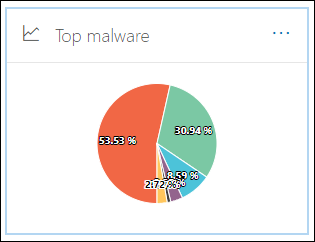

# E-mailbeveiligingsrapporten bekijken in het Beveiligings- en compliancecentrumView email security reports in the Security & Compliance Center

[!INCLUDE [Microsoft 365 Defender rebranding](../includes/microsoft-defender-for-office.md)]

**Van toepassing op****Applies to**
- [Exchange Online ProtectionExchange Online Protection](exchange-online-protection-overview.md)
- [Abonnement 1 en abonnement 2 voor Microsoft Defender voor Office 365Microsoft Defender for Office 365 plan 1 and plan 2](defender-for-office-365.md)
- [Microsoft 365 DefenderMicrosoft 365 Defender](../defender/microsoft-365-defender.md)

Er zijn diverse rapporten beschikbaar in het [beveiligings- & compliancecentrum](https://protection.office.com) om te zien hoe e-mailbeveiligingsfuncties, zoals antispam, anti-malware en versleutelingsfuncties in Microsoft 365 uw organisatie beschermen.A variety of reports are available in the [Security & Compliance Center](https://protection.office.com) to help you see how email security features, such as anti-spam, anti-malware, and encryption features in Microsoft 365 are protecting your organization. Als u de [benodigde machtigingen hebt,](#what-permissions-are-needed-to-view-these-reports)kunt u deze rapporten bekijken in het Beveiligings- & compliancecentrum door naar  \> **Rapportendashboard** te gaan.If you have the [necessary permissions](#what-permissions-are-needed-to-view-these-reports), you can view these reports in the Security & Compliance Center by going to **Reports** \> **Dashboard**. Als u rechtstreeks naar het dashboard Rapporten wilt gaan, opent u <https://protection.office.com/insightdashboard> .To go directly to the Reports dashboard, open <https://protection.office.com/insightdashboard>.

## Rapport over gecompromitteerde gebruikersCompromised users report

> [!NOTE]
> Dit rapport is beschikbaar in Microsoft 365-organisaties met Exchange Online-postvakken.This report is available in Microsoft 365 organizations with Exchange Online mailboxes. Het is niet beschikbaar in zelfstandige EOP-organisaties (Exchange Online Protection).It's not available in standalone Exchange Online Protection (EOP) organizations.

In **het rapport Gecompromitteerde** gebruikers ziet  u  het aantal gebruikersaccounts dat in de afgelopen 7 dagen is gemarkeerd als Verdacht of Beperkt.The **Compromised users** report shows shows the number of user accounts that were marked as **Suspicious** or **Restricted** within the last 7 days. Accounts in een van deze staten zijn problematisch of zelfs gecompromitteerd.Accounts in either of these states are problematic or even compromised. Met regelmatig gebruik kunt u het rapport gebruiken om pieken en zelfs trends te herkennen in verdachte of beperkte accounts.With frequent use, you can use the report to spot spikes, and even trends, in suspicious or restricted accounts. Zie Reageren op een gekromd e-mailaccount voor meer informatie over gecompromitteerde [gebruikers.](responding-to-a-compromised-email-account.md)For more information about compromised users, see [Responding to a compromised email account](responding-to-a-compromised-email-account.md).

De statistische weergave bevat gegevens van de afgelopen 90 dagen en de detailweergave bevat gegevens van de afgelopen 30 dagen.The aggregate view shows data for the last 90 days and the detail view shows data for the last 30 days.

Als u het rapport wilt bekijken, opent u  het [beveiligingscentrum & compliancecentrum,](https://protection.office.com)gaat u naar Het \> **dashboard Rapporten** en selecteert u **Gecompromitteerde gebruikers.**To view the report, open the [Security & Compliance Center](https://protection.office.com), go to **Reports** \> **Dashboard** and select **Compromised users**. Als u rechtstreeks naar het rapport wilt gaan, opent u <https://protection.office.com/reportv2?id=CompromisedUsers> .To go directly to the report, open <https://protection.office.com/reportv2?id=CompromisedUsers>.

U kunt zowel de grafiek als de detailtabel filteren door op **Filters** te klikken en een of meer van de volgende waarden te selecteren:You can filter both the chart and the details table by clicking **Filters** and selecting one or more of the following values:

- **Begindatum** en **einddatum****Start date** and **End date**

- **Verdacht:** Het gebruikersaccount heeft verdachte e-mailberichten verzonden en loopt het risico dat het niet meer kan worden verzonden.**Suspicious**: The user account has sent suspicious email and is at risk of being restricted from sending email.

- **Beperkt:** Het gebruikersaccount is beperkt tot het verzenden van e-mail vanwege zeer verdachte patronen.**Restricted**: The user account has been restricted from sending email due to highly suspicious patterns.

Als u op **Detailstabel weergeven klikt,** ziet u de volgende details:If you click **View details table**, you can see the following details:

- **Aanmaaktijd****Creation time**
- **Gebruikers-id****User ID**
- **Actie****Action**

Als u terug wilt gaan naar de rapportweergave, klikt u op **Rapport weergeven.**To go back to the report view, click **View report**.

## VersleutelingsrapportEncryption report

Het **versleutelingsrapport** is beschikbaar in EOP (abonnementen met postvakken in Exchange Online of zelfstandige EOP zonder Exchange Online-postvakken).The **Encryption report** is available in EOP (subscriptions with mailboxes in Exchange Online or standalone EOP without Exchange Online mailboxes). Het beveiligingsteam van uw organisatie kan informatie in dit rapport gebruiken om patronen te identificeren en beleidsregels proactief toe te passen of aan te passen voor gevoelige e-mailberichten.Your organization's security team can use information in this report to identify patterns and proactively apply or adjust policies for sensitive email messages. Bijvoorbeeld:For example:

- Als er een groot aantal e-mailberichten wordt versleuteld door gebruikers, kunt u een versleutelingsbeleid toevoegen om versleuteling voor bepaalde gebruiksgevallen te automatiseren.If you see a high number of email messages encrypted by users, you might want to add an encryption policy to automate encryption for certain use cases. Zie Regels voor e-mailstroom definiëren om e-mailberichten te versleutelen [in Microsoft 365](../../compliance/define-mail-flow-rules-to-encrypt-email.md)voor meer informatie.For more information, see [Define mail flow rules to encrypt email messages in Microsoft 365](../../compliance/define-mail-flow-rules-to-encrypt-email.md).

- Als u een aantal versleutelingssjablonen beschikbaar hebt, maar niemand deze gebruikt, kunt u onderzoeken of gebruikers functietraining nodig hebben.If you have a number of encryption templates available but no one is using them, you might explore whether users need feature training.

Met de statistische weergave kunt u filteren voor de afgelopen 90 dagen, terwijl in de detailweergave 10 dagen kan worden gefilterd.The aggregate view allows filtering for the last 90 days, while the detail view allows filtering for 10 days.

Als u het rapport wilt bekijken, opent u het [Beveiligings- & Compliancecentrum,](https://protection.office.com)gaat u **naar** \> **Rapportendashboard** en selecteert u **Versleutelingsrapport.**To view the report, open the [Security & Compliance Center](https://protection.office.com), go to **Reports** \> **Dashboard** and select **Encryption report**. Als u rechtstreeks naar het rapport wilt gaan, opent u <https://protection.office.com/reportv2?id=EncryptionReport> .To go directly to the report, open <https://protection.office.com/reportv2?id=EncryptionReport>.

Zie E-mailversleuteling [in Microsoft 365](../../compliance/email-encryption.md)voor meer informatie over versleuteling.To learn more about encryption, see [Email encryption in Microsoft 365](../../compliance/email-encryption.md).

### Rapportweergave voor het versleutelingsrapportReport view for the Encryption report

U kunt de volgende filters in de grafiek gebruiken:You can use the following filters on the chart:

- **Gegevens weergeven op: Berichtversleutelingsrapport** en **Afbreed door: Versleutelingsmethode:** De volgende versleutelingsmethoden zijn beschikbaar:**View data by: Message Encryption Report** and **Break down by: Encryption method**: The following encryption methods are available:

  - **Versleuteling door gebruiker****Encryption by user**
  - **Versleuteling per beleid****Encryption by policy**

  Als u op **Filters klikt,** kunt u de grafiek wijzigen met de volgende filters:If you click **Filters**, you can modify the chart with the following filters:

  - **Begindatum** en **einddatum****Start date** and **End date**
  - Versleutelingsmethode.Encryption method.
  - Versleutelingssjabloon.Encryption template.

- **Gegevens weergeven op: Berichtversleutelingsrapport** en **Afbreed door: Versleutelingssjabloon:** De volgende versleutelingsmethoden zijn beschikbaar:**View data by: Message Encryption Report** and **Break down by: Encryption template**: The following encryption methods are available:

  - **Niet doorsturen****Do not forward**
  - **Alleen versleutelen****Encrypt only**
  - **OME vorige****OME previous**
  - **Aangepast****Custom**

  Als u op **Filters klikt,** kunt u de grafiek wijzigen met de volgende filters:If you click **Filters**, you can modify the chart with the following filters:

  - **Begindatum** en **einddatum****Start date** and **End date**
  - VersleutelingsmethodeEncryption method
  - VersleutelingssjabloonEncryption template

- **Gegevens weergeven op: Top 5 geadresseerdedomeinen:** In deze weergave ziet u een cirkeldiagram met verzonden berichttellingen voor de bovenste 5 geadresseerdedomeinen.**View data by: Top 5 recipient domains**: This view shows a pie chart with sent message counts for the top 5 recipient domains.

  Als u op **Filters klikt,** kunt u een **begin-** en **einddatum selecteren.**If you click **Filters**, you can select a **Start date** and **End date**.

### Tabelweergave Details voor het versleutelingsrapportDetails table view for the Encryption report

Als u op **Detailstabel weergeven klikt,** is de weergegeven informatie afhankelijk van de grafiek die u hebt bekeken:If you click **View details table**, the information that's shown depends on the chart you were looking at:

- **Afbreed door: Versleutelingsmethode** **of Afbreed door: Versleutelingssjabloon:** De volgende informatie wordt weergegeven:**Break down by: Encryption method** or **Break down by: Encryption template**: The following information is shown:

  - **Datum****Date**
  - **Adres afzender****Sender address**
  - **Versleutelingssjabloon****Encryption template**
  - **Versleutelingsmethode****Encryption method**
  - **Adres van geadresseerde****Recipient address**
  - **Onderwerp****Subject**

- **Gegevens weergeven op: Top 5 adressendomeinen:****View data by: Top 5 recipient domains**:

  - **Datum****Date**
  - **Domein geadresseerde****Recipient domain**
  - **Aantal berichten****Message count**

Als u in een detailtabelweergave op **Filters** klikt, kunt u de resultaten met de volgende filters wijzigen:If you click **Filters** in a details table view, you can modify the results with the following filters:

- **Begindatum** en **einddatum****Start date** and **End date**
- VersleutelingsmethodeEncryption method
- VersleutelingssjabloonEncryption template

Als u terug wilt gaan naar de rapportweergave, klikt u op **Rapport weergeven.**To go back to the report view, click **View report**.

## E-mailflowstatusrapportMailflow status report

Het **rapport Mailflow-status** bevat informatie over malware, spam, phishing en edge geblokkeerde berichten.The **Mailflow status report** contains information about malware, spam, phishing and edge blocked messages. Zie [Mailflow-statusrapport](view-mail-flow-reports.md#mailflow-status-report)voor meer informatie.For more details, see [Mailflow status report](view-mail-flow-reports.md#mailflow-status-report).

## Malwaredetecties in e-mailrapportMalware detections in email report

Het **malwaredetectierapport in het** e-mailrapport bevat informatie over malwaredetecties in inkomende en uitgaande e-mailberichten (malware gedetecteerd door Exchange Online Protection of EOP).The **Malware detections in email** report shows information about malware detections in incoming and outgoing email messages (malware detected by Exchange Online Protection or EOP). Zie [Anti-malwarebeveiliging in EOP](anti-malware-protection.md)voor meer informatie over malwarebeveiliging in EOP.For more information about malware protection in EOP, see [Anti-malware protection in EOP](anti-malware-protection.md).

 Het filter voor de statistische weergave kan 90 dagen duren, terwijl het detailtabelfilter slechts 10 dagen toestaat.The aggregate view filter allows for 90 days, while the details table filter only allows for 10 days.

Als u het rapport wilt bekijken, opent u  het [Beveiligings- & Compliancecentrum,](https://protection.office.com)gaat u naar Rapportendashboard en selecteert u \>  **Malwaredetecties in e-mail.**To view the report, open the [Security & Compliance Center](https://protection.office.com), go to **Reports** \> **Dashboard** and select **Malware detections in email**. Als u rechtstreeks naar het rapport wilt gaan, opent u <https://protection.office.com/reportv2?id=MalwareDetections> .To go directly to the report, open <https://protection.office.com/reportv2?id=MalwareDetections>.

U kunt zowel de grafiek als de detailtabel filteren door op **Filters te klikken** en het volgende te selecteren:You can filter both the chart and the details table by clicking **Filters** and selecting:

- **Begindatum** en **einddatum****Start date** and **End date**
- **Binnenkomende****Inbound**
- **Uitgaande****Outbound**

Als u op **Detailstabel weergeven klikt,** ziet u de volgende details:If you click **View details table**, you can see the following details:

- **Datum****Date**
- **Adres afzender****Sender address**
- **Adres van geadresseerde****Recipient address**
- **Bericht-id:** Beschikbaar in het **veld Bericht-id** in de berichtkoptekst en moet uniek zijn.**Message ID**: Available in the **Message-ID** header field in the message header and should be unique. Een voorbeeldwaarde is `<08f1e0f6806a47b4ac103961109ae6ef@server.domain>` (let op de hoekhaken).An example value is `<08f1e0f6806a47b4ac103961109ae6ef@server.domain>` (note the angle brackets).
- **Onderwerp****Subject**
- **Bestandsnaam****Filename**
- **Malwarenaam****Malware name**

Als u terug wilt gaan naar de rapportweergave, klikt u op **Rapport weergeven.**To go back to the report view, click **View report**.

## E-maillatentierapportMail latency report

Het **rapport E-maillatentie** bevat informatie over de latentie van e-mailbezorging en detonatie binnen uw organisatie.The **Mail latency report** contains information on the mail delivery and detonation latency experienced within your organization. Zie Mail [latentierapport](view-reports-for-mdo.md#mail-latency-report)voor meer informatie.For more information, see [Mail latency report](view-reports-for-mdo.md#mail-latency-report).

## E-mailrapport verzonden en ontvangenSent and received email report

Het **rapport Verzonden** en ontvangen e-mail bevat informatie over malware, spam, regels voor e-mailstromen (ook wel transportregels genoemd) en geavanceerde malwaredetecties nadat e-mail de service binnenkomt.The **Sent and received email** report contains information about malware, spam, mail flow rules (also known as transport rules), and advanced malware detections after email enters the service. Zie E-mailrapport [verzonden en ontvangen](view-mail-flow-reports.md#sent-and-received-email-report)voor meer informatie.For more information, see [Sent and received email report](view-mail-flow-reports.md#sent-and-received-email-report).

## Rapport over spamdetectieSpam detections report

In **het rapport Spamdetecties** ziet u spam-e-mailberichten die zijn geblokkeerd door EOP.The **Spam detections** report shows spam email messages that were blocked by EOP. Berichten worden afzonderlijk geteld, niet per geadresseerde.Messages are counted individually, not per recipient. Als bijvoorbeeld hetzelfde spambericht is verzonden naar 100 geadresseerden in uw organisatie, telt dit als één bericht.For example, if the same spam message was sent to 100 recipients in your organization, it counts as one message.

In de statistische weergave kan 90 dagen worden gefilterd, terwijl in de detailtabel 10 dagen kan worden gefilterd.The aggregate view allows for 90 days filtering, while the details table allows for 10 days filtering.

Als u het rapport wilt bekijken, opent u het [Beveiligings- & Compliancecentrum,](https://protection.office.com)gaat u naar  \> **Rapportendashboard** en selecteert u **Spamdetecties.**To view the report, open the [Security & Compliance Center](https://protection.office.com), go to **Reports** \> **Dashboard** and select **Spam detections**. Als u rechtstreeks naar het rapport wilt gaan, opent u <https://protection.office.com/reportv2?id=SpamDetections> .To go directly to the report, open <https://protection.office.com/reportv2?id=SpamDetections>.

Zie Bescherming tegen spam in [EOP](anti-spam-protection.md)voor meer informatie over bescherming tegen spam.For more information about anti-spam protection, see [Anti-spam protection in EOP](anti-spam-protection.md).

### Rapportweergave voor het rapport SpamdetectiesReport view for the Spam detections report

De volgende grafieken zijn beschikbaar in de rapportweergave:The following charts are available in the report view:

- **Afbreed door: Actie**: De volgende gebeurtenistypen worden weergegeven:**Break down by: Action**: The following event types are shown:

  - **Gefilterde spaminhoud****Spam content filtered**
  - **IP-blok spam****Spam IP block**
  - **Spam envelopblok****Spam envelope block**
  - **Spam DBEB-filter:** Directory based edge blocking (DBEB)**Spam DBEB filter**: Directory based edge blocking (DBEB)

  Wanneer u de muisaanwijzer over een dag (gegevenspunt) in de grafiek beweegt, kunt u zien hoeveel items die dag zijn geblokkeerd en hoe deze items zijn gecategoriseerd.When you hover over a day (data point) in the chart, you can see how many items were blocked that day, as well as how those items are categorized.

  

- **Afbreed door: Richting**: De volgende aanwijzingen worden weergegeven:**Break down by: Direction**: The following directions are shown:

  - **Binnenkomende****Inbound**
  - **Uitgaande****Outbound**

  

Als u in **een rapportweergave** op Filters klikt, kunt u de resultaten met de volgende filters wijzigen:If you click **Filters** in a report view, you can modify the results with the following filters:

- **Begindatum** en **einddatum****Start date** and **End date**
- RichtingswaardenDirection values
- Waarden voor gebeurtenistypeEvent type values

### Tabelweergave details voor het rapport SpamdetectiesDetails table view for the Spam detections report

Als u in **een rapportweergave op Detailstabel** weergeven klikt, worden de volgende gegevens weergegeven:If you click **View details table** in any report view, the following information is shown:

- **Datum****Date**
- **Adres afzender****Sender address**
- **Adres van geadresseerde****Recipient address**
- **Gebeurtenistype****Event type**
- **Actie****Action**
- **Onderwerp****Subject**

Als u in een **detailtabel** op Filters klikt, kunt u de resultaten wijzigen met de volgende filters:If you click **Filters** in a details table, you can modify the results with the following filters:

- **Begindatum** en **einddatum****Start date** and **End date**
- RichtingswaardenDirection values
- Waarden voor gebeurtenistypeEvent type values

Als u terug wilt gaan naar de rapportweergave, klikt u op **Rapport weergeven.**To go back to the report view, click **View report**.

## Rapport spoofdetectiesSpoof detections report

Het **rapport Spoofdetecties** laat zien hoeveel spoofberichten zijn gedetecteerd en welke als 'goed' zijn beschouwd (spoofmail die is uitgevoerd om legitieme zakelijke redenen).The **Spoof detections** report shows how many spoof mail messages were detected, and of those, which ones were considered "good" (spoof mail done for legitimate business reasons). Zie Bescherming tegen spoofing in EOP voor meer [informatie over spoofing.](anti-spoofing-protection.md)For more information about spoofing, see [Anti-spoofing protection in EOP](anti-spoofing-protection.md).

De statistische weergave van het rapport zorgt voor 90 dagen filteren, terwijl de detailweergave slechts tien dagen filtert.The aggregate view of the report allows for 90 days of filtering, while the detail view only allows for ten days of filtering.

Als u het rapport wilt bekijken, opent u het [Beveiligings- & Compliancecentrum,](https://protection.office.com)gaat u naar  \> **Rapportendashboard** en selecteert u **Spoofdetecties.**To view the report, open the [Security & Compliance Center](https://protection.office.com), go to **Reports** \> **Dashboard** and select **Spoof detections**. Als u rechtstreeks naar het rapport wilt gaan, opent u <https://protection.office.com/reportv2?id=SpoofMailReport> .To go directly to the report, open <https://protection.office.com/reportv2?id=SpoofMailReport>.

Wanneer u de muisaanwijzer boven een dag (gegevenspunt) in de grafiek beweegt, kunt u zien hoeveel spoofberichten er zijn binnen gekomen.When you hover over a day (data point) in the chart, you can see how many spoof mail messages came through.

U kunt zowel de grafiek als de detailtabel filteren door op **Filters** te klikken en een of meer van de volgende waarden te selecteren:You can filter both the chart and the details table by clicking **Filters** and selecting one or more of the following values:

- **Begindatum** en **einddatum****Start date** and **End date**

- **Goede e-mail****Good mail**

- **Gesnapt als spam****Caught as spam**

Als u op **Detailstabel weergeven klikt,** ziet u de volgende details:If you click **View details table**, you can see the following details:

- **Datum****Date**
- **Vervalste afzender****Spoofed sender**
- **Echte afzender****True sender**
- **Ip-afzender****Sender IP**
- **Actie****Action**
- **Aantal berichten****Message count**

Als u terug wilt gaan naar de rapportweergave, klikt u op **Rapport weergeven.**To go back to the report view, click **View report**.

## Statusrapport bedreigingsbeveiligingThreat protection status report

Het **rapport Bedreigingsbeveiligingsstatus** is beschikbaar in zowel EOP als Microsoft Defender voor Office 365. De rapporten bevatten echter verschillende gegevens.The **Threat protection status** report is available in both EOP and Microsoft Defender for Office 365; however, the reports contain different data. EOP-klanten kunnen bijvoorbeeld informatie bekijken over malware die is gedetecteerd in e-mail, maar geen informatie over schadelijke bestanden die zijn gedetecteerd door veilige bijlagen voor [SharePoint, OneDrive](mdo-for-spo-odb-and-teams.md)en Microsoft Teams.For example, EOP customers can view information about malware detected in email, but not information about malicious files detected by [Safe Attachments for SharePoint, OneDrive, and Microsoft Teams](mdo-for-spo-odb-and-teams.md).

Het rapport bevat het aantal e-mailberichten met schadelijke inhoud, zoals bestanden of websiteadressen (URL's) die zijn geblokkeerd door de anti-malware-engine, automatische nul-uursre [purge (ZAP)](zero-hour-auto-purge.md)en Defender voor Office 365-functies, zoals [Veilige](safe-links.md)koppelingen, Veilige bijlagen en [Anti-phishing.](set-up-anti-phishing-policies.md)The report provides the count of email messages with malicious content, such as files or website addresses (URLs) that were blocked by the anti-malware engine, [zero-hour auto purge (ZAP)](zero-hour-auto-purge.md), and Defender for Office 365 features like [Safe Links](safe-links.md), [Safe Attachments](safe-attachments.md), and [Anti-phishing](set-up-anti-phishing-policies.md). U kunt deze informatie gebruiken om trends te identificeren of om te bepalen of organisatiebeleid moet worden aangepast.You can use this information to identify trends or determine whether organization policies need adjustment.

**Opmerking:** Het is belangrijk om te begrijpen dat als een bericht naar vijf geadresseerden wordt verzonden, we het als vijf verschillende berichten tellen en niet één bericht.**Note**: It's important to understand that if a message is sent to five recipients we count it as five different messages and not one message.

Als u het rapport wilt bekijken, opent u het [beveiligingscentrum & compliancecentrum,](https://protection.office.com)gaat u naar **Het** \> **dashboard Rapporten** en selecteert u **Status bedreigingsbeveiliging**.To view the report, open the [Security & Compliance Center](https://protection.office.com), go to **Reports** \> **Dashboard** and select **Threat protection status**. Open een van de volgende URL's om rechtstreeks naar het rapport te gaan:To go directly to the report, open one of the following URLs:

- Microsoft Defender voor Office 365: <https://protection.office.com/reportv2?id=TPSAggregateReportATP>Microsoft Defender for Office 365: <https://protection.office.com/reportv2?id=TPSAggregateReportATP>
- EOP: <https://protection.office.com/reportv2?id=TPSAggregateReport>EOP: <https://protection.office.com/reportv2?id=TPSAggregateReport>

Standaard worden in de grafiek gegevens van de afgelopen 7 dagen weergegeven.By default, the chart shows data for the past 7 days. Als u op **Filters** klikt, kunt u een datumbereik van 90 dagen selecteren (proefabonnementen kunnen worden beperkt tot 30 dagen).If you click **Filters**, you can select a 90 day date range (trial subscriptions might be limited to 30 days). In de tabelweergave details kunt u 30 dagen filteren.The details table view allows filtering for 30 days.

### Rapportweergave voor het rapport BedreigingsbeveiligingReport view for the Threat protection status report

De volgende weergaven zijn beschikbaar:The following views are available:

- **Gegevens weergeven door: Overzicht:** De volgende detectiegegevens worden weergegeven:**View data by: Overview**: The following detection information is shown:

  - **E-mailmalware****Email malware**
  - **E-mail phish****Email phish**
  - **Inhoudsmalware****Content malware**

  

- **Gegevens weergeven op: Inhoud \> Malware**1:De volgende informatie wordt weergegeven voor Microsoft Defender voor Office 365-organisaties:**View data by: Content \> Malware**1: The following information is shown for Microsoft Defender for Office 365 organizations:

  - **Anti-malware-engine:** Schadelijke bestanden die zijn gedetecteerd in Sharepoint, OneDrive en Microsoft Teams door de [ingebouwde virusdetectie in Microsoft 365.](virus-detection-in-spo.md)**Anti-malware engine**: Malicious files detected in Sharepoint, OneDrive, and Microsoft Teams by the [built-in virus detection in Microsoft 365](virus-detection-in-spo.md).
  - **Bestandsdetonatie:** schadelijke bestanden die zijn gedetecteerd door [veilige bijlagen voor SharePoint, OneDrive en Microsoft Teams.](mdo-for-spo-odb-and-teams.md)**File detonation**: Malicious files detected by [Safe Attachments for SharePoint, OneDrive, and Microsoft Teams](mdo-for-spo-odb-and-teams.md).

  

- **Gegevens weergeven op: Bericht overschrijven:** De volgende redengegevens worden weergegeven:**View data by: Message Override**: The following override reason information is shown:

  - **On-premises overslaan****On-premises skip**
  - **IP-toestaan****IP Allow**
  - **E-mailstroomregel****Mail flow rule**
  - **Afzender toestaan****Sender allow**
  - **Domein toestaan****Domain allow**
  - **ZAP niet ingeschakeld****ZAP not enabled**
  - **Map Ongewenste e-mail niet ingeschakeld****Junk Mail folder not enabled**
  - **Veilige afzender van gebruiker****User Safe Sender**
  - **Veilig domein van gebruiker****User Safe Domain**

  

- **Afbreed door: Detectietechnologie en** **Gegevens weergeven door: E-mail \> phish:** De volgende informatie wordt weergegeven:**Break down by: Detection technology** and **View data by: Email \> Phish**: The following information is shown:

  - **ATP-gegenereerde URL-reputatie**1:Schadelijke URL-reputatie die is gegenereerd door Defender voor Office 365-detonaties in andere Microsoft 365-klanten.**ATP-generated URL reputation**1: Malicious URL reputation generated from Defender for Office 365 detonations in other Microsoft 365 customers.
  - **Geavanceerd phish-filter:** Phishing-signalen op basis van machine learning.**Advanced phish filter**: Phishing signals based on machine learning.
  - **Anti-spoof - DMARC-fout:** DMARC-verificatiefout op berichten.**Anti-spoof - DMARC failure**: DMARC authentication failure on messages.
  - **Anti-spoof - intra-org**: Afzender probeert het domein van de geadresseerde te vervalsen.**Anti-spoof - intra-org**: Sender is trying to spoof the recipient domain.
  - **Anti-spoof - extern domein:** Afzender probeert een ander domein te vervalsen.**Anti-spoof - external domain**: Sender is trying to spoof some other domain.
  - **Merk imitatie:** Imitatie van bekende merken op basis van afzenders.**Brand impersonation**: Impersonation of well-known brands based on senders.
  - **Domein imitatie**1:Imitatie van domeinen die de klant bezit of definieert.**Domain impersonation**1: Impersonation of domains that the customer owns or defines.
  - **EOP URL-reputatie:** reputatie van schadelijke URL's.**EOP URL reputation**: Malicious URL reputation.
  - **Algemeen phish-filter:** Phishing-signalen op basis van analistregels.**General phish filter**: Phishing signals based on analyst rules.
  - **Anderen****Others**
  - **Phish ZAP**2:Automatische nuluurse purge van phishingberichten.**Phish ZAP**2: Zero hour auto purge of phishing messages.
  - **URL-detonatie**1**URL detonation**1
  - **Gebruikers-imitatie**1:imitatie van gebruikers die zijn gedefinieerd door beheerder of die zijn geleerd via postvakinformatie.**User impersonation**1: Impersonation of users defined by admin or learned through mailbox intelligence.

  

- **Afbreed door: Detectietechnologie en** **Gegevens weergeven door: E-mail \> malware:** De volgende informatie wordt weergegeven:**Break down by: Detection technology** and **View data by: Email \> Malware**: The following information is shown:

  - **ATP-gegenereerde bestandsreputatie**1:Alle schadelijke bestandsreputatie die wordt gegenereerd door Defender voor Office 365-detonaties.**ATP-generated file reputation**1: All malicious file reputation generated by Defender for Office 365 detonations.
  - **Anti-malware engine**1:Detectie van anti-malware-engines.**Anti-malware engine**1: Detection from anti-malware engines.
  - **Bestandstype anti-malwarebeleid:** dit zijn e-mailberichten die zijn uitgefilterd vanwege het type schadelijk bestand dat in het bericht is geïdentificeerd.**Anti-malware policy file type block**: These are email messages filtered out due to the type of malicious file identified in the message.
  - **Bestandsdetonatie**1: Detectie door veilige bijlagen.**File detonation**1: Detection by Safe Attachments.
  - **Schadelijke bestandsreputatie****Malicious file reputation**
  - **Malware ZAP**2**Malware ZAP**2
  - **Anderen****Others**

  

- **Afbreed door: Type beleid** en **Gegevens weergeven op: E-mail \> Phish** of Gegevens weergeven **door: \> E-mail malware:** De volgende informatie wordt weergegeven:**Break down by: Policy type** and **View data by: Email \> Phish** or **View data by: Email \> Malware**: The following information is shown:

  - **Anti-malware****Anti-malware**
  - **Veilige bijlagen**1**Safe Attachments**1
  - **Anti-phish****Anti-phish**
  - **Antispam****Anti-spam**
  - **E-mailstroomregel** (ook wel transportregel genoemd)**Mail flow rule** (also known as a transport rule)
  - **Anderen****Others**

  

- **Afbreed door: Bezorgingsstatus** en **Gegevens weergeven door: E-mail \> Phish** of Gegevens weergeven **door: \> E-mail malware:** De volgende informatie wordt weergegeven:**Break down by: Delivery status** and **View data by: Email \> Phish** or **View data by: Email \> Malware**: The following information is shown:

  - **Bezorging mislukt****Delivery failed**
  - **Laten vallen****Dropped**
  - **Doorgestuurd****Forwarded**
  - **Gehost postvak: aangepaste map****Hosted mailbox: Custom folder**
  - **Gehost postvak: Verwijderde items****Hosted mailbox: Deleted items**
  - **Gehost postvak: Postvak IN****Hosted mailbox: Inbox**
  - **Gehost postvak: Ongewenste e-mail****Hosted mailbox: Junk**
  - **On-premises server: geleverd****On-premises server: Delivered**
  - **Quarantaine****Quarantine**

  

Alleen 1 Defender voor Office 3651 Defender for Office 365 only

2 Zap (Zero Hour Auto Purge) is niet beschikbaar in zelfstandige EOP (het werkt alleen in Exchange Online-postvakken).2 Zero-hour auto purge (ZAP) isn't available in standalone EOP (it only works in Exchange Online mailboxes).

Als u op **Filters klikt,** zijn de beschikbare filters afhankelijk van de grafiek die u bekijkt:If you click **Filters**, the filters available depends on the chart you were looking at:

- Voor **Gegevens weergeven op: Content \> Malware**, kunt u het rapport wijzigen op **begindatum** en **einddatum** en de **detectiewaarde.**For **View data by: Content \> Malware**, you can modify the report by **Start date** and **End date**, and the **Detection** value.

- Voor **Gegevens weergeven door: Bericht overschrijven,** kunt u het rapport wijzigen met de volgende filters:For **View data by: Message Override**, you can modify the report with the following filters:

  - **Begindatum** en **einddatum****Start date** and **End date**
  - **Reden overschrijven****Override Reason**
  - **Tag:** Filter de resultaten op gebruikers of groepen waarvan de opgegeven gebruikerstag is toegepast (inclusief prioriteitsaccounts).**Tag**: Filter the results by users or groups that have had the specified user tag applied (including priority accounts). Zie Gebruikerslabels voor meer [informatie over gebruikerslabels.](user-tags.md)For more information about user tags, see [User tags](user-tags.md).
  - **Domein****Domain**

- Voor alle andere weergaven kunt u het rapport wijzigen met de volgende filters:For all other views, you can modify the report with the following filters:

  - **Begindatum** en **einddatum****Start date** and **End date**
  - **Detectie****Detection**
  - **Beveiligd door**: **ATP** of **EOP****Protected by**: **ATP** or **EOP**
  - **Tag:** Filter de resultaten op gebruikers of groepen waarvan de opgegeven gebruikerstag is toegepast (inclusief prioriteitsaccounts).**Tag**: Filter the results by users or groups that have had the specified user tag applied (including priority accounts). Zie Gebruikerslabels voor meer [informatie over gebruikerslabels.](user-tags.md)For more information about user tags, see [User tags](user-tags.md).
  - **Domein****Domain**

### Tabelweergave details voor het rapport Status van bedreigingsbeveiligingDetails table view for the Threat protection status report

Als u op **Detailstabel weergeven klikt,** is de weergegeven informatie afhankelijk van de grafiek die u hebt bekeken:If you click **View details table**, the information that's shown depends on the chart you were looking at:

- **Gegevens weergeven door: Overzicht:** **Knop Details weergeven** is niet beschikbaar.**View data by: Overview**: No **View details table** button is available.

- **Gegevens weergeven op: Inhoud \> Malware:****View data by: Content \> Malware**:

  - **Datum****Date**
  - **Locatie****Location**
  - **Aangestuurd door****Directed by**
  - **Malwarenaam****Malware name**

  Als u in deze weergave op **Filters** klikt, kunt u het rapport wijzigen op **Begindatum** **en** Einddatum en de **waarde Detectie.**If you click **Filters** in this view, you can modify the report by **Start date** and **End date**, and the **Detection** value.

- **Gegevens weergeven op: Bericht overschrijven:****View data by: Message Override**:

  - **Datum****Date**
  - **Onderwerp****Subject**
  - **Afzender****Sender**
  - **Geadresseerden****Recipients**
  - **Gedetecteerd door****Detected by**
  - **Reden overschrijven****Override Reason**
  - **Bron van compromis****Source of Compromise**
  - **Tags****Tags**

  Als u in deze **weergave op Filters** klikt, kunt u het rapport met de volgende filters wijzigen:If you click **Filters** in this view, you can modify the report with the following filters:

  - **Begindatum** en **einddatum****Start date** and **End date**
  - **Reden overschrijven****Override Reason**
  - **Tag:** Filter de resultaten op gebruikers of groepen waarvan de opgegeven gebruikerstag is toegepast (inclusief prioriteitsaccounts).**Tag**: Filter the results by users or groups that have had the specified user tag applied (including priority accounts). Zie Gebruikerslabels voor meer [informatie over gebruikerslabels.](user-tags.md)For more information about user tags, see [User tags](user-tags.md).
  - **Domein****Domain**
  - **Geadresseerden** (Houd er rekening mee dat deze filterbare eigenschap alleen beschikbaar is in de tabelweergave details)**Recipients** (Note that this filterable property is only available in the details table view)

- Alle andere grafieken:All other charts:

  - **Datum****Date**
  - **Onderwerp****Subject**
  - **Afzender****Sender**
  - **Geadresseerden****Recipients**
  - **Gedetecteerd door****Detected by**
  - **Bezorgingsstatus****Delivery Status**
  - **Bron van compromis****Source of Compromise**
  - **Tags****Tags**

  Als u op **Filters klikt,** kunt u het rapport met de volgende filters wijzigen:If you click **Filters**, you can modify the report with the following filters:

  - **Begindatum** en **einddatum****Start date** and **End date**
  - **Detectie****Detection**
  - **Beveiligd door**: **Defender voor Office 365** of **EOP****Protected by**: **Defender for Office 365** or **EOP**
  - **Tag:** Filter de resultaten op gebruikers of groepen waarvan de opgegeven gebruikerstag is toegepast (inclusief prioriteitsaccounts).**Tag**: Filter the results by users or groups that have had the specified user tag applied (including priority accounts). Zie Gebruikerslabels voor meer [informatie over gebruikerslabels.](user-tags.md)For more information about user tags, see [User tags](user-tags.md).
  - **Domein****Domain**
  - **Geadresseerden** (Houd er rekening mee dat deze filterbare eigenschap alleen beschikbaar is in de tabelweergave details)**Recipients** (Note that this filterable property is only available in the details table view)

## Top malwarerapportTop malware report

Het **rapport Top malware** toont de verschillende soorten malware die zijn gedetecteerd door [anti-malwarebeveiliging in EOP.](anti-malware-protection.md)The **Top malware** report shows the various kinds of malware that was detected by [anti-malware protection in EOP](anti-malware-protection.md).

Als u het rapport wilt bekijken, opent u het [Beveiligingscentrum & Compliancecentrum,](https://protection.office.com)gaat u naar  \> **Rapportendashboard** en selecteert u **Top malware.**To view the report, open the [Security & Compliance Center](https://protection.office.com), go to **Reports** \> **Dashboard** and select **Top malware**. Als u rechtstreeks naar het rapport wilt gaan, opent u <https://protection.office.com/reportv2?id=TopMalware> .To go directly to the report, open <https://protection.office.com/reportv2?id=TopMalware>.

Wanneer u de muisaanwijzer over een wig in het cirkeldiagram beweegt, ziet u de naam van een soort malware en hoeveel berichten zijn gedetecteerd als malware.When you hover over a wedge in the pie chart, you can see the name of a kind of malware and how many messages were detected as having that malware.

Als u op **Detailstabel weergeven klikt,** ziet u de volgende details:If you click **View details table**, you can see the following details:

- **Top malware****Top malware**
- **Aantal****Count**

Als u in **de rapportweergave** of detailtabelweergave op Filters klikt, kunt u een datumbereik opgeven met **Begindatum** en **Einddatum.**If you click **Filters** in the report view or details table view, you can specify a date range with **Start date** and **End date**.

## URL-bedreigingsbeveiligingsrapportURL threat protection report

Het **rapport URL-bedreigingsbeveiliging** is beschikbaar in Microsoft Defender voor Office 365.The **URL threat protection report** is available in Microsoft Defender for Office 365. Zie het rapport [URL-bedreigingsbeveiliging voor meer informatie.](view-reports-for-mdo.md#url-threat-protection-report)For more information, see [URL threat protection report](view-reports-for-mdo.md#url-threat-protection-report).

## Rapport met door de gebruiker gerapporteerde berichtenUser-reported messages report

Het rapport Door de gebruiker gerapporteerde berichten bevat informatie over e-mailberichten die gebruikers hebben gerapporteerd als ongewenste e-mail, phishingpogingen of goede **e-mail** met behulp van de [invoeging](enable-the-report-message-add-in.md) Rapportbericht of de invoegmap [Rapport phishing.](enable-the-report-phish-add-in.md)The **User-reported messages** report shows information about email messages that users have reported as junk, phishing attempts, or good mail by using the [Report Message add-in](enable-the-report-message-add-in.md) or [The Report Phishing add-in](enable-the-report-phish-add-in.md).

Details zijn beschikbaar voor elk bericht, inclusief de bezorgingsreden, een dergelijke uitzondering voor spambeleid of e-mailstroomregel die is geconfigureerd voor uw organisatie.Details are available for each message, including the delivery reason, such a spam policy exception or mail flow rule configured for your organization. Als u details wilt weergeven, selecteert u een item in de  lijst met gebruikersrapporten en bekijkt u de gegevens op de tabbladen Overzicht **en** Details.To view details, select an item in the user-reports list, and then view the information on the **Summary** and **Details** tabs.

Ga op een van de volgende & om dit rapport weer te geven:To view this report, in the [Security & Compliance Center](https://protection.office.com), do one of the following:

- Ga naar **Dashboard Bedreigingsbeheer** \>  \> **Door de gebruiker gerapporteerde berichten.**Go to **Threat management** \> **Dashboard** \> **User-reported messages**.

- Ga naar **Bedreigingsbeheer** \> **Door** \> **de gebruiker gerapporteerde berichten controleren.**Go to **Threat management** \> **Review** \> **User-reported messages**.

> [!IMPORTANT]
> Als het rapport Door de gebruiker gerapporteerde berichten correct werkt, moet **auditregistratie** zijn ingeschakeld voor uw Office 365-omgeving.In order for the User-reported messages report to work correctly, **audit logging must be turned on** for your Office 365 environment. Dit wordt meestal gedaan door iemand aan wie de rol Auditlogboeken is toegewezen in Exchange Online.This is typically done by someone who has the Audit Logs role assigned in Exchange Online. Zie Microsoft [365 auditlogboek zoeken in- of uitschakelen voor meer informatie.](../../compliance/turn-audit-log-search-on-or-off.md)For more information, see [Turn Microsoft 365 audit log search on or off](../../compliance/turn-audit-log-search-on-or-off.md).

## Welke machtigingen zijn nodig om deze rapporten weer te geven?What permissions are needed to view these reports?

Als u de rapporten wilt bekijken en gebruiken die in dit artikel worden beschreven, moet u lid zijn van een van de volgende rollengroepen in het Compliancecentrum & Beveiliging:In order to view and use the reports described in this article, you need to be a member of one of the following role groups in the Security & Compliance Center:

- **Organisatiebeheer****Organization Management**
- **Beveiligingsbeheerder****Security Administrator**
- **Beveiligingslezer****Security Reader**
- **Algemene lezer****Global Reader**

Zie [Machtigingen in het Beveiligings- & compliancecentrum](permissions-in-the-security-and-compliance-center.md) voor meer informatie.For more information, see [Permissions in the Security & Compliance Center](permissions-in-the-security-and-compliance-center.md).

**Opmerking:** Gebruikers toevoegen aan de bijbehorende Azure Active Directory-rol in het Microsoft 365-beheercentrum biedt gebruikers de vereiste machtigingen in het Beveiligings- & _Compliancecentrum_ en machtigingen voor andere functies in Microsoft 365.**Note**: Adding users to the corresponding Azure Active Directory role in the Microsoft 365 admin center gives users the required permissions in the Security & Compliance Center _and_ permissions for other features in Microsoft 365. Zie[Over beheerdersrollen](../../admin/add-users/about-admin-roles.md) voor meer informatie.For more information, see [About admin roles](../../admin/add-users/about-admin-roles.md).

## Wat gebeurt er als er geen gegevens worden weergegeven in de rapporten?What if the reports aren't showing data?

Als u geen gegevens in uw rapporten ziet, controleert u of uw beleid correct is ingesteld.If you are not seeing data in your reports, double-check that your policies are set up correctly. Zie Beschermen tegen [bedreigingen voor meer informatie.](protect-against-threats.md)To learn more, see [Protect against threats](protect-against-threats.md).

## Verwante onderwerpenRelated topics

[Bescherming tegen spam en anti-malware in EOPAnti-spam and anti-malware protection in EOP](anti-spam-and-anti-malware-protection.md)

[Slimme rapporten en inzichten in het beveiligings- & compliancecentrumSmart reports and insights in the Security & Compliance Center](reports-and-insights-in-security-and-compliance.md)

[E-mailstroomrapporten weergeven in het beveiligings- & compliancecentrumView mail flow reports in the Security & Compliance Center](view-mail-flow-reports.md)

[Rapporten weergeven voor Defender voor Office 365View reports for Defender for Office 365](view-reports-for-mdo.md)
