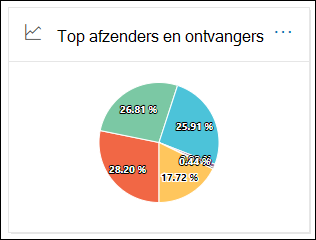

# E-mailstroomrapporten weergeven in het dashboard Rapporten in & Compliance centerView mail flow reports in the Reports dashboard in Security & Compliance Center

[!INCLUDE [Microsoft 365 Defender rebranding](../includes/microsoft-defender-for-office.md)]

**Van toepassing op****Applies to**
- [Exchange Online ProtectionExchange Online Protection](exchange-online-protection-overview.md)
- [Abonnement 1 en abonnement 2 voor Microsoft Defender voor Office 365Microsoft Defender for Office 365 plan 1 and plan 2](defender-for-office-365.md)
- [Microsoft 365 DefenderMicrosoft 365 Defender](../defender/microsoft-365-defender.md)

Naast de e-mailstroomrapporten die  beschikbaar zijn in het e-mailstroomdashboard in het beveiligings- & compliancecentrum, zijn er diverse extra e-mailstroomrapporten beschikbaar in het dashboard Rapporten om u te helpen uw Microsoft 365-organisatie te controleren.In addition to the mail flow reports that are available in the [Mail flow dashboard](mail-flow-insights-v2.md) in the Security & Compliance Center, a variety of additional mail flow reports are available in the Reports dashboard to help you monitor your Microsoft 365 organization.

Als u de [benodigde machtigingen hebt,](#what-permissions-are-needed-to-view-these-reports)kunt u deze rapporten bekijken in het Beveiligings- & [compliancecentrum](https://protection.office.com) door naar **Rapportendashboard te** \> **gaan.**If you have the [necessary permissions](#what-permissions-are-needed-to-view-these-reports), you can view these reports in the [Security & Compliance Center](https://protection.office.com) by going to **Reports** \> **Dashboard**. Als u rechtstreeks naar het dashboard Rapporten wilt gaan, opent u <https://protection.office.com/insightdashboard> .To go directly to the Reports dashboard, open <https://protection.office.com/insightdashboard>.

## ConnectorrapportConnector report

Het **rapport Connector toont** e-mailstroomactiviteit op de binnenkomende en uitgaande [verbindingslijnen](/Exchange/mail-flow-best-practices/use-connectors-to-configure-mail-flow/use-connectors-to-configure-mail-flow) die zijn geconfigureerd voor uw organisatie.The **Connector report** shows mail flow activity on the [inbound and outbound connectors](/Exchange/mail-flow-best-practices/use-connectors-to-configure-mail-flow/use-connectors-to-configure-mail-flow) that are configured for your organization.

Als u het rapport wilt bekijken, opent u het [Beveiligings- & Compliancecentrum,](https://protection.office.com)gaat u naar  \> **Rapportendashboard** en selecteert u **Connector-rapport.**To view the report, open the [Security & Compliance Center](https://protection.office.com), go to **Reports** \> **Dashboard** and select **Connector report**. Als u rechtstreeks naar het rapport wilt gaan, opent u <https://protection.office.com/reportv2?id=ConnectorReport> .To go directly to the report, open <https://protection.office.com/reportv2?id=ConnectorReport>.

### Rapportweergave voor het connectorrapportReport view for the Connector report

De volgende grafieken zijn beschikbaar in de rapportweergave:The following charts are available in report view:

- **Gegevens weergeven op: E-mailstroom:** In deze grafiek ziet u het aantal binnenkomende en uitgaande berichten dat is ingedeeld op:**View data by: Mail flow**: This chart shows the number of inbound and outbound messages organized by:

  - **Totaal****Total**
  - **Van internet zonder verbindingslijn****From the internet without a connector**
  - **Naar internet zonder verbindingslijn****To the internet without a connector**
  - Een specifieke verbindingslijn die u hebt geconfigureerd.A specific connector that you've configured.

  Als u de gegevens in de grafiek wilt isoleren, gebruikt u gegevens **voor** besturingselementen tonen om een van deze opties of **Alle e-mailstroom te selecteren.**To isolate the data in the chart, use the **Show data for** control to select one of these options or **All mail flow**.

  

- **Gegevens weergeven op: TLS-gebruik:** In deze grafiek wordt het percentage TLS-versiegebruik (Transport Layer Security) voor e-mailstroom weergegeven.**View data by: TLS usage**: This chart shows the percentage of Transport Layer Security (TLS) version usage for mail flow.

  Als u de gegevens in de grafiek wilt isoleren, gebruikt u de optie Gegevens **voor besturingselementen** tonen om een van de volgende opties te selecteren:To isolate the data in the chart, use the **Show data for** control to select one of the following options:

  - **Alle e-mailstroom****All mail flow**
  - **Van internet zonder verbindingslijn****From the internet without a connector**
  - **Naar internet zonder verbindingslijn****To the internet without a connector**
  - Een specifieke verbindingslijn die u hebt geconfigureerd.A specific connector that you've configured.

  

Als u in **een rapportweergave** op Filters klikt, kunt u een datumbereik opgeven met **Begindatum** en **Einddatum.**If you click **Filters** in a report view, you can specify a date range with **Start date** and **End date**.

### Detailtabelweergave voor het connectorrapportDetails table view for the Connector report

Als u in **een rapportweergave op Detailstabel** weergeven klikt, worden de volgende gegevens weergegeven:If you click **View details table** in a report view, the following information is shown:

- **Datum****Date**
- **Richting en naam van verbindingslijn****Connector direction and name**
- **Connectortype****Connector type**
- **Gedwongen TLS?**: De waarde **Waar** of **Onwaar**.**Forced TLS?**: The value **True** or **False**.
- **Geen TLS** (percentage)**No TLS** (percentage)
- **TLS 1,0** (percentage)**TLS 1.0** (percentage)
- **TLS 1,1** (percentage)**TLS 1.1** (percentage)
- **TLS 1,2** (percentage)**TLS 1.2** (percentage)
- **Volume:** Het aantal berichten.**Volume**: The number of messages.

Als u in een detailtabelweergave op **Filters** klikt, kunt u een datumbereik opgeven met **Begindatum** en **Einddatum.**If you click **Filters** in a details table view, you can specify a date range with **Start date** and **End date**.

Als u terug wilt gaan naar de rapportweergave, klikt u op **Rapport weergeven.**To go back to the report view, click **View report**.

## Rapport met exchange-transportregelExchange transport rule report

Het **rapport Exchange-transportregel toont** het effect van regels voor de e-mailstroom (ook wel transportregels genoemd) op binnenkomende en uitgaande berichten in uw organisatie.The **Exchange transport rule report** shows the effect of mail flow rules (also known as transport rules) on incoming and outgoing messages in your organization.

Als u het rapport wilt bekijken, opent u het [Beveiligings- & Compliancecentrum,](https://protection.office.com)gaat u naar  \> **Rapportendashboard** en **selecteert u Exchange Transport-regel**.To view the report, open the [Security & Compliance Center](https://protection.office.com), go to **Reports** \> **Dashboard** and select **Exchange Transport rule**. Als u rechtstreeks naar het rapport wilt gaan, opent u <https://protection.office.com/reportv2?id=ETRRuleReport> .To go directly to the report, open <https://protection.office.com/reportv2?id=ETRRuleReport>.

### Rapportweergave voor het rapport Exchange-transportregelReport view for the Exchange transport rule report

De volgende grafieken zijn beschikbaar in de rapportweergave:The following charts are available in report view:

- **Gegevens weergeven op: Exchange-transportregels** \> **Afbreed door: Richting:** In deze grafiek  ziet u het aantal **binnenkomende** en uitgaande berichten dat is beïnvloed door transportregels.**View data by: Exchange transport rules** \> **Break down by: Direction**: This chart shows the number of **Inbound** and **Outbound** messages that were affected by transport rules.

- **Gegevens weergeven op: Exchange-transportregels** \> **Afbreed door: Ernst:** In deze  grafiek ziet u het aantal berichten met hoge ernst en gemiddelde ernst **en** berichten met een **lage ernst.****View data by: Exchange transport rules** \> **Break down by: Severity**: This chart shows the number of **High severity** and **Medium severity**, and **Low severity** messages. U stelt het ernstniveau in als een actie in de regel ( Controleer deze regel met **ernstniveau** of _SetAuditSeverity_).You set the severity level as an action in the rule (**Audit this rule with severity level** or _SetAuditSeverity_). Zie Acties voor [e-mailstroomregelen in Exchange Online voor meer informatie.](//Exchange/security-and-compliance/mail-flow-rules/mail-flow-rule-actions)For more information, see [Mail flow rule actions in Exchange Online](//Exchange/security-and-compliance/mail-flow-rules/mail-flow-rule-actions).

- **Gegevens weergeven op: DLP Exchange-transportregels** \> **Afbreiding door: Richting:** In deze  grafiek ziet u het aantal **binnenkomende** en uitgaande berichten dat is beïnvloed door DLP-transportregels (Data Loss Prevention).**View data by: DLP Exchange transport rules** \> **Break down by: Direction**: This chart shows the number of **Inbound** and **Outbound** messages that were affected by data loss prevention (DLP) transport rules. U kunt de grafiek verder verfijnen door een van de volgende opties te selecteren:You can further refine the chart by selecting on of the following options:

  - **Gegevens voor: Alle DLP-transportregels****Show data for: All DLP transport rules**
  - **Gegevens voor: Gecompromitteerd gebruikers****Show data for: Compromised users**
  - **Gegevens voor: Laag volume aan gedetecteerde Amerikaanse Patriot Act****Show data for: Low volume of content detected U.S. Patriot Act**

- **Gegevens weergeven op: DLP Exchange-transportregels** \> **Afbreiding door: Richting:** In  deze weergave ziet u  het aantal berichten met hoge ernst en gemiddelde ernst **en** berichten met een lage ernst die zijn beïnvloed door DLP-transportregels.**View data by: DLP Exchange transport rules** \> **Break down by: Direction**: This view shows the number of **High severity** and **Medium severity**, and **Low severity** messages that were affected by DLP transport rules. U kunt de grafiek verder verfijnen door een van de volgende opties te selecteren:You can further refine the chart by selecting on of the following options:

  - **Gegevens voor: Alle DLP-transportregels****Show data for: All DLP transport rules**
  - **Gegevens voor: Gecompromitteerd gebruikers****Show data for: Compromised users**
  - **Gegevens voor: Laag volume aan gedetecteerde Amerikaanse Patriot Act****Show data for: Low volume of content detected U.S. Patriot Act**

Als u in **een rapportweergave** op Filters klikt, kunt u de resultaten wijzigen met de volgende filters::If you click **Filters** in a report view, you can modify the results with the following filters::

- **Begindatum** en **einddatum****Start date** and **End date**
- RichtingswaardenDirection values
- ErnstwaardenSeverity values

### Tabelweergave Details voor het rapport Exchange-transportregelDetails table view for the Exchange transport rule report

Als u op **Detailstabel weergeven klikt,** is de weergegeven informatie afhankelijk van de grafiek die u hebt bekeken:If you click **View details table**, the information that's shown depends on the chart you were looking at:

- **Gegevens weergeven door: Exchange-transportregels:****View data by: Exchange Transport rules**:

  - **Datum****Date**
  - **Transportregel****Transport rule**
  - **Onderwerp****Subject**
  - **Adres afzender****Sender address**
  - **Adres van geadresseerde****Recipient address**
  - **Ernst****Severity**
  - **Richting****Direction**

- **Gegevens weergeven op: DLP Exchange-transportregels**:**View data by: DLP Exchange transport rules**:

  - **Datum****Date**
  - **DLP-beleid****DLP policy**
  - **Transportregel****Transport rule**
  - **Onderwerp****Subject**
  - **Adres afzender****Sender address**
  - **Adres van geadresseerde****Recipient address**
  - **Ernst****Severity**
  - **Richting****Direction**

Als u in een detailtabelweergave op **Filters** klikt, kunt u de resultaten met de volgende filters wijzigen:If you click **Filters** in a details table view, you can modify the results with the following filters:

- **Begindatum** en **einddatum****Start date** and **End date**
- RichtingswaardenDirection values
- ErnstwaardenSeverity values

Als u terug wilt gaan naar de rapportweergave, klikt u op **Rapport weergeven.**To go back to the report view, click **View report**.

## Doorsturen van rapportForwarding report

In **het rapport Doorsturen** ziet u de automatisch doorgestuurde berichten van uw organisatie naar externe domeinen vanuit Exchange Online-postvakken.The **Forwarding report** shows your organization's automatically forwarded messages to external domains from Exchange Online mailboxes. Doorgestuurde berichten kunnen een beveiligings- of compliancerisico opleveren en kunnen een gekromd account aangeven.Forwarded messages can pose a security or compliance risk, and might indicate a compromised account.

Als u het rapport wilt bekijken, opent u  het [Beveiligings- & Compliancecentrum,](https://protection.office.com)gaat u naar \> **Rapportendashboard** en selecteert u **Rapport doorsturen.**To view the report, open the [Security & Compliance Center](https://protection.office.com), go to **Reports** \> **Dashboard** and select **Forwarding report**. Als u rechtstreeks naar het rapport wilt gaan, opent u <https://protection.office.com/reportv2?id=MailFlowForwarding> .To go directly to the report, open <https://protection.office.com/reportv2?id=MailFlowForwarding>.

### Rapportweergave voor het rapport DoorsturenReport view for the Forwarding report

De volgende grafieken zijn beschikbaar in de rapportweergave:The following charts are available in the report view:

- **Gegevens voor: Doorsturen methoden**: De volgende methoden worden weergegeven:**Show data for: Forwarding methods**: The following methods are shown:

  - **Transportregel:** ook wel [e-mailstroomregels genoemd.](/Exchange/security-and-compliance/mail-flow-rules/mail-flow-rules)**Transport rule**: Also known as [mail flow rules](/Exchange/security-and-compliance/mail-flow-rules/mail-flow-rules).
  - **Postvakregel:** Ook wel regels [voor Postvak IN genoemd.](https://support.microsoft.com/office/c24f5dea-9465-4df4-ad17-a50704d66c59)**Mailbox rule**: Also known as [Inbox rules](https://support.microsoft.com/office/c24f5dea-9465-4df4-ad17-a50704d66c59).

  

- **Gegevens weergeven voor: Domeinen doorsturen:** in deze weergave ziet u de geadresseerdedomeinen die de bestemmingen zijn voor doorsturen.**Show data for: Forwarding domains**: This view shows the recipient domains that are the destinations for forwarding.

  

- **Gegevens voor: Doorsturen:** De volgende doorsturen worden weergegeven:**Show data for: Forwarders**: The following forwarders are shown:

  - **Transportregel****Transport rule**
  - Het postvak met de regel Postvak IN doorsturen.The mailbox that contains the forwarding Inbox rule.

  

Als u in **een rapportweergave** op Filters klikt, kunt u een datumbereik opgeven met **Begindatum** en **Einddatum.**If you click **Filters** in a report view, you can specify a date range with **Start date** and **End date**.

### Tabelweergave Details voor het rapport DoorsturenDetails table view for the Forwarding report

Als u in **een rapportweergave op Detailstabel** weergeven klikt, worden de volgende gegevens weergegeven:If you click **View details table** in a report view, the following information is shown:

- **Doorst:De** waarde **Transportregel** of het postvak met de regel Postvak IN doorsturen.**Forwarders**: The value **Transport rule** or the mailbox that contains the forwarding Inbox rule.
- **Doorsturen:** De waarde **Regel Postvak** of **Transportregel**.**Forwarding type**: The value **Mailbox rule** or **Transport rule**.
- **Naam van geadresseerde****Recipient name**
- **Domein geadresseerde****Recipient domain**
- **Details:** dit is de GUID-waarde van de e-mailstroomregel of de waarde RuleIdentity van de regel Postvak IN.**Details**: This is the GUID value of the mail flow rule, or the RuleIdentity value of the Inbox rule.
- **Aantal****Count**
- **Eerste doorgestuurde datum****First forward date**

Als u in een detailtabelweergave op **Filters** klikt, kunt u een datumbereik opgeven met **Begindatum** en **Einddatum.**If you click **Filters** in a details table view, you can specify a date range with **Start date** and **End date**.

Als u terug wilt gaan naar de rapportweergave, klikt u op **Rapport weergeven.**To go back to the reports view, click **View report**.

## E-mailflowstatusrapportMailflow status report

Het **rapport Mailflow-status** is vergelijkbaar met het e-mailrapport Verzonden en [ontvangen,](#sent-and-received-email-report)met aanvullende informatie over e-mail die aan de rand is toegestaan of geblokkeerd.The **Mailflow status report** is similar to the [Sent and received email report](#sent-and-received-email-report), with additional information about email allowed or blocked on the edge. Dit is het enige rapport dat informatie over randbeveiliging bevat en laat zien hoeveel e-mail wordt geblokkeerd voordat e-mail wordt toegestaan in de service voor evaluatie door Exchange Online Protection (EOP).This is the only report that contains edge protection information, and shows just how much email is blocked before being allowed into the service for evaluation by Exchange Online Protection (EOP). Het is belangrijk om te begrijpen dat als een bericht naar vijf geadresseerden wordt verzonden, we het als vijf verschillende berichten tellen en niet één bericht.It's important to understand that if a message is sent to five recipients we count it as five different messages and not one message.
Als u het rapport wilt bekijken, opent u  het [beveiligingscentrum & compliancecentrum,](https://protection.office.com)gaat u naar Het dashboard Rapporten en selecteert u \>  **Mailflow-statusrapport.**To view the report, open the [Security & Compliance Center](https://protection.office.com), go to **Reports** \> **Dashboard** and select **Mailflow status report**. Als u rechtstreeks naar het rapport **E-mailstroomstatus wilt gaan,** opent <https://protection.office.com/mailflowStatusReport> u .To go directly to the **Mail flow status report**, open <https://protection.office.com/mailflowStatusReport>.

### Typweergave voor het rapport Mailflow-statusType view for the Mailflow status report

Wanneer u het rapport opent, is **het tabblad Type** standaard geselecteerd.When you open the report, the **Type** tab is selected by default. Standaard bevat deze weergave een grafiek en een gegevenstabel die is geconfigureerd met de volgende filters:By default, this view contains a chart and a data table that's configured with the following filters:

- **Datum:** De laatste 7 dagen.**Date**: The last 7 days.
- **Richting**:**Direction**:

  - **Binnenkomende****Inbound**
  - **Uitgaande****Outbound**
  - **Intra-org:** dit aantal is voor berichten binnen een tenant, dat wil zeggen**Intra-org**: this count is for messages within a tenant i.e afzender abc@domain.com verzendt naar geadresseerde xyz@domain.com (afzonderlijk geteld van **Binnenkomende** en **Uitgaande**)sender abc@domain.com sends to recipient xyz@domain.com  (counted separately from **Inbound** and **Outbound**)

- **Typ**:**Type**:

  - **Goede e-mail****Good mail**
  - **Malware****Malware**
  - **Spam****Spam**
  - **Randbeveiliging****Edge protection**
  - **Regelberichten****Rule messages**
  - **Phishing-e-mail****Phishing email**

De grafiek wordt ingedeeld op basis van **de waarden Type.**The chart is organized by the **Type** values.

U kunt deze filters wijzigen door op **Filter te klikken of** door te klikken op een waarde in de grafieklegenda.You can change these filters by clicking **Filter** or by clicking a value in the chart legend.

De gegevenstabel bevat de volgende informatie:The data table contains the following information:

- **Richting****Direction**
- **Type****Type**
- **24 uur****24 hours**
- **3 dagen****3 days**
- **7 dagen****7 days**
- **15 dagen****15 days**
- **30 dagen****30 days**

Als u op **Een categorie kiezen klikt voor meer informatie,** kunt u kiezen uit de volgende waarden:If you click **Choose a category for more details**, you can select from the following values:

- **Phishing-e-mail:** met deze selectie gaat u naar het [statusrapport Bedreigingsbeveiliging.](view-email-security-reports.md#threat-protection-status-report)**Phishing email**: This selection takes you to the [Threat protection status report](view-email-security-reports.md#threat-protection-status-report).
- **Malware in e-mail:** met deze selectie gaat u naar het [statusrapport Bedreigingsbeveiliging.](view-email-security-reports.md#threat-protection-status-report)**Malware in email**: This selection takes you to the [Threat protection status report](view-email-security-reports.md#threat-protection-status-report).
- **Spamdetecties:** Met deze selectie gaat u naar het [rapport Spamdetecties.](view-email-security-reports.md#spam-detections-report)**Spam detections**: This selection takes you to the [Spam Detections report](view-email-security-reports.md#spam-detections-report).
- **Edge geblokkeerde spam:** Met deze selectie gaat u naar het [rapport Spamdetecties.](view-email-security-reports.md#spam-detections-report)**Edge blocked spam**: This selection takes you to the [Spam Detections report](view-email-security-reports.md#spam-detections-report).

**Exporteren**:**Export**:

Voor de detailweergave kunt u slechts één dag gegevens exporteren.For the detail view, you can only export data for one day. Dus als u gegevens 7 dagen wilt exporteren, moet u 7 verschillende exportacties uitvoeren.So, if you want to export data for 7 days, you need to do 7 different export actions.

Elk geëxporteerd CSV-bestand is beperkt tot 150.000 rijen.Each exported .csv file is limited to 150,000 rows. Als de gegevens voor die dag meer dan 150.000 rijen bevatten, worden er meerdere CSV-bestanden gemaakt.If the data for that day contains more than 150,000 rows, then multiple .csv files will be created.

### Richtingsweergave voor het rapport Mailflow-statusDirection view for the Mailflow status report

Als u op het tabblad **Richting** klikt, worden dezelfde standaardfilters uit de **weergave Type** gebruikt.If you click the **Direction** tab, the same default filters from the **Type** view are used.

De grafiek is ingedeeld op **richtingswaarden.**The chart is organized by **Direction** values.

U kunt deze filters wijzigen door op **Filter te klikken of** door te klikken op een waarde in de grafieklegenda.You can change these filters by clicking **Filter** or by clicking a value in the chart legend. Dezelfde filters uit de **weergave Type** worden gebruikt.The same filters from the **Type** view are used.

De gegevenstabel bevat dezelfde informatie uit de **weergave Type.**The data table contains same information from the **Type** view.

De **categorie Kies een categorie voor meer informatie** beschikbare selecties en gedrag zijn hetzelfde als de **weergave** Type.The **Choose a category for more details** available selections and behavior are the same as the **Type** view.

**Exporteren**:**Export**:

Voor de detailweergave kunt u slechts één dag gegevens exporteren.For the detail view, you can only export data for one day. Dus als u gegevens 7 dagen wilt exporteren, moet u 7 verschillende exportacties uitvoeren.So, if you want to export data for 7 days, you need to do 7 different export actions.

Elk geëxporteerd CSV-bestand is beperkt tot 150.000 rijen.Each exported .csv file is limited to 150,000 rows. Als de gegevens voor die dag meer dan 150.000 rijen bevatten, worden er meerdere CSV-bestanden gemaakt.If the data for that day contains more than 150,000 rows, then multiple .csv files will be created.

### Trechterweergave voor het rapport Mailflow-statusFunnel view for the Mailflow status report

In **de trechterweergave** ziet u hoe de beveiligingsfuncties voor e-mail van Microsoft inkomende en uitgaande e-mail in uw organisatie filteren.The **Funnel** view shows you how Microsoft's email threat protection features filter incoming and outgoing email in your organization. Het bevat informatie over het totale aantal e-mailberichten en hoe de geconfigureerde beveiligingsfuncties voor bedreigingen, zoals randbeveiliging, anti-malware, anti-phishing, antispam en anti-spoofing van invloed zijn op dit aantal.It provides details on the total email count, and how the configured threat protection features, including edge protection, anti-malware, anti-phishing, anti-spam, and anti-spoofing affect this count.

Als u op **het** tabblad Trechter klikt, bevat deze weergave standaard een grafiek en een gegevenstabel die is geconfigureerd met de volgende filters:If you click the **Funnel** tab, by default, this view contains a chart and a data table that's configured with the following filters:

- **Datum:** De laatste 7 dagen.**Date**: The last 7 days.

- **Richting**:**Direction**:

  - **Binnenkomende****Inbound**
  - **Uitgaande****Outbound**
  - **Intra-org:** Dit aantal is voor berichten die binnen een tenant worden verzonden; Dat wil zeggen dat afzenders abc@domain.com naar geadresseerden xyz@domain.com (afzonderlijk geteld van Binnenkomende en Uitgaande).**Intra-org**: This count is for messages sent within a tenant; i.e, sender abc@domain.com sends to recipient xyz@domain.com (counted separately from Inbound and Outbound).

De statistische weergave en gegevenstabelweergave kunnen 90 dagen worden gefilterd.The aggregate view and data table view allow for 90 days of filtering.

Als u op **Filteren klikt,** kunt u zowel de grafiek als de gegevenstabel filteren.If you click **Filter**, you can filter both the chart and the data table.

In deze grafiek ziet u het aantal e-mailberichten dat is ingedeeld op:This chart shows the email count organized by:

- **Totaal aantal e-mail****Total email**
- **E-mail na randbeveiliging****Email after edge protection**
- **E-mail na anti-malware, bestandsreputatie, bestandstypeblok****Email after anti-malware, file reputation, file type block**
- **E-mail na anti-phish, URL-reputatie, merkremitatie, anti-spoofing****Email after anti-phish, URL reputation, brand impersonation, anti-spoof**
- **E-mail na antispam, bulkmailfilters****Email after anti-spam, bulk mail filtering**
- **E-mail na gebruikers- en domein-imitatie**1**Email after user and domain impersonation**1
- **E-mail na bestand en URL-detonatie**1**Email after file and URL detonation**1
- **E-mail die is gedetecteerd als goedaardig na de beveiliging na de bezorging (URL klik op tijdbeveiliging)****Email detected as benign after post-delivery protection (URL click time protection)**

Alleen 1 Defender voor Office 3651 Defender for Office 365 only

Als u het e-mailbericht dat is gefilterd op EOP of Defender voor Office 365 afzonderlijk wilt weergeven, klikt u op de waarde in de grafieklegenda.To view the email filtered by EOP or Defender for Office 365 separately, click on the value in the chart legend.

De gegevenstabel bevat de volgende gegevens, weergegeven in aflopende datumvolgorde:The data table contains the following information, shown in descending date order:

- **Datum****Date**
- **Totaal aantal e-mail****Total email**
- **Randbeveiliging****Edge protection**
- **Anti-malware, bestandsreputatie, bestandstypeblok:****Anti-malware, file reputation, file type block**:
  - **Bestandsreputatie:** Berichten die zijn gefilterd vanwege de identificatie van een bijgevoegd bestand door andere Microsoft-klanten.**File reputation**: Messages filtered due to identification of an attached file by other Microsoft customers.
  - **Bestandstypeblok:** Berichten die zijn gefilterd vanwege het type schadelijk bestand dat in het bericht is geïdentificeerd.**File type block**: Messages filtered due to the type of malicious file identified in the message.
- **Anti-phish, URL-reputatie, merk imitatie, anti-spoof:****Anti-phish, URL reputation, Brand impersonation, anti-spoof**:
  - **URL-reputatie:** Berichten die zijn gefilterd vanwege de identificatie van de URL door andere Microsoft-klanten.**URL reputation**: Messages filtered due to the identification of the URL by other Microsoft customers.
  - **Merkremitatie:** berichten die zijn gefilterd vanwege het bericht dat afkomstig is van bekende merkremiterende afzenders.**Brand impersonation**: Messages filtered due to the message coming from well-known brand impersonating senders.
  - **Anti-spoof:** Berichten die zijn gefilterd vanwege het bericht waarin wordt geprobeerd een domein te vervalsen dat de geadresseerde behoort, of een domein dat de afzender van het bericht niet bezit.**Anti-spoof**: Messages filtered due to the message attempting to spoof a domain that the recipient belongs to, or a domain that the message sender doesn't own.
- **Antispam, bulkmailfilters:****Anti-spam, bulk mail filtering**:
  - **Bulkmailfilters:** Berichten die zijn gefilterd als gevolg van een poging om bulkmail bij de geadresseerden te bezorgen.**Bulk mail filtering**: Messages filtered due to an attempt to deliver bulk mail to its recipients.
- **Gebruikers- en domein-imitatie (Defender voor Office 365)**:**User and domain impersonation (Defender for Office 365)**:
  - **Gebruikers-imitatie:** berichten die zijn gefilterd vanwege een poging om zich voor te doen als een gebruiker (afzender van een bericht) die is gedefinieerd in de instellingen voor imitatiebeveiliging van een anti-phishingbeleid.**User impersonation**: Messages filtered due to an attempt to impersonate a user (message sender) that's defined in the impersonation protection settings of an anti-phishing policy.
  - **Domein imitatie:** Berichten gefilterd vanwege een poging om een domein na te bootsen dat is gedefinieerd in de instellingen voor imitatiebeveiliging van een anti-phishingbeleid.**Domain impersonation**: Messages filtered due to an attempt to impersonate a domain that's defined in the impersonation protection settings of an anti-phishing policy.
- **Bestands- en URL-detonatie (Defender voor Office 365)**:**File and URL detonation (Defender for Office 365)**:
  - **Bestandsdetonatie:** berichten gefilterd met een beleid voor veilige bijlagen.**File detonation**: Messages filtered by a Safe Attachments policy.
  - **URL-detonatie:** bericht gefilterd door een beleid voor veilige koppelingen.**URL detonation**: Message filtered by a Safe Links policy.
- **Beveiliging na aflevering en ZAP (ATP) of ZAP (EOP)**: ZAP geeft automatisch nul uur aan.**Post-delivery protection and ZAP (ATP), or ZAP (EOP)**: ZAP indicates zero hour auto-purge.

Als u een rij in de gegevenstabel selecteert, wordt een verdere uitsplitsing van de e-mailtellingen weergegeven in de flyout.If you select a row in the data table, a further breakdown of the email counts are shown in the flyout.

**Exporteren**:**Export**:

Nadat u onder **Opties op Exporteren** hebt geklikt, kunt u een van de volgende waarden selecteren: After you click **Export** under **Options**, you can select one of the following values:

- **Overzicht (met gegevens van de afgelopen 90 dagen)****Summary (with data for last 90 days at most)**
- **Details (met gegevens van de afgelopen 30 dagen ten hoogst)****Details (with data for last 30 days at most)**

Kies **onder Datum** een bereik en klik vervolgens op **Toepassen.**Under **Date**, choose a range, and then click **Apply**. Gegevens voor de huidige filters worden geëxporteerd naar een CSV-bestand.Data for the current filters will be exported to a .csv file.

Elk geëxporteerd CSV-bestand is beperkt tot 150.000 rijen.Each exported .csv file is limited to 150,000 rows. Als de gegevens meer dan 150.000 rijen bevatten, worden meerdere CSV-bestanden gemaakt.If the data contains more than 150,000 rows, then multiple .csv files will be created.

 

### Technische weergave voor het mailflowstatusrapportTech view for the Mailflow status report

De **techweergave** is vergelijkbaar met de **trechterweergave,** met meer gedetailleerde details voor de geconfigureerde functies voor bedreigingsbeveiliging.The **Tech view** is similar to the **Funnel** view, providing more granular details for the configured threat protections features. In de grafiek kunt u zien hoe berichten worden gecategoriseerd in de verschillende stadia van bedreigingsbeveiliging.From the chart, you can see how messages are categorized at the different stages of threat protection.

Als u op het **tabblad Technische** weergave klikt, bevat deze weergave standaard een grafiek en een gegevenstabel die is geconfigureerd met de volgende filters:If you click the **Tech view** tab, by default, this view contains a chart and a data table that's configured with the following filters:

- **Datum:** De laatste 7 dagen.**Date**: The last 7 days.

- **Richting**:**Direction**:

  - **Binnenkomende****Inbound**
  - **Uitgaande****Outbound**
  - **Intra-org:** dit aantal is voor berichten binnen een tenant, dat wil zeggen**Intra-org**: this count is for messages within a tenant i.e afzender abc@domain.com verzenden naar geadresseerde xyz@domain.com (afzonderlijk geteld van Binnenkomende en Uitgaande)sender abc@domain.com sends to recipient xyz@domain.com (counted separately from Inbound and Outbound)

De statistische weergave en gegevenstabelweergave kunnen 90 dagen worden gefilterd.The aggregate view and data table view allow for 90 days of filtering.

Als u op **Filteren klikt,** kunt u zowel de grafiek als de gegevenstabel filteren.If you click **Filter**, you can filter both the chart and the data table.

In deze grafiek ziet u berichten die zijn ingedeeld in de volgende categorieën:This chart shows messages organized into the following categories:

- **Totaal aantal e-mail****Total email**
- **Rand toestaan** en **Edge gefilterd****Edge allow** and **Edge filtered**
- **Geen malware,** **detectie van veilige bijlagen,** \* detectie van **anti-malwareprogramma's** en **regelberichten****Not malware**, **Safe Attachments detection**\*, **Anti-malware engine detection**, and **Rule messages**
- **Geen phish,** **DMARC-fout,** **imitatiedetectie,** **spoofdetectie** en **Phish-detectie****Not phish**, **DMARC failure**, **Impersonation detection**, **Spoof detection**, and **Phish detection**
- **Geen detectie met URL-detonatie en** **URL-detonatiedetectie**\***No detection with URL detonation** and **URL detonation detection**\*
- **Geen spam en**  **spam****Not spam** and  **Spam**
- **Niet-schadelijke e-mail,** **detectie van** veilige koppelingen \* en **ZAP****Non-malicious email**, **Safe Links detection**\*, and **ZAP**

\* Defender voor Office 365\* Defender for Office 365

Wanneer u de muisaanwijzer boven een categorie in de grafiek beweegt, kunt u het aantal berichten in die categorie zien.When you hover over a category in the chart, you can see the number of messages in that category.

De gegevenstabel bevat de volgende gegevens, weergegeven in aflopende datumvolgorde:The data table contains the following information, shown in descending date order:

- **Datum****Date**
- **Totaal aantal e-mail****Total email**
- **Gefilterde rand****Edge filtered**
- **Anti-malware-engine, Veilige bijlagen, regel gefilterd:****Anti-malware engine, Safe Attachments, rule filtered**:
  - **Regel gefilterd:** Berichten gefilterd vanwege regels voor e-mailstroom (ook wel transportregels genoemd).**Rule filtered**: Messages filtered due to  mail flow rules (also known as transport rules).
- **DMARC, imitatie, spoof, phish gefilterd:****DMARC, impersonation, spoof, phish filtered**:
  - **DMARC:** Berichten gefilterd vanwege het bericht dat de DMARC-verificatiecontrole mislukt.**DMARC**: Messages filtered due to the message failing its DMARC authentication check.
- **DETECTIE VAN URL-detonatie****URL detonation detection**
- **Gefilterde antispam****Anti-spam filtered**
- **ZAP verwijderd****ZAP removed**
- **Detectie door veilige koppelingen****Detection by Safe Links**

Als u een rij in de gegevenstabel selecteert, wordt een verdere uitsplitsing van de e-mailtellingen weergegeven in de flyout.If you select a row in the data table, a further breakdown of the email counts are shown in the flyout.

**Exporteren**:**Export**:

Als u op **Exporteren** klikt, kunt u onder **Opties** een van de volgende waarden selecteren:On clicking **Export**, under **Options** you can select one of the following values:

- **Overzicht (met gegevens van de afgelopen 90 dagen)****Summary (with data for last 90 days at most)**
- **Details (met gegevens van de afgelopen 30 dagen ten hoogst)****Details (with data for last 30 days at most)**

Kies **onder Datum** een bereik en klik vervolgens op **Toepassen.**Under **Date**, choose a range, and then click **Apply**. Gegevens voor de huidige filters worden geëxporteerd naar een CSV-bestand.Data for the current filters will be exported to a .csv file.

Elk geëxporteerd CSV-bestand is beperkt tot 150.000 rijen.Each exported .csv file is limited to 150,000 rows. Als de gegevens meer dan 150.000 rijen bevatten, worden meerdere CSV-bestanden gemaakt.If the data contains more than 150,000 rows, then multiple .csv files will be created.

 

## E-mailrapport verzonden en ontvangenSent and received email report

Het **rapport Verzonden** en ontvangen e-mail is een slim rapport met informatie over inkomende en uitgaande e-mail, waaronder spamdetecties, malware en e-mail die als 'goed' zijn geïdentificeerd.The **Sent and received email** report is a smart report that shows information about incoming and outgoing email, including spam detections, malware, and email identified as "good." Het verschil tussen dit rapport en het [mailflowstatusrapport](#mailflow-status-report) is: dit rapport bevat geen gegevens over berichten die zijn geblokkeerd door randbeveiliging. Het is belangrijk om te begrijpen dat als een bericht naar vijf geadresseerden wordt verzonden, we het als één bericht tellen.The difference between this report and the [Mailflow status report](#mailflow-status-report) is: this report doesn't include data about messages blocked by edge protection.It's important to understand that if a message is sent to five recipients we count it as one message.

Met de statistische weergave en de detailweergave van het rapport kunt u 90 dagen filteren.The aggregate view and the detail view of the report allow for 90 days of filtering.

Als u het rapport wilt bekijken, opent u  het [Beveiligings- & Compliancecentrum,](https://protection.office.com)gaat u naar \> **Rapportendashboard** en **selecteert u Verzonden en ontvangen e-mail.**To view the report, open the [Security & Compliance Center](https://protection.office.com), go to **Reports** \> **Dashboard** and select **Sent and received email**. Als u rechtstreeks naar het rapport wilt gaan, opent u <https://protection.office.com/reportv2?id=SentAndReceivedMailATP> .To go directly to the report, open <https://protection.office.com/reportv2?id=SentAndReceivedMailATP>.

### Rapportweergave voor het e-mailrapport Verzonden en ontvangenReport view for the Sent and received email report

De volgende grafieken zijn beschikbaar in de rapportweergave:The following charts are available in the report view:

- **Afbreken op: Type:** De grafiek bevat alle beschikbare categorieën:**Break down by: Type**: The chart shows all available categories:

  - **Totaal****Total**
  - **Goede e-mail****Good mail**
  - **Malware (anti-malware)** (EOP)**Malware (anti-malware)** (EOP)
  - **Spamdetecties****Spam detections**
  - **Regelberichten****Rule messages**
  - **Geavanceerde malware** (Microsoft Defender voor Office 365)**Advanced malware** (Microsoft Defender for Office 365)

  Wanneer u de muisaanwijzer boven een dag (gegevenspunt) in de grafiek beweegt, ziet u details voor die dag.When you hover over a day (data point) in the chart, you can see details for that day.

  

- **Af te breken op: Richting:** In de grafiek **worden totaal-,** **inkomende** en **uitgaande gegevens** weergegeven.**Break down by: Direction**: The chart shows **Total**, **Inbound**, and **Outbound** data. Wanneer u de muisaanwijzer boven een dag (gegevenspunt) in de grafiek beweegt, ziet u details voor die dag.When you hover over a day (data point) in the chart, you can see details for that day.

  

- **Inzoomen op** \> **Malware (anti-malware)**: Met deze selectie gaat u naar de detecties van [malware in het e-mailrapport.](view-email-security-reports.md#malware-detections-in-email-report)**Drill down by** \> **Malware (anti-malware)**: This selection takes you to the [Malware detections in email report](view-email-security-reports.md#malware-detections-in-email-report).

- **Inzoomen op** \> **Spamdetecties)**: Met deze selectie gaat u naar het [rapport Spamdetecties.](view-email-security-reports.md#spam-detections-report)**Drill down by** \> **Spam detections)**: This selection takes you to the [Spam Detections report](view-email-security-reports.md#spam-detections-report).

Als u in **een rapportweergave** op Filters klikt, kunt u de resultaten met de volgende filters wijzigen:If you click **Filters** in a report view, you can modify the results with the following filters:

- **Begindatum** en **einddatum****Start date** and **End date**
- RichtingswaardenDirection values
- Waarden typenType values

Als u terug wilt gaan naar de rapportweergave, klikt u op **Rapport weergeven.**To go back to the report view, click **View report**.

### Tabelweergave Details voor het e-mailrapport Verzonden en ontvangenDetails table view for the Sent and received email report

Als u in **de tabel Details weergeven** klikt **op:** Richting of Afbreken **door:** Richtingsweergave, worden de volgende gegevens weergegeven:If you click **View details table** in the **Break down by: Direction** or **Break down by: Direction** view, the following information is shown:

- **Datum (UTC)****Date (UTC)**
- **Type****Type**
- **Richting****Direction**
- **Aantal berichten****Message count**

Als u in een detailtabelweergave op **Filters** klikt, kunt u de resultaten met de volgende filters wijzigen:If you click **Filters** in a details table view, you can modify the results with the following filters:

- **Begindatum** en **einddatum****Start date** and **End date**
- RichtingswaardenDirection values
- Waarden typenType values

Als u terug wilt gaan naar de rapportweergave, klikt u op **Rapport weergeven.**To go back to the report view, click **View report**.

## Rapport top afzenders en geadresseerdenTop senders and recipients report

Het **rapport Top senders and recipients** is a pie chart showing your top email senders and recipients.The **Top senders and recipients** report is a pie chart showing your top email senders and recipients.

Als u het rapport wilt bekijken, opent u  het [Beveiligingscentrum & Compliancecentrum,](https://protection.office.com)gaat u naar \> **Rapportendashboard** en selecteert u **Top senders and recipients**.To view the report, open the [Security & Compliance Center](https://protection.office.com), go to **Reports** \> **Dashboard** and select **Top senders and recipients**. Als u rechtstreeks naar het rapport wilt gaan, opent u <https://protection.office.com/reportv2?id=TopSenderRecipientsATP> .To go directly to the report, open <https://protection.office.com/reportv2?id=TopSenderRecipientsATP>.

### Rapportweergave voor het rapport Top senders and recipient reportReport view for the Top senders and recipient report

De volgende grafieken zijn beschikbaar in de rapportweergave:The following charts are available in the report view:

- **Gegevens voor \> de belangrijkste afzenders van e-mail tonen****Show data for \> Top mail senders**
- **Gegevens voor \> de belangrijkste geadresseerden van e-mail tonen****Show data for \> Top mail recipients**
- **Gegevens voor \> beste spamontvangers tonen****Show data for \> Top spam recipients**
- **Gegevens voor \> Belangrijkste ontvangers van malware** (EOP)**Show data for \> Top malware recipients** (EOP)
- **Gegevens voor \> de beste ontvangers van malware (Defender voor Office 365)****Show data for \> Top malware recipients (Defender for Office 365)**

De samenstelling van het cirkeldiagram wordt gewijzigd op basis van deze selecties.The composition of the pie chart changes based on these selections.

Wanneer u de muisaanwijzer over een wig in het cirkeldiagram beweegt, ziet u een aantal verzonden of ontvangen berichten.When you hover over a wedge in the pie chart, you can see a count of messages sent or received.

Als u in **een rapportweergave** op Filters klikt, kunt u een datumbereik opgeven met **Begindatum** en **Einddatum.**If you click **Filters** in a report view, you can specify a date range with **Start date** and **End date**.

### Tabelweergave Details voor het rapport Met de beste afzenders en geadresseerdenDetails table view for the Top senders and recipient report

Als u op **Detailstabel weergeven klikt,** is de weergegeven informatie afhankelijk van de grafiek die u hebt bekeken:If you click **View details table**, the information that's shown depends on the chart you were looking at:

- **Gegevens voor \> de belangrijkste afzenders van e-mail tonen****Show data for \> Top mail senders**

  - **Belangrijkste afzenders van e-mail****Top mail senders**
  - **Aantal****Count**

- **Gegevens voor \> de belangrijkste geadresseerden van e-mail tonen****Show data for \> Top mail recipients**

  - **Belangrijkste geadresseerden van e-mail****Top mail recipients**
  - **Aantal****Count**

- **Gegevens voor \> beste spamontvangers tonen****Show data for \> Top spam recipients**

  - **Belangrijkste geadresseerden van spam****Top spam recipients**
  - **Aantal****Count**

- **Gegevens voor \> Belangrijkste ontvangers van malware** (EOP)**Show data for \> Top malware recipients** (EOP)

  - **Belangrijkste ontvangers van malware****Top malware recipients**
  - **Aantal****Count**

- **Gegevens voor \> de beste ontvangers van malware (Defender voor Office 365)****Show data for \> Top malware recipients (Defender for Office 365)**

  - **Belangrijkste ontvangers van malware (Defender voor Office 365)****Top malware recipients (Defender for Office 365)**
  - **Aantal****Count**

Als u in een detailtabelweergave op **Filters** klikt, kunt u een datumbereik opgeven met **Begindatum** en **Einddatum.**If you click **Filters** in a details table view, you can specify a date range with **Start date** and **End date**.

Als u terug wilt gaan naar de rapportweergave, klikt u op **Rapport weergeven.**To go back to the report view, click **View report**.

## Welke machtigingen zijn nodig om deze rapporten weer te geven?What permissions are needed to view these reports?

Als u de rapporten wilt bekijken en gebruiken die in dit artikel worden beschreven, moet u lid zijn van een van de volgende rollengroepen in het Compliancecentrum & Beveiliging:In order to view and use the reports described in this article, you need to be a member of one of the following role groups in the Security & Compliance Center:

- **Organisatiebeheer****Organization Management**
- **Beveiligingsbeheerder****Security Administrator**
- **Beveiligingslezer****Security Reader**
- **Algemene lezer****Global Reader**

Zie [Machtigingen in het Beveiligings- & compliancecentrum](permissions-in-the-security-and-compliance-center.md) voor meer informatie.For more information, see [Permissions in the Security & Compliance Center](permissions-in-the-security-and-compliance-center.md).

> [!NOTE]
> Gebruikers toevoegen aan de overeenkomstige Azure Active Directory-rol in het Microsoft 365-beheercentrum geeft gebruikers de benodigde machtigingen in het Beveiligings- en compliancecentrum _en_ machtigingen voor andere functies in Microsoft 365.Adding users to the corresponding Azure Active Directory role in the Microsoft 365 admin center gives users the required permissions in the Security & Compliance Center _and_ permissions for other features in Microsoft 365. Zie[Over beheerdersrollen](../../admin/add-users/about-admin-roles.md) voor meer informatie.For more information, see [About admin roles](../../admin/add-users/about-admin-roles.md).

## Verwante onderwerpenRelated topics

[Slimme rapporten en inzichten in het beveiligings- & compliancecentrumSmart reports and insights in the Security & Compliance Center](reports-and-insights-in-security-and-compliance.md)

[Inzichten in e-mailstroom in het beveiligings- & compliancecentrumMail flow insights in the Security & Compliance Center](mail-flow-insights-v2.md)

[E-mailbeveiligingsrapporten weergeven in het beveiligings- & compliancecentrumView email security reports in the Security & Compliance Center](view-email-security-reports.md)

[Rapporten weergeven voor Microsoft Defender voor Office 365View reports for Microsoft Defender for Office 365](view-reports-for-mdo.md)
