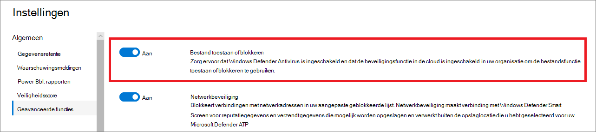

# Geavanceerde functies configureren in Defender voor Eindpunt

**Van toepassing op:**
- [Microsoft Defender voor Eindpunt](https://go.microsoft.com/fwlink/p/?linkid=2154037)
- [Microsoft 365 Defender](https://go.microsoft.com/fwlink/?linkid=2118804)

[!INCLUDE [Microsoft 365 Defender rebranding](../../includes/microsoft-defender.md)]

> Wilt u Defender voor Eindpunt ervaren? [Meld u aan voor een gratis proefabonnement.](https://www.microsoft.com/microsoft-365/windows/microsoft-defender-atp?ocid=docs-wdatp-advancedfeats-abovefoldlink)

Afhankelijk van de Microsoft-beveiligingsproducten die u gebruikt, zijn er mogelijk enkele geavanceerde functies beschikbaar voor u om Defender voor Eindpunt te integreren.

## Geavanceerde functies inschakelen

1. Selecteer in het navigatiedeelvenster **Voorkeuren instellen**  >  **Geavanceerde functies.**
2. Selecteer de geavanceerde functie die u wilt configureren en schakel de instelling in tussen **Aan** en **Uit.**
3. Klik **op Voorkeuren opslaan.**

Gebruik de volgende geavanceerde functies om beter te worden beschermd tegen potentieel schadelijke bestanden en om beter inzicht te krijgen tijdens beveiligingsonderzoeken.

## Geautomatiseerd onderzoek

Schakel deze functie in om te profiteren van de geautomatiseerde onderzoeks- en herstelfuncties van de service. Zie Geautomatiseerd onderzoek [voor meer informatie.](automated-investigations.md)

## Live-antwoord

Schakel deze functie in, zodat gebruikers met de juiste machtigingen een livereactiesessie op apparaten kunnen starten.

Zie Rollen maken en beheren voor meer informatie over [roltoewijzingen.](user-roles.md)

## Livereactie voor servers
Schakel deze functie in, zodat gebruikers met de juiste machtigingen een livereactiesessie op servers kunnen starten.

Zie Rollen maken en beheren voor meer informatie over [roltoewijzingen.](user-roles.md)

## Uitvoering van niet-ondertekende scripts met livereactie

Als u deze functie inschakelen, kunt u niet-ondertekende scripts uitvoeren in een livereactiesessie.

## PuA altijd herstellen
Potentieel ongewenste toepassingen (PUA) zijn een categorie software waarmee uw computer traag kan worden uitgevoerd, onverwachte advertenties kan weergeven of in het slechtste geval andere software kan installeren die onverwacht of ongewenst kan zijn. 

Schakel deze functie in, zodat mogelijk ongewenste toepassingen (PUA) worden gesaneerd op alle apparaten in uw tenant, zelfs als PUA-beveiliging niet is geconfigureerd op de apparaten. Dit helpt gebruikers te beschermen tegen het onbedoeld installeren van ongewenste toepassingen op hun apparaat. Wanneer deze is uitgeschakeld, is herstel afhankelijk van de apparaatconfiguratie. 

## Correlatie beperken tot binnen bereik van apparaatgroepen
Deze configuratie kan worden gebruikt voor scenario's waarin lokale soc-bewerkingen de correlaties van waarschuwingen alleen willen beperken tot apparaatgroepen die ze kunnen openen. Door deze instelling in te stellen, wordt een incident dat bestaat uit waarschuwingen die verschillende apparaatgroepen zijn, niet langer als één incident beschouwd. De lokale soc kan dan actie ondernemen op het incident omdat ze toegang hebben tot een van de betrokken apparaatgroepen. Globale SOC ziet echter verschillende incidenten per apparaatgroep in plaats van één incident. U wordt niet aangeraden deze instelling in te stellen, tenzij dit de voordelen van incidentcorrelatie in de hele organisatie opweegt
>[!NOTE]
>Het wijzigen van deze instelling heeft alleen gevolgen voor toekomstige waarschuwingscorrelatie.

## EDR inschakelen in de blokmodus
Endpoint detection and response (EDR) in block mode biedt bescherming tegen schadelijke artefacten, zelfs wanneer Microsoft Defender Antivirus wordt uitgevoerd in de passieve modus. Wanneer EDR is ingeschakeld, blokkeert EDR in de blokmodus schadelijke artefacten of gedragingen die worden gedetecteerd op een apparaat. EDR in de blokmodus werkt achter de schermen om schadelijke artefacten te corrigeren die worden gedetecteerd na een inbreuk.

## Autoresolve remediated alerts

Voor tenants die zijn gemaakt op of na Windows 10, versie 1809, is de mogelijkheid voor automatisch onderzoek en herstel standaard geconfigureerd om waarschuwingen op te lossen waarbij de status van het geautomatiseerde analyseresultaat 'Geen bedreigingen gevonden' of 'Opgelost' is.  Als u waarschuwingen niet automatisch wilt laten oplossen, moet u de functie handmatig uitschakelen.

> [!TIP]
> Voor tenants die vóór die versie zijn gemaakt, moet u deze functie handmatig inschakelen vanaf de [pagina Geavanceerde functies.](https://securitycenter.windows.com/preferences2/integration)

> [!NOTE]
>
> - Het resultaat van de actie voor automatisch oplossen kan van invloed zijn op de berekening van het apparaatrisiconiveau, die is gebaseerd op de actieve waarschuwingen die op een apparaat zijn gevonden.
> - Als een beveiligingsanalist de status van een waarschuwing handmatig in stelt op 'Aan de gang' of 'Opgelost', wordt de functie voor automatisch oplossen niet overschreven.

## Bestand toestaan of blokkeren

Blokkeren is alleen beschikbaar als uw organisatie aan deze vereisten voldoet:

- Gebruikt Microsoft Defender Antivirus als de actieve antimalware-oplossing en,
- De cloudbeveiligingsfunctie is ingeschakeld

Met deze functie kunt u potentieel schadelijke bestanden in uw netwerk blokkeren. Als u een bestand blokkeert, wordt dit niet gelezen, geschreven of uitgevoerd op apparaten in uw organisatie.

Bestanden **toestaan of blokkeren** in- of in- of uit te stellen:

1. Selecteer in het navigatiedeelvenster **Instellingen Geavanceerde**  >  **functies Bestand** toestaan of  >  **blokkeren.**

1. Schakel de instelling in tussen **Aan** en **Uit.**

    

1. Selecteer **Voorkeuren opslaan** onder aan de pagina.

Nadat u deze functie hebt ingeslagen, kunt u bestanden [blokkeren](respond-file-alerts.md#allow-or-block-file) via het tabblad **Indicator** toevoegen op de profielpagina van een bestand.

## Aangepaste netwerkindicatoren

Met deze functie kunt u indicatoren maken voor IP-adressen, domeinen of URL's, die bepalen of deze worden toegestaan of geblokkeerd op basis van uw aangepaste indicatorlijst.

Als u deze functie wilt gebruiken, moeten apparaten Windows 10 versie 1709 of hoger gebruiken. Ze moeten ook netwerkbeveiliging hebben in de blokmodus en versie 4.18.1906.3 of hoger van het antimalware-platform [zie KB 4052623](https://go.microsoft.com/fwlink/?linkid=2099834).

Zie Indicatoren beheren voor meer [informatie.](manage-indicators.md)

> [!NOTE]
> Netwerkbeveiliging maakt gebruik van reputatieservices die aanvragen verwerken op locaties die zich mogelijk buiten de locatie bevinden die u hebt geselecteerd voor uw Defender voor eindpuntgegevens.

## Beveiliging van tamper
Tijdens sommige soorten cyberaanvallen proberen slechte spelers beveiligingsfuncties, zoals antivirusbeveiliging, uit te schakelen op uw machines. Slechte spelers willen uw beveiligingsfuncties uitschakelen om gemakkelijker toegang te krijgen tot uw gegevens, om malware te installeren of om op een andere manier uw gegevens, identiteit en apparaten te misbruiken.

Met de beveiliging van tamper wordt Microsoft Defender Antivirus vergrendeld en wordt voorkomen dat uw beveiligingsinstellingen worden gewijzigd via apps en methoden.

Houd de beveiliging van de tamper ingeschakeld om ongewenste wijzigingen in uw beveiligingsoplossing en de essentiële functies te voorkomen.

## Gebruikersgegevens tonen

Schakel deze functie in, zodat u gebruikersgegevens kunt zien die zijn opgeslagen in Azure Active Directory. Details zijn onder andere de afbeelding, naam, titel en afdelingsgegevens van een gebruiker bij het onderzoeken van entiteiten van gebruikersaccounts. U kunt gebruikersaccountgegevens vinden in de volgende weergaven:

- Dashboard beveiligingsbewerkingen
- Waarschuwingswachtrij
- Pagina Apparaatdetails

Zie Een gebruikersaccount [onderzoeken voor meer informatie.](investigate-user.md)

## Skype voor Bedrijven-integratie

Als u de integratie van Skype voor Bedrijven inschakelen, kunt u communiceren met gebruikers via Skype voor Bedrijven, e-mail of telefoon. Dit kan handig zijn als u wilt communiceren met de gebruiker en risico's wilt beperken.

> [!NOTE]
> Wanneer een apparaat wordt geïsoleerd van het netwerk, is er een pop-up waarin u outlook- en Skype-communicatie kunt inschakelen, zodat communicatie met de gebruiker kan worden ingeschakeld terwijl de verbinding met het netwerk is verbroken. Deze instelling is van toepassing op Communicatie via Skype en Outlook wanneer apparaten in de isolatiemodus staan.

## Microsoft Defender voor identiteitsintegratie

Met de integratie met Microsoft Defender voor identiteit kunt u rechtstreeks naar een ander beveiligingsproduct van Microsoft Identity draaien. Microsoft Defender voor identiteit vergroot een onderzoek met aanvullende inzichten over een verdacht gekromd account en gerelateerde bronnen. Door deze functie in te stellen, verrijkt u de apparaatgebaseerde onderzoeksfunctie door vanuit een identificeerpunt over het netwerk te draaien.

> [!NOTE]
> U moet over de juiste licentie beschikken om deze functie in te stellen.

## Office 365 Threat Intelligence-verbinding

Deze functie is alleen beschikbaar als u een actieve Office 365 E5 of de Threat Intelligence-invoeging hebt. Zie de productpagina van Office 365 Enterprise E5 voor meer informatie.

Wanneer u deze functie in gebruik neemt, kunt u gegevens van Microsoft Defender voor Office 365 opnemen in het Microsoft Defender-beveiligingscentrum om een uitgebreid beveiligingsonderzoek uit te voeren op Office 365-postvakken en Windows-apparaten.

> [!NOTE]
> U moet over de juiste licentie beschikken om deze functie in te stellen.

Als u contextuele apparaatintegratie wilt ontvangen in Office 365 Threat Intelligence, moet u de instellingen van Defender voor Eindpunt inschakelen in het dashboard & Compliance. Zie Bedreigingsonderzoek [en -antwoord voor meer informatie.](https://docs.microsoft.com/microsoft-365/security/office-365-security/office-365-ti)

## Microsoft Threat Experts - Meldingen van gerichte aanvallen

Van de twee Microsoft Threat Expert-onderdelen is een gerichte aanvalsmelding algemeen beschikbaar. Experts-on-demand-mogelijkheden zijn nog steeds beschikbaar in de preview-versie. U kunt de mogelijkheid van experts op aanvraag alleen gebruiken als u een preview-aanvraag hebt ingediend en uw toepassing is goedgekeurd. U kunt gerichte aanvalsmeldingen ontvangen van Microsoft Threat Experts via het dashboard waarschuwingen van de Defender for Endpoint-portal en via e-mail als u deze configureert.

> [!NOTE]
> De Microsoft Threat Experts-mogelijkheid in Defender voor Eindpunt is beschikbaar met een E5-licentie voor [Enterprise Mobility + Security.](https://www.microsoft.com/cloud-platform/enterprise-mobility-security)
## Microsoft Cloud App Security

Als u deze instelling inschakelen, worden Defender voor Eindpunt-signalen doorgestuurd naar Microsoft Cloud App Security om meer inzicht te krijgen in het gebruik van cloudtoepassing. Doorgestuurde gegevens worden opgeslagen en verwerkt op dezelfde locatie als uw cloud-app-beveiligingsgegevens.

> [!NOTE]
> Deze functie is beschikbaar met een E5-licentie voor [Enterprise Mobility + Beveiliging](https://www.microsoft.com/cloud-platform/enterprise-mobility-security) op apparaten met Windows 10, versie 1709 (os build 16299.1085 met [KB4493441](https://support.microsoft.com/help/4493441)), Windows 10, versie 1803 (os build 17134.704 met [KB4493464),](https://support.microsoft.com/help/4493464)Windows 10, versie 1809 (os build 17763.379 met [KB4489899),](https://support.microsoft.com/help/4489899)of hoger Windows 10-versies.

## Microsoft Secure Score

Doorgestuurde Microsoft Defender voor eindpunten naar Microsoft Secure Score in het Microsoft 365-beveiligingscentrum. Door deze functie in te stellen, krijgt Microsoft Secure Score inzicht in de beveiligingsstatus van het apparaat. Doorgestuurde gegevens worden opgeslagen en verwerkt op dezelfde locatie als uw Microsoft Secure Score-gegevens.

### De integratie van Microsoft Defender voor eindpunten inschakelen vanuit de Microsoft Defender voor identiteitsportal

Als u contextuele apparaatintegratie wilt ontvangen in Microsoft Defender voor identiteit, moet u de functie ook inschakelen in de Microsoft Defender for Identity-portal.

1. Meld u aan bij de [Microsoft Defender for Identity-portal](https://portal.atp.azure.com/) met een rol voor globale beheerder of beveiligingsbeheerder.

2. Klik **op Uw exemplaar maken.**

3. Schakel de instelling Integratie in op **Aan** en klik op **Opslaan.**

Nadat u de integratiestappen voor beide portals hebt doorlopen, kunt u relevante waarschuwingen zien op de pagina apparaatdetails of gebruikersgegevens.

## Filteren van webinhoud
Blokkeer de toegang tot websites die ongewenste inhoud bevatten en volg webactiviteit in alle domeinen. Als u de categorieën met webinhoud wilt opgeven die u wilt blokkeren, maakt u een [filterbeleid voor webinhoud.](https://security.microsoft.com/preferences2/web_content_filtering_policy) Zorg ervoor dat u netwerkbeveiliging hebt in de blokmodus bij het implementeren van de [beveiligingslijn van Microsoft Defender voor Eindpunt.](https://devicemanagement.microsoft.com/#blade/Microsoft_Intune_Workflows/SecurityBaselineSummaryMenu/overview/templateType/2)

## Eindpuntwaarschuwingen delen met Microsoft Compliance Center
Doorgestuurde beveiligingswaarschuwingen voor eindpunten en hun triagestatus naar Microsoft Compliance Center, zodat u het beleid voor insiderrisicobeheer kunt verbeteren met waarschuwingen en interne risico's kunt corrigeren voordat deze schade veroorzaken. Doorgestuurde gegevens worden verwerkt en opgeslagen op dezelfde locatie als uw Office 365-gegevens.

Nadat u  de indicatoren voor beveiligingsbeleidsovertreding hebt geconfigureerd in de instellingen voor insiderrisicobeheer, worden defender voor eindpuntwaarschuwingen gedeeld met insiderrisicobeheer voor toepasselijke gebruikers.

## Microsoft Intune-verbinding

Defender voor Eindpunt kan worden geïntegreerd met [Microsoft Intune om](https://docs.microsoft.com/intune/what-is-intune) voorwaardelijke toegang op basis van [apparaatrisico's in te stellen.](https://docs.microsoft.com/intune/advanced-threat-protection#enable-windows-defender-atp-in-intune) Wanneer u [deze functie in gebruikt,](configure-conditional-access.md)kunt u de apparaatgegevens van Defender voor eindpunt delen met Intune, waardoor de handhaving van het beleid wordt vergroot.

> [!IMPORTANT]
> U moet de integratie van zowel Intune als Defender voor Endpoint inschakelen om deze functie te kunnen gebruiken. Zie Voorwaardelijke toegang [configureren in Defender voor eindpunt](configure-conditional-access.md)voor meer informatie over specifieke stappen.

Deze functie is alleen beschikbaar als u het volgende hebt:

- Een gelicentieerde tenant voor Enterprise Mobility + Security E3 en Windows E5 (of Microsoft 365 Enterprise E5)
- Een actieve Microsoft Intune-omgeving, met Intune-beheerde Windows 10-apparaten [met Azure AD-joined.](https://docs.microsoft.com/azure/active-directory/devices/concept-azure-ad-join/)

### Beleid voor voorwaardelijke toegang

Wanneer u Intune-integratie inschakelen, wordt in Intune automatisch een klassiek CA-beleid (Conditional Access) aan het maken. Dit klassieke CA-beleid is een vereiste voor het instellen van statusrapporten op Intune. Het moet niet worden verwijderd.

> [!NOTE]
> Het klassieke CA-beleid dat door Intune is gemaakt, verschilt van het moderne beleid voor Voorwaardelijke [toegang,](https://docs.microsoft.com/azure/active-directory/conditional-access/overview/)dat wordt gebruikt voor het configureren van eindpunten.

## Apparaatdetectie
Helpt u bij het vinden van niet-beheerbare apparaten die zijn verbonden met uw bedrijfsnetwerk zonder dat u extra apparaten of lastige proceswijzigingen nodig hebt. Met onboarded-apparaten kunt u onaangemande apparaten in uw netwerk vinden en beveiligingslekken en risico's beoordelen. Zie Apparaatdetectie voor [meer informatie.](device-discovery.md)

## Preview-functies

Lees meer over nieuwe functies in de preview-release van Defender voor Eindpunt en probeer als een van de eersten toekomstige functies door de preview-ervaring in te- of uitschakelen.

U hebt toegang tot toekomstige functies, waarop u feedback kunt geven om de algehele ervaring te verbeteren voordat functies algemeen beschikbaar zijn.

## Verwante onderwerpen

- [Instellingen voor gegevensretentie bijwerken](data-retention-settings.md)
- [Waarschuwingsmeldingen configureren](configure-email-notifications.md)
