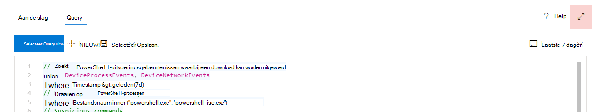
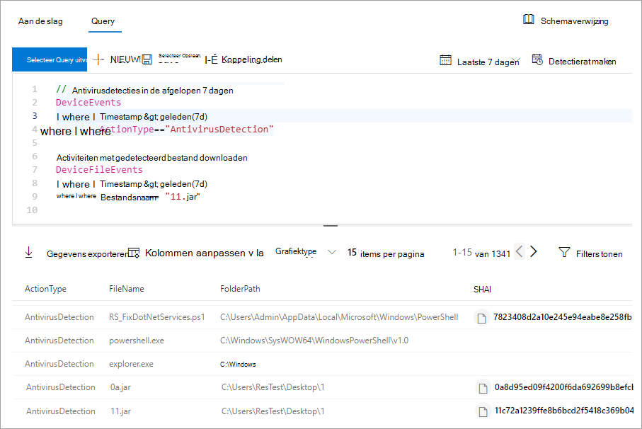

# <a name="learn-the-advanced-hunting-query-language"></a>De geavanceerde zoekquerytaal leren

[!INCLUDE [Microsoft 365 Defender rebranding](../../includes/microsoft-defender.md)]

**Van toepassing op:**
- [Defender voor Eindpunt](https://go.microsoft.com/fwlink/?linkid=2154037)

> Wilt u Defender voor Eindpunt ervaren? [Meld u aan voor een gratis proefabonnement.](https://www.microsoft.com/microsoft-365/windows/microsoft-defender-atp?ocid=docs-wdatp-advancedhunting-abovefoldlink)

Geavanceerd zoeken is gebaseerd op de [querytaal Kusto.](https://docs.microsoft.com/azure/kusto/query/) U kunt Kusto-operatoren en instructies gebruiken om query's te maken die informatie zoeken in een gespecialiseerd [schema.](advanced-hunting-schema-reference.md) Als u deze concepten beter wilt begrijpen, kunt u de eerste query uitvoeren.

## <a name="try-your-first-query"></a>Probeer uw eerste query

Ga in het Microsoft Defender-beveiligingscentrum naar **Geavanceerd zoeken om** uw eerste query uit te voeren. Gebruik het volgende voorbeeld:

```kusto
// Finds PowerShell execution events that could involve a download
union DeviceProcessEvents, DeviceNetworkEvents
| where Timestamp > ago(7d)
// Pivoting on PowerShell processes
| where FileName in~ ("powershell.exe", "powershell_ise.exe")
// Suspicious commands
| where ProcessCommandLine has_any("WebClient",
    "DownloadFile",
    "DownloadData",
    "DownloadString",
    "WebRequest",
    "Shellcode",
    "http",
    "https")
| project Timestamp, DeviceName, InitiatingProcessFileName, InitiatingProcessCommandLine, 
FileName, ProcessCommandLine, RemoteIP, RemoteUrl, RemotePort, RemoteIPType
| top 100 by Timestamp
```
**[Voer deze query uit in geavanceerd zoeken](https://securitycenter.windows.com/hunting?query=H4sIAAAAAAAEAI2TT0vDQBDF5yz4HUJPFcTqyZsXqyCIBFvxKNGWtpo_NVlbC8XP7m8mado0K5Zls8nkzdu3b2Z70pNAbmUmqYyk4D2UTJYyllwGMmWNGQHrN_NNvsSBzUBrbMFMiWieAx3xDEBl4GL4AuNd8B0bNgARENcdUmIZ3yM5liPwac3bN-YZPGPU5ET1rWDc7Ox4uod8YDp4MzI-GkjlX4Ne2nly0zEkKzFWh4ZE5sSuTN8Ehq5couvEMnvmUAhez-HsRBMipVa_W_OG6vEfGtT12JRHpqV064e1Kx04NsxFzXxW1aFjp_djXmDRPbfY3XMMcLogTz2bWZ2KqmIJI6q6wKe2WYnrRsa9KVeU9kCBBo2v7BzPxF_Bx2DKiqh63SGoRoc6Njti48z_yL71XHQAcgAur6rXRpcqH3l-4knZF23Utsbq2MircEqmw-G__xR1TdZ1r7zb7XLezmx3etkvGr-ze6NdGdW92azUfpcdluWvr-aqbh_nofnqcWI3aYyOsBV7giduRUO7187LMKTT5rxvHHX80_t8IeeMgLquvL7-Ak3q-kz8BAAA&runQuery=true&timeRangeId=week)**

### <a name="describe-the-query-and-specify-the-tables-to-search"></a>Beschrijf de query en geef de tabellen op die u wilt zoeken
Er is een korte opmerking toegevoegd aan het begin van de query om te beschrijven waar deze voor is. Deze opmerking helpt als u later besluit de query op te slaan en deze te delen met anderen in uw organisatie.

```kusto
// Finds PowerShell execution events that could involve a download
```
De query zelf begint meestal met een tabelnaam, gevolgd door verschillende elementen die beginnen met een pijp ( `|` ). In dit voorbeeld beginnen we met het maken van een samenvoeging van twee tabellen en , en voegen we zo nodig  `DeviceProcessEvents` `DeviceNetworkEvents` gepijpte elementen toe.

```kusto
union DeviceProcessEvents, DeviceNetworkEvents
```
### <a name="set-the-time-range"></a>Het tijdsbereik instellen
Het eerste piped-element is een tijdfilter dat is beperkt tot de afgelopen zeven dagen. Als u het tijdbereik beperkt, zorgt u ervoor dat query's goed presteren, beheersbare resultaten retourneren en geen time-out maken.

```kusto
| where Timestamp > ago(7d)
```

### <a name="check-specific-processes"></a>Specifieke processen controleren
Het tijdbereik wordt onmiddellijk gevolgd door een zoekopdracht naar de namen van procesbestanden die de PowerShell-toepassing vertegenwoordigen.

```kusto
// Pivoting on PowerShell processes
| where FileName in~ ("powershell.exe", "powershell_ise.exe")
```

### <a name="search-for-specific-command-strings"></a>Specifieke opdrachtreeksen zoeken
Daarna zoekt de query naar tekenreeksen in opdrachtregels die gewoonlijk worden gebruikt om bestanden te downloaden met PowerShell.

```kusto
// Suspicious commands
| where ProcessCommandLine has_any("WebClient",
    "DownloadFile",
    "DownloadData",
    "DownloadString",
    "WebRequest",
    "Shellcode",
    "http",
    "https")
```

### <a name="customize-result-columns-and-length"></a>Resultaatkolommen en lengte aanpassen 
Nu de query duidelijk aangeeft welke gegevens u wilt zoeken, kunt u definiëren hoe de resultaten eruit zien. `project` geeft als resultaat specifieke kolommen en `top` beperkt het aantal resultaten. Deze operatoren helpen ervoor te zorgen dat de resultaten goed zijn opgemaakt en redelijk groot en eenvoudig te verwerken zijn.

```kusto
| project Timestamp, DeviceName, InitiatingProcessFileName, InitiatingProcessCommandLine, 
FileName, ProcessCommandLine, RemoteIP, RemoteUrl, RemotePort, RemoteIPType
| top 100 by Timestamp
```

Selecteer **Query uitvoeren om** de resultaten te zien. Gebruik het pictogram Uitvvuiten rechtsboven in de queryeditor om de focus te leggen op uw query en de resultaten. 



>[!TIP]
>U kunt queryresultaten weergeven als grafieken en snel filters aanpassen. Lees voor meer [informatie over het werken met queryresultaten](advanced-hunting-query-results.md)

## <a name="learn-common-query-operators-for-advanced-hunting"></a>Veelgebruikte queryoperatoren voor geavanceerd zoeken

U hebt zojuist uw eerste query uitgevoerd en hebt een algemeen idee van de onderdelen. Het is tijd om iets terug te keren en enkele basisbeginselen te leren. De kusto-querytaal die wordt gebruikt door geavanceerde jagen ondersteunt een reeks operatoren, waaronder de volgende veelgebruikte.

| Operator | Beschrijving en gebruik |
|--|--|
| `where` | Een tabel filteren op de subset van rijen die voldoen aan een predicaat. |
| `summarize` | Een tabel maken die de inhoud van de invoertabel aggregeert. |
| `join` | Voeg de rijen van twee tabellen samen om een nieuwe tabel te vormen door de waarden van de opgegeven kolom(en) uit elke tabel te koppelen. |
| `count` | Het aantal records in de invoerrecordset retourneren. |
| `top` | Retourneert de eerste N-records gesorteerd op de opgegeven kolommen. |
| `limit` | Ga terug naar het opgegeven aantal rijen. |
| `project` | Selecteer de kolommen die u wilt opnemen, de naam wilt wijzigen of neerzetten en voeg nieuwe berekende kolommen in. |
| `extend` | Maak berekende kolommen en wijs deze toe aan de resultatenset. |
| `makeset` |  Retourneert een dynamische matrix (JSON) van de set afzonderlijke waarden die Expr in de groep op zich neemt. |
| `find` | Rijen zoeken die overeenkomen met een predicaat in een set tabellen. |

Als u een livevoorbeeld van deze operatoren wilt zien, kunt u deze uitvoeren vanuit de sectie Aan **de** slag van de geavanceerde pagina.

## <a name="understand-data-types"></a>Gegevenstypen begrijpen

Geavanceerde jacht ondersteunt Kusto-gegevenstypen, waaronder de volgende veelvoorkomende typen:

| Gegevenstype | Beschrijving en query-implicaties |
|--|--|
| `datetime` | Gegevens- en tijdgegevens die meestal gebeurtenistijdstempels vertegenwoordigen. [Ondersteunde datumtime-indelingen bekijken](https://docs.microsoft.com/azure/data-explorer/kusto/query/scalar-data-types/datetime) |
| `string` | Tekenreeks in UTF-8 tussen enkele aanhalingstekens ( `'` ) of dubbele aanhalingstekens ( `"` ). [Meer informatie over tekenreeksen](https://docs.microsoft.com/azure/data-explorer/kusto/query/scalar-data-types/string) |
| `bool` | Dit gegevenstype ondersteunt `true` of `false` geeft deze op. [Ondersteunde letterlijke en operatoren bekijken](https://docs.microsoft.com/azure/data-explorer/kusto/query/scalar-data-types/bool) |
| `int` | 32-bits geheel getal  |
| `long` | 64-bits geheel getal |

Als u meer wilt weten over deze gegevenstypen, [leest u meer over kusto scalaire gegevenstypen.](https://docs.microsoft.com/azure/data-explorer/kusto/query/scalar-data-types/)

## <a name="get-help-as-you-write-queries"></a>Hulp krijgen tijdens het schrijven van query's
Profiteer van de volgende functionaliteit om query's sneller te schrijven:

- **Autosuggest**: terwijl u query's schrijft, biedt geavanceerd zoeken suggesties van IntelliSense.
- **Schemastructuur:** een schemaweergave die de lijst met tabellen en de kolommen bevat, wordt naast uw werkgebied weergegeven. Plaats de muisaanwijzer op een item voor meer informatie. Dubbelklik op een item om het in te voegen in de queryeditor.
- **[Schemaverwijzing:](advanced-hunting-schema-reference.md#get-schema-information-in-the-security-center)** in-portalverwijzing met tabel- en kolombeschrijvingen, ondersteunde gebeurtenistypen `ActionType` (waarden) en voorbeeldquery's

## <a name="work-with-multiple-queries-in-the-editor"></a>Werken met meerdere query's in de editor
U kunt de queryeditor gebruiken om te experimenteren met meerdere query's. Meerdere query's gebruiken:

- Scheid elke query met een lege regel.
- Plaats de cursor op een deel van een query om die query te selecteren voordat u deze uitvoert. Hiermee wordt alleen de geselecteerde query uitgevoerd. Als u een andere query wilt uitvoeren, verplaatst u de cursor dienovereenkomstig en selecteert u **Query uitvoeren.**


 _Queryeditor met meerdere query's_

## <a name="use-sample-queries"></a>Voorbeeldquery's gebruiken

De **sectie Aan de** slag bevat een paar eenvoudige query's met veelgebruikte operatoren. Probeer deze query's uit te proberen en kleine wijzigingen aan te brengen.


> [!NOTE]
> Naast de basisqueryvoorbeelden hebt u ook toegang tot gedeelde [query's](advanced-hunting-shared-queries.md) voor specifieke scenario's voor het zoeken naar bedreigingen. Verken de gedeelde query's aan de linkerkant van de pagina of de [GitHub-queryopslagplaats.](https://aka.ms/hunting-queries)

## <a name="access-comprehensive-query-language-reference"></a>Uitgebreide querytaalverwijzing van Access

Zie [Kusto-querytaaldocumentatie](https://docs.microsoft.com/azure/kusto/query/)voor meer informatie over de querytaal.

## <a name="related-topics"></a>Verwante onderwerpen
- [Overzicht van geavanceerd opsporen](advanced-hunting-overview.md)
- [Werken met queryresultaten](advanced-hunting-query-results.md)
- [Gedeelde query's gebruiken](advanced-hunting-shared-queries.md)
- [Meer informatie over het schema](advanced-hunting-schema-reference.md)
- [Aanbevolen procedures voor query's toepassen](advanced-hunting-best-practices.md)
