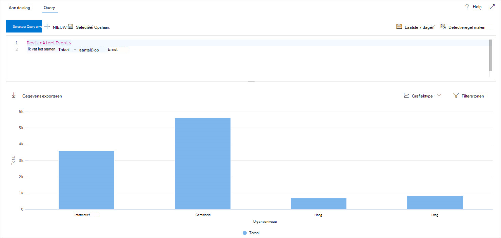
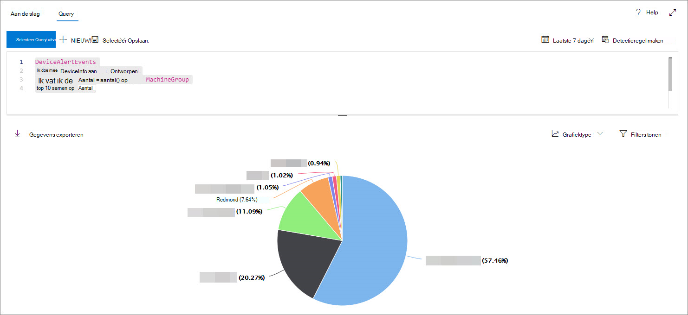
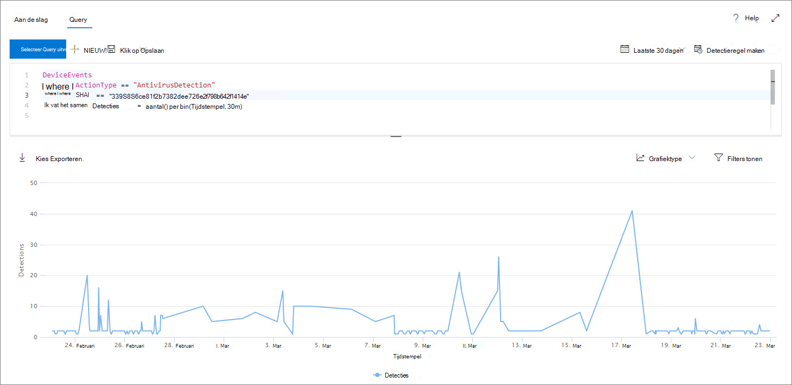
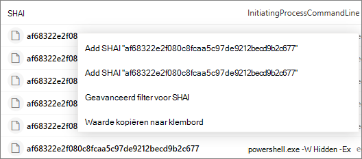

# <a name="work-with-advanced-hunting-query-results"></a><span data-ttu-id="92163-104">Werken met geavanceerde resultaten van query's</span><span class="sxs-lookup"><span data-stu-id="92163-104">Work with advanced hunting query results</span></span>

[!INCLUDE [Microsoft 365 Defender rebranding](../../includes/microsoft-defender.md)]

<span data-ttu-id="92163-105">**Van toepassing op:**</span><span class="sxs-lookup"><span data-stu-id="92163-105">**Applies to:**</span></span>
- [<span data-ttu-id="92163-106">Microsoft Defender voor Eindpunt</span><span class="sxs-lookup"><span data-stu-id="92163-106">Microsoft Defender for Endpoint</span></span>](https://go.microsoft.com/fwlink/?linkid=2154037)

><span data-ttu-id="92163-107">Wilt u Defender voor Eindpunt ervaren?</span><span class="sxs-lookup"><span data-stu-id="92163-107">Want to experience Defender for Endpoint?</span></span> [<span data-ttu-id="92163-108">Meld u aan voor een gratis proefabonnement.</span><span class="sxs-lookup"><span data-stu-id="92163-108">Sign up for a free trial.</span></span>](https://www.microsoft.com/microsoft-365/windows/microsoft-defender-atp?ocid=docs-wdatp-advancedhunting-abovefoldlink)

<span data-ttu-id="92163-109">Hoewel u geavanceerde [](advanced-hunting-overview.md) zoekquery's kunt maken om zeer nauwkeurige informatie te retourneren, kunt u ook met de queryresultaten werken om meer inzicht te krijgen en specifieke activiteiten en indicatoren te onderzoeken.</span><span class="sxs-lookup"><span data-stu-id="92163-109">While you can construct your [advanced hunting](advanced-hunting-overview.md) queries to return very precise information, you can also work with the query results to gain further insight and investigate specific activities and indicators.</span></span> <span data-ttu-id="92163-110">U kunt de volgende acties uitvoeren voor de queryresultaten:</span><span class="sxs-lookup"><span data-stu-id="92163-110">You can take the following actions on your query results:</span></span>

- <span data-ttu-id="92163-111">Resultaten weergeven als een tabel of grafiek</span><span class="sxs-lookup"><span data-stu-id="92163-111">View results as a table or chart</span></span>
- <span data-ttu-id="92163-112">Tabellen en grafieken exporteren</span><span class="sxs-lookup"><span data-stu-id="92163-112">Export tables and charts</span></span>
- <span data-ttu-id="92163-113">Inzoomen op gedetailleerde entiteitsgegevens</span><span class="sxs-lookup"><span data-stu-id="92163-113">Drill down to detailed entity information</span></span>
- <span data-ttu-id="92163-114">Uw query's rechtstreeks aanpassen aan de resultaten of filters toepassen</span><span class="sxs-lookup"><span data-stu-id="92163-114">Tweak your queries directly from the results or apply filters</span></span>

## <a name="view-query-results-as-a-table-or-chart"></a><span data-ttu-id="92163-115">Queryresultaten weergeven als een tabel of grafiek</span><span class="sxs-lookup"><span data-stu-id="92163-115">View query results as a table or chart</span></span>
<span data-ttu-id="92163-116">Standaard worden queryresultaten in geavanceerde query's weergegeven als tabelgegevens.</span><span class="sxs-lookup"><span data-stu-id="92163-116">By default, advanced hunting displays query results as tabular data.</span></span> <span data-ttu-id="92163-117">U kunt ook dezelfde gegevens als een grafiek weergeven.</span><span class="sxs-lookup"><span data-stu-id="92163-117">You can also display the same data as a chart.</span></span> <span data-ttu-id="92163-118">Geavanceerde jacht ondersteunt de volgende weergaven:</span><span class="sxs-lookup"><span data-stu-id="92163-118">Advanced hunting supports the following views:</span></span>

| <span data-ttu-id="92163-119">Weergavetype</span><span class="sxs-lookup"><span data-stu-id="92163-119">View type</span></span> | <span data-ttu-id="92163-120">Omschrijving</span><span class="sxs-lookup"><span data-stu-id="92163-120">Description</span></span> |
| -- | -- |
| <span data-ttu-id="92163-121">**Tabel**</span><span class="sxs-lookup"><span data-stu-id="92163-121">**Table**</span></span> | <span data-ttu-id="92163-122">Geeft de queryresultaten weer in tabelvorm</span><span class="sxs-lookup"><span data-stu-id="92163-122">Displays the query results in tabular format</span></span> |
| <span data-ttu-id="92163-123">**Kolomdiagram**</span><span class="sxs-lookup"><span data-stu-id="92163-123">**Column chart**</span></span> | <span data-ttu-id="92163-124">Geeft een reeks unieke items op de x-as weer als verticale balken waarvan de hoogten numerieke waarden uit een ander veld vertegenwoordigen</span><span class="sxs-lookup"><span data-stu-id="92163-124">Renders a series of unique items on the x-axis as vertical bars whose heights represent numeric values from another field</span></span> |
| <span data-ttu-id="92163-125">**Gestapeld kolomdiagram**</span><span class="sxs-lookup"><span data-stu-id="92163-125">**Stacked column chart**</span></span> | <span data-ttu-id="92163-126">Geeft een reeks unieke items op de x-as weer als gestapelde verticale balken waarvan de hoogten numerieke waarden uit een of meer andere velden vertegenwoordigen</span><span class="sxs-lookup"><span data-stu-id="92163-126">Renders a series of unique items on the x-axis as stacked vertical bars whose heights represent numeric values from one or more other fields</span></span> |
| <span data-ttu-id="92163-127">**Cirkeldiagram**</span><span class="sxs-lookup"><span data-stu-id="92163-127">**Pie chart**</span></span> | <span data-ttu-id="92163-128">Hiermee worden sectie-cirkels weergegeven die unieke items vertegenwoordigen.</span><span class="sxs-lookup"><span data-stu-id="92163-128">Renders sectional pies representing unique items.</span></span> <span data-ttu-id="92163-129">De grootte van elke cirkel vertegenwoordigt numerieke waarden uit een ander veld.</span><span class="sxs-lookup"><span data-stu-id="92163-129">The size of each pie represents numeric values from another field.</span></span> |
| <span data-ttu-id="92163-130">**Donut-diagram**</span><span class="sxs-lookup"><span data-stu-id="92163-130">**Donut chart**</span></span> | <span data-ttu-id="92163-131">Hiermee worden sectiebogen weergegeven die unieke items vertegenwoordigen.</span><span class="sxs-lookup"><span data-stu-id="92163-131">Renders sectional arcs representing unique items.</span></span> <span data-ttu-id="92163-132">De lengte van elke boog vertegenwoordigt numerieke waarden uit een ander veld.</span><span class="sxs-lookup"><span data-stu-id="92163-132">The length of each arc represents numeric values from another field.</span></span> |
| <span data-ttu-id="92163-133">**Lijndiagram**</span><span class="sxs-lookup"><span data-stu-id="92163-133">**Line chart**</span></span> | <span data-ttu-id="92163-134">Plots numerieke waarden voor een reeks unieke items en verbindt de uitgezete waarden</span><span class="sxs-lookup"><span data-stu-id="92163-134">Plots numeric values for a series of unique items and connects the plotted values</span></span> |
| <span data-ttu-id="92163-135">**Spreidingsdiagram**</span><span class="sxs-lookup"><span data-stu-id="92163-135">**Scatter chart**</span></span> | <span data-ttu-id="92163-136">Numerieke waarden voor een reeks unieke items plots</span><span class="sxs-lookup"><span data-stu-id="92163-136">Plots numeric values for a series of unique items</span></span> |
| <span data-ttu-id="92163-137">**Vlakdiagram**</span><span class="sxs-lookup"><span data-stu-id="92163-137">**Area chart**</span></span> | <span data-ttu-id="92163-138">Plots numerieke waarden voor een reeks unieke items en vult de secties onder de uitgezete waarden</span><span class="sxs-lookup"><span data-stu-id="92163-138">Plots numeric values for a series of unique items and fills the sections below the plotted values</span></span> |

### <a name="construct-queries-for-effective-charts"></a><span data-ttu-id="92163-139">Query's maken voor effectieve grafieken</span><span class="sxs-lookup"><span data-stu-id="92163-139">Construct queries for effective charts</span></span>
<span data-ttu-id="92163-140">Bij het weergeven van grafieken worden met geavanceerde jacht automatisch de kolommen met interesse en de numerieke waarden geïdentificeerd die moeten worden samengevoegd.</span><span class="sxs-lookup"><span data-stu-id="92163-140">When rendering charts, advanced hunting automatically identifies columns of interest and the numeric values to aggregate.</span></span> <span data-ttu-id="92163-141">Als u zinvolle grafieken wilt krijgen, maakt u uw query's om de specifieke waarden te retourneren die u wilt visualiseren.</span><span class="sxs-lookup"><span data-stu-id="92163-141">To get meaningful charts, construct your queries to return the specific values you want to see visualized.</span></span> <span data-ttu-id="92163-142">Hier zijn enkele voorbeeldquery's en de resulterende grafieken.</span><span class="sxs-lookup"><span data-stu-id="92163-142">Here are some sample queries and the resulting charts.</span></span>

#### <a name="alerts-by-severity"></a><span data-ttu-id="92163-143">Waarschuwingen op ernst</span><span class="sxs-lookup"><span data-stu-id="92163-143">Alerts by severity</span></span>
<span data-ttu-id="92163-144">Gebruik de operator om een numeriek aantal waarden te verkrijgen dat `summarize` u wilt grafieken.</span><span class="sxs-lookup"><span data-stu-id="92163-144">Use the `summarize` operator to obtain a numeric count of the values you want to chart.</span></span> <span data-ttu-id="92163-145">In de onderstaande query wordt `summarize` de operator gebruikt om het aantal waarschuwingen op ernst te krijgen.</span><span class="sxs-lookup"><span data-stu-id="92163-145">The query below uses the `summarize` operator to get the number of alerts by severity.</span></span>

```kusto
DeviceAlertEvents
| summarize Total = count() by Severity
```
<span data-ttu-id="92163-146">Bij het weergeven van de resultaten wordt in een kolomdiagram elke ernstwaarde weergegeven als een afzonderlijke kolom:</span><span class="sxs-lookup"><span data-stu-id="92163-146">When rendering the results, a column chart displays each severity value as a separate column:</span></span>

<span data-ttu-id="92163-147">
 *kolomdiagram worden weergegeven*</span><span class="sxs-lookup"><span data-stu-id="92163-147">
*Query results for alerts by severity displayed as a column chart*</span></span>

#### <a name="alert-severity-by-operating-system"></a><span data-ttu-id="92163-148">Ernst van waarschuwing per besturingssysteem</span><span class="sxs-lookup"><span data-stu-id="92163-148">Alert severity by operating system</span></span>
<span data-ttu-id="92163-149">U kunt de operator ook `summarize` gebruiken om resultaten voor te bereiden voor het in kaart brengen van waarden uit meerdere velden.</span><span class="sxs-lookup"><span data-stu-id="92163-149">You could also use the `summarize` operator to prepare results for charting values from multiple fields.</span></span> <span data-ttu-id="92163-150">U wilt bijvoorbeeld weten hoe de ernst van waarschuwingen wordt verdeeld over besturingssystemen (OS).</span><span class="sxs-lookup"><span data-stu-id="92163-150">For example, you might want to understand how alert severities are distributed across operating systems (OS).</span></span> 

<span data-ttu-id="92163-151">In de onderstaande query wordt een operator gebruikt om besturingssysteemgegevens uit de tabel te halen en vervolgens waarden in zowel de tabel als `join` `DeviceInfo` de kolommen te `summarize` `OSPlatform` `Severity` tellen:</span><span class="sxs-lookup"><span data-stu-id="92163-151">The query below uses a `join` operator to pull in OS information from the `DeviceInfo` table, and then uses `summarize` to count values in both the `OSPlatform` and `Severity` columns:</span></span>

```kusto
DeviceAlertEvents
| join DeviceInfo on DeviceId
| summarize Count = count() by OSPlatform, Severity
```
<span data-ttu-id="92163-152">Deze resultaten worden het best gevisualiseerd met behulp van een gestapeld kolomdiagram:</span><span class="sxs-lookup"><span data-stu-id="92163-152">These results are best visualized using a stacked column chart:</span></span>

<span data-ttu-id="92163-153">
 *als een gestapelde grafiek*</span><span class="sxs-lookup"><span data-stu-id="92163-153">
*Query results for alerts by OS and severity displayed as a stacked chart*</span></span>

#### <a name="top-ten-device-groups-with-alerts"></a><span data-ttu-id="92163-154">Tien apparaatgroepen met waarschuwingen</span><span class="sxs-lookup"><span data-stu-id="92163-154">Top ten device groups with alerts</span></span>
<span data-ttu-id="92163-155">Als u te maken hebt met een lijst met waarden die niet eindig is, kunt u de operator gebruiken om alleen de waarden met de meeste `Top` exemplaren in kaart te brengen.</span><span class="sxs-lookup"><span data-stu-id="92163-155">If you're dealing with a list of values that isn’t finite, you can use the `Top` operator to chart only the values with the most instances.</span></span> <span data-ttu-id="92163-156">Als u bijvoorbeeld de tien beste apparaatgroepen met de meeste waarschuwingen wilt krijgen, gebruikt u de onderstaande query:</span><span class="sxs-lookup"><span data-stu-id="92163-156">For example, to get the top ten device groups with the most alerts, use the query below:</span></span>

```kusto
DeviceAlertEvents
| join DeviceInfo on DeviceId
| summarize Count = count() by MachineGroup
| top 10 by Count
```
<span data-ttu-id="92163-157">Gebruik de cirkeldiagramweergave om de verdeling over de bovenste groepen effectief weer te geven:</span><span class="sxs-lookup"><span data-stu-id="92163-157">Use the pie chart view to effectively show distribution across the top groups:</span></span>

<span data-ttu-id="92163-158">
 *de verdeling van waarschuwingen over apparaatgroepen*</span><span class="sxs-lookup"><span data-stu-id="92163-158">
*Pie chart showing distribution of alerts across device groups*</span></span>

#### <a name="malware-detections-over-time"></a><span data-ttu-id="92163-159">Malwaredetecties in de tijd</span><span class="sxs-lookup"><span data-stu-id="92163-159">Malware detections over time</span></span>
<span data-ttu-id="92163-160">Met behulp `summarize` van de operator met de functie kunt u controleren op gebeurtenissen met een bepaalde indicator in de `bin()` tijd.</span><span class="sxs-lookup"><span data-stu-id="92163-160">Using the `summarize` operator with the `bin()` function, you can check for events involving a particular indicator over time.</span></span> <span data-ttu-id="92163-161">Met de onderstaande query worden detecties van een EICAR-testbestand met intervallen van 30 minuten geteld om pieken in detecties van dat bestand weer te geven:</span><span class="sxs-lookup"><span data-stu-id="92163-161">The query below counts detections of an EICAR test file at 30 minute intervals to show spikes in detections of that file:</span></span>

```kusto
DeviceEvents
| where ActionType == "AntivirusDetection"
| where SHA1 == "3395856ce81f2b7382dee72602f798b642f14140"
| summarize Detections = count() by bin(Timestamp, 30m)
```
<span data-ttu-id="92163-162">In het lijndiagram hieronder worden duidelijk perioden met meer detecties van de testmalware belicht:</span><span class="sxs-lookup"><span data-stu-id="92163-162">The line chart below clearly highlights time periods with more detections of the test malware:</span></span> 

<span data-ttu-id="92163-163">
 *een test malware in de tijd*</span><span class="sxs-lookup"><span data-stu-id="92163-163">
*Line chart showing the number of detections of a test malware over time*</span></span>


## <a name="export-tables-and-charts"></a><span data-ttu-id="92163-164">Tabellen en grafieken exporteren</span><span class="sxs-lookup"><span data-stu-id="92163-164">Export tables and charts</span></span>
<span data-ttu-id="92163-165">Nadat u een query hebt uitgevoerd, **selecteert u Exporteren om** de resultaten op te slaan in een lokaal bestand.</span><span class="sxs-lookup"><span data-stu-id="92163-165">After running a query, select **Export** to save the results to local file.</span></span> <span data-ttu-id="92163-166">De gekozen weergave bepaalt hoe de resultaten worden geëxporteerd:</span><span class="sxs-lookup"><span data-stu-id="92163-166">Your chosen view determines how the results are exported:</span></span>

- <span data-ttu-id="92163-167">**Tabelweergave:** de queryresultaten worden in tabelvorm geëxporteerd als een Microsoft Excel-werkmap</span><span class="sxs-lookup"><span data-stu-id="92163-167">**Table view** — the query results are exported in tabular form as a Microsoft Excel workbook</span></span>
- <span data-ttu-id="92163-168">**Een grafiek:** de queryresultaten worden geëxporteerd als EEN JPEG-afbeelding van de weergegeven grafiek</span><span class="sxs-lookup"><span data-stu-id="92163-168">**Any chart** — the query results are exported as a JPEG image of the rendered chart</span></span>

## <a name="drill-down-from-query-results"></a><span data-ttu-id="92163-169">Inzoomen op queryresultaten</span><span class="sxs-lookup"><span data-stu-id="92163-169">Drill down from query results</span></span>
<span data-ttu-id="92163-170">Als u meer informatie wilt weergeven over entiteiten, zoals apparaten, bestanden, gebruikers, IP-adressen en URL's, klikt u in de queryresultaten op de entiteit-id.</span><span class="sxs-lookup"><span data-stu-id="92163-170">To view more information about entities, such as devices, files, users, IP addresses, and URLs, in your query results, simply click the entity identifier.</span></span> <span data-ttu-id="92163-171">Hiermee wordt een gedetailleerde profielpagina voor de geselecteerde entiteit geopend.</span><span class="sxs-lookup"><span data-stu-id="92163-171">This opens a detailed profile page for the selected entity.</span></span>

<span data-ttu-id="92163-172">Als u snel een record in de queryresultaten wilt controleren, selecteert u de bijbehorende rij om het deelvenster Record controleren te openen.</span><span class="sxs-lookup"><span data-stu-id="92163-172">To quickly inspect a record in your query results, select the corresponding row to open the Inspect record panel.</span></span> <span data-ttu-id="92163-173">Het deelvenster bevat de volgende informatie op basis van de geselecteerde record:</span><span class="sxs-lookup"><span data-stu-id="92163-173">The panel provides the following information based on the selected record:</span></span>

- <span data-ttu-id="92163-174">**Activa:** een samengevatte weergave van de belangrijkste activa (postvakken, apparaten en gebruikers) die in de record zijn gevonden, aangevuld met beschikbare informatie, zoals risico- en blootstellingsniveaus</span><span class="sxs-lookup"><span data-stu-id="92163-174">**Assets** — A summarized view of the main assets (mailboxes, devices, and users) found in the record, enriched with available information, such as risk and exposure levels</span></span>
- <span data-ttu-id="92163-175">**Processtructuur:** een grafiek die wordt gegenereerd voor records met procesgegevens en die is uitgebreid met behulp van beschikbare contextuele informatie; Query's die meer kolommen retourneren, kunnen over het algemeen leiden tot rijkere procesbomen.</span><span class="sxs-lookup"><span data-stu-id="92163-175">**Process tree** — A chart generated for records with process information and enriched using available contextual information; in general, queries that return more columns can result in richer process trees.</span></span>
- <span data-ttu-id="92163-176">**Alle details:** bevat alle waarden uit de kolommen in de record</span><span class="sxs-lookup"><span data-stu-id="92163-176">**All details** — Lists all the values from the columns in the record</span></span>

## <a name="tweak-your-queries-from-the-results"></a><span data-ttu-id="92163-177">Uw query's aanpassen aan de hand van de resultaten</span><span class="sxs-lookup"><span data-stu-id="92163-177">Tweak your queries from the results</span></span>
<span data-ttu-id="92163-178">Klik met de rechtermuisknop op een waarde in de resultatenset om de query snel te verbeteren.</span><span class="sxs-lookup"><span data-stu-id="92163-178">Right-click a value in the result set to quickly enhance your query.</span></span> <span data-ttu-id="92163-179">U kunt de opties gebruiken om:</span><span class="sxs-lookup"><span data-stu-id="92163-179">You can use the options to:</span></span>

- <span data-ttu-id="92163-180">Zoek expliciet naar de geselecteerde waarde ( `==` )</span><span class="sxs-lookup"><span data-stu-id="92163-180">Explicitly look for the selected value (`==`)</span></span>
- <span data-ttu-id="92163-181">De geselecteerde waarde uitsluiten van de query ( `!=` )</span><span class="sxs-lookup"><span data-stu-id="92163-181">Exclude the selected value from the query (`!=`)</span></span>
- <span data-ttu-id="92163-182">Meer geavanceerde operatoren voor het toevoegen van de waarde aan uw query, zoals `contains` , `starts with` en `ends with`</span><span class="sxs-lookup"><span data-stu-id="92163-182">Get more advanced operators for adding the value to your query, such as `contains`, `starts with` and `ends with`</span></span> 



## <a name="filter-the-query-results"></a><span data-ttu-id="92163-184">De queryresultaten filteren</span><span class="sxs-lookup"><span data-stu-id="92163-184">Filter the query results</span></span>
<span data-ttu-id="92163-185">De filters die in het rechterdeelvenster worden weergegeven, geven een overzicht van de resultatenset.</span><span class="sxs-lookup"><span data-stu-id="92163-185">The filters displayed in the right pane provide a summary of the result set.</span></span> <span data-ttu-id="92163-186">Elke kolom heeft een eigen sectie in het deelvenster, met elk de waarden in die kolom en het aantal exemplaren.</span><span class="sxs-lookup"><span data-stu-id="92163-186">Every column has its own section in the pane, each of which lists the values found in that column, and the number of instances.</span></span>

<span data-ttu-id="92163-187">Verfijn de query door de of knoppen te selecteren op de waarden `+` die u wilt opnemen of `-` uitsluiten.</span><span class="sxs-lookup"><span data-stu-id="92163-187">Refine your query by selecting the `+` or `-` buttons on the values that you want to include or exclude.</span></span> <span data-ttu-id="92163-188">Selecteer vervolgens **Query uitvoeren.**</span><span class="sxs-lookup"><span data-stu-id="92163-188">Then select **Run query**.</span></span>


<span data-ttu-id="92163-190">Nadat u het filter hebt toegepast om de query te wijzigen en de query vervolgens uit te voeren, worden de resultaten dienovereenkomstig bijgewerkt.</span><span class="sxs-lookup"><span data-stu-id="92163-190">Once you apply the filter to modify the query and then run the query, the results are updated accordingly.</span></span>

## <a name="related-topics"></a><span data-ttu-id="92163-191">Verwante onderwerpen</span><span class="sxs-lookup"><span data-stu-id="92163-191">Related topics</span></span>
- [<span data-ttu-id="92163-192">Overzicht van geavanceerd opsporen</span><span class="sxs-lookup"><span data-stu-id="92163-192">Advanced hunting overview</span></span>](advanced-hunting-overview.md)
- [<span data-ttu-id="92163-193">De querytaal leren</span><span class="sxs-lookup"><span data-stu-id="92163-193">Learn the query language</span></span>](advanced-hunting-query-language.md)
- [<span data-ttu-id="92163-194">Gedeelde query's gebruiken</span><span class="sxs-lookup"><span data-stu-id="92163-194">Use shared queries</span></span>](advanced-hunting-shared-queries.md)
- [<span data-ttu-id="92163-195">Meer informatie over het schema</span><span class="sxs-lookup"><span data-stu-id="92163-195">Understand the schema</span></span>](advanced-hunting-schema-reference.md)
- [<span data-ttu-id="92163-196">Aanbevolen procedures voor query's toepassen</span><span class="sxs-lookup"><span data-stu-id="92163-196">Apply query best practices</span></span>](advanced-hunting-best-practices.md)
- [<span data-ttu-id="92163-197">Overzicht van aangepaste detectie</span><span class="sxs-lookup"><span data-stu-id="92163-197">Custom detections overview</span></span>](overview-custom-detections.md)
