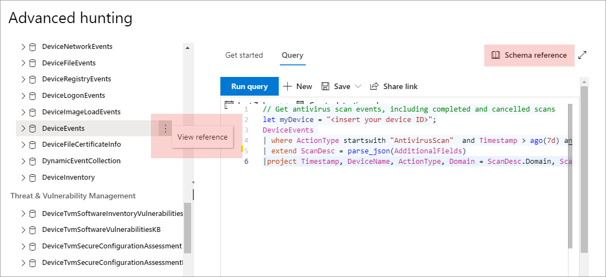

# Het geavanceerde schema voor de jacht in Microsoft Defender voor Eindpunt begrijpen

[!INCLUDE [Microsoft 365 Defender rebranding](../../includes/microsoft-defender.md)]

**Van toepassing op:**
- [Microsoft Defender voor Eindpunt](https://go.microsoft.com/fwlink/?linkid=2154037)

>Wilt u Defender voor Eindpunt ervaren? [Meld u aan voor een gratis proefabonnement.](https://www.microsoft.com/microsoft-365/windows/microsoft-defender-atp?ocid=docs-wdatp-advancedhuntingref-abovefoldlink)

[!include[Prerelease information](../../includes/prerelease.md)]

Het [geavanceerde schema](advanced-hunting-overview.md) bestaat uit meerdere tabellen die gebeurtenisgegevens of informatie over apparaten en andere entiteiten bevatten. Als u query's wilt maken die meerdere tabellen bespannen, moet u de tabellen en kolommen in het geavanceerde schema voor de jacht begrijpen.

## Schemagegevens verkrijgen in het beveiligingscentrum
Gebruik de ingebouwde schemaverwijzing tijdens het maken van query's om snel de volgende informatie over elke tabel in het schema te krijgen:

- **Beschrijving van tabellen:** het type gegevens in de tabel en de bron van die gegevens.
- **Kolommen:** alle kolommen in de tabel.
- **Actietypen:** mogelijke waarden in de `ActionType` kolom die de gebeurtenistypen vertegenwoordigen die door de tabel worden ondersteund. Dit is alleen beschikbaar voor tabellen die gebeurtenisgegevens bevatten.
- **Voorbeeldquery:** voorbeeldquery's met de manier waarop de tabel kan worden gebruikt.

### De schemaverwijzing openen
Als u snel toegang wilt tot de schemaverwijzing, selecteert u de actie Verwijzing **weergeven** naast de tabelnaam in de schemaweergave. U kunt ook **Schemaverwijzing selecteren om** naar een tabel te zoeken.

## De schematabellen leren

In de volgende verwijzing vindt u alle tabellen in het geavanceerde schema voor de jacht. Elke tabelnaam wordt koppelingen naar een pagina met de kolomnamen voor die tabel.

Tabel- en kolomnamen worden ook weergegeven in de Microsoft Defender-beveiligingscentrum, in de schemaweergave op het geavanceerde zoekscherm.

| Tabelnaam | Beschrijving |
|------------|-------------|
| **[DeviceAlertEvents](advanced-hunting-devicealertevents-table.md)** | Waarschuwingen op Microsoft Defender-beveiligingscentrum |
| **[DeviceInfo](advanced-hunting-deviceinfo-table.md)** | Apparaatgegevens, inclusief OS-informatie |
| **[DeviceNetworkInfo](advanced-hunting-devicenetworkinfo-table.md)** | Netwerkeigenschappen van apparaten, waaronder adapters, IP- en MAC-adressen, evenals verbonden netwerken en domeinen |
| **[DeviceProcessEvents](advanced-hunting-deviceprocessevents-table.md)** | Procescreatie en gerelateerde gebeurtenissen |
| **[DeviceNetworkEvents](advanced-hunting-devicenetworkevents-table.md)** | Netwerkverbinding en gerelateerde gebeurtenissen |
| **[DeviceFileEvents](advanced-hunting-devicefileevents-table.md)** | Bestandscreatie, wijziging en andere bestandssysteemgebeurtenissen |
| **[DeviceRegistryEvents](advanced-hunting-deviceregistryevents-table.md)** | Registergegevens maken en wijzigen |
| **[DeviceLogonEvents](advanced-hunting-devicelogonevents-table.md)** | Aanmeldingen en andere verificatiegebeurtenissen |
| **[DeviceImageLoadEvents](advanced-hunting-deviceimageloadevents-table.md)** | DLL-laadgebeurtenissen |
| **[DeviceEvents](advanced-hunting-deviceevents-table.md)** | Meerdere gebeurtenistypen, waaronder gebeurtenissen die worden geactiveerd door beveiligingsbesturingselementen, zoals Microsoft Defender Antivirus en bescherming tegen misbruik |
| **[DeviceFileCertificateInfo](advanced-hunting-devicefilecertificateinfo-table.md)** | Certificaatgegevens van ondertekende bestanden die zijn verkregen uit gebeurtenissen met certificaatverificatie op eindpunten |
| **[DeviceTvmSoftwareInventory](advanced-hunting-devicetvmsoftwareinventory-table.md)** | Inventaris van software die op apparaten is geïnstalleerd, inclusief de versiegegevens en de status van het einde van de ondersteuning |
| **[DeviceTvmSoftwareVulnerabilities](advanced-hunting-devicetvmsoftwarevulnerabilities-table.md)** | Softwareproblemen die zijn gevonden op apparaten en de lijst met beschikbare beveiligingsupdates die elk beveiligingsprobleem verhelpen |
| **[DeviceTvmSoftwareVulnerabilitiesKB](advanced-hunting-devicetvmsoftwarevulnerabilitieskb-table.md)** | Knowledge base of publicly disclosed vulnerabilities, including whether exploit code is publicly available |
| **[DeviceTvmSecureConfigurationAssessment](advanced-hunting-devicetvmsecureconfigurationassessment-table.md)** | Gebeurtenissen & beveiligingsprobleembeheer, waarmee de status van verschillende beveiligingsconfiguraties op apparaten wordt aangegeven |
| **[DeviceTvmSecureConfigurationAssessmentKB](advanced-hunting-devicetvmsecureconfigurationassessmentkb-table.md)** | Knowledge base of various security configurations used by Threat & Vulnerability Management to assess devices; bevat toewijzingen aan verschillende standaarden en benchmarks |

>[!TIP]
>Gebruik [geavanceerde jacht in Microsoft 365 Defender](/microsoft-365/security/defender/advanced-hunting-overview) om te zoeken naar bedreigingen met behulp van gegevens van Defender voor Eindpunt, Microsoft Defender voor Office 365, Microsoft Cloud App Security en Microsoft Defender voor identiteit. [Microsoft 365 Defender inschakelen](/microsoft-365/security/defender/m365d-enable)  
Meer informatie over het verplaatsen van uw geavanceerde zoekwerkstromen van Microsoft Defender voor Eindpunt naar Microsoft 365 Defender in Geavanceerde zoekquery's migreren vanuit [Microsoft Defender voor Eindpunt.](/microsoft-365/security/defender/advanced-hunting-migrate-from-mde)

## Verwante onderwerpen
- [Overzicht van geavanceerd opsporen](advanced-hunting-overview.md)
- [De querytaal leren](advanced-hunting-query-language.md)
- [Werken met queryresultaten](advanced-hunting-query-results.md)
- [Aanbevolen procedures voor query's toepassen](advanced-hunting-best-practices.md)
- [Overzicht van aangepaste detectie](overview-custom-detections.md)
- [Geavanceerde wijzigingen in schema's voor jagende gegevens](https://techcommunity.microsoft.com/t5/microsoft-defender-atp/advanced-hunting-data-schema-changes/ba-p/1043914)
