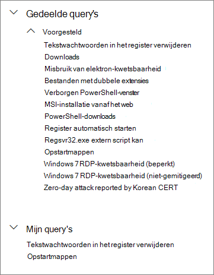
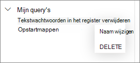

# Gedeelde query's gebruiken in geavanceerde zoekopdrachtenUse shared queries in advanced hunting

[!INCLUDE [Microsoft 365 Defender rebranding](../../includes/microsoft-defender.md)]

**Van toepassing op:****Applies to:**
- [Microsoft Defender voor EndpointMicrosoft Defender for Endpoint](https://go.microsoft.com/fwlink/p/?linkid=2154037)

>Wilt u Defender voor Eindpunt ervaren?Want to experience Defender for Endpoint? [Meld u aan voor een gratis proefabonnement.Sign up for a free trial.](https://www.microsoft.com/microsoft-365/windows/microsoft-defender-atp?ocid=docs-wdatp-advancedhunting-abovefoldlink)

[Geavanceerde](advanced-hunting-overview.md) zoekquery's kunnen worden gedeeld tussen gebruikers in dezelfde organisatie.[Advanced hunting](advanced-hunting-overview.md) queries can be shared among users in the same organization. U kunt ook query's vinden die openbaar zijn gedeeld op GitHub.You can also find queries shared publicly on GitHub. Met deze query's kunt u snel specifieke scenario's voor het zoeken naar bedreigingen uitvoeren zonder dat u zelf query's moet schrijven.These queries let you quickly pursue specific threat hunting scenarios without having to write queries from scratch.

## Een query opslaan, wijzigen en delenSave, modify, and share a query
U kunt een nieuwe of bestaande query opslaan, zodat deze alleen toegankelijk is voor u of wordt gedeeld met andere gebruikers in uw organisatie.You can save a new or existing query so that it is only accessible to you or shared with other users in your organization.

1. Typ een nieuwe query of laad een bestaande query onder **Gedeelde query's** of **Mijn query's.**Type a new query or load an existing one from under **Shared queries** or **My queries**.

2. Selecteer **Opslaan** of **Opslaan als** in de opties voor opslaan.Select **Save** or **Save as** from the save options. Als u wilt voorkomen dat u een bestaande query overschrijft, kiest **u Opslaan als**.To avoid overwriting an existing query, choose **Save as**.

3. Voer een naam in voor de query.Enter a name for the query.

   

4. Selecteer de map waarin u de query wilt opslaan.Select the folder where you'd like to save the query.
    - **Gedeelde query's:** gedeeld met alle gebruikers in uw organisatie**Shared queries** — shared to all users in your organization
    - **Mijn query's,** die alleen voor u toegankelijk zijn**My queries** — accessible only to you
    
5. Kies **Opslaan**.Select **Save**.

## Een query verwijderen of de naam wijzigenDelete or rename a query
1. Klik met de rechtermuisknop op een query die u wilt wijzigen of verwijderen.Right-click on a query you want to rename or delete.

    

2. Selecteer **Verwijderen** en bevestig verwijdering.Select **Delete** and confirm deletion. Of selecteer **Naam wijzigen** en geef een nieuwe naam op voor de query.Or select **Rename** and provide a new name for the query.

## Een directe koppeling naar een query makenCreate a direct link to a query
Als u een koppeling wilt genereren die uw query rechtstreeks opent in de geavanceerde queryeditor, rondt u de query af en selecteert u **Koppeling delen.**To generate a link that opens your query directly in the advanced hunting query editor, finalize your query and select **Share link**.

## Access-query's in de GitHub-opslagplaatsAccess queries in the GitHub repository  
Microsoft-beveiligingsonderzoekers delen regelmatig geavanceerde zoekquery's in een aangewezen [openbare opslagplaats op GitHub.](https://github.com/Microsoft/WindowsDefenderATP-Hunting-Queries)Microsoft security researchers regularly share advanced hunting queries in a [designated public repository on GitHub](https://github.com/Microsoft/WindowsDefenderATP-Hunting-Queries). Deze opslagplaats staat open voor bijdragen.This repository is open to contributions. Als u wilt bijdragen, [kunt u gratis deelnemen aan GitHub.](https://github.com/)To contribute, [join GitHub for free](https://github.com/). 

>[!TIP]
>Beveiligingsonderzoekers van Microsoft bieden ook geavanceerde zoekquery's die u kunt gebruiken om activiteiten en indicatoren te vinden die zijn gekoppeld aan nieuwe bedreigingen.Microsoft security researchers also provide advanced hunting queries that you can use to locate activities and indicators associated with emerging threats. Deze query's worden geleverd als onderdeel van de [bedreigingsanalyserapporten](threat-analytics.md) in het Microsoft Defender-beveiligingscentrum.These queries are provided as part of the [threat analytics](threat-analytics.md) reports in Microsoft Defender Security Center.

## Verwante onderwerpenRelated topics
- [Overzicht van geavanceerd opsporenAdvanced hunting overview](advanced-hunting-overview.md)
- [De querytaal lerenLearn the query language](advanced-hunting-query-language.md)
- [Werken met queryresultatenWork with query results](advanced-hunting-query-results.md)
- [Meer informatie over het schemaUnderstand the schema](advanced-hunting-schema-reference.md)
- [Aanbevolen procedures voor query's toepassenApply query best practices](advanced-hunting-best-practices.md)
- [Overzicht van aangepaste detectieCustom detections overview](overview-custom-detections.md)
