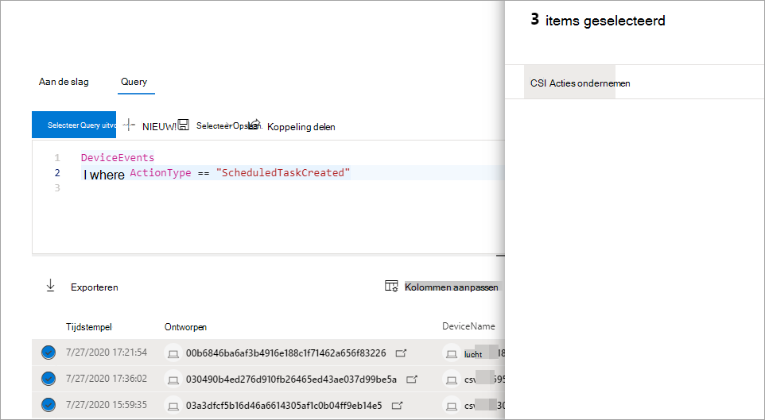

# Actie ondernemen voor geavanceerde resultaten van query'sTake action on advanced hunting query results

**Van toepassing op:****Applies to:**
- [Microsoft Defender voor EndpointMicrosoft Defender for Endpoint](https://go.microsoft.com/fwlink/p/?linkid=2154037)

> Wilt u Defender voor Eindpunt ervaren?Want to experience Defender for Endpoint? [Meld u aan voor een gratis proefabonnement.Sign up for a free trial.](https://www.microsoft.com/microsoft-365/windows/microsoft-defender-atp?ocid=docs-wdatp-advancedhuntingref-abovefoldlink)

Met krachtige en uitgebreide actieopties kunt u snel bedreigingen bevatten of gecompromitteerde activa die u in [geavanceerde](advanced-hunting-overview.md) zoekactie vindt, bevatten.You can quickly contain threats or address compromised assets that you find in [advanced hunting](advanced-hunting-overview.md) using powerful and comprehensive action options. Met deze opties kunt u:With these options, you can:

- Verschillende acties uitvoeren op apparatenTake various actions on devices
- QuarantainebestandenQuarantine files

## Vereiste machtigingenRequired permissions

Als u actie wilt kunnen ondernemen via geavanceerde zoekacties, hebt u een rol nodig in Defender for Endpoint met machtigingen voor het indienen van herstelacties [op apparaten.](https://docs.microsoft.com/microsoft-365/security/defender-endpoint/user-roles#permission-options)To be able to take action through advanced hunting, you need a role in Defender for Endpoint with [permissions to submit remediation actions on devices](https://docs.microsoft.com/microsoft-365/security/defender-endpoint/user-roles#permission-options). Als u geen actie kunt ondernemen, neemt u contact op met een globale beheerder over het verkrijgen van de volgende machtigingen:If you can't take action, contact a global administrator about getting the following permission:

*Actieve herstelacties > bedreigings- en kwetsbaarheidsbeheer - Herstelafhandeling**Active remediation actions > Threat and vulnerability management - Remediation handling*

## Verschillende acties uitvoeren op apparatenTake various actions on devices

U kunt de volgende acties uitvoeren op apparaten die zijn geïdentificeerd door de `DeviceId` kolom in de queryresultaten:You can take the following actions on devices identified by the `DeviceId` column in your query results:

- Getroffen apparaten isoleren om een infectie te bevatten of om te voorkomen dat aanvallen lateraal worden verplaatstIsolate affected devices to contain an infection or prevent attacks from moving laterally
- Onderzoekspakket verzamelen om meer gerechtelijke informatie te verkrijgenCollect investigation package to obtain more forensic information
- Voer een antivirusscan uit om bedreigingen te zoeken en te verwijderen met de meest recente beveiligingsinformatie-updatesRun an antivirus scan to find and remove threats using the latest security intelligence updates
- Een geautomatiseerd onderzoek starten om bedreigingen op het apparaat en mogelijk andere getroffen apparaten te controleren en te corrigerenInitiate an automated investigation to check and remediate threats on the device and possibly other affected devices
- De uitvoering van apps beperken tot alleen door Microsoft ondertekende uitvoerbare bestanden, waardoor verdere bedreigingsactiviteit via malware of andere niet-vertrouwde uitvoerbare bestanden wordt voorkomenRestrict app execution to only Microsoft-signed executable files, preventing subsequent threat activity through malware or other untrusted executables

Voor meer informatie over hoe deze antwoordacties worden uitgevoerd via Defender voor Eindpunt, leest u [meer over antwoordacties op apparaten.](respond-machine-alerts.md)To learn more about how these response actions are performed through Defender for Endpoint, [read about response actions on devices](respond-machine-alerts.md).

## QuarantainebestandenQuarantine files

U kunt de *quarantaineactie voor* bestanden implementeren, zodat ze automatisch in quarantaine worden geplaatst wanneer ze worden aangetroffen.You can deploy the *quarantine* action on files so that they are automatically quarantined when encountered. Wanneer u deze actie selecteert, kunt u kiezen uit de volgende kolommen om te bepalen welke bestanden in de queryresultaten in quarantaine moeten worden geplaatst:When selecting this action, you can choose between the following columns to identify which files in your query results to quarantine:

- `SHA1` — In de meeste geavanceerde zoektabellen is dit de SHA-1 van het bestand dat is beïnvloed door de opgenomen actie.`SHA1` — In most advanced hunting tables, this is the SHA-1 of the file that was affected by the recorded action. Als een bestand bijvoorbeeld is gekopieerd, is dit het gekopieerde bestand.For example, if a file was copied, this would be the copied file.
- `InitiatingProcessSHA1` — In de meest geavanceerde zoektabellen is dit het bestand dat verantwoordelijk is voor het starten van de opgenomen actie.`InitiatingProcessSHA1` — In most advanced hunting tables, this is the file responsible for initiating the recorded action. Als bijvoorbeeld een onderliggend proces is gestart, is dit het bovenliggende proces.For example, if a child process was launched, this would be the parent process. 
- `SHA256` — Dit is het SHA-256-equivalent van het bestand dat door de kolom is `SHA1` geïdentificeerd.`SHA256` — This is the SHA-256 equivalent of the file identified by the `SHA1` column.
- `InitiatingProcessSHA256` — Dit is het SHA-256-equivalent van het bestand dat door de kolom is `InitiatingProcessSHA1` geïdentificeerd.`InitiatingProcessSHA256` — This is the SHA-256 equivalent of the file identified by the `InitiatingProcessSHA1` column.

Voor meer informatie over hoe quarantaineacties worden ondernomen en hoe bestanden kunnen worden hersteld, leest u [meer over reactieacties op bestanden.](respond-file-alerts.md)To learn more about how quarantine actions are taken and how files can be restored, [read about response actions on files](respond-file-alerts.md).

>[!NOTE]
>Als u bestanden wilt zoeken en in quarantaine wilt plaatsen, moeten de queryresultaten ook waarden `DeviceId` als apparaataanduidingen bevatten.To locate files and quarantine them, the query results should also include `DeviceId` values as device identifiers.  

## Actie ondernemenTake action

Als u een van de beschreven acties wilt uitvoeren, selecteert u een of meer records in de queryresultaten en selecteert u **Vervolgens Acties uitvoeren.**To take any of the described actions, select one or more records in your query results and then select **Take actions**. Een wizard begeleidt u bij het proces van het selecteren en vervolgens indienen van uw gewenste acties.A wizard will guide you through the process of selecting and then submitting your preferred actions.

## Acties bekijken die zijn ondernomenReview actions taken

Elke actie wordt afzonderlijk opgenomen in het actiecentrum, onder **Actiecentrumgeschiedenis**  >   [(security.microsoft.com/action-center/history).](https://security.microsoft.com/action-center/history)Each action is individually recorded in the action center, under **Action center** > **History** ([security.microsoft.com/action-center/history](https://security.microsoft.com/action-center/history)). Ga naar het actiecentrum om de status van elke actie te controleren.Go to the action center to check the status of each action.
 
## Verwante onderwerpenRelated topics

- [Overzicht van geavanceerd opsporenAdvanced hunting overview](advanced-hunting-overview.md)
- [De querytaal lerenLearn the query language](advanced-hunting-query-language.md)
- [Meer informatie over het schemaUnderstand the schema](advanced-hunting-schema-reference.md)
- [Werken met queryresultatenWork with query results](advanced-hunting-query-results.md)
- [Aanbevolen procedures voor query's toepassenApply query best practices](advanced-hunting-best-practices.md)
- [Overzicht van aangepaste detectieCustom detections overview](overview-custom-detections.md)
