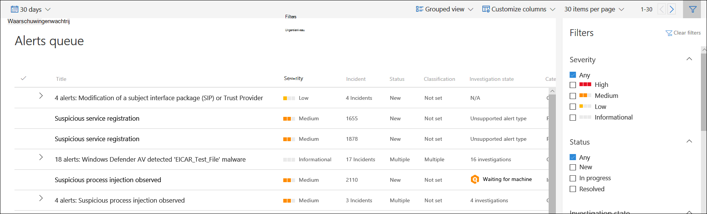

# De wachtrij waarschuwingen voor Microsoft Defender voor eindpunten weergeven en ordenenView and organize the Microsoft Defender for Endpoint Alerts queue

[!INCLUDE [Microsoft 365 Defender rebranding](../../includes/microsoft-defender.md)]

**Van toepassing op:****Applies to:**
- [Defender voor EindpuntDefender for Endpoint](https://go.microsoft.com/fwlink/?linkid=2154037)

>Wilt u Defender voor Eindpunt ervaren?Want to experience Defender for Endpoint? [Meld u aan voor een gratis proefabonnement.Sign up for a free trial.](https://www.microsoft.com/microsoft-365/windows/microsoft-defender-atp?ocid=docs-wdatp-alertsq-abovefoldlink) 

In **de wachtrij Waarschuwingen** ziet u een lijst met waarschuwingen die zijn gemarkeerd vanaf apparaten in uw netwerk.The **Alerts queue** shows a list of alerts that were flagged from devices in your network. Standaard worden in de wachtrij waarschuwingen weergegeven die in de afgelopen 30 dagen in een gegroepeerde weergave zijn weergegeven.By default, the queue displays alerts seen in the last 30 days in a grouped view. De meest recente waarschuwingen worden boven aan de lijst weergegeven, zodat u eerst de meest recente waarschuwingen kunt zien.The most recent alerts are showed at the top of the list helping you see the most recent alerts first.

> [!NOTE]
> De wachtrij voor waarschuwingen wordt aanzienlijk verminderd met geautomatiseerd onderzoek en herstel, zodat experts voor beveiligingsbewerkingen zich kunnen richten op geavanceerdere bedreigingen en andere hoogwaardige initiatieven.The alerts queue is significantly reduced with automated investigation and remediation, allowing security operations experts to focus on more sophisticated threats and other high value initiatives. Wanneer een waarschuwing een ondersteunde entiteit bevat voor geautomatiseerd onderzoek (bijvoorbeeld een bestand) in een apparaat met een ondersteund besturingssysteem, kan een geautomatiseerd onderzoek en herstel starten.When an alert contains a supported entity for automated investigation (for example, a file) in a device that has a supported operating system for it, an automated investigation and remediation can start. Zie Overzicht van geautomatiseerde onderzoeken voor meer informatie over [geautomatiseerde onderzoeken.](automated-investigations.md)For more information on automated investigations, see [Overview of Automated investigations](automated-investigations.md).

Er zijn verschillende opties waar u uit kunt kiezen om de wachtrijweergave voor waarschuwingen aan te passen.There are several options you can choose from to customize the alerts queue view. 

Op de bovenste navigatie kunt u:On the top navigation you can:

- Gegroepeerde weergave of lijstweergave selecterenSelect grouped view or list view
- Kolommen aanpassen om kolommen toe te voegen of te verwijderenCustomize columns to add or remove columns 
- De items selecteren die per pagina moeten worden weergegevenSelect the items to show per page
- Navigeren tussen pagina'sNavigate between pages
- Filters toepassenApply filters

## De waarschuwingenwachtrij sorteren, filteren en groeperenSort, filter, and group the alerts queue

U kunt de volgende filters toepassen om de lijst met waarschuwingen te beperken en de waarschuwingen beter te bekijken.You can apply the following filters to limit the list of alerts and get a more focused view the alerts.

### ErnstSeverity

Ernst van waarschuwingAlert severity | BeschrijvingDescription
:---|:---
HoogHigh  (Rood)(Red) | Waarschuwingen die vaak worden gezien in verband met geavanceerde permanente bedreigingen (APT).Alerts commonly seen associated with advanced persistent threats (APT). Deze waarschuwingen geven een hoog risico aan vanwege de ernst van de schade die ze kunnen toebrengen aan apparaten.These alerts indicate a high risk because of  the severity of damage they can inflict on devices. Enkele voorbeelden zijn: activiteiten van referentiediefstalhulpmiddelen, ransomwareactiviteiten die niet aan een groep zijn gekoppeld, geknoei met beveiligingssensoren of schadelijke activiteiten die wijzen op een menselijke tegenstrever.Some examples are: credential theft tools activities, ransomware activities not associated with any group, tampering with security sensors, or any malicious activities indicative of a human adversary.
GemiddeldMedium  (Oranje)(Orange) | Waarschuwingen van endpointdetectie en reactie na inbreukgedrag dat deel kan uitmaken van een geavanceerde permanente bedreiging (APT).Alerts from endpoint detection and response post-breach behaviors that might be a part of an advanced persistent threat (APT). Dit omvat waargenomen gedrag dat typisch is voor aanvalsfasen, afwijkende registerwijziging, uitvoering van verdachte bestanden, enzovoort.This includes observed behaviors typical of attack stages, anomalous registry change, execution of suspicious files, and so forth. Hoewel sommige mogelijk deel uitmaken van interne beveiligingstests, is onderzoek vereist, omdat het mogelijk ook deel uitmaakt van een geavanceerde aanval.Although some might be part of internal security testing, it requires investigation as it might also be a part of an advanced attack.
LaagLow  (Geel)(Yellow) | Waarschuwingen over bedreigingen die zijn gekoppeld aan voorkomende malware.Alerts on threats associated with prevalent malware. Denk bijvoorbeeld aan hackprogramma's, hulpprogramma's voor niet-malware hacken, zoals het uitvoeren van verkenningsopdrachten, het wissen van logboeken, enzovoort, die vaak geen geavanceerde bedreiging aangeven die zich op de organisatie richt.For example, hack-tools, non-malware hack tools, such as running exploration commands, clearing logs, etc., that often do not indicate an advanced threat targeting the organization. Het kan ook afkomstig zijn van een geïsoleerd beveiligingsprogramma dat is getest door een gebruiker in uw organisatie.It could also come from an isolated security tool testing by a user in your organization.
InformatiefInformational  (Grijs)(Grey) | Waarschuwingen die mogelijk niet als schadelijk voor het netwerk worden beschouwd, maar die de organisatie meer bewust kunnen maken van mogelijke beveiligingsproblemen.Alerts that might not be considered harmful to the network but can drive organizational security awareness on potential security issues.

#### Ernst van waarschuwingswaarschuwingenUnderstanding alert severity

Microsoft Defender Antivirus (Microsoft Defender AV) en Defender voor eindpuntwaarschuwingen verschillen omdat ze verschillende bereikbereiken vertegenwoordigen.Microsoft Defender Antivirus (Microsoft Defender AV) and Defender for Endpoint alert severities are different because they represent different scopes.

De ernst van de AV-bedreiging van Microsoft Defender vertegenwoordigt de absolute ernst van de gedetecteerde bedreiging (malware) en wordt toegewezen op basis van het potentiële risico voor het afzonderlijke apparaat, indien geïnfecteerd.The Microsoft Defender AV threat severity represents the absolute severity of the detected threat (malware), and is assigned based on the potential risk to the individual device, if infected.

De ernst van de waarschuwing van Defender voor eindpunt geeft de ernst van het gedetecteerde gedrag aan, het werkelijke risico voor het apparaat, maar nog belangrijker het potentiële risico voor de organisatie.The Defender for Endpoint alert severity represents the severity of the detected behavior, the actual risk to the device but more importantly the potential risk to the organization.

Bijvoorbeeld:So, for example:

- De ernst van een Waarschuwing van Defender voor Eindpunt over een Microsoft Defender AV-gedetecteerde bedreiging die volledig is voorkomen en het apparaat niet heeft geïnfecteerd, wordt gecategoriseerd als 'Informatief' omdat er geen werkelijke schade was.The severity of a Defender for Endpoint alert about a Microsoft Defender AV detected threat that was completely prevented and did not infect the device is categorized as "Informational" because there was no actual damage.
- Een waarschuwing over een commerciële malware is gedetecteerd tijdens het uitvoeren, maar geblokkeerd en gesaneerd door Microsoft Defender AV, wordt gecategoriseerd als 'Laag', omdat deze mogelijk enige schade heeft veroorzaakt aan het afzonderlijke apparaat, maar geen bedreiging vormt voor de organisatie.An alert about a commercial malware was detected while executing, but blocked and remediated by Microsoft Defender AV, is categorized as  "Low" because it may have caused some damage to the individual device but poses no organizational threat.
- Een waarschuwing over malware die tijdens het uitvoeren is gedetecteerd en die niet alleen een bedreiging kan vormen voor het afzonderlijke apparaat, maar ook voor de organisatie, ongeacht of deze uiteindelijk is geblokkeerd, kan worden geclassificeerd als 'Gemiddeld' of 'Hoog'.An alert about malware detected while executing which can pose a threat not only to the individual device but to the organization, regardless if it was eventually blocked, may be ranked as "Medium" or "High".
- Verdachte waarschuwingen voor gedrag, die niet zijn geblokkeerd of die niet zijn gesaneerd, worden geclassificeerd als 'Laag', 'Gemiddeld' of 'Hoog' volgens dezelfde bedreigingsoverwegingen van de organisatie.Suspicious behavioral alerts, which weren't blocked or remediated will be ranked "Low", "Medium" or "High" following the same organizational threat considerations.

#### Waarschuwingscategorieën begrijpenUnderstanding alert categories

We hebben de waarschuwingscategorieën opnieuw gedefinieerd om uit te lijnen op de [aanvalstactieken](https://attack.mitre.org/tactics/enterprise/) van de onderneming in de [MITRE ATT-matrix&CK.](https://attack.mitre.org/)We've redefined the alert categories to align to the [enterprise attack tactics](https://attack.mitre.org/tactics/enterprise/) in the [MITRE ATT&CK matrix](https://attack.mitre.org/). Nieuwe categorienamen zijn van toepassing op alle nieuwe waarschuwingen.New category names apply to all new alerts. Bestaande waarschuwingen behouden de vorige categorienamen.Existing alerts will keep the previous category names.

De onderstaande tabel bevat de huidige categorieën en de manier waarop ze over het algemeen worden toe te wijden aan eerdere categorieën.The table below lists the current categories and how they generally map to previous categories. 

| Nieuwe categorieNew   category       | NAAM VAN API-categorieAPI category name   | Gedetecteerde bedreigingsactiviteit of onderdeelDetected threat activity or   component                                                                                                 |
|----------------------|---------------------|-----------------------------------------------------------------------------------------------------------------------------------------|
| VerzamelingCollection           | VerzamelingCollection          | Gegevens voor exfiltratie zoeken en verzamelenLocating   and collecting data for exfiltration                                                                                         |
| Opdracht en besturingselementCommand and control  | CommandAndControlCommandAndControl   | Verbinding maken met netwerkinfrastructuur die door de aanvaller wordt beheerd om gegevens door te geven of opdrachten te ontvangenConnecting   to attacker-controlled network infrastructure to relay data or receive   commands                                          |
| Toegang tot referentiesCredential access    | CredentialAccessCredentialAccess    | Geldige referenties verkrijgen om de controle over apparaten en andere resources in het netwerk uit te breidenObtaining   valid credentials to extend control over devices and other resources in the   network                                       |
| VerdedigingsontwijkingDefense evasion      | DefenseEvasionDefenseEvasion      | Beveiligingsbesturingselementen vermijden door bijvoorbeeld beveiligingsapps uit te schakelen, implantaten te verwijderen en rootkits uit te voerenAvoiding security controls by, for example, turning off   security apps, deleting implants, and running rootkits                        |
| DetectieDiscovery            | DetectieDiscovery           | Informatie verzamelen over belangrijke apparaten en resources, zoals beheerderscomputers, domeincontrollers en bestandsserversGathering   information about important devices and resources, such as administrator   computers, domain controllers, and file servers  |
| UitvoeringExecution            | UitvoeringExecution           | Hulpprogramma's voor aanvallers en schadelijke code starten, waaronder RAT's en backdoorsLaunching   attacker tools and malicious code, including RATs and backdoors                                                             |
| ExfiltrationExfiltration         | ExfiltrationExfiltration        | Gegevens uit het netwerk extraheren naar een externe, door de aanvaller gecontroleerde locatieExtracting   data from the network to an external, attacker-controlled location                                                         |
| ExploitExploit              | ExploitExploit             | Code en mogelijke benuttingsactiviteit gebruikenExploit   code and possible exploitation activity                                                                                       |
| Eerste toegangInitial access       | InitialAccessInitialAccess       | Eerste toegang krijgen tot het doelnetwerk, meestal met wachtwoord-raden, exploits of phishing-e-mailberichtenGaining   initial entry to the target network, usually involving password-guessing,   exploits, or phishing emails                      |
| ZijbewegingLateral movement     | LateralMovementLateralMovement     | Verplaatsen tussen apparaten in het doelnetwerk om kritieke bronnen te bereiken of netwerk persistentie te krijgenMoving   between devices in the target network to reach critical resources or gain   network persistence                                |
| MalwareMalware              | MalwareMalware             | Backdoors, trojaanse paarden en andere typen schadelijke codeBackdoors,   trojans, and other types of malicious code                                                                                 |
| PersistentiePersistence          | PersistentiePersistence         | Extensibility points (ASEP's) voor automatisch starten maken om actief te blijven en systeemstarten te overlevenCreating   autostart extensibility points (ASEPs) to remain active and survive system   restarts                                        |
| Escalatie van bevoegdhedenPrivilege escalation | PrivilegeEscalationPrivilegeEscalation | Hogere machtigingsniveaus voor code verkrijgen door deze uit te voeren in de context van een bevoorrecht proces of accountObtaining   higher permission levels for code by running it in the context of a   privileged process or account                         |
| RansomwareRansomware           | RansomwareRansomware          | Malware die bestanden versleutelt en betaling afperst om de toegang te herstellenMalware   that encrypts files and extorts payment to restore access                                                                     |
| Verdachte activiteitSuspicious activity  | SuspiciousActivitySuspiciousActivity  | Atypische activiteit die malwareactiviteit of een deel van een aanval kan zijnAtypical   activity that could be malware activity or part of an attack                                                                 |
| Ongewenste softwareUnwanted software    | Ongewenste softwareUnwantedSoftware    | Apps en apps met een lage reputatie die van invloed zijn op de productiviteit en de gebruikerservaring; gedetecteerd als potentieel ongewenste toepassingen (PUA's)Low-reputation   apps and apps that impact productivity and the user experience; detected as   potentially unwanted applications (PUAs) |

### StatusStatus

U kunt ervoor kiezen om de lijst met waarschuwingen te beperken op basis van hun status.You can choose to limit the list of alerts based on their status.

### OnderzoekstoestandInvestigation state

Komt overeen met de geautomatiseerde onderzoekstoestand.Corresponds to the automated investigation state.

### CategorieCategory

U kunt ervoor kiezen om de wachtrij te filteren om specifieke typen schadelijke activiteiten weer te geven.You can choose to filter the queue to display specific types of malicious activity.

### Toegewezen aanAssigned to

U kunt kiezen tussen het weergeven van waarschuwingen die aan u zijn toegewezen of automatisering.You can choose between showing alerts that are assigned to you or automation.

### DetectiebronDetection source

Selecteer de bron die de waarschuwingsdetectie heeft geactiveerd.Select the source that triggered the alert detection. Microsoft Threat Experts preview-deelnemers kunnen nu detecties filteren en zien van de nieuwe door bedreigingsdeskundigen beheerde huntingservice.Microsoft Threat Experts preview participants can now filter and see detections from the new threat experts-managed hunting service.

>[!NOTE]
>Het antivirusfilter wordt alleen weergegeven als apparaten Microsoft Defender Antivirus gebruiken als het standaard antimalwareproduct voor realtimebeveiliging.The Antivirus filter will only appear if devices are using Microsoft Defender Antivirus as the default real-time protection antimalware product.

| DetectiebronDetection source                  | API-waardeAPI value                  |
|-----------------------------------|----------------------------|
| Sensoren van derden3rd party sensors                 | ThirdPartySensorsThirdPartySensors          |
| AntivirusAntivirus                         | WindowsDefenderAvWindowsDefenderAv          |
| Geautomatiseerd onderzoekAutomated investigation           | AutomatedInvestigationAutomatedInvestigation     |
| Aangepaste detectieCustom detection                  | CustomDetectionCustomDetection            |
| Aangepaste TICustom TI                         | CustomerTICustomerTI                 |
| EDREDR                               | WindowsDefenderAtpWindowsDefenderAtp         |
| Microsoft 365 DefenderMicrosoft 365 Defender            | MTPMTP                        |
| Microsoft Defender voor Office 365Microsoft Defender for Office 365 | OfficeATPOfficeATP                  |
| Microsoft Threat ExpertsMicrosoft Threat Experts          | ThreatExpertsThreatExperts              |
| SmartScreenSmartScreen                       | WindowsDefenderSmartScreenWindowsDefenderSmartScreen |

### BESTURINGSSYSTEEM-platformOS platform

Beperk de wachtrijweergave voor waarschuwingen door het besturingssysteemplatform te selecteren dat u wilt onderzoeken.Limit the alerts queue view by selecting the OS platform that you're interested in investigating.

### ApparaatgroepDevice group

Als u specifieke apparaatgroepen hebt die u wilt controleren, kunt u de groepen selecteren om de wachtrijweergave voor waarschuwingen te beperken.If you have specific device groups that you're interested in checking, you can select the groups to limit the alerts queue view. 

### Gekoppelde bedreigingAssociated threat

Gebruik dit filter om u te richten op waarschuwingen die betrekking hebben op bedreigingen met een hoog profiel.Use this filter to focus on alerts that are related to high profile threats. U ziet de volledige lijst met high-profile bedreigingen in [Threat Analytics.](threat-analytics.md)You can see the full list of high-profile threats in [Threat analytics](threat-analytics.md).

## Verwante onderwerpenRelated topics

- [Waarschuwingen voor Microsoft Defender voor eindpunten beherenManage Microsoft Defender for Endpoint alerts](manage-alerts.md)
- [Microsoft Defender onderzoeken voor eindpuntwaarschuwingenInvestigate Microsoft Defender for Endpoint alerts](investigate-alerts.md)
- [Een bestand onderzoeken dat is gekoppeld aan een waarschuwing van Microsoft Defender voor eindpuntInvestigate a file associated with a Microsoft Defender for Endpoint alert](investigate-files.md)
- [Apparaten onderzoeken in de lijst Microsoft Defender voor eindpuntapparatenInvestigate devices in the Microsoft Defender for Endpoint Devices list](investigate-machines.md)
- [Een IP-adres onderzoeken dat is gekoppeld aan een waarschuwing van Microsoft Defender voor eindpuntInvestigate an IP address associated with a Microsoft Defender for Endpoint alert](investigate-ip.md)
- [Een domein onderzoeken dat is gekoppeld aan een waarschuwing van Microsoft Defender voor eindpuntInvestigate a domain associated with a Microsoft Defender for Endpoint alert](investigate-domain.md)
- [Een gebruikersaccount onderzoeken in Microsoft Defender voor EindpuntInvestigate a user account in Microsoft Defender for Endpoint](investigate-user.md)
