# Microsoft Defender voor Eindpunt voor Android implementeren met Microsoft Intune 

[!INCLUDE [Microsoft 365 Defender rebranding](../../includes/microsoft-defender.md)]

**Van toepassing op:**
- [Microsoft Defender voor Endpoint](https://go.microsoft.com/fwlink/p/?linkid=2154037)
- [Microsoft 365 Defender](https://go.microsoft.com/fwlink/?linkid=2118804)

> Wilt u Microsoft Defender voor Eindpunt ervaren? [Meld u aan voor een gratis proefabonnement.](https://www.microsoft.com/microsoft-365/windows/microsoft-defender-atp?ocid=docs-wdatp-exposedapis-abovefoldlink) 

Meer informatie over het implementeren van Defender voor Eindpunt voor Android op intune Company Portal geregistreerde apparaten. Zie Uw apparaat  [registreren](https://docs.microsoft.com/mem/intune/user-help/enroll-device-android-company-portal)voor meer informatie over intune-apparaatinschrijving.

> [!NOTE]
> **Defender voor Eindpunt voor Android is nu beschikbaar op [Google Play](https://play.google.com/store/apps/details?id=com.microsoft.scmx)**  
> U kunt vanuit Intune verbinding maken met Google Play om de Defender voor Endpoint-app te implementeren in de registratiemodi Apparaatbeheerder en Android Enterprise.
Updates voor de app worden automatisch via Google Play.

## Implementeren op apparaten die zijn geregistreerd door apparaatbeheerder

**Defender voor Eindpunt voor Android implementeren op Intune Company Portal - Apparatenbeheerder ingeschreven apparaten**

Meer informatie over het implementeren van Defender voor Eindpunt voor Android op Intune Company Portal - Apparatenbeheerder die zijn geregistreerd. 

### Toevoegen als Android Store-app

1. Ga [in het Microsoft Endpoint Manager-beheercentrum](https://go.microsoft.com/fwlink/?linkid=2109431) naar **Apps** \> **Android Apps** Android \> **\> Store-app toevoegen** en kies **Selecteren.**

   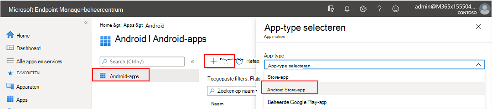

2. Voer op **de pagina App** toevoegen en in de sectie *App-informatie* het volgende in: 

   - **Naam** 
   - **Beschrijving**
   - **Publisher** als Microsoft.
   - **App Store URL** as https://play.google.com/store/apps/details?id=com.microsoft.scmx (Defender for Endpoint app Google Play Store URL) 

   Andere velden zijn optioneel. Selecteer **Volgende**.

   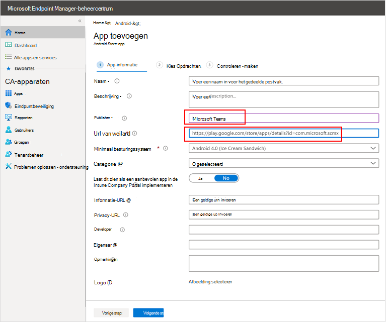

3. Ga in *de sectie Opdrachten* naar de sectie **Vereist** en selecteer **Groep toevoegen.** Vervolgens kunt u de gebruikersgroep(s) kiezen die u wilt richten op De app Defender voor Eindpunt voor Android. Kies **Selecteren** en vervolgens **Volgende**.

    >[!NOTE]
    >De geselecteerde gebruikersgroep moet bestaan uit intune geregistreerde gebruikers.

    > [!div class="mx-imgBorder"]

    > 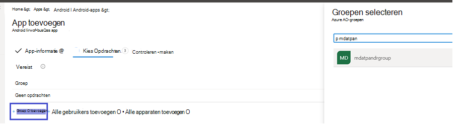

4. Controleer in **de sectie Controleren+Maken** of alle ingevoerde gegevens juist zijn en selecteer vervolgens **Maken.**

    Over een paar minuten wordt de App Defender voor Eindpunt gemaakt en wordt er een melding weergegeven in de rechterbovenhoek van de pagina.

    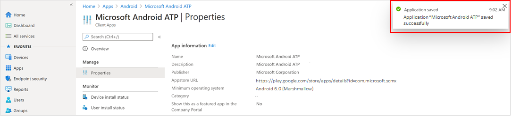

5. Selecteer op de pagina met app-informatie die wordt weergegeven in de sectie Monitor de **status** apparaatinstallatie om te controleren of de installatie van het apparaat is voltooid. 

    > [!div class="mx-imgBorder"]
    > 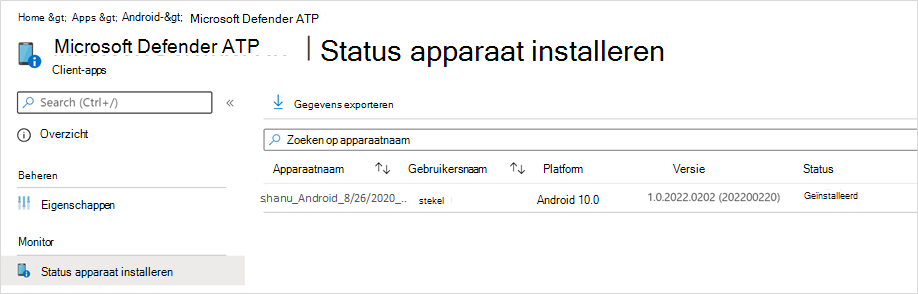

### De onboarding- en controlestatus voltooien

1. Zodra Defender voor Eindpunt voor Android is geïnstalleerd op het apparaat, ziet u het app-pictogram.

    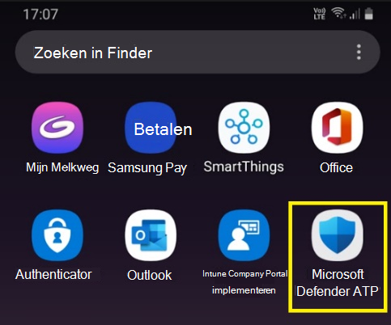

2. Tik op het atp-apppictogram van Microsoft Defender en volg de instructies op het scherm om de onboarding van de app te voltooien. De details omvatten de acceptatie door eindgebruikers van Android-machtigingen die vereist zijn door Defender voor Eindpunt voor Android.

3. Na succesvolle onboarding wordt het apparaat weergegeven in de lijst Apparaten in het Microsoft Defender-beveiligingscentrum.

    

## Implementeren op geregistreerde Android Enterprise-apparaten

Defender voor Eindpunt voor Android ondersteunt geregistreerde Android Enterprise-apparaten.

Zie [Inschrijvingsopties](https://docs.microsoft.com/mem/intune/enrollment/android-enroll)voor meer informatie over de inschrijvingsopties die worden ondersteund door Intune.

**Op dit moment worden persoonlijke apparaten met een werkprofiel en volledig beheerde gebruikersapparaatinschrijvingen van het bedrijf ondersteund voor implementatie.**

## Microsoft Defender voor Eindpunt voor Android toevoegen als een beheerde Google Play-app

Volg de onderstaande stappen om de App Microsoft Defender voor Eindpunt toe te voegen aan uw beheerde Google Play.

1. Ga [in het Microsoft Endpoint Manager-beheercentrum](https://go.microsoft.com/fwlink/?linkid=2109431) naar **Apps** \> **Android Apps** \> **toevoegen** en selecteer **Beheerde Google Play-app.**

    > [!div class="mx-imgBorder"]
    > 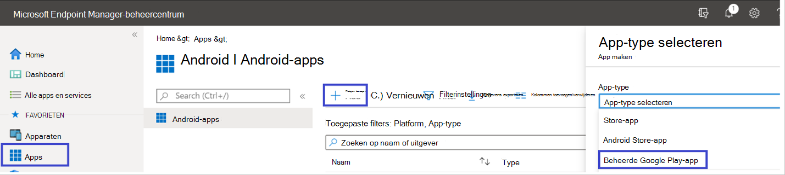

2. Ga op de beheerde Google Play-pagina die vervolgens wordt geladen naar het zoekvak en zoek **Microsoft Defender.** Uw zoekopdracht moet de Microsoft Defender voor Eindpunt-app weergeven in uw beheerde Google Play. Klik op de Microsoft Defender voor Eindpunt-app in het zoekresultaat Apps.

    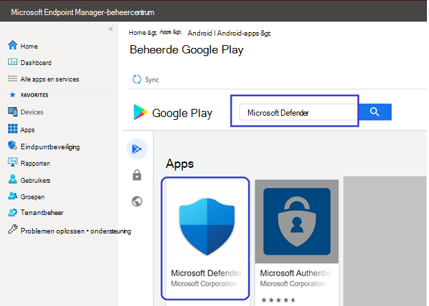

3. Op de pagina App-beschrijving die hierna wordt weergegeven, kunt u app-details zien op Defender voor Eindpunt. Controleer de informatie op de pagina en selecteer **goedkeuren.**

    > [!div class="mx-imgBorder"]
    > 

4. U krijgt de machtigingen die Door Defender voor Eindpunt worden gekregen om het te laten werken. Controleer ze en selecteer **goedkeuren.**

    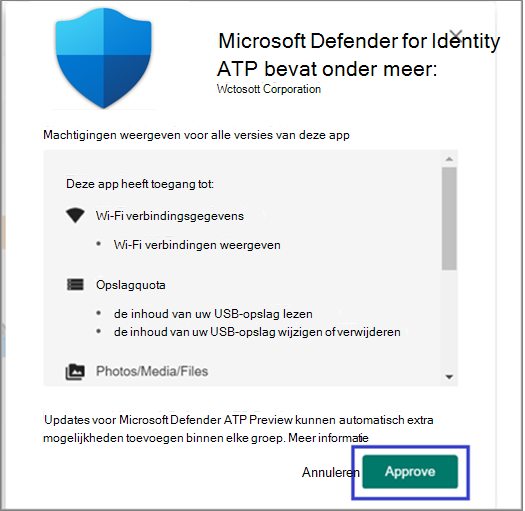

5. U ziet de pagina Goedkeuringsinstellingen. De pagina bevestigt uw voorkeur voor het verwerken van nieuwe app-machtigingen die Defender voor Eindpunt voor Android kan vragen. Bekijk de keuzes en selecteer de gewenste optie. Selecteer **Gereed**.

    Beheerde Google Play selecteert standaard Goedgekeurd blijven wanneer *app nieuwe machtigingen aanvraagt*

    > [!div class="mx-imgBorder"]
    > 

6. Nadat de machtigingen voor het verwerken van de selectie zijn gemaakt, **selecteert** u Synchroniseren om Microsoft Defender voor Eindpunt te synchroniseren met uw lijst met apps.

    > [!div class="mx-imgBorder"]
    > 

7. De synchronisatie wordt binnen enkele minuten voltooid.

    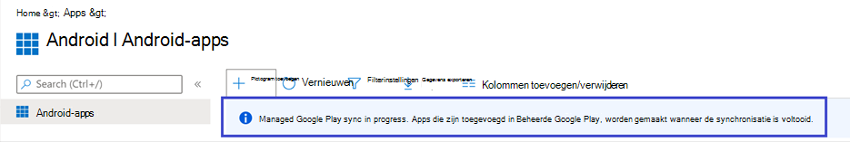

8. Selecteer de **knop** Vernieuwen in het scherm Android-apps en Microsoft Defender ATP moet zichtbaar zijn in de lijst met apps.

    > [!div class="mx-imgBorder"]
    > 

9. Defender voor Eindpunt ondersteunt app-configuratiebeleid voor beheerde apparaten via Intune. Deze mogelijkheid kan worden gebruikt voor autogrant toepasselijke Android-machtigingen, zodat de eindgebruiker deze machtigingen niet hoeft te accepteren.

    1. Ga op **de pagina Apps** naar **Beleidsbeleid > app-configuratiebeleid > Apparaten > toevoegen.**

       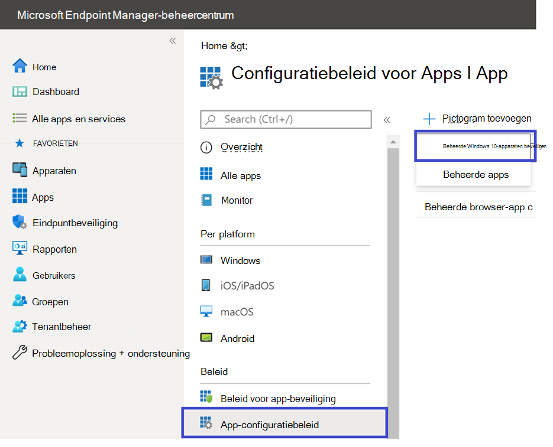

    1. Voer op **de pagina App-configuratiebeleid** maken de volgende details in:
    
        - Naam: Microsoft Defender ATP.
        - Kies **Android Enterprise** als platform.
        - Kies **Alleen werkprofiel als** profieltype.
        - Klik **op App selecteren,** kies **Microsoft Defender ATP,** selecteer **OK** en vervolgens **Volgende.**
    
        > [!div class="mx-imgBorder"]
        > 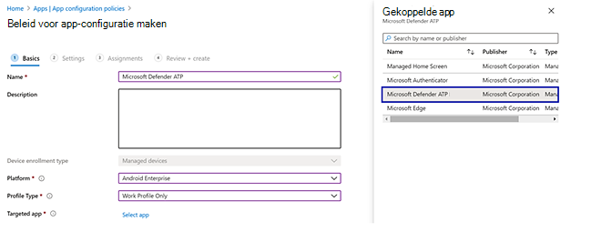

    1. Ga op **de** pagina Instellingen naar de sectie Machtigingen en klik op Toevoegen om de lijst met ondersteunde machtigingen weer te geven. Selecteer in de sectie Machtigingen toevoegen de volgende machtigingen:

       - Externe opslag (gelezen)
       - Externe opslag (schrijven)

       Selecteer vervolgens **OK**.

       > [!div class="mx-imgBorder"]
      > 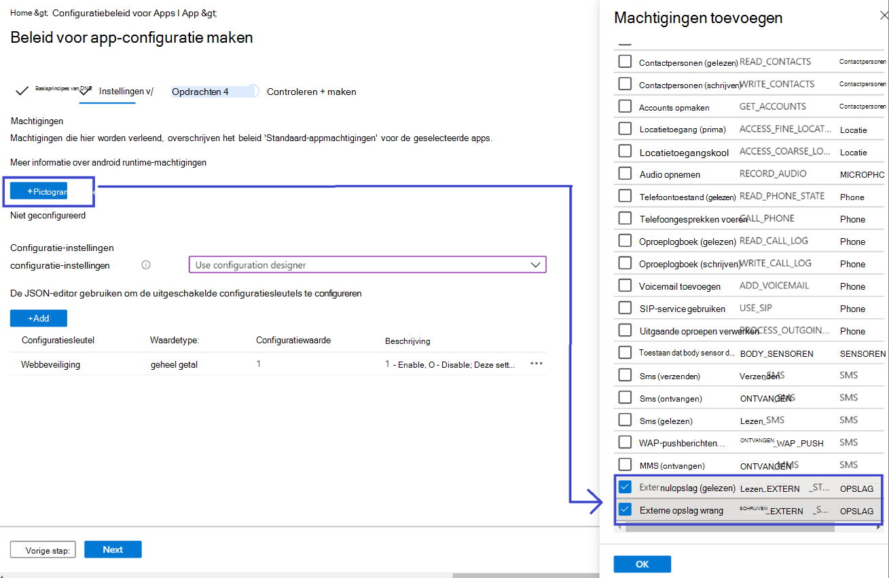

    1. U ziet nu zowel de weergegeven machtigingen als nu kunt u beide  automatisch toevoegen door autogrant te kiezen in de vervolgkeuzelijst Machtigingstoestand en vervolgens **Volgende te selecteren.**

       > [!div class="mx-imgBorder"]
       > 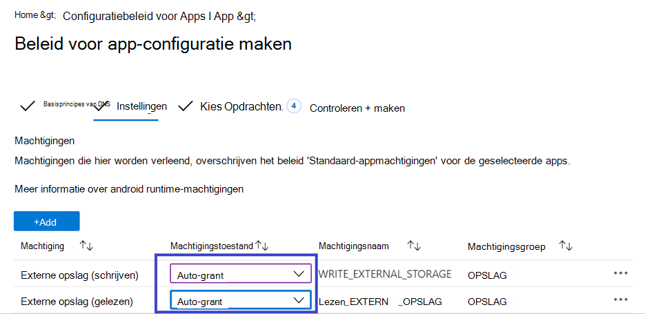

    1. Selecteer op **de pagina** Toewijzingen de gebruikersgroep waaraan dit app-config-beleid zou zijn toegewezen. Klik **op Groepen selecteren om de** betreffende groep op te nemen en te selecteren en vervolgens Volgende te **selecteren.**  De groep die hier is geselecteerd, is meestal dezelfde groep waaraan u Microsoft Defender voor Endpoint Android-app zou toewijzen. 

       > [!div class="mx-imgBorder"]
       > 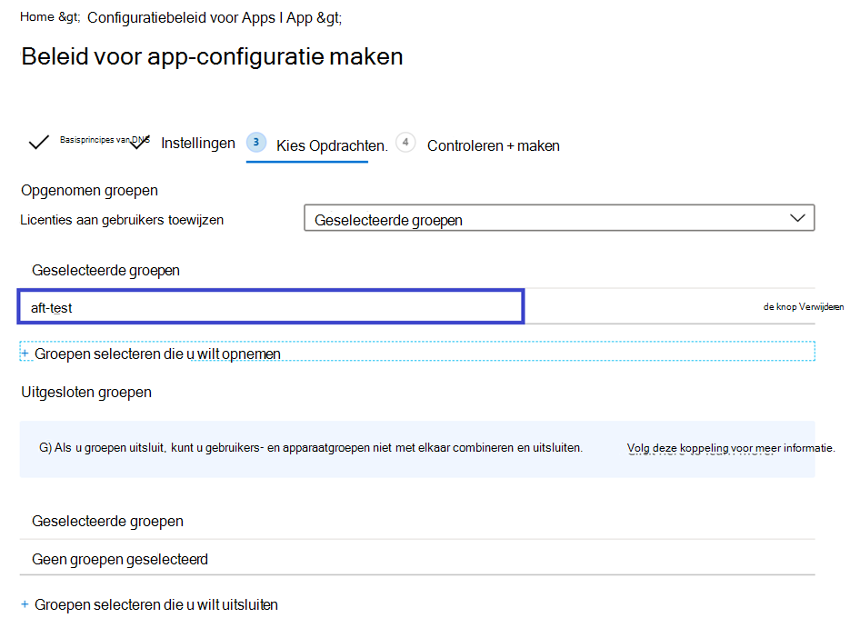
    

     1. Bekijk alle **informatie op de** pagina Controleren + Maken die hierna wordt weergegeven en selecteer vervolgens **Maken.**  
    
        Het app-configuratiebeleid voor Defender voor Eindpunt dat de opslagmachtigingen automatisch wordt toegewezen, is nu toegewezen aan de geselecteerde gebruikersgroep.

        > [!div class="mx-imgBorder"]
        > 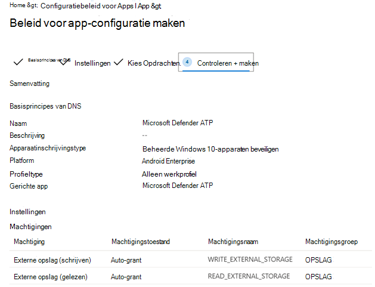

10. Selecteer **Microsoft Defender ATP-app** in de lijst \> **Eigenschappentoewijzingen** \>  \> **bewerken**.

    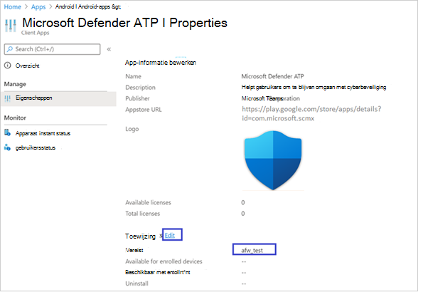

11. Wijs de app toe als *een vereiste* app aan een gebruikersgroep. Deze wordt automatisch geïnstalleerd in het *werkprofiel* tijdens de volgende synchronisatie van het apparaat via de bedrijfsportal-app. U kunt deze opdracht uitvoeren door naar de groep Vereist *toevoegen* te \> **gaan,** de gebruikersgroep te selecteren en op Selecteren **te klikken.**

    > [!div class="mx-imgBorder"]
    > 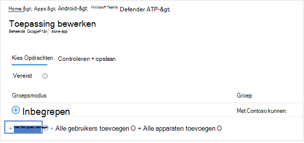

12. Bekijk op **de pagina** Toepassing bewerken alle informatie die hierboven is ingevoerd. Selecteer vervolgens **Controleren + Opslaan en** vervolgens opnieuw opslaan **om** de toewijzing te starten.

### Auto Setup of Always-on VPN 
Defender voor Eindpunt ondersteunt apparaatconfiguratiebeleid voor beheerde apparaten via Intune. Deze mogelijkheid kan worden gebruikt voor het automatisch instellen van **Always-on VPN** op geregistreerde Android Enterprise-apparaten, zodat de eindgebruiker geen VPN-service hoeft in te stellen tijdens onboarding.
1.  Selecteer **op Apparaten** **configuratieprofielen**  >  **Profielplatform** maken Android  >    >  **Enterprise** Selecteer **Apparaatbeperkingen** onder een van de volgende opties, op basis van het type apparaatinschrijving 
- **Volledig beheerd, toegewezen en Corporate-Owned werkprofiel**
- **Persoonlijk werkprofiel**

Selecteer **Maken**. 
 
   > 
    
2. **Configuratie-instellingen** Geef een **naam en** een beschrijving **op om** het configuratieprofiel uniek te identificeren. 

   > 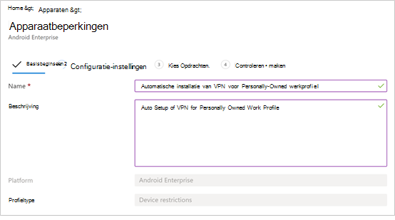
   
 3. Selecteer **Connectiviteit en** configureer VPN:
- **Always-on VPN inschakelen** Stel een VPN-client in het werkprofiel in om waar mogelijk automatisch verbinding te maken en opnieuw verbinding te maken met de VPN. Er kan slechts één VPN-client worden geconfigureerd voor altijd-on VPN op een bepaald apparaat, dus zorg ervoor dat er niet meer dan één always-on VPN-beleid is geïmplementeerd op één apparaat. 
- Selecteer **Aangepast** in de vervolgkeuzelijst vpn-client Aangepaste VPN is in dit geval Defender voor Endpoint VPN, dat wordt gebruikt om de webbeveiligingsfunctie te bieden. 
    > [!NOTE]
    > Microsoft Defender ATP-app moet zijn geïnstalleerd op het apparaat van de gebruiker, zodat deze VPN automatisch kan worden ingesteld.

- Voer **de pakket-id** in van de MICROSOFT Defender ATP-app in de Google Play Store. Voor de URL van de Defender-app https://play.google.com/store/apps/details?id=com.microsoft.scmx is Package ID **com.microsoft.scmx**  
- **Vergrendelingsmodus** Niet geconfigureerd (standaard) 

     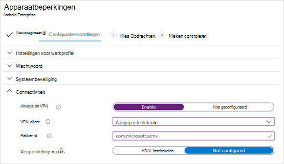
   
4. **Toewijzing** Selecteer op  **de pagina**   Toewijzingen de gebruikersgroep waaraan dit app-config-beleid zou zijn toegewezen. Klik **op Groepen selecteren** om de betreffende groep op te nemen en te selecteren en klik vervolgens op **Volgende.** De groep die hier is geselecteerd, is meestal dezelfde groep waaraan u Microsoft Defender voor Endpoint Android-app zou toewijzen. 

     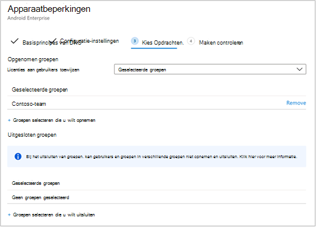

5. Bekijk alle **informatie op de** pagina Controleren + Maken die hierna wordt weergegeven en selecteer vervolgens **Maken.** Het apparaatconfiguratieprofiel is nu toegewezen aan de geselecteerde gebruikersgroep.    

    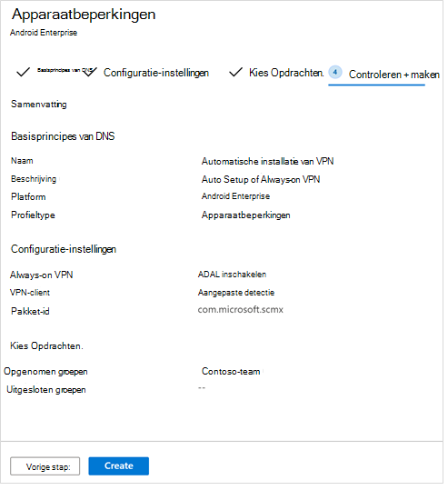

## De onboarding- en controlestatus voltooien

1. Bevestig de installatiestatus van Microsoft Defender voor Eindpunt voor Android door op de status **apparaatinstallatie te klikken.** Controleer of het apparaat hier wordt weergegeven.

    > [!div class="mx-imgBorder"]
    > 

2. Op het apparaat kunt u de onboarding-status valideren door naar het **werkprofiel te gaan.** Controleer of Defender voor Eindpunt beschikbaar is en dat u bent geregistreerd voor de apparaten van persoonlijk **eigendom met werkprofiel.**  Als u bent geregistreerd bij een volledig beheerd gebruikersapparaat van het **bedrijf,** hebt u één profiel op het apparaat waar u kunt bevestigen dat Defender voor Eindpunt beschikbaar is.

    

3. Wanneer de app is geïnstalleerd, opent u de app en accepteert u de machtigingen en moet uw onboarding succesvol zijn.

    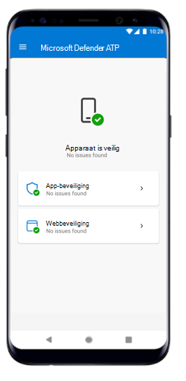

4. In dit stadium is het apparaat met succes onboarded op Defender voor Eindpunt voor Android. U kunt dit controleren in het [Microsoft Defender-beveiligingscentrum](https://securitycenter.microsoft.com) door naar de pagina **Apparaten te** navigeren.

    

## Verwante onderwerpen
- [Overzicht van Microsoft Defender voor Eindpunt voor Android](microsoft-defender-endpoint-android.md)
- [Microsoft Defender voor endpoint voor Android-functies configureren](android-configure.md)
