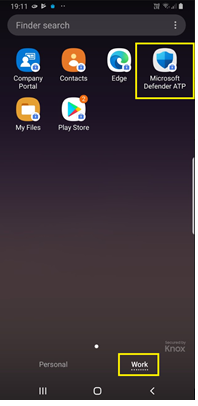

# Microsoft Defender voor Eindpunt op Android implementeren via Microsoft IntuneDeploy Microsoft Defender for Endpoint on Android with Microsoft Intune

[!INCLUDE [Microsoft 365 Defender rebranding](../../includes/microsoft-defender.md)]

**Van toepassing op:****Applies to:**
- [Microsoft Defender voor EindpuntMicrosoft Defender for Endpoint](https://go.microsoft.com/fwlink/p/?linkid=2154037)
- [Microsoft 365 DefenderMicrosoft 365 Defender](https://go.microsoft.com/fwlink/?linkid=2118804)

> Wilt u Microsoft Defender voor Eindpunt ervaren?Want to experience Microsoft Defender for Endpoint? [Meld u aan voor een gratis proefversie.Sign up for a free trial.](https://www.microsoft.com/microsoft-365/windows/microsoft-defender-atp?ocid=docs-wdatp-exposedapis-abovefoldlink)

Meer informatie over het implementeren van Defender voor Eindpunt op Android op Intune-bedrijfsportal geregistreerde apparaten.Learn how to deploy Defender for Endpoint on Android on Intune Company Portal enrolled devices. Zie Uw apparaat  [registreren](/mem/intune/user-help/enroll-device-android-company-portal)voor meer informatie over intune-apparaatinschrijving.For more information about Intune device enrollment, see  [Enroll your device](/mem/intune/user-help/enroll-device-android-company-portal).

> [!NOTE]
> **Defender voor Eindpunt op Android is nu beschikbaar op [Google Play](https://play.google.com/store/apps/details?id=com.microsoft.scmx)****Defender for Endpoint on Android is now available on [Google Play](https://play.google.com/store/apps/details?id=com.microsoft.scmx)**
>
> U kunt vanuit Intune verbinding maken met Google Play om de Defender voor Endpoint-app te implementeren in de registratiemodi Apparaatbeheerder en Android Enterprise.You can connect to Google Play from Intune to deploy Defender for Endpoint app across Device Administrator and Android Enterprise enrollment modes.
>
> Updates voor de app worden automatisch via Google Play.Updates to the app are automatic via Google Play.

## Implementeren op apparaten die zijn geregistreerd door apparaatbeheerderDeploy on Device Administrator enrolled devices

**Defender voor eindpunt implementeren op Android op Intune-bedrijfsportal - Apparatenbeheerder die zijn geregistreerd****Deploy Defender for Endpoint on Android on Intune Company Portal - Device Administrator enrolled devices**

Meer informatie over het implementeren van Defender voor Eindpunt op Android op Intune-bedrijfsportal - Apparaatbeheerder ingeschreven apparaten.Learn how to deploy Defender for Endpoint on Android on Intune Company Portal - Device Administrator enrolled devices.

### Toevoegen als Android Store-appAdd as Android store app

1. Ga [Microsoft Endpoint Manager in het beheercentrum](https://go.microsoft.com/fwlink/?linkid=2109431) naar **Apps** \> **Android Apps** Android \> **\> Store-app toevoegen** en kies **Selecteren.**In [Microsoft Endpoint Manager admin center](https://go.microsoft.com/fwlink/?linkid=2109431) , go to **Apps** \> **Android Apps** \> **Add \> Android store app** and choose **Select**.

   

2. Voer op **de pagina App** toevoegen en in de sectie *App-informatie* het volgende in:On the **Add app** page and in the *App Information* section enter:

   - **Naam****Name**
   - **Beschrijving****Description**
   - **Publisher** als Microsoft.**Publisher** as Microsoft.
   - **App Store URL** as https://play.google.com/store/apps/details?id=com.microsoft.scmx (Defender for Endpoint app Google Play Store URL)**App store URL** as https://play.google.com/store/apps/details?id=com.microsoft.scmx (Defender for Endpoint app Google Play Store URL)

   Andere velden zijn optioneel.Other fields are optional. Selecteer **Volgende**.Select **Next**.

   

3. Ga in *de sectie Opdrachten* naar de sectie **Vereist** en selecteer **Groep toevoegen.**In the *Assignments* section, go to the **Required** section and select **Add group.** Vervolgens kunt u de gebruikersgroep(s) kiezen die u wilt richten op Defender voor Eindpunt in de Android-app.You can then choose the user group(s) that you would like to target Defender for Endpoint on Android app. Kies **Selecteren** en vervolgens **Volgende**.Choose **Select** and then **Next**.

    > [!NOTE]
    > De geselecteerde gebruikersgroep moet bestaan uit intune geregistreerde gebruikers.The selected user group should consist of Intune enrolled users.

    > [!div class="mx-imgBorder"]

    > 

4. Controleer in **de sectie Controleren+Maken** of alle ingevoerde gegevens juist zijn en selecteer vervolgens **Maken.**In the **Review+Create** section, verify that all the information entered is correct and then select **Create**.

    Over een paar minuten wordt de App Defender voor Eindpunt gemaakt en wordt er een melding weergegeven in de rechterbovenhoek van de pagina.In a few moments, the Defender for Endpoint app would be created successfully, and a notification would show up at the top-right corner of the page.

    

5. Selecteer op de pagina met app-informatie die wordt weergegeven in de sectie Monitor de **status** apparaatinstallatie om te controleren of de installatie van het apparaat is voltooid. In the app information page that is displayed, in the **Monitor** section, select **Device install status** to verify that the device installation has completed successfully.

    > [!div class="mx-imgBorder"]
    > 

### De onboarding- en controlestatus voltooienComplete onboarding and check status

1. Zodra Defender voor Eindpunt op Android is geïnstalleerd op het apparaat, ziet u het app-pictogram.Once Defender for Endpoint on Android has been installed on the device, you'll see the app icon.

    

2. Tik op het pictogram van de Microsoft Defender voor endpoint-app en volg de instructies op het scherm om de onboarding van de app te voltooien.Tap the Microsoft Defender for Endpoint app icon and follow the on-screen instructions to complete onboarding the app. De details omvatten de acceptatie door eindgebruikers van Android-machtigingen die vereist zijn door Defender voor Eindpunt op Android.The details include end-user acceptance of Android permissions required by Defender for Endpoint on Android.

3. Na succesvolle onboarding wordt het apparaat weergegeven in de lijst Apparaten in Microsoft Defender-beveiligingscentrum.Upon successful onboarding, the device will start showing up on the Devices list in Microsoft Defender Security Center.

    

## Implementeren op geregistreerde Android Enterprise-apparatenDeploy on Android Enterprise enrolled devices

Defender voor Eindpunt op Android ondersteunt geregistreerde Android Enterprise-apparaten.Defender for Endpoint on Android supports Android Enterprise enrolled devices.

Zie [Inschrijvingsopties](/mem/intune/enrollment/android-enroll)voor meer informatie over de inschrijvingsopties die worden ondersteund door Intune.For more information on the enrollment options supported by Intune, see [Enrollment Options](/mem/intune/enrollment/android-enroll).

**Op dit moment worden persoonlijke apparaten met een werkprofiel en volledig beheerde gebruikersapparaatinschrijvingen van het bedrijf ondersteund voor implementatie.****Currently, Personally owned devices with work profile and Corporate-owned fully managed user device enrollments are supported for deployment.**

## Microsoft Defender voor eindpunt toevoegen aan Android als een beheerde Google Play-appAdd Microsoft Defender for Endpoint on Android as a Managed Google Play app

Volg de onderstaande stappen om de App Microsoft Defender voor Eindpunt toe te voegen aan uw beheerde Google Play.Follow the steps below to add Microsoft Defender for Endpoint app into your managed Google Play.

1. Ga [Microsoft Endpoint Manager beheercentrum naar](https://go.microsoft.com/fwlink/?linkid=2109431) **Apps** \> **Android Apps** \> **toevoegen** en selecteer **Beheerde Google Play-app.**In [Microsoft Endpoint Manager admin center](https://go.microsoft.com/fwlink/?linkid=2109431) , go to **Apps** \> **Android Apps** \> **Add** and select **Managed Google Play app**.

    > [!div class="mx-imgBorder"]
    > 

2. Ga op de beheerde Google Play-pagina die vervolgens wordt geladen naar het zoekvak en zoek **Microsoft Defender.**On your managed Google Play page that loads subsequently, go to the search box and lookup **Microsoft Defender.** Uw zoekopdracht moet de Microsoft Defender voor Eindpunt-app weergeven in uw beheerde Google Play.Your search should display the Microsoft Defender for Endpoint app in your Managed Google Play. Klik op de Microsoft Defender voor Eindpunt-app in het zoekresultaat Apps.Click on the Microsoft Defender for Endpoint app from the Apps search result.

    

3. Op de pagina App-beschrijving die hierna wordt weergegeven, kunt u app-details zien op Defender voor Eindpunt.In the App description page that comes up next, you should be able to see app details on Defender for Endpoint. Controleer de informatie op de pagina en selecteer **goedkeuren.**Review the information on the page and then select **Approve**.

    > [!div class="mx-imgBorder"]
    > 

4. U krijgt de machtigingen die Door Defender voor Eindpunt worden gekregen om het te laten werken.You'll be presented with the permissions that Defender for Endpoint obtains for it to work. Controleer ze en selecteer **goedkeuren.**Review them and then select **Approve**.

    

5. U ziet de pagina Goedkeuringsinstellingen.You'll be presented with the Approval settings page. De pagina bevestigt uw voorkeur voor het verwerken van nieuwe app-machtigingen die Defender voor Eindpunt op Android kan vragen.The page confirms your preference to handle new app permissions that Defender for Endpoint on Android might ask. Bekijk de keuzes en selecteer de gewenste optie.Review the choices and select your preferred option. Selecteer **Gereed**.Select **Done**.

    Beheerde Google Play selecteert standaard Goedgekeurd blijven wanneer *app nieuwe machtigingen aanvraagt*By default, managed Google Play selects *Keep approved when app requests new permissions*

    > [!div class="mx-imgBorder"]
    > 

6. Nadat de machtigingen voor het verwerken van de selectie zijn gemaakt, **selecteert** u Synchroniseren om Microsoft Defender voor Eindpunt te synchroniseren met uw lijst met apps.After the permissions handling selection is made, select **Sync** to sync Microsoft Defender for Endpoint to your apps list.

    > [!div class="mx-imgBorder"]
    > 

7. De synchronisatie wordt binnen enkele minuten voltooid.The sync will complete in a few minutes.

    

8. Selecteer de **knop** Vernieuwen in het scherm met Android-apps en Microsoft Defender voor Eindpunt moet zichtbaar zijn in de lijst met apps.Select the **Refresh** button in the Android apps screen and Microsoft Defender for Endpoint should be visible in the apps list.

    > [!div class="mx-imgBorder"]
    > 

9. Defender voor Eindpunt ondersteunt app-configuratiebeleid voor beheerde apparaten via Intune.Defender for Endpoint supports App configuration policies for managed devices via Intune. Deze mogelijkheid kan worden gebruikt voor autogrant toepasselijke Android-machtigingen, zodat de eindgebruiker deze machtigingen niet hoeft te accepteren.This capability can be leveraged to autogrant applicable Android permission(s), so the end user does not need to accept these permission(s).

    1. Ga op **de pagina Apps** naar **Beleidsbeleid > app-configuratiebeleid > Apparaten > toevoegen.**In the **Apps** page, go to **Policy > App configuration policies > Add > Managed devices**.

       

    1. Voer op **de pagina App-configuratiebeleid** maken de volgende details in:In the **Create app configuration policy** page, enter the following details:

        - Naam: Microsoft Defender voor Eindpunt.Name: Microsoft Defender for Endpoint.
        - Kies **Android Enterprise** als platform.Choose **Android Enterprise** as platform.
        - Kies **Alleen werkprofiel als** profieltype.Choose **Work Profile only** as Profile Type.
        - Klik **op App selecteren,** kies **Microsoft Defender ATP,** selecteer **OK** en vervolgens **Volgende.**Click **Select App**, choose **Microsoft Defender ATP**, select **OK** and then **Next**.

        > [!div class="mx-imgBorder"]
        > 

    1. Ga op **Instellingen** pagina naar de sectie Machtigingen en klik op Toevoegen om de lijst met ondersteunde machtigingen weer te geven.In the **Settings** page, go to the Permissions section click on Add to view the list of supported permissions. Selecteer in de sectie Machtigingen toevoegen de volgende machtigingen:In the Add Permissions section, select the following permissions:

       - Externe opslag (gelezen)External storage (read)
       - Externe opslag (schrijven)External storage (write)

       Selecteer vervolgens **OK**.Then select **OK**.

       > [!div class="mx-imgBorder"]
      > 

    1. U ziet nu zowel de weergegeven machtigingen als nu kunt u beide  automatisch toevoegen door autogrant te kiezen in de vervolgkeuzelijst Machtigingstoestand en vervolgens **Volgende te selecteren.**You should now see both the permissions listed and now you can autogrant both by choosing autogrant in the **Permission state** drop-down and then select **Next**.

       > [!div class="mx-imgBorder"]
       > 

    1. Selecteer op **de pagina** Toewijzingen de gebruikersgroep waaraan dit app-config-beleid zou zijn toegewezen.In the **Assignments** page, select the user group to which this app config policy would be assigned to. Klik **op Groepen selecteren om de** betreffende groep op te nemen en te selecteren en vervolgens Volgende te **selecteren.**Click **Select groups to include** and selecting the applicable group and then selecting **Next**.  De groep die hier is geselecteerd, is meestal dezelfde groep waaraan u Microsoft Defender voor Endpoint Android-app zou toewijzen.The group selected here is usually the same group to which you would assign Microsoft Defender for Endpoint Android app.

       > [!div class="mx-imgBorder"]
       > 

    1. Bekijk alle **informatie op de** pagina Controleren + Maken die hierna wordt weergegeven en selecteer vervolgens **Maken.**In the **Review + Create** page that comes up next, review all the information and then select **Create**.  

        Het app-configuratiebeleid voor Defender voor Eindpunt dat de opslagmachtigingen automatisch wordt toegewezen, is nu toegewezen aan de geselecteerde gebruikersgroep.The app configuration policy for Defender for Endpoint autogranting the storage permission is now assigned to the selected user group.

        > [!div class="mx-imgBorder"]
        > 

10. Selecteer **Microsoft Defender ATP-app** in de lijst \> **Eigenschappentoewijzingen** \>  \> **bewerken**.Select **Microsoft Defender ATP** app in the list \> **Properties** \> **Assignments** \> **Edit**.

    

11. Wijs de app toe als *een vereiste* app aan een gebruikersgroep.Assign the app as a *Required* app to a user group. Het wordt automatisch geïnstalleerd in het *werkprofiel* tijdens de volgende synchronisatie van het apparaat via Bedrijfsportal app.It is automatically installed in the *work profile* during the next sync of the device via Company Portal app. U kunt deze opdracht uitvoeren door naar de groep Vereist *toevoegen* te \> **gaan,** de gebruikersgroep te selecteren en op Selecteren **te klikken.**This assignment can be done by navigating to the *Required* section \> **Add group,** selecting the user group and click **Select**.

    > [!div class="mx-imgBorder"]
    > 

12. Bekijk op **de pagina** Toepassing bewerken alle informatie die hierboven is ingevoerd.In the **Edit Application** page, review all the information that was entered above. Selecteer vervolgens **Controleren + Opslaan en** vervolgens opnieuw opslaan **om** de toewijzing te starten.Then select **Review + Save** and then **Save** again to commence assignment.

### Auto Setup of Always-on VPNAuto Setup of Always-on VPN

Defender voor Eindpunt ondersteunt apparaatconfiguratiebeleid voor beheerde apparaten via Intune.Defender for Endpoint supports Device configuration policies for managed devices via Intune. Deze mogelijkheid kan worden gebruikt voor het automatisch instellen van **Always-on VPN** op geregistreerde Android Enterprise-apparaten, zodat de eindgebruiker geen VPN-service hoeft in te stellen tijdens onboarding.This capability can be leveraged to **Auto setup of Always-on VPN** on Android Enterprise enrolled devices, so the end user does not need to set up VPN service while onboarding.

1. Selecteer **op Apparaten** **configuratieprofielen**  >  **Profielplatform**  >    >  **maken Android Enterprise**On **Devices**, select **Configuration Profiles** > **Create Profile** > **Platform** > **Android Enterprise**

   Selecteer **Apparaatbeperkingen onder** een van de volgende opties, op basis van het type apparaatinschrijving:Select **Device restrictions** under one of the following, based on your device enrollment type:
   - **Volledig beheerd, toegewezen en Corporate-Owned werkprofiel****Fully Managed, Dedicated, and Corporate-Owned Work Profile**
   - **Persoonlijk werkprofiel****Personally owned Work Profile**

   Selecteer **Maken**.Select **Create**.

   > 

2. **Configuratie Instellingen** Geef een **naam en** een beschrijving **op om** het configuratieprofiel uniek te identificeren.**Configuration Settings** Provide a **Name** and a **Description** to uniquely identify the configuration profile.

   > 

3. Selecteer **Connectiviteit en** configureer VPN:Select **Connectivity** and configure VPN:
   - **Always-on VPN inschakelen**Enable **Always-on VPN**

   Stel een VPN-client in het werkprofiel in om waar mogelijk automatisch verbinding te maken en opnieuw verbinding te maken met de VPN.Setup a VPN client in the work profile to automatically connect and reconnect to the VPN whenever possible. Er kan slechts één VPN-client worden geconfigureerd voor altijd-on VPN op een bepaald apparaat, dus zorg ervoor dat er niet meer dan één always-on VPN-beleid is geïmplementeerd op één apparaat.Only one VPN client can be configured for always-on VPN on a given device, so be sure to have no more than one always-on VPN policy deployed to a single device.

   - Selecteer **Aangepast** in de vervolgkeuzelijst vpn-clientSelect **Custom** in VPN client dropdown list

   Aangepaste VPN is in dit geval Defender voor Endpoint VPN, dat wordt gebruikt om de webbeveiligingsfunctie te bieden.Custom VPN in this case is Defender for Endpoint VPN which is used to provide the Web Protection feature.

   > [!NOTE]
   > Microsoft Defender voor Endpoint-app moet zijn geïnstalleerd op het apparaat van de gebruiker, zodat deze VPN automatisch kan worden ingesteld.Microsoft Defender for Endpoint app must be installed on user’s device, in order to functioning of auto setup of this VPN.

   - Voer **pakket-id** in van de Microsoft Defender voor Eindpunt-app in de Google Play Store.Enter **Package ID** of the Microsoft Defender for Endpoint app in Google Play store. Voor de URL van de Defender-app <https://play.google.com/store/apps/details?id=com.microsoft.scmx> is Package ID **com.microsoft.scmx**For the Defender app URL <https://play.google.com/store/apps/details?id=com.microsoft.scmx>, Package ID is **com.microsoft.scmx**
   - **Vergrendelingsmodus** Niet geconfigureerd (standaard)**Lockdown mode** Not configured (Default)

     

4. **Toewijzing****Assignment**

   Selecteer op **de pagina**   Toewijzingen de gebruikersgroep waaraan dit app-config-beleid zou zijn toegewezen.In the **Assignments** page, select the user group to which this app config policy would be assigned to. Klik **op Groepen selecteren** om de betreffende groep op te nemen en te selecteren en klik vervolgens op **Volgende.**Click **Select groups** to include and selecting the applicable group and then click **Next**. De groep die hier is geselecteerd, is meestal dezelfde groep waaraan u Microsoft Defender voor Endpoint Android-app zou toewijzen.The group selected here is usually the same group to which you would assign Microsoft Defender for Endpoint Android app.

     

5. Bekijk alle **informatie op de** pagina Controleren + Maken die hierna wordt weergegeven en selecteer vervolgens **Maken.**In the **Review + Create** page that comes up next, review all the information and then select **Create**.
Het apparaatconfiguratieprofiel is nu toegewezen aan de geselecteerde gebruikersgroep.The device configuration profile is now assigned to the selected user group.

    

## De onboarding- en controlestatus voltooienComplete onboarding and check status

1. Bevestig de installatiestatus van Microsoft Defender voor Eindpunt op Android door op de **status apparaatinstallatie te klikken.**Confirm the installation status of Microsoft Defender for Endpoint on Android by clicking on the **Device Install Status**. Controleer of het apparaat hier wordt weergegeven.Verify that the device is displayed here.

    > [!div class="mx-imgBorder"]
    > 

2. Op het apparaat kunt u de onboarding-status valideren door naar het **werkprofiel te gaan.**On the device, you can validate the onboarding status by going to the **work profile**. Controleer of Defender voor Eindpunt beschikbaar is en dat u bent geregistreerd voor de apparaten van persoonlijk **eigendom met werkprofiel.**Confirm that Defender for Endpoint is available and that you are enrolled to the **Personally owned devices with work profile**.  Als u bent geregistreerd bij een volledig beheerd gebruikersapparaat van het **bedrijf,** hebt u één profiel op het apparaat waar u kunt bevestigen dat Defender voor Eindpunt beschikbaar is.If you are enrolled to a **Corporate-owned, fully managed user device**, you will have a single profile on the device where you can confirm that Defender for Endpoint is available.

    

3. Wanneer de app is geïnstalleerd, opent u de app en accepteert u de machtigingen en moet uw onboarding succesvol zijn.When the app is installed, open the app and accept the permissions and then your onboarding should be successful.

    

4. In dit stadium is het apparaat met succes onboarded op Defender for Endpoint op Android.At this stage the device is successfully onboarded onto Defender for Endpoint on Android. U kunt dit controleren op de [Microsoft Defender-beveiligingscentrum](https://securitycenter.microsoft.com) door naar de pagina Apparaten **te** navigeren.You can verify this on the [Microsoft Defender Security Center](https://securitycenter.microsoft.com) by navigating to the **Devices** page.

    

## Gerelateerde onderwerpenRelated topics

- [Overzicht van Microsoft Defender voor Eindpunt op AndroidOverview of Microsoft Defender for Endpoint on Android](microsoft-defender-endpoint-android.md)
- [Microsoft Defender voor Eindpunt in Android-functies configurerenConfigure Microsoft Defender for Endpoint on Android features](android-configure.md)
