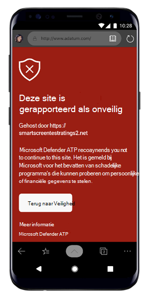
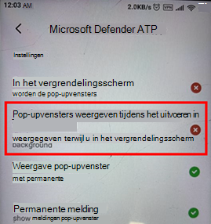

# Problemen met Microsoft Defender voor Eindpunt op Android oplossenTroubleshooting issues on Microsoft Defender for Endpoint on Android

[!INCLUDE [Microsoft 365 Defender rebranding](../../includes/microsoft-defender.md)]

**Van toepassing op:****Applies to:**
- [Microsoft Defender voor EindpuntMicrosoft Defender for Endpoint](https://go.microsoft.com/fwlink/p/?linkid=2154037)
- [Microsoft 365 DefenderMicrosoft 365 Defender](https://go.microsoft.com/fwlink/?linkid=2118804)

> Wilt u Microsoft Defender voor Eindpunt ervaren?Want to experience Microsoft Defender for Endpoint? [Meld u aan voor een gratis proefabonnement.Sign up for a free trial.](https://www.microsoft.com/microsoft-365/windows/microsoft-defender-atp?ocid=docs-wdatp-exposedapis-abovefoldlink) 

Wanneer u een apparaat onboardt, ziet u mogelijk aanmeldingsproblemen nadat de app is geïnstalleerd.When onboarding a device, you might see sign in issues after the app is installed.

Tijdens onboarding kunt u problemen ondervinden bij het aanmelden nadat de app op uw apparaat is geïnstalleerd.During onboarding, you might encounter sign in issues after the app is installed on your device.

In dit artikel vindt u oplossingen voor het oplossen van aanmeldingsproblemen.This article provides solutions to help address the sign-on issues.  

## Aanmelden mislukt - onverwachte foutSign in failed - unexpected error
**Aanmelden is mislukt: Onverwachte** *fout, probeer het later***Sign in failed:** *Unexpected error, try later*

**Bericht:****Message:**

Onverwachte fout, probeer het laterUnexpected error, try later

**Oorzaak:****Cause:**

Er is een oudere versie van de App Microsoft Authenticator op uw apparaat geïnstalleerd.You have an older version of "Microsoft Authenticator" app installed on your device.

**Oplossing:****Solution:**

De nieuwste versie en [Microsoft Authenticator installeren](https://play.google.com/store/apps/details?androidid=com.azure.authenticator) vanuit de Google Play Store en het opnieuw proberenInstall latest version and of [Microsoft Authenticator](https://play.google.com/store/apps/details?androidid=com.azure.authenticator) from Google Play Store and try again

## Aanmelden mislukt - ongeldige licentieSign in failed - invalid license

**Aanmelden mislukt:** *Ongeldige licentie, neem contact op met beheerder***Sign in failed:** *Invalid license, please contact administrator*

**Bericht:** *Ongeldige licentie, neem contact op met de beheerder***Message:** *Invalid license, please contact administrator*

**Oorzaak:****Cause:**

U hebt geen Microsoft 365-licentie toegewezen of uw organisatie heeft geen licentie voor microsoft 365 Enterprise-abonnement.You do not have Microsoft 365 license assigned, or your organization does not have a license for Microsoft 365 Enterprise subscription.

**Oplossing:****Solution:**

Neem contact op met uw beheerder voor hulp.Contact your administrator for help.

## Phishingpagina's worden niet geblokkeerd op sommige OEM-apparatenPhishing pages aren't blocked on some OEM devices

**Van toepassing op:** Alleen specifieke OEM's**Applies to:** Specific OEMs only

-   **Xiaomi****Xiaomi**

Phishing en schadelijke webbedreigingen die worden gedetecteerd door Defender voor Eindpunt voor Android, worden niet geblokkeerd op sommige Xiaomi-apparaten.Phishing and harmful web threats that are detected by Defender for Endpoint for Android are not blocked on some Xiaomi devices. De volgende functionaliteit werkt niet op deze apparaten.The following functionality doesn't work on these devices.

**Oorzaak:****Cause:**

Xiaomi-apparaten bevatten een nieuw machtigingsmodel.Xiaomi devices include a new permission model. Hierdoor wordt voorkomen dat in Defender voor Eindpunt voor Android pop-upvensters worden weergegeven terwijl deze op de achtergrond wordt uitgevoerd.This prevents Defender for Endpoint for Android from displaying pop-up windows while it runs in the background.

Machtiging voor Xiaomi-apparaten: 'Pop-upvensters weergeven terwijl u op de achtergrond werkt'.Xiaomi devices permission: "Display pop-up windows while running in the background."

**Oplossing:****Solution:**

Schakel de vereiste machtiging in op Xiaomi-apparaten.Enable the required permission on Xiaomi devices.

- Pop-upvensters weergeven terwijl deze op de achtergrond worden uitgevoerd.Display pop-up windows while running in the background.
