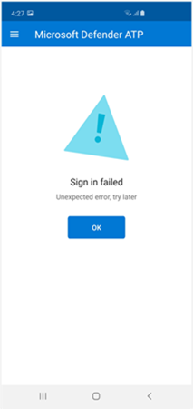

# Problemen met Microsoft Defender voor Eindpunt voor Android oplossen

[!INCLUDE [Microsoft 365 Defender rebranding](../../includes/microsoft-defender.md)]

**Van toepassing op:**
- [Microsoft Defender voor Eindpunt](https://go.microsoft.com/fwlink/p/?linkid=2154037)
- [Microsoft 365 Defender](https://go.microsoft.com/fwlink/?linkid=2118804)

> Wilt u Microsoft Defender voor Eindpunt ervaren? [Meld u aan voor een gratis proefabonnement.](https://www.microsoft.com/microsoft-365/windows/microsoft-defender-atp?ocid=docs-wdatp-exposedapis-abovefoldlink) 

Wanneer u een apparaat onboardt, ziet u mogelijk aanmeldingsproblemen nadat de app is geïnstalleerd.

Tijdens onboarding kunt u problemen ondervinden bij het aanmelden nadat de app op uw apparaat is geïnstalleerd.

In dit artikel vindt u oplossingen voor het oplossen van aanmeldingsproblemen.  

## Aanmelden mislukt - onverwachte fout
**Aanmelden is mislukt: Onverwachte** *fout, probeer het later*

**Bericht:**

Onverwachte fout, probeer het later

**Oorzaak:**

Er is een oudere versie van de App Microsoft Authenticator op uw apparaat geïnstalleerd.

**Oplossing:**

De nieuwste versie en [Microsoft Authenticator installeren](https://play.google.com/store/apps/details?androidid=com.azure.authenticator) vanuit de Google Play Store en het opnieuw proberen

## Aanmelden mislukt - ongeldige licentie

**Aanmelden mislukt:** *Ongeldige licentie, neem contact op met beheerder*

**Bericht:** *Ongeldige licentie, neem contact op met de beheerder*

**Oorzaak:**

U hebt geen Microsoft 365-licentie toegewezen of uw organisatie heeft geen licentie voor microsoft 365 Enterprise-abonnement.

**Oplossing:**

Neem contact op met uw beheerder voor hulp.

## Phishingpagina's worden niet geblokkeerd op sommige OEM-apparaten

**Van toepassing op:** Alleen specifieke OEM's

-   **Xiaomi**

Phishing en schadelijke webbedreigingen die worden gedetecteerd door Defender voor Eindpunt voor Android, worden niet geblokkeerd op sommige Xiaomi-apparaten. De volgende functionaliteit werkt niet op deze apparaten.

**Oorzaak:**

Xiaomi-apparaten bevatten een nieuw machtigingsmodel. Hierdoor wordt voorkomen dat in Defender voor Eindpunt voor Android pop-upvensters worden weergegeven terwijl deze op de achtergrond wordt uitgevoerd.

Machtiging voor Xiaomi-apparaten: 'Pop-upvensters weergeven terwijl u op de achtergrond werkt'.

**Oplossing:**

Schakel de vereiste machtiging in op Xiaomi-apparaten.

- Pop-upvensters weergeven terwijl deze op de achtergrond worden uitgevoerd.
