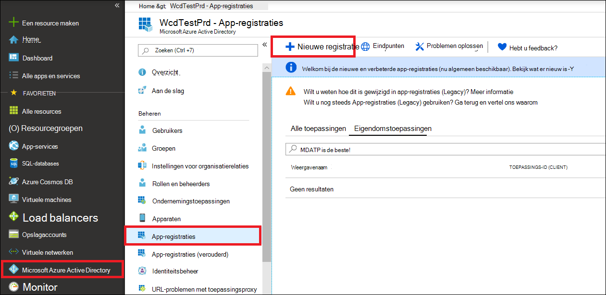
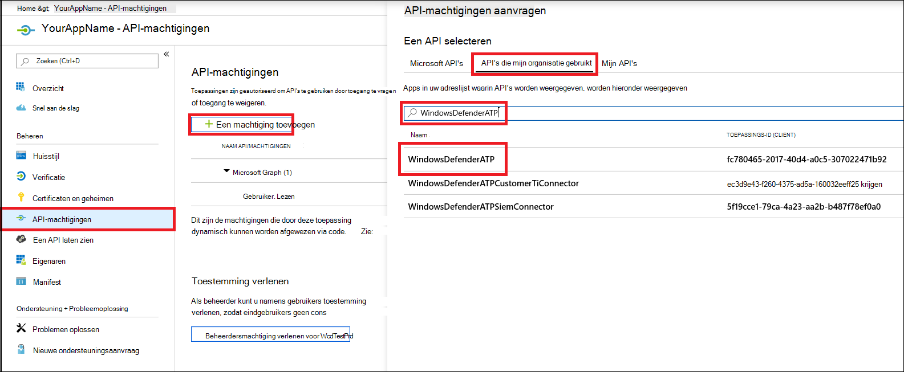
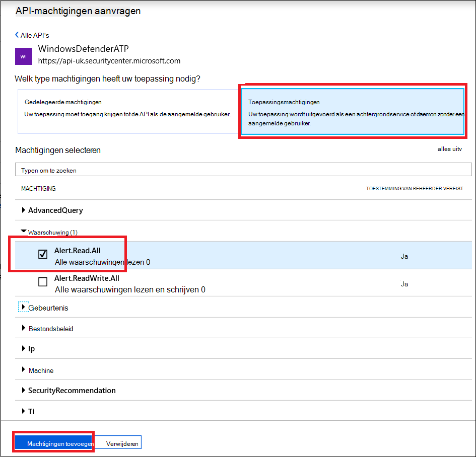
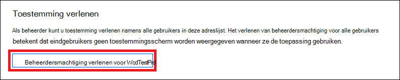
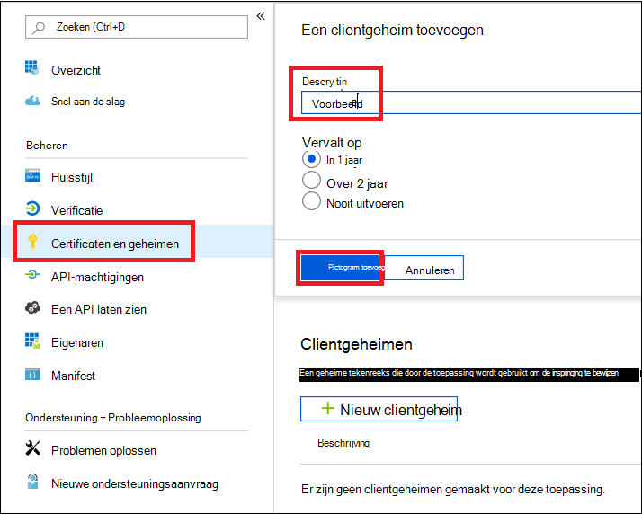
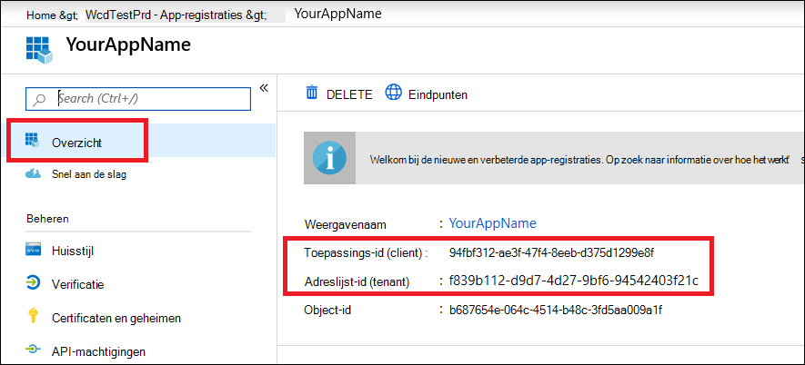
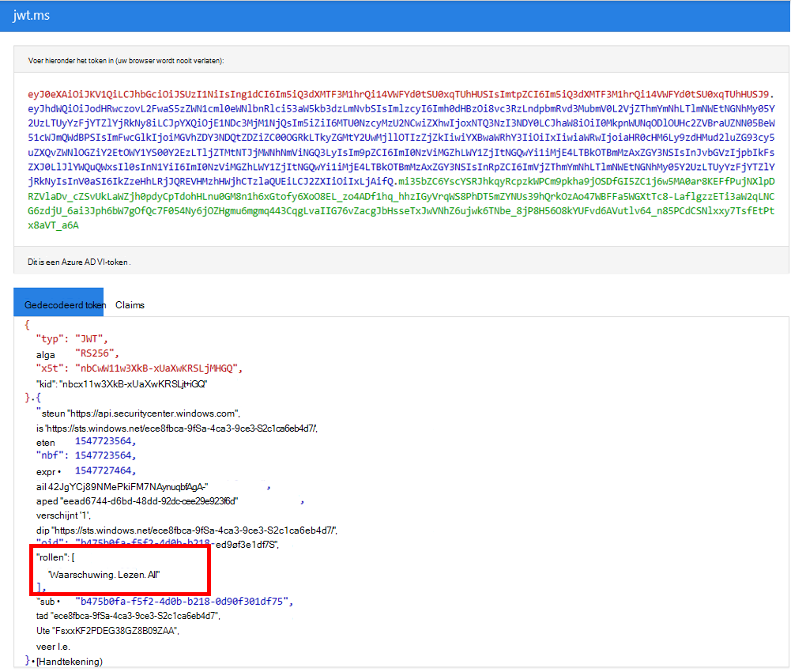

# <a name="microsoft-defender-for-endpoint-api---hello-world"></a><span data-ttu-id="e1cd0-104">Microsoft Defender voor Endpoint API - Hello World</span><span class="sxs-lookup"><span data-stu-id="e1cd0-104">Microsoft Defender for Endpoint API - Hello World</span></span> 

[!INCLUDE [Microsoft 365 Defender rebranding](../../includes/microsoft-defender.md)]


<span data-ttu-id="e1cd0-105">**Van toepassing op:**</span><span class="sxs-lookup"><span data-stu-id="e1cd0-105">**Applies to:**</span></span> 
- [<span data-ttu-id="e1cd0-106">Microsoft Defender voor Eindpunt</span><span class="sxs-lookup"><span data-stu-id="e1cd0-106">Microsoft Defender for Endpoint</span></span>](https://go.microsoft.com/fwlink/?linkid=2154037)


- <span data-ttu-id="e1cd0-107">Wilt u Microsoft Defender voor Eindpunt ervaren?</span><span class="sxs-lookup"><span data-stu-id="e1cd0-107">Want to experience Microsoft Defender for Endpoint?</span></span> [<span data-ttu-id="e1cd0-108">Meld u aan voor een gratis proefabonnement.</span><span class="sxs-lookup"><span data-stu-id="e1cd0-108">Sign up for a free trial.</span></span>](https://www.microsoft.com/microsoft-365/windows/microsoft-defender-atp?ocid=docs-wdatp-exposedapis-abovefoldlink) 

[!include[Microsoft Defender for Endpoint API URIs for US Government](../../includes/microsoft-defender-api-usgov.md)]

[!include[Improve request performance](../../includes/improve-request-performance.md)]


## <a name="get-alerts-using-a-simple-powershell-script"></a><span data-ttu-id="e1cd0-109">Waarschuwingen ontvangen met een eenvoudig PowerShell-script</span><span class="sxs-lookup"><span data-stu-id="e1cd0-109">Get Alerts using a simple PowerShell script</span></span>

### <a name="how-long-it-takes-to-go-through-this-example"></a><span data-ttu-id="e1cd0-110">Hoe lang duurt het om dit voorbeeld door te nemen?</span><span class="sxs-lookup"><span data-stu-id="e1cd0-110">How long it takes to go through this example?</span></span>
<span data-ttu-id="e1cd0-111">Het duurt slechts 5 minuten in twee stappen:</span><span class="sxs-lookup"><span data-stu-id="e1cd0-111">It only takes 5 minutes done in two steps:</span></span>
- <span data-ttu-id="e1cd0-112">Toepassingsregistratie</span><span class="sxs-lookup"><span data-stu-id="e1cd0-112">Application registration</span></span>
- <span data-ttu-id="e1cd0-113">Voorbeelden gebruiken: alleen kopiëren/plakken van een kort PowerShell-script is vereist</span><span class="sxs-lookup"><span data-stu-id="e1cd0-113">Use examples: only requires copy/paste of a short PowerShell script</span></span>

### <a name="do-i-need-a-permission-to-connect"></a><span data-ttu-id="e1cd0-114">Heb ik toestemming nodig om verbinding te maken?</span><span class="sxs-lookup"><span data-stu-id="e1cd0-114">Do I need a permission to connect?</span></span>
<span data-ttu-id="e1cd0-115">Voor de registratiefase toepassing moet u een globale beheerdersrol **hebben** in uw Azure Active Directory -tenant (Azure AD).</span><span class="sxs-lookup"><span data-stu-id="e1cd0-115">For the Application registration stage, you must have a **Global administrator** role in your Azure Active Directory (Azure AD) tenant.</span></span>

### <a name="step-1---create-an-app-in-azure-active-directory"></a><span data-ttu-id="e1cd0-116">Stap 1 - Een app maken in Azure Active Directory</span><span class="sxs-lookup"><span data-stu-id="e1cd0-116">Step 1 - Create an App in Azure Active Directory</span></span>

1. <span data-ttu-id="e1cd0-117">Meld u aan [bij Azure](https://portal.azure.com) met uw **globale beheerdergebruiker.**</span><span class="sxs-lookup"><span data-stu-id="e1cd0-117">Log on to [Azure](https://portal.azure.com) with your **Global administrator** user.</span></span>

2. <span data-ttu-id="e1cd0-118">**Navigeer naar Azure Active Directory**  >  **App-registraties** Nieuwe  >  **registratie**.</span><span class="sxs-lookup"><span data-stu-id="e1cd0-118">Navigate to **Azure Active Directory** > **App registrations** > **New registration**.</span></span> 

   

3. <span data-ttu-id="e1cd0-120">Kies in het registratieformulier een naam voor uw toepassing en klik vervolgens op **Registreren.**</span><span class="sxs-lookup"><span data-stu-id="e1cd0-120">In the registration form, choose a name for your application and then click **Register**.</span></span>

4. <span data-ttu-id="e1cd0-121">Geef uw toepassing toegang tot Defender voor Eindpunt en wijs deze **machtiging 'Alle waarschuwingen lezen'** toe:</span><span class="sxs-lookup"><span data-stu-id="e1cd0-121">Allow your Application to access Defender for Endpoint and assign it **'Read all alerts'** permission:</span></span>

   - <span data-ttu-id="e1cd0-122">Klik op uw **toepassingspagina** op API-machtigingen Machtigingen toevoegen Api's die mijn organisatie gebruikt  >    >   > **WindowsDefenderATP** typen en klik op **WindowsDefenderATP.**</span><span class="sxs-lookup"><span data-stu-id="e1cd0-122">On your application page, click **API Permissions** > **Add permission** > **APIs my organization uses** > type **WindowsDefenderATP** and click on **WindowsDefenderATP**.</span></span>

   - <span data-ttu-id="e1cd0-123">**Opmerking:** WindowsDefenderATP wordt niet weergegeven in de oorspronkelijke lijst.</span><span class="sxs-lookup"><span data-stu-id="e1cd0-123">**Note**: WindowsDefenderATP does not appear in the original list.</span></span> <span data-ttu-id="e1cd0-124">U moet beginnen met het schrijven van de naam in het tekstvak om deze weer te geven.</span><span class="sxs-lookup"><span data-stu-id="e1cd0-124">You need to start writing its name in the text box to see it appear.</span></span>

   

   - <span data-ttu-id="e1cd0-126">Kies **Toepassingsmachtigingen**  >  **Alert.Read.All** > Klik op **Machtigingen toevoegen**</span><span class="sxs-lookup"><span data-stu-id="e1cd0-126">Choose **Application permissions** > **Alert.Read.All** > Click on **Add permissions**</span></span>

   

   <span data-ttu-id="e1cd0-128">**Belangrijke opmerking:** u moet de relevante machtigingen selecteren.</span><span class="sxs-lookup"><span data-stu-id="e1cd0-128">**Important note**: You need to select the relevant permissions.</span></span> <span data-ttu-id="e1cd0-129">'Alle waarschuwingen lezen' is slechts een voorbeeld!</span><span class="sxs-lookup"><span data-stu-id="e1cd0-129">'Read All Alerts' is only an example!</span></span>

     <span data-ttu-id="e1cd0-130">Bijvoorbeeld:</span><span class="sxs-lookup"><span data-stu-id="e1cd0-130">For instance,</span></span>

     - <span data-ttu-id="e1cd0-131">Als [u geavanceerde query's wilt uitvoeren,](run-advanced-query-api.md)selecteert u 'Geavanceerde query's uitvoeren' machtiging</span><span class="sxs-lookup"><span data-stu-id="e1cd0-131">To [run advanced queries](run-advanced-query-api.md), select 'Run advanced queries' permission</span></span>
     - <span data-ttu-id="e1cd0-132">Als [u een computer wilt isoleren,](isolate-machine.md)selecteert u machtiging 'Machine isoleren'.</span><span class="sxs-lookup"><span data-stu-id="e1cd0-132">To [isolate a machine](isolate-machine.md), select 'Isolate machine' permission</span></span>
     - <span data-ttu-id="e1cd0-133">Als u wilt bepalen welke machtiging u nodig hebt, kijkt u naar de **sectie** Machtigingen in de API die u wilt bellen.</span><span class="sxs-lookup"><span data-stu-id="e1cd0-133">To determine which permission you need, please look at the **Permissions** section in the API you are interested to call.</span></span>

5. <span data-ttu-id="e1cd0-134">Klik **op Toestemming verlenen**</span><span class="sxs-lookup"><span data-stu-id="e1cd0-134">Click **Grant consent**</span></span>

    - <span data-ttu-id="e1cd0-135">**Opmerking:** Telkens wanneer u machtigingen toevoegt, moet u op Toestemming **verlenen** klikken om de nieuwe machtiging van kracht te laten worden.</span><span class="sxs-lookup"><span data-stu-id="e1cd0-135">**Note**: Every time you add permission you must click on **Grant consent** for the new permission to take effect.</span></span>

    

6. <span data-ttu-id="e1cd0-137">Voeg een geheim toe aan de toepassing.</span><span class="sxs-lookup"><span data-stu-id="e1cd0-137">Add a secret to the application.</span></span>

    - <span data-ttu-id="e1cd0-138">Klik **op Certificaten &,** voeg beschrijving toe aan het geheim en klik op **Toevoegen.**</span><span class="sxs-lookup"><span data-stu-id="e1cd0-138">Click **Certificates & secrets**, add description to the secret and click **Add**.</span></span>

    <span data-ttu-id="e1cd0-139">**Belangrijk:** Nadat u op Toevoegen hebt **geklikt, kopieert u de gegenereerde geheime waarde.**</span><span class="sxs-lookup"><span data-stu-id="e1cd0-139">**Important**: After click Add, **copy the generated secret value**.</span></span> <span data-ttu-id="e1cd0-140">U kunt het niet meer ophalen nadat u bent weggehaald.</span><span class="sxs-lookup"><span data-stu-id="e1cd0-140">You won't be able to retrieve after you leave!</span></span>

    

7. <span data-ttu-id="e1cd0-142">Schrijf uw toepassings-id en uw tenant-id op:</span><span class="sxs-lookup"><span data-stu-id="e1cd0-142">Write down your application ID and your tenant ID:</span></span>

   - <span data-ttu-id="e1cd0-143">Ga op de toepassingspagina naar **Overzicht** en kopieer het volgende:</span><span class="sxs-lookup"><span data-stu-id="e1cd0-143">On your application page, go to **Overview** and copy the following:</span></span>

   


<span data-ttu-id="e1cd0-145">Klaar!</span><span class="sxs-lookup"><span data-stu-id="e1cd0-145">Done!</span></span> <span data-ttu-id="e1cd0-146">U hebt een toepassing geregistreerd.</span><span class="sxs-lookup"><span data-stu-id="e1cd0-146">You have successfully registered an application!</span></span>

### <a name="step-2---get-a-token-using-the-app-and-use-this-token-to-access-the-api"></a><span data-ttu-id="e1cd0-147">Stap 2: haal een token op met de App en gebruik dit token om toegang te krijgen tot de API.</span><span class="sxs-lookup"><span data-stu-id="e1cd0-147">Step 2 - Get a token using the App and use this token to access the API.</span></span>

-   <span data-ttu-id="e1cd0-148">Kopieer het script hieronder naar PowerShell ISE of naar een teksteditor en sla het op als "**Get-Token.ps1**"</span><span class="sxs-lookup"><span data-stu-id="e1cd0-148">Copy the script below to PowerShell ISE or to a text editor, and save it as "**Get-Token.ps1**"</span></span>
-   <span data-ttu-id="e1cd0-149">Als u dit script uit te voeren, wordt een token gegenereerd en wordt dit opgeslagen in de werkmap onder de naam "**Latest-token.txt**".</span><span class="sxs-lookup"><span data-stu-id="e1cd0-149">Running this script will generate a token and will save it in the working folder under the name "**Latest-token.txt**".</span></span>

```
# That code gets the App Context Token and save it to a file named "Latest-token.txt" under the current directory
# Paste below your Tenant ID, App ID and App Secret (App key).

$tenantId = '' ### Paste your tenant ID here
$appId = '' ### Paste your Application ID here
$appSecret = '' ### Paste your Application secret here

$resourceAppIdUri = 'https://api.securitycenter.microsoft.com'
$oAuthUri = "https://login.microsoftonline.com/$TenantId/oauth2/token"
$authBody = [Ordered] @{
    resource = "$resourceAppIdUri"
    client_id = "$appId"
    client_secret = "$appSecret"
    grant_type = 'client_credentials'
}
$authResponse = Invoke-RestMethod -Method Post -Uri $oAuthUri -Body $authBody -ErrorAction Stop
$token = $authResponse.access_token
Out-File -FilePath "./Latest-token.txt" -InputObject $token
return $token
```

-   <span data-ttu-id="e1cd0-150">Sanity Check:</span><span class="sxs-lookup"><span data-stu-id="e1cd0-150">Sanity Check:</span></span><br>
<span data-ttu-id="e1cd0-151">Voer het script uit.</span><span class="sxs-lookup"><span data-stu-id="e1cd0-151">Run the script.</span></span><br>
<span data-ttu-id="e1cd0-152">Ga in uw browser naar: https://jwt.ms/</span><span class="sxs-lookup"><span data-stu-id="e1cd0-152">In your browser go to: https://jwt.ms/</span></span> <br>
<span data-ttu-id="e1cd0-153">Kopieer het token (de inhoud van het Latest-token.txt bestand).</span><span class="sxs-lookup"><span data-stu-id="e1cd0-153">Copy the token (the content of the Latest-token.txt file).</span></span><br>
<span data-ttu-id="e1cd0-154">Plakken in het bovenste vak.</span><span class="sxs-lookup"><span data-stu-id="e1cd0-154">Paste in the top box.</span></span><br>
<span data-ttu-id="e1cd0-155">Zoek naar de sectie 'rollen'.</span><span class="sxs-lookup"><span data-stu-id="e1cd0-155">Look for the "roles" section.</span></span> <span data-ttu-id="e1cd0-156">Zoek de rol Alert.Read.All.</span><span class="sxs-lookup"><span data-stu-id="e1cd0-156">Find the Alert.Read.All role.</span></span>



### <a name="lets-get-the-alerts"></a><span data-ttu-id="e1cd0-158">Hiermee kunt u de waarschuwingen krijgen.</span><span class="sxs-lookup"><span data-stu-id="e1cd0-158">Lets get the Alerts!</span></span>

-   <span data-ttu-id="e1cd0-159">Het onderstaande script gebruikt **Get-Token.ps1** toegang tot de API en krijgt de afgelopen 48 uur waarschuwingen.</span><span class="sxs-lookup"><span data-stu-id="e1cd0-159">The script below will use **Get-Token.ps1** to access the API and will get the past 48 hours Alerts.</span></span>
-   <span data-ttu-id="e1cd0-160">Sla dit script op in dezelfde map die u het vorige script hebt **Get-Token.ps1.**</span><span class="sxs-lookup"><span data-stu-id="e1cd0-160">Save this script in the same folder you saved the previous script **Get-Token.ps1**.</span></span> 
-   <span data-ttu-id="e1cd0-161">Het script maakt twee bestanden (json en csv) met de gegevens in dezelfde map als de scripts.</span><span class="sxs-lookup"><span data-stu-id="e1cd0-161">The script creates two files (json and csv) with the data in the same folder as the scripts.</span></span>

```
# Returns Alerts created in the past 48 hours.

$token = ./Get-Token.ps1       #run the script Get-Token.ps1  - make sure you are running this script from the same folder of Get-Token.ps1

# Get Alert from the last 48 hours. Make sure you have alerts in that time frame.
$dateTime = (Get-Date).ToUniversalTime().AddHours(-48).ToString("o")       

# The URL contains the type of query and the time filter we create above
# Read more about other query options and filters at   Https://TBD- add the documentation link
$url = "https://api.securitycenter.microsoft.com/api/alerts?`$filter=alertCreationTime ge $dateTime"

# Set the WebRequest headers
$headers = @{ 
    'Content-Type' = 'application/json'
    Accept = 'application/json'
    Authorization = "Bearer $token" 
}

# Send the webrequest and get the results. 
$response = Invoke-WebRequest -Method Get -Uri $url -Headers $headers -ErrorAction Stop

# Extract the alerts from the results. 
$alerts =  ($response | ConvertFrom-Json).value | ConvertTo-Json

# Get string with the execution time. We concatenate that string to the output file to avoid overwrite the file
$dateTimeForFileName = Get-Date -Format o | foreach {$_ -replace ":", "."}    

# Save the result as json and as csv
$outputJsonPath = "./Latest Alerts $dateTimeForFileName.json"     
$outputCsvPath = "./Latest Alerts $dateTimeForFileName.csv"

Out-File -FilePath $outputJsonPath -InputObject $alerts
($alerts | ConvertFrom-Json) | Export-CSV $outputCsvPath -NoTypeInformation 
```

<span data-ttu-id="e1cd0-162">U bent klaar.</span><span class="sxs-lookup"><span data-stu-id="e1cd0-162">You’re all done!</span></span> <span data-ttu-id="e1cd0-163">U hebt zojuist het volgende gedaan:</span><span class="sxs-lookup"><span data-stu-id="e1cd0-163">You have just successfully:</span></span>
-   <span data-ttu-id="e1cd0-164">Gemaakt en geregistreerd en toepassing</span><span class="sxs-lookup"><span data-stu-id="e1cd0-164">Created and registered and application</span></span>
-   <span data-ttu-id="e1cd0-165">Machtiging verleend voor deze toepassing om waarschuwingen te lezen</span><span class="sxs-lookup"><span data-stu-id="e1cd0-165">Granted permission for that application to read alerts</span></span>
-   <span data-ttu-id="e1cd0-166">De API verbonden</span><span class="sxs-lookup"><span data-stu-id="e1cd0-166">Connected the API</span></span>
-   <span data-ttu-id="e1cd0-167">Een PowerShell-script gebruikt om waarschuwingen te retourneren die in de afgelopen 48 uur zijn gemaakt</span><span class="sxs-lookup"><span data-stu-id="e1cd0-167">Used a PowerShell script to return alerts created in the past 48 hours</span></span>


## <a name="related-topic"></a><span data-ttu-id="e1cd0-168">Verwant onderwerp</span><span class="sxs-lookup"><span data-stu-id="e1cd0-168">Related topic</span></span>
- [<span data-ttu-id="e1cd0-169">Microsoft Defender voor eindpunt-API's</span><span class="sxs-lookup"><span data-stu-id="e1cd0-169">Microsoft Defender for Endpoint APIs</span></span>](exposed-apis-list.md)
- [<span data-ttu-id="e1cd0-170">Toegang tot Microsoft Defender voor eindpunt met toepassingscontext</span><span class="sxs-lookup"><span data-stu-id="e1cd0-170">Access Microsoft Defender for Endpoint with application context</span></span>](exposed-apis-create-app-webapp.md)
- [<span data-ttu-id="e1cd0-171">Toegang tot Microsoft Defender voor Eindpunt met gebruikerscontext</span><span class="sxs-lookup"><span data-stu-id="e1cd0-171">Access Microsoft Defender for Endpoint with user context</span></span>](exposed-apis-create-app-nativeapp.md)
