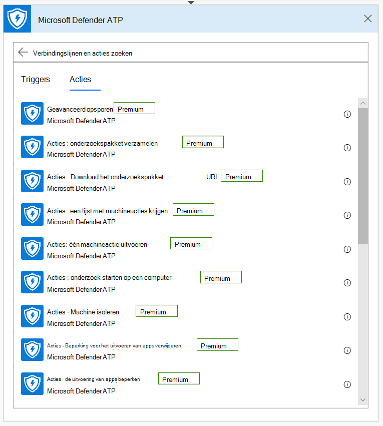
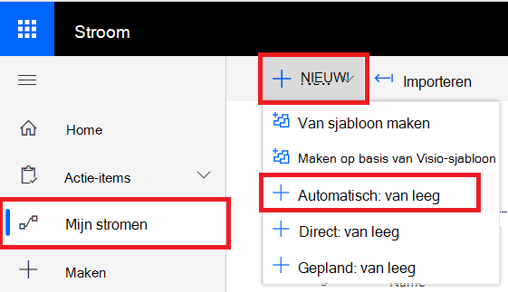

# Microsoft Power Automate (voorheen Microsoft Flow) en Azure-functiesMicrosoft Power Automate (formerly Microsoft Flow), and Azure Functions

[!INCLUDE [Microsoft 365 Defender rebranding](../../includes/microsoft-defender.md)]

**Van toepassing op:****Applies to:**
- [Microsoft Defender voor EindpuntMicrosoft Defender for Endpoint](https://go.microsoft.com/fwlink/p/?linkid=2154037)
- [Microsoft 365 DefenderMicrosoft 365 Defender](https://go.microsoft.com/fwlink/?linkid=2118804)

- Wilt u Microsoft Defender voor Eindpunt ervaren?Want to experience Microsoft Defender for Endpoint? [Meld u aan voor een gratis proefabonnement.Sign up for a free trial.](https://www.microsoft.com/microsoft-365/windows/microsoft-defender-atp?ocid=docs-wdatp-exposedapis-abovefoldlink) 

Het automatiseren van beveiligingsprocedures is een standaardvereiste voor elk modern Beveiligingscentrum.Automating security procedures is a standard requirement for every modern Security Operations Center. Het ontbreken van professionele cyberverdedigers dwingt SOC om op de meest efficiënte manier te werken en automatisering is een must.The lack of professional cyber defenders forces SOC to work in the most efficient way and automation is a must. Microsoft Power Automate ondersteunt verschillende connectors die daar precies voor zijn gemaakt.Microsoft Power Automate supports different connectors that were built exactly for that. U kunt binnen enkele minuten een end-to-end procedureautomatisering maken.You can build an end-to-end procedure automation within a few minutes.

Microsoft Defender API heeft een officiële Flow Connector met veel mogelijkheden.Microsoft Defender API has an official Flow Connector with many capabilities.

> [!NOTE]
> Zie Licenties voor [premium-connectors](/power-automate/triggers-introduction#licensing-for-premium-connectors)voor meer informatie over licentievoorwaarden voor premium connectors.For more details about premium connectors licensing prerequisites, see [Licensing for premium connectors](/power-automate/triggers-introduction#licensing-for-premium-connectors).

## GebruiksvoorbeeldUsage example

In het volgende voorbeeld wordt gedemonstreerd hoe u een Flow maakt die wordt geactiveerd op elk moment dat er een nieuwe waarschuwing op uw tenant plaatsvindt.The following example demonstrates how to create a Flow that is triggered any time a new Alert occurs on your tenant.

1. Meld u aan bij [Microsoft Power Automate.](https://flow.microsoft.com)Log in to [Microsoft Power Automate](https://flow.microsoft.com).

2. Ga naar **Mijn stromen**  >  **Nieuw**  >  **geautomatiseerd-van leeg**.Go to **My flows** > **New** > **Automated-from blank**.

    

3. Kies een naam voor uw Flow, zoek naar 'Microsoft Defender ATP Triggers' als trigger en selecteer vervolgens de nieuwe trigger Waarschuwingen.Choose a name for your Flow, search for "Microsoft Defender ATP Triggers" as the trigger, and then select the new Alerts trigger.

    

U hebt nu een Flow die wordt geactiveerd telkens wanneer er een nieuwe waarschuwing wordt gegeven.Now you have a Flow that is triggered every time a new Alert occurs.

Het enige wat u nu hoeft te doen, is uw volgende stappen kiezen.All you need to do now is choose your next steps.
U kunt het apparaat bijvoorbeeld isoleren als de ernst van de waarschuwing hoog is en er een e-mailbericht over verzenden.For example, you can isolate the device if the Severity of the Alert is High and send an email about it.
De waarschuwingstrigger bevat alleen de waarschuwings-id en de machine-id.The Alert trigger provides only the Alert ID and the Machine ID. U kunt de verbindingslijn gebruiken om deze entiteiten uit te vouwen.You can use the connector to expand these entities.

### De entiteit Waarschuwing ontvangen met behulp van de verbindingslijnGet the Alert entity using the connector

1. Kies **Microsoft Defender ATP** voor de nieuwe stap.Choose **Microsoft Defender ATP** for the new step.

2. Kies **Waarschuwingen - Eén waarschuwings-API ontvangen.**Choose **Alerts - Get single alert API**.

3. Stel de **waarschuwings-id** van de laatste stap in als **Invoer.**Set the **Alert ID** from the last step as **Input**.

    

### Het apparaat isoleren als de ernst van de waarschuwing hoog isIsolate the device if the Alert's severity is High

1. Voorwaarde **toevoegen** als een nieuwe stap.Add **Condition** as a new step.

2. Controleer of de ernst van de waarschuwing **gelijk is aan** Hoog.Check if the Alert severity **is equal to** High.

   Zo ja, voegt u de **Microsoft Defender ATP - Machineactie** isoleren met de machine-id en een opmerking.If yes, add the **Microsoft Defender ATP - Isolate machine** action with the Machine ID and a comment.

    

3. Voeg een nieuwe stap toe voor het e-mailen over de waarschuwing en de isolatie.Add a new step for emailing about the Alert and the Isolation. Er zijn meerdere e-mailconnectoren die heel eenvoudig te gebruiken zijn, zoals Outlook of Gmail.There are multiple email connectors that are very easy to use, such as Outlook or Gmail.

4. Sla uw stroom op.Save your flow.

U kunt ook een geplande stroom **maken** met geavanceerde query's en nog veel meer.You can also create a **scheduled** flow that runs Advanced Hunting queries and much more!

## Verwant onderwerpRelated topic
- [Microsoft Defender voor eindpunt-API'sMicrosoft Defender for Endpoint APIs](apis-intro.md)
